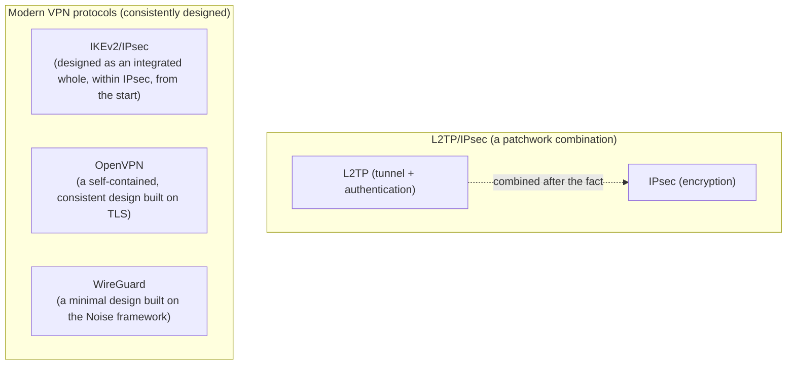

## Introduction

- **What You'll Learn From This Article**: What's really behind the assessment that "L2TP/IPsec is legacy"—specifically which parts of its design are considered dated—along with a systematic understanding of the design philosophies behind IKEv2/IPsec, OpenVPN, and WireGuard, the protocols in widespread use for remote-access VPNs today, and the criteria you should use to choose between them.
- **Intended Audience**: This article is aimed at infrastructure engineers involved in building or selecting remote-access VPNs who have heard that "L2TP/IPsec is old" but can't concretely explain what's different about it, or why the newer protocols are considered superior.
- **Estimated Reading Time**: About 20 minutes

This article is part of the [Top 1% Series' full article guide](/en/sitemap).

## Prerequisites

- **VPN (Virtual Private Network)**: A general term for technology that creates a logical communication path over a public network like the internet, functioning as if it were a dedicated line.
- **Symmetric-Key vs. Public-Key Cryptography**: Symmetric-key cryptography uses the same key for encryption and decryption, while public-key cryptography uses a different key pair for each. VPNs typically use public-key cryptography for key exchange and authentication, and fast symmetric-key cryptography for encrypting the actual data.
- **UDP/TCP**: UDP is a lightweight, connectionless protocol with no retransmission control; TCP is connection-oriented, with acknowledgment and retransmission control.

## Getting the Big Picture

### In a Nutshell

**The single biggest reason L2TP/IPsec is called "legacy" comes down to a difference in design philosophy: it's a "patchwork" combination, bolted together after the fact, of two protocols originally designed for entirely different purposes—a tunneling technology with no encryption (L2TP) and an encryption technology with no user-authentication capability (IPsec, as based on IKEv1)—whereas the protocols in mainstream use today were built from the ground up with a consistent design aimed at a single goal: secure remote-access VPN.**

Here's a summary of the main differences among the four protocols:

| Protocol | Standardized/Introduced | Transport It Runs Over | Rough Implementation Size | Resilience on Mobile Networks |
|---|---|---|---|---|
| L2TP/IPsec | L2TP: 1999 (RFC 2661); IPsec: 1995 onward (multiple RFCs) | UDP (500/1701/4500) | Large (requires a separate IKE daemon, L2TP daemon, and PPP daemon) | Weak (an IP address change tends to force re-establishment of the IKE SA) |
| IKEv2/IPsec | 2005 onward (RFC 7296, used without L2TP) | UDP (500/4500) | Large (self-contained in a single IKE daemon, but the implementation still inherits much of IKEv1-era complexity) | Strong (the MOBIKE extension handles IP address changes) |
| OpenVPN | 2001 onward | UDP or TCP (port number is freely configurable) | Medium-to-large (a user-space implementation built on OpenSSL) | Implementation-dependent (by default, tends to require session re-establishment) |
| WireGuard | Merged into the Linux kernel in 2020 | UDP | Small (the core is roughly 4,000 lines) | Strong (peers are identified by public key, not IP address, so it doesn't depend on the IP address staying fixed) |

## Fundamentals, Thoroughly Explained

### Why the "Transport It Runs Over" Matters for Remote-Access VPN

The "Transport It Runs Over" column in the comparison table isn't just a spec-sheet detail. It's one of the most practically important selection criteria for a remote-access VPN, because it directly determines **which networks the VPN can actually connect from, and how stable its performance will be.** There are two main reasons.

1. **Ease of traversing firewalls and NAT**: Corporate networks, and public Wi-Fi at hotels or airports, often block UDP traffic and the ESP protocol (IP protocol number 50) that IPsec uses, as a matter of security policy, allowing only TCP ports 80 and 443 (used for ordinary web traffic) out to the internet. UDP-only protocols like IKEv2/IPsec and WireGuard can sometimes fail to connect from such restrictive networks, whereas OpenVPN can be configured to run over TCP port 443, making it look, to anything on the path, like ordinary HTTPS traffic — which makes it much easier to establish a connection (covered in more detail in the OpenVPN section below). The reason IPsec-family protocols have a **NAT-T (NAT Traversal)** mechanism that re-wraps themselves inside UDP port 4500 (which does have a port number) when behind NAT is the same underlying constraint: ESP, being identified purely by protocol number, doesn't traverse NAT devices well (the internal workings of NAT-T are covered in depth in [How L2TP/IPsec Works](/en/articles/l2tp-ipsec-guide)).
2. **Impact on performance and stability — the "TCP over TCP" problem**: When the VPN tunnel itself runs over TCP, the user's own traffic flowing through the tunnel (SSH, HTTPS, and so on — much of which is itself TCP) ends up nested as "TCP inside TCP." When packet loss occurs on the path, the inner TCP connection (the user's traffic) and the outer TCP connection (the tunnel itself) each independently try to run their own retransmission timers and congestion control, and these retransmissions end up competing with each other. RTT estimates get thrown off, and throughput can drop sharply. This is a well-known phenomenon called **"TCP-over-TCP meltdown,"** and it's the main reason OpenVPN recommends UDP as its default mode of operation, treating the TCP-443 configuration as a fallback specifically for restrictive-firewall environments.

In short, UDP is designed to leave retransmission, when packet loss occurs, up to the application riding inside the tunnel while the tunnel itself stays lightweight — which usually means high performance and low latency, but it can't connect where UDP itself is blocked. TCP prioritizes connectivity at the cost of the TCP-over-TCP performance risk described above. That tradeoff between connectivity and performance is the real meaning behind lining up each protocol's supported transport in the comparison table.

### Why Is L2TP/IPsec Called "Legacy"?

The grounds for considering L2TP/IPsec dated boil down to three main points.

1. **The complexity of implementation and operations that comes from combining several independent standards**: Getting L2TP/IPsec working requires three separately developed software components to cooperate: an IPsec daemon that handles IKE/ESP (e.g., strongSwan), an L2TP daemon that handles L2TP tunnels and sessions (e.g., xl2tpd), and a PPP daemon that handles PPP negotiation (e.g., pppd) (the daemon execution model itself — a process that stays resident in the background — is covered in [What Is a Daemon?](/en/articles/linux-daemon-guide)). Because a single connection sequence spans multiple processes and protocol stacks, isolating problems during failures is difficult, and interoperability bugs between different implementations have historically been reported quite often.
2. **Weakness when a mobile client switches networks**: In the IKEv1-based IPsec that L2TP/IPsec relies on, the SA (Security Association) is tightly bound to the client's IP address. **An SA is the set of parameters two parties have agreed on** — which cryptographic algorithm to use, which key, what the current sequence number is, and so on — registered in the SAD (Security Association Database) inside the IPsec implementation once IKE has finished exchanging keys. The reason this SA ends up tightly bound to an IP address is that **the matching rule that decides which packets an SA applies to (the SPD's selectors — Security Policy Database) is built primarily around the source/destination IP addresses of the peer.** When the client's IP address changes — switching from Wi-Fi to a mobile connection, for instance — the SA itself, keys and all, may still technically be valid, but there's no longer a matching rule that ties traffic from the new IP address to that SA. As a result the existing IKE SA and ESP SA become unusable in practice, and most implementations require renegotiating from Phase 1 all over again. This doesn't sit well with how mobile devices are used today.
3. **Known weaknesses around key exchange and authentication**: Individually, mitigations exist for issues like the risk of offline brute-force attacks against a pre-shared key (PSK) in IKEv1's Aggressive Mode, or the cryptographic weaknesses in MS-CHAPv2 used for PPP authentication (switching to Main Mode, moving to certificate-based authentication, and so on). But the fact that the design leaves so much room to end up choosing a weak configuration in the first place is a recurring finding in security audits.

None of this means "secure communication is categorically impossible with L2TP/IPsec"—**with the right configuration (certificate-based authentication, Main Mode, operating in a way that doesn't depend on MOBIKE-style mobility, etc.), it can achieve entirely adequate security in practice.** But the fact that so many of these configurations demand careful attention from administrators is a relative weakness compared to protocols designed from the ground up to default to the safe choice.

### IKEv2/IPsec: The "Evolved" Version That Skips L2TP

**IKEv2 (RFC 7296)** is the key-exchange protocol standardized as IKEv1's successor. The decisive difference from L2TP/IPsec is that **IKEv2 by itself, without going through L2TP, can provide everything a remote-access VPN needs.**

The difference between IKEv1 and IKEv2 isn't just a version number — the message-exchange design itself was overhauled.

| Aspect | IKEv1 | IKEv2 |
|---|---|---|
| Per-user authentication | Not part of the standard; relies on vendor extensions like XAuth | Built into the standard as EAP |
| Virtual IP/DNS assignment | Not part of the standard; relies on L2TP's IPCP | Built into the standard as the Configuration Payload |
| Resilience to IP address changes | None (requires renegotiating from Phase 1) | Standard support via the MOBIKE extension (RFC 4555) |
| Number of message round trips | Many: Phase 1 (Main Mode, 6 round trips) + Phase 2 (Quick Mode, 3 round trips) | Simplified to 4 round trips (IKE_SA_INIT + IKE_AUTH) |
| DoS resistance | Prone to starting expensive processing before verifying the source isn't spoofed | Lets the responder demand a cookie first, making it more resistant to spoofed-source load attacks |

The first two rows of that table — per-user authentication and virtual IP/DNS assignment — map directly onto the root cause that made L2TP/IPsec need L2TP in the first place: IPsec by itself had no mechanism for the user authentication or IPCP-style address assignment that PPP used to provide. The accurate way to put it is that IKEv2 **didn't import PPP itself; it rebuilt the two roles PPP used to play — user authentication and address assignment — as native, standard features inside IKEv2's own message exchange.**

- **Standard support for EAP authentication**: Where IKEv1-era deployments relied on vendor-specific extensions (like XAuth) for per-user authentication, IKEv2 built this in as a standard feature using EAP (Extensible Authentication Protocol). This lets IKEv2 itself take on the role PPP authentication used to play under L2TP, without going through L2TP at all.
- **Configuration Payload**: The job L2TP's IPCP used to handle—handing out a virtual IP address and DNS server—is also natively supported by IKEv2 through a mechanism called the Configuration Payload.
- **MOBIKE (RFC 4555)**: An IKEv2 extension that lets the existing IKE SA and IPsec SA be carried over to a new IP address, even when the client's IP address changes. Mechanically, once a client detects that its IP address has changed, it can leave the existing SA (its keys and other already-negotiated parameters) untouched and simply **send a single lightweight round trip over the INFORMATIONAL exchange — a notification called UPDATE_SA_ADDRESSES — asking the peer to update the source address associated with that SA.** As explained above, the reason IKEv1-based setups are fragile against IP address changes is that the matching rule binding traffic to an SA depends on IP addresses. Rather than redoing the (expensive) key exchange from Phase 1, MOBIKE resolves that root cause by letting just the matching-rule side be updated with a lightweight notification.

This is exactly why so many of the built-in VPN clients on Windows, iOS, macOS, and Android natively support IKEv2/IPsec alongside L2TP/IPsec.

### OpenVPN: A General-Purpose VPN Built on TLS

**OpenVPN** is a piece of VPN software that reuses the same [library](/en/articles/software-library-guide) (OpenSSL) that underpins TLS (SSL), the protocol widely used to secure HTTPS traffic on the web, implementing key exchange, authentication, and encryption as a single, consistent protocol stack. Rather than IPsec's "combination of several separate standards," it's built on a single design based on a TLS handshake, and supports both certificate-based and PSK authentication (why TLS combines key exchange, authentication, and encryption the way it does is covered in [How PKI and Digital Certificates Work](/en/articles/pki-guide); the inner workings of the symmetric-key cryptography that encrypts the actual data are covered in [How Symmetric-Key Encryption (AES) and HMAC/AEAD Work](/en/articles/symmetric-encryption-guide)).

TLS was originally built to **encrypt a specific application's communication**, the way it secures HTTP traffic between a browser and a server. What OpenVPN does is take the raw IP packets handed to it by the OS through a TUN virtual network interface (covered below) and pour them straight into a single TLS connection. From TLS's point of view, it has no idea what's inside the connection — it's just a byte stream, and it treats an HTTP request and an IP packet exactly the same way. There's nothing special, spec-wise, about pouring arbitrary data into a TLS-protected connection like this; OpenVPN simply exploits that property to implement its VPN tunnel.

So why didn't the designers of L2TP and IPsec just build a TLS-based VPN from the start? There are three main reasons.

1. **A generational gap**: SSL (TLS's predecessor) was published by Netscape around 1994–1995, and TLS 1.0 (RFC 2246) wasn't standardized until 1999. IPsec's original form, by contrast, had been under standardization since around 1995 — roughly the same era, or slightly ahead of TLS. The option of "building on the newer TLS instead of the already-running IPsec design" simply hadn't matured yet at the time.
2. **A difference in the scope the design targeted**: L2TP/IPsec was aiming to transparently tunnel arbitrary Layer-2 traffic between sites — not just IP packets but Ethernet frames as well (it wasn't unusual back then for a company's internal network to run non-IP protocols like IPX or AppleTalk). TLS assumes a single TCP connection as its foundation, and was never designed with that kind of Layer-2 transparency in mind.
3. **The TCP-over-TCP problem discussed above**: TLS fundamentally runs on top of TCP. Building a VPN tunnel on top of TLS (i.e., TCP) reintroduces the "TCP-over-TCP meltdown" described in the previous section, causing throughput to collapse on lossy connections. The reason IPsec (ESP) and WireGuard are designed to run over UDP is precisely to avoid this problem, and it's the same reason OpenVPN is recommended to run over UDP wherever possible. Implementing a VPN over TLS is entirely possible — but as long as it's built on TCP, this constraint doesn't go away.

Aside: "VPN server" versus "VPN software"

L2TP/IPsec and IKEv2/IPsec are combinations of protocols, and the server-side software that implements them comes from multiple vendors and projects — strongSwan, Windows RRAS, and others. That's why a vendor-neutral phrase like "a VPN server (built with strongSwan, say)" reads naturally. OpenVPN, by contrast, has its protocol specification and its implementation fused into essentially one open-source program (`openvpn`, developed by OpenVPN Inc.), used as both server and client alike. "OpenVPN server" isn't wrong, but articles sometimes say "OpenVPN software" instead specifically to emphasize this fusion of "protocol name" and "specific piece of software."

OpenVPN's biggest practical advantage is that **it can run over TCP as well as UDP, and the port number it uses is entirely configurable.** If it's configured to use TCP port 443 (the port ordinarily used for HTTPS), it looks, to any firewall or proxy along the path, like nothing more than "ordinary HTTPS traffic"—making it much easier to establish a connection even on restrictive networks that tend to block UDP or IPsec-related protocols. On the other hand, because the implementation runs in [user space](/en/articles/linux-user-kernel-space-guide) (exchanging data with the kernel through a virtual network interface—a TUN/TAP device), every packet incurs a context switch between user space and kernel space, which tends to put OpenVPN at a throughput disadvantage compared to WireGuard, discussed next.

Aside: What is a TUN/TAP device?

A **TUN/TAP device** is a virtual network interface mechanism provided by the Linux kernel that lets a user-space program like OpenVPN directly read and write IP packets (TUN) or Ethernet frames (TAP) to and from the kernel's network stack. The OS treats it as a single network interface, indistinguishable from a physical NIC, but it's actually a purely software-created virtual device that needs no additional physical hardware. Why this mechanism is indispensable to user-space VPN software, and how it creates a performance gap against kernel-space implementations, is covered in more detail in [User Space, Kernel Space, and TUN/TAP Devices](/en/articles/linux-user-kernel-space-guide).

### WireGuard: A Modern Design Built Around Radical Minimalism

**WireGuard** is a comparatively new VPN protocol and implementation, merged into the Linux kernel proper (5.6) in 2020. Its design philosophy stands in stark contrast to IPsec's and OpenVPN's: it's built on the principle that **"drastically shrinking the number of choosable cryptographic algorithms, and fixing on a single modern, well-proven cipher suite, eliminates the very possibility of misconfiguration or downgrade attacks."**

- **A fixed cipher suite**: Key exchange always uses Curve25519 (elliptic-curve Diffie-Hellman), encryption always uses ChaCha20, integrity verification always uses Poly1305, and the hash function is always BLAKE2s—all fixed in advance, with no alternative choices. Because there's no negotiation step at all (unlike IKE's "agree on which algorithm to use during negotiation"), the risk of ending up with a weak algorithm, and the room for bugs to hide in the negotiation logic itself, are structurally eliminated.
- **An extremely small implementation**: The core of WireGuard's kernel implementation is said to come in at roughly 4,000 lines, a stark contrast to OpenVPN (said to exceed 100,000 lines) or the similarly large IPsec implementations like strongSwan—giving it a real practical advantage for code review and security auditing.
- **Peer identification via public key**: WireGuard identifies its peer not by "IP address" but by a **public key exchanged in advance**. As long as authentication succeeds using the correct key pair, communication can continue even if the client's IP address changes—no dedicated extension like IKEv2's MOBIKE is needed, because the design itself is inherently resilient to network changes on mobile devices.

## The View from the Top 1% (What Experts See)

### Why "Complexity" Directly Translates into Security Risk

In the world of VPN protocols, the principle that **"complexity in the implementation or specification itself widens the attack surface"** carries a lot of weight. The more message types and extension specs an IKE negotiation has to handle, the higher the risk that a bug is hiding somewhere in the implementation—and in practice, both strongSwan and OpenVPN have had a history of multiple serious vulnerabilities reported (some leading to remote code execution or denial of service). WireGuard's deliberate elimination of choice among cryptographic algorithms, and its drastically minimized codebase, is a design decision that clearly reflects this "complexity equals attack surface" lesson. The fact that it went through review by prominent cryptographers and security researchers on its way into the Linux kernel proper backs up the real-world effectiveness of this design philosophy.

### Performance Characteristics: User-Space vs. Kernel-Space Implementations

VPN implementations broadly split into those running outside the OS kernel (user space) and those running inside it (kernel space). OpenVPN is a user-space implementation, so every packet it processes incurs a context switch and memory copy between the kernel and user space. WireGuard, by contrast, is a kernel-space implementation built directly into the Linux kernel, so this back-and-forth overhead is much smaller—which tends to give it an edge in both throughput and latency under equivalent conditions. IPsec (whether L2TP/IPsec or IKEv2/IPsec) can also take advantage of kernel-space crypto processing on many OSes (frameworks such as XFRM), so the general trend is that IPsec-family protocols and WireGuard tend to outperform OpenVPN on the performance front.

### How These Are Actually Used in Practice: Protocol-by-Protocol Pros and Cons

"WireGuard is the simplest and fastest" is technically correct, but in real-world deployments, IKEv2/IPsec and OpenVPN both remain in wide use. Looking at the pros and cons that fall out of each protocol's design explains why this split persists.

- **IKEv2/IPsec**
  - Pros: It's a built-in standard client on Windows, iOS, macOS, and Android, so there's no need to distribute or manage a separate app. Paired with an MDM (mobile device management) tool that auto-distributes client certificates via a mechanism like SCEP, large-scale rollouts can be handled entirely with OS-native functionality. Major VPN appliance and firewall products from vendors like Cisco and Palo Alto support IKEv2/IPsec as standard, which is exactly why it remains a common choice for enterprise remote-access VPN.
  - Cons: Because it's UDP-only, as noted above, it can fail to connect from restrictive networks. The IKE daemon implementation itself still carries over much of the complexity inherited from the IKEv1 era, and interoperability issues are still occasionally reported even among open-source implementations like strongSwan.
- **OpenVPN**
  - Pros: Its TCP-443 fallback gives it the strongest connectivity of the bunch, and both its open-source and commercial implementations are mature thanks to its long history. Many consumer commercial VPN services have traditionally offered an OpenVPN-based option, precisely because of this connectivity and battle-tested maturity. Its high configuration flexibility, including the ability to build a custom self-signed PKI, also makes it a popular choice for self-hosted enterprise environments.
  - Cons: Being a user-space implementation carries overhead, putting it at a disadvantage on performance for site-to-site links carrying heavy traffic. Using the TCP-443 configuration always carries the risk of the TCP-over-TCP problem.
- **WireGuard**
  - Pros: Its radically simple implementation delivers high speed and low latency with few configuration items and low operational overhead, driving rapid adoption in self-hosted VPNs (router OSes like pfSense/OPNsense, or individual/small-organization servers) and in mesh connections between sites or devices. Commercial VPN services have increasingly moved toward WireGuard-based proprietary protocols in recent years too — NordVPN's NordLynx and ExpressVPN's Lightway among them.
  - Cons: The standard spec includes no username/password login management and no DHCP-like mechanism for dynamically handing out IP addresses per connection. That makes bare WireGuard alone a poor fit for large-scale enterprise access management, and in practice it's usually deployed through a commercial or open-source wrapper — Tailscale, Cloudflare WARP, NetBird, and the like — that uses WireGuard as its internal protocol while layering IdP integration, key distribution, and access-control lists (ACLs) on top.

In other words, the real-world choice comes down not to a simple performance comparison but to operational requirements: whether you want to run on OS-native clients, whether connectivity from restrictive networks is a hard requirement, and where user-level access management should live. In recent years, more enterprises have also been migrating toward **ZTNA (Zero Trust Network Access)** services like Zscaler Private Access or Cloudflare Access, on top of these VPN protocols — but the underlying transport for those services is frequently built on IPsec or WireGuard technology too, so understanding the characteristics of each protocol covered here remains directly relevant.

### Selection Criteria for Enterprise Deployment

No protocol is "unconditionally the best"—the right answer depends on your requirements.

| Selection Criterion | Best-Fit Protocol | Why |
|---|---|---|
| Wanting to operate using only the standard clients built into Windows/iOS/macOS/Android | IKEv2/IPsec | No need to install additional client apps, and it tends to receive long-term support as a native OS feature |
| Prioritizing connectivity from restrictive networks (hotels, public Wi-Fi, etc.) | OpenVPN (configured for TCP 443) | Can disguise itself as ordinary HTTPS traffic, making it easier to connect even where UDP/ESP is blocked |
| Prioritizing top performance and a simple setup in a self-hosted environment | WireGuard | Simple, fast implementation with few configuration items and low operational overhead |
| Stuck with an existing commercial VPN appliance that only supports L2TP/IPsec | L2TP/IPsec (certificate-based authentication + Main Mode mandatory) | Keeps existing assets in use while operating in a configuration that avoids the known weaknesses |

**Even if you can't immediately replace an existing L2TP/IPsec environment**, most of its known weaknesses can be mitigated in practice by moving away from a shared pre-shared key toward certificate-based authentication and by pinning IKE Phase 1 to Main Mode. In many cases, hardening the weak points of the current setup takes priority over a wholesale protocol migration.

## Common Misconceptions and Pitfalls

- **Misconception 1: "You should always pick the newer protocol."**
  Even though WireGuard is technically elegant, it has no built-in specification for standard user authentication (username/password login management) or enterprise-grade centralized management features, meaning it may not, on its own, satisfy the access-management requirements of a large organization (this is exactly why commercial implementations built on top of WireGuard exist that add IdP integration and user-management features). You should choose based on fit for your requirements, not novelty alone.
- **Misconception 2: "L2TP/IPsec is dangerous now and should never be used."**
  This is an extreme conclusion. With the right configuration—certificate-based authentication, strictly enforcing Main Mode—it's entirely possible to achieve adequate security in practice. "The design leaves a lot of room to end up choosing an insecure configuration" and "it's always insecure" are two different claims.
- **Misconception 3: "WireGuard has no concept of user authentication whatsoever."**
  WireGuard itself only has a mechanism for device authentication based on a public-key pair, and it's true that the concept of "logging in with a username and password" isn't part of its specification. But this is a deliberate design trade-off—if needed, user-level authentication and management features can be layered on by combining it with a wrapper implementation or commercial service that integrates with an external identity provider (IdP).

## Troubleshooting Perspective

Trouble during a protocol migration or connectivity issues on mobile networks are best approached by asking **"which event is this particular protocol's design weak against?"**

1. **Connection failures in an environment where protocols are mixed during a migration period**: If some clients use the old protocol (L2TP/IPsec) and others use the new one (e.g., IKEv2/IPsec), check whether both protocols are enabled simultaneously on the VPN server side, and whether the corresponding firewall rules (UDP 500/1701/4500, or IKEv2-specific settings) are correctly separated for each.
2. **Frequent disconnects when switching between mobile data and Wi-Fi**: Under IKEv1-based IPsec without MOBIKE support (including L2TP/IPsec), every IP address change tends to trigger a full reconnection from Phase 1, which is often perceived by the user as a disconnect. Whether switching to IKEv2 (with MOBIKE enabled) or WireGuard improves the situation is one useful diagnostic signal.
3. **Unable to connect only from certain networks (hotels, cafes, etc.)**: This strongly suggests UDP or ESP (protocol number 50) is being blocked. Whether a configuration that can "disguise itself as ordinary HTTPS traffic," like OpenVPN over TCP 443, is available makes a real difference in connectivity in these environments.

### Prevention and Long-Term Countermeasures

- When building a new remote-access VPN, choose a protocol only after clarifying your requirements (client types, network environment constraints, operational overhead), and prioritize a mobility-resilient configuration (IKEv2 + MOBIKE, or WireGuard) where possible.
- If an existing L2TP/IPsec environment can't be replaced right away, prioritize switching to certificate-based authentication and strictly enforcing Main Mode.
- During a transition period where multiple protocols run in parallel, extend monitoring and log collection to cover all of them, so a failure in one doesn't go unnoticed while attention stays on the other.

## Summary

- Which transport (UDP/TCP) each protocol runs over is a practically important selection axis, affecting both how easily it traverses firewalls/NAT and whether it avoids the TCP-over-TCP meltdown that hurts performance.
- L2TP/IPsec's "legacy" status rests on the complexity of implementation and operations that comes from combining independent standards after the fact, its weakness under IP address changes on mobile networks, and known weaknesses around key exchange and authentication.
- IKEv2/IPsec extends IPsec's own standard specification (EAP authentication, Configuration Payload, MOBIKE) to deliver a complete remote-access VPN without going through L2TP, gaining mobile resilience along the way.
- OpenVPN is a consistent design built on TLS, and excels at firewall traversal (such as disguising itself over TCP 443), but pays an overhead cost for being a user-space implementation.
- WireGuard shrinks its attack surface by fixing its cryptographic algorithms and minimizing its implementation size, and achieves both mobile resilience and performance through public-key-based peer identification.
- Which protocol is optimal depends on your requirements—novelty alone isn't a good selection criterion. An existing L2TP/IPsec environment can also achieve adequate security in practice with the right configuration.

**Starting Today**
1. When selecting or reevaluating a VPN protocol, organize your requirements along three axes—client types, network environment constraints, and whether mobile usage is involved—before comparing options.
2. If an L2TP/IPsec environment is still in place, don't wait for a full migration—start with the immediately effective steps: switching to certificate-based authentication and strictly enforcing Main Mode.

## References

- [Internet Key Exchange Protocol Version 2 (IKEv2) | RFC 7296](https://datatracker.ietf.org/doc/html/rfc7296)
- [IKEv2 Mobility and Multihoming Protocol (MOBIKE) | RFC 4555](https://datatracker.ietf.org/doc/html/rfc4555)
- [Extensible Authentication Protocol (EAP) | RFC 3748](https://datatracker.ietf.org/doc/html/rfc3748)
- [WireGuard: Next Generation Kernel Network Tunnel | WireGuard whitepaper](https://www.wireguard.com/papers/wireguard.pdf)
- [OpenVPN Community Resources](https://openvpn.net/community-resources/)
- [Security Architecture for the Internet Protocol | RFC 4301](https://datatracker.ietf.org/doc/html/rfc4301)
