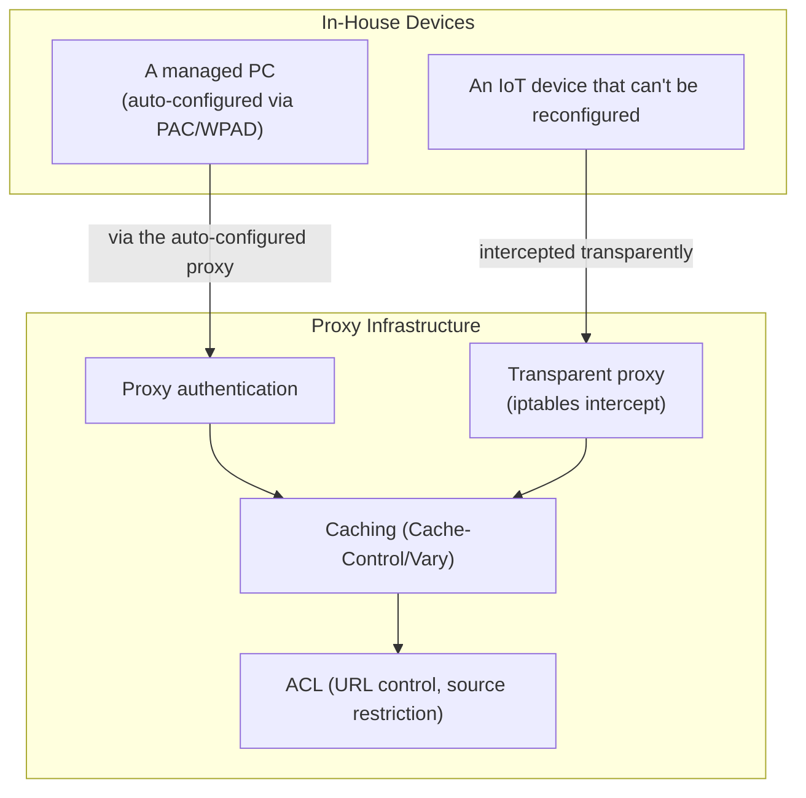

## Introduction

- **What You'll Learn From This Article**: This is the Web Proxy/Caching Department's capstone project, where you'll **integrate, on your own, the techniques you've learned one at a time in earlier hands-on labs** (explicit proxy construction and URL-level access control via Squid, cache control via Cache-Control/Vary, a transparent proxy via iptables and Squid, open-proxy hardening) **and the knowledge from the lectures** (automatic configuration via PAC files/WPAD, proxy authentication via Basic/NTLM/Kerberos) **into a single fictional multi-site retailer's internet access infrastructure.** Where earlier articles aimed at "following steps to reliably master one technique," this article takes a format much closer to real-world work: **presenting only requirements, and leaving you to design which techniques to combine, and how.**
- **Intended Audience**: Readers who've worked through the Web Proxy/Caching Department's Junior, Senior, and Graduate School content and can execute each individual hands-on lab, but have never designed a single proxy infrastructure combining them.
- **Estimated Reading Time**: Expect several days to about a week, including design, building, and documentation (the heaviest single hands-on in this series).

This article is part of the [Top 1% Series Complete Article Guide](/en/sitemap). It's positioned as the capstone project within the [Web Proxy/Caching Department's full curriculum](/en/university#web-proxycaching-department).

## Prerequisite Knowledge

This hands-on doesn't teach new techniques. **It combines techniques you've already mastered in the following lectures and hands-on labs.**

- [The Top 1% Hands-On for Building an Explicit Proxy With Squid and Experiencing URL-Level Access Control](/en/articles/squid-proxy-handson-guide)
- [Understanding PAC Files and WPAD From a Top 1% Perspective](/en/articles/pac-wpad-guide)
- [Understanding the Difference Between Proxy Authentication Methods (Basic/NTLM/Kerberos) From a Top 1% Perspective](/en/articles/proxy-auth-guide)
- [Understanding Cache-Control and the Vary Header From a Top 1% Perspective](/en/articles/cache-control-vary-guide)
- [A Top 1% Hands-On for Building Squid as a Caching Proxy and Confirming HIT/MISS With the X-Cache Header](/en/articles/squid-caching-handson-guide)
- [A Top 1% Hands-On for Building a Transparent Proxy With iptables and Squid, and Experiencing How a Proxy Gets Forced Without Any Client Configuration](/en/articles/transparent-proxy-handson-guide)
- [A Top 1% Hands-On for Reproducing Squid's Open-Proxy Danger Yourself and Defending With ACL-Based Access Restriction](/en/articles/squid-open-proxy-hardening-handson-guide)

## The Challenge: A Fictional Multi-Site Retailer's Internet Access Infrastructure

**You're an infrastructure engineer at a fictional multi-site retailer, "KoiKoi Retail." This company operates several stores and offices, but every device connects directly to the internet, creating two problems: growing traffic volume, and no visibility into access patterns. Your assignment is to build, with your own hands, an internet access infrastructure satisfying every one of the following requirements.**

### Requirement 1: Distribute Proxy Configuration to Employee PCs Without Any Manual Setup at All

**Make sure every PC across the company uses the same proxy configuration, across several hundred machines, without ever having to configure a proxy address on each one individually.**

### Requirement 2: Enable Recording Who Accessed Which Site

**Introduce a mechanism for identifying the employee behind traffic going through the proxy.** Choose a method that never sends the password across the network in plaintext.

### Requirement 3: Cache Commonly Used Content While Never Mixing Up Content That Differs by Employee

**Give the proxy a caching feature, to reduce traffic volume.** But make sure content that should legitimately differ based on a request header's value, such as a language setting, is never mistakenly served from the same cache.

### Requirement 4: Route Traffic Through the Proxy Even From Devices That Can't or Shouldn't Be Configured

**Route an in-store IoT device's network traffic through the proxy too, even though it can't be reconfigured.** Never require any individual configuration work on that device.

### Requirement 5: Make Sure This Proxy Infrastructure Never Gets Unintentionally Opened to Third Parties

**Make sure an outside third party can never abuse this proxy as a stepping stone for an unauthorized access against some other server.** Clearly design which range of access is allowed, and how everything else gets handled.

### Requirement 6: Restrict Access to Specific Categories of Sites, at the URL Level

**Build in a mechanism that restricts access, at the URL level, to specific sites unrelated to work.**

## Deliverable Requirements: Assemble It as a Portfolio

**This hands-on's final deliverable isn't just a confirmation that the configuration worked.** Assemble the following into a repository, such as on GitHub.

- **README.md**: An overview of this scenario, and the overall picture of the internet access infrastructure you adopted (including a diagram, such as a mermaid chart)
- **A Record of Design Decisions**: The reasoning behind "why you chose that particular technique or configuration" — especially where a trade-off arose, such as your auto-configuration method and cache accuracy
- **Execution Steps**: A record of the configuration and verification commands you actually ran
- **An Access Control Policy Document**: A clear policy on which sources and which URLs are allowed, and how everything else gets handled
- **A Retrospective**: Challenges you discovered while doing this, and what you'd additionally need to consider in real-world practice (TLS decryption requiring certificate distribution, integrating with monitoring tools, and similar)

**This deliverable is exactly the concrete achievement you can present in a job search or as a portfolio.** Simply explaining "I built a proxy with Squid" is far less persuasive than being able to demonstrate that, "under the realistic constraint of a live environment used by several hundred devices, I designed by combining several techniques, and can articulate the trade-off between auto-configuration and cache accuracy."

## What a Pro Sees Here (Top 1% Understanding)

### "The Ability to Follow Steps" and "the Ability to Design From Requirements" Are Entirely Different Skills

Every hands-on so far has taken the format of following a fixed set of steps: "Step 1, Step 2...." **But what actually gets evaluated in real-world work is never the ability to execute a procedure exactly as written — it's the ability to design, on your own, which techniques to combine and how, starting from given requirements** (what this article calls "Requirements 1 through 6"). These two are entirely different skills, despite looking similar. Even having completed every individual hands-on, without the experience of combining them into one coherent proxy infrastructure design, you're not yet immediately effective in real-world work. This capstone project is deliberately designed to bridge that gap.

### Why This Scenario — "Multiple Sites, Diverse Devices"

There's a reason this hands-on, rather than being a one-off technical demo, is deliberately modeled on a realistic project — one where "multiple sites and multiple kinds of devices coexist." **Most real-world proxy infrastructure builds never serve a single purpose in isolation — they need to simultaneously satisfy multiple axes at once: minimizing configuration-distribution effort, identifying users, cache accuracy, handling devices that can't be configured, and defending against abuse.** Knowing Squid's basic configuration alone isn't enough for a real project — you also need to see through to auto-configuration via PAC/WPAD, a transparent proxy, and open-proxy hardening. The ultimate goal of this capstone project is to elevate your knowledge of individual techniques into **the ability to see through an entire proxy infrastructure's design.**

## Common Misconceptions and Pitfalls

- **Misconception 1: "This hands-on has one single, fixed, correct configuration."**
  There's no single correct answer to this hands-on. Multiple valid approaches exist, as long as the design satisfies the requirements. What matters is recording, in your README.md, the design you chose and why.
- **Misconception 2: "A deliverable confirming it worked is sufficient on its own."**
  Confirming it works matters, but isn't sufficient on its own. Being able to articulate the reasoning behind your design decisions is this hands-on's real value.
- **Misconception 3: "Having completed every individual hands-on means this one will be easy too."**
  There's a large gap between knowing individual techniques and integrating them into one coherent design. Expect this to take considerable time.

## Troubleshooting Perspective

For this hands-on, **design-level rework** is the main challenge, more than individual technical troubleshooting.

1. **You think you've satisfied the requirements, then later notice a contradiction**: Before starting implementation, write up only the design portion of your README.md first, and confirm, at the writing stage, that you've satisfied every one of Requirements 1 through 6.
2. **You've forgotten the steps from an individual hands-on**: Don't hesitate to go back and reread the linked prerequisite article for each requirement. This capstone tests design skill, not memorization.
3. **You're not sure how much detail is enough**: Use "could I show this README.md to an interviewer I'm meeting for the first time, in a job search, and explain my design decisions?" as your benchmark for completeness.

## Summary

- This capstone project is an integrative exercise, combining techniques you've mastered individually in the Web Proxy/Caching Department into a single fictional multi-site retailer's internet access infrastructure.
- What's required is never the ability to follow steps — it's the ability to design, on your own, from requirements.
- Assemble your deliverable as a portfolio document that articulates the reasoning behind your design decisions, not just a confirmation that it worked.

**Takeaways to Apply Today**
1. Even while learning an individual hands-on, build the habit of asking "under what future requirements would I actually end up using this?"
2. Beyond technical deliverables, build the habit of articulating the trade-off between auto-configuration and cache accuracy in your day-to-day work too.

## References

- [The Web Proxy/Caching Department's Full Curriculum](/en/university#web-proxycaching-department)
