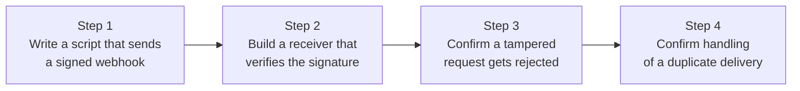

## Introduction

- **What You'll Learn From This Article**: Verify the webhook concept covered in [What's Actually Happening Behind a Payment API](/en/articles/payment-api-guide) by **actually building a webhook receiver yourself, implementing HMAC signature verification and handling for a duplicate event delivery.**
- **Intended Audience**: Readers who understand a webhook as "a mechanism where an event notification gets pushed from one server to another," but have never actually implemented how to confirm a notification genuinely came from its legitimate sender, or what happens when the same notification arrives twice.
- **Estimated Reading Time**: About 25 minutes, including the hands-on exercise

This article is part of the [Top 1% Series Complete Article Guide](/en/sitemap), and the sixth article in the [Web/API Series](/en/sitemap#series-list). You can follow along with one of the Ubuntu Server environments set up in the [Hands-On Prep Manual](/en/articles/handson-prep-guide).

## Prerequisite Knowledge

- **A Webhook's Basic Role**: The mechanism covered in [What's Actually Happening Behind a Payment API](/en/articles/payment-api-guide) — proactively notifying another server of a server-side event (a completed payment, and similar).
- **Idempotency Fundamentals**: The idea of idempotency covered in [Understanding RESTful APIs](/en/articles/restful-api-guide). This article applies that idea to the context of a retried webhook delivery.

## Getting the Big Picture

This hands-on covers four steps.



## Hands-On Steps

### Step 1: Write a Script That Sends a Signed Webhook

Using a secret string shared ahead of time between the sender and receiver (the **shared secret**), write a script that computes the payload's HMAC-SHA256 signature and sends it. Save it as `sender.py`.

```python
import hmac
import hashlib
import json
import urllib.request

SHARED_SECRET = b"my-shared-secret"

def send_webhook(event_id, payload_dict):
    payload = json.dumps(payload_dict).encode()
    signature = hmac.new(SHARED_SECRET, payload, hashlib.sha256).hexdigest()
    req = urllib.request.Request(
        "http://localhost:8000/webhook",
        data=payload,
        headers={
            "Content-Type": "application/json",
            "X-Event-Id": event_id,
            "X-Signature": signature,
        },
    )
    with urllib.request.urlopen(req) as resp:
        print(resp.status, resp.read())

send_webhook("evt_001", {"type": "payment.succeeded", "amount": 1000})
```

### Step 2: Build a Receiver That Verifies the Signature

The receiver side **computes the signature itself, from the received payload, using the same shared secret, and checks whether it matches the signature that was sent.** Save it as `receiver.py`.

```python
import hmac
import hashlib
from http.server import BaseHTTPRequestHandler, HTTPServer

SHARED_SECRET = b"my-shared-secret"
processed_event_ids = set()

class Handler(BaseHTTPRequestHandler):
    def do_POST(self):
        length = int(self.headers.get('Content-Length', 0))
        payload = self.rfile.read(length)
        received_signature = self.headers.get('X-Signature', '')
        event_id = self.headers.get('X-Event-Id', '')

        expected_signature = hmac.new(SHARED_SECRET, payload, hashlib.sha256).hexdigest()

        if not hmac.compare_digest(expected_signature, received_signature):
            self.send_response(401)
            self.end_headers()
            self.wfile.write(b'{"error": "invalid signature"}')
            return

        if event_id in processed_event_ids:
            print(f"Event {event_id} already processed, skipping")
            self.send_response(200)
            self.end_headers()
            self.wfile.write(b'{"status": "already processed"}')
            return

        processed_event_ids.add(event_id)
        print(f"Processing event {event_id}: {payload}")
        self.send_response(200)
        self.end_headers()
        self.wfile.write(b'{"status": "processed"}')

HTTPServer(('0.0.0.0', 8000), Handler).serve_forever()
```

```bash
python3 receiver.py &
python3 sender.py
```

**Output:**

```
Processing event evt_001: b'{"type": "payment.succeeded", "amount": 1000}'
200 b'{"status": "processed"}'
```

You confirmed a webhook with a correct signature got processed normally.

<details>
<summary>Why Use the Dedicated `hmac.compare_digest` Comparison Function?</summary>

When checking whether two signatures match, **avoid a plain string comparison (`==`).** A normal string comparison stops immediately the moment it hits a mismatch, which creates a risk: **the time it takes to find a mismatch leaks, bit by bit, exactly how much of the signature matched so far — letting an attacker gradually infer it.** This is called a **timing attack.** `hmac.compare_digest` is implemented to always take a constant amount of time regardless of the string's length, closing off this timing attack. It looks like an ordinary `==` comparison on the surface, but its internal implementation is entirely different — that distinction matters.

</details>

### Step 3: Confirm a Tampered Request Gets Rejected

Modify `sender.py` slightly to compute the signature first, then send a payload whose content has been tampered with afterward.

```python
import hmac
import hashlib
import json
import urllib.request

SHARED_SECRET = b"my-shared-secret"
payload_dict = {"type": "payment.succeeded", "amount": 1000}
payload = json.dumps(payload_dict).encode()
signature = hmac.new(SHARED_SECRET, payload, hashlib.sha256).hexdigest()

# Tamper with just the amount, after the signature was computed
tampered_payload = json.dumps({"type": "payment.succeeded", "amount": 999999}).encode()

req = urllib.request.Request(
    "http://localhost:8000/webhook",
    data=tampered_payload,
    headers={"X-Event-Id": "evt_002", "X-Signature": signature},
)
try:
    urllib.request.urlopen(req)
except urllib.error.HTTPError as e:
    print(e.code, e.read())
```

**Output:**

```
401 b'{"error": "invalid signature"}'
```

**Because the payload's content (the amount) got changed, the signature the receiver computed itself no longer matched the signature that was sent, so it was correctly rejected with a 401 error.** A third party who doesn't know the shared secret can never compute a valid signature for their tampered payload, so they can't slip past this check.

### Step 4: Confirm Handling of a Duplicate (Retried) Delivery

A real-world webhook sender (Stripe, say) may **retry sending the same event** if it never receives a response from the receiver. Reproduce this behavior by sending Step 1's request again, with the same `event_id`.

```bash
python3 sender.py
python3 sender.py
```

**Output of the second run:**

```
200 b'{"status": "already processed"}'
```

**Checking the receiver's log, the first run shows `Processing event evt_001`, while the second shows `Event evt_001 already processed, skipping`** — confirming the actual processing (just a `print` here, but in real-world practice, something significant like crediting an amount in a database) never ran twice.

## What a Pro Sees Here (Top 1% Understanding)

### The Baseline Assumption for Handling an Incoming Webhook Is: Treat It as "Untrusted Input"

A webhook receiver endpoint might look like an internal API on the surface, but **it's actually an endpoint published to the internet, which anyone can send a request to.** Skip the signature-verification step, and **a third party who doesn't know the shared secret can send a forged "payment completed" notification — shipping a product even though no payment ever actually happened** — a concrete, real-world harm. Just as [HTTP request smuggling's defense](/en/articles/load-balancing-request-smuggling-handson-guide) was built on the idea of rejecting contradictory input, handling an incoming webhook follows the same standard real-world practice: never unconditionally trust input that merely claims a given sender.

## Common Misconceptions and Pitfalls

- **Misconception 1: "If a webhook's sender uses HTTPS, signature verification is unnecessary."**
  HTTPS encrypts the communication path — it never proves "this genuinely came from that sender." Signature verification is an independent defense, serving an entirely different purpose from encryption.
- **Misconception 2: "A matching signature means you don't need to worry about duplicate deliveries."**
  Signature verification only confirms "this wasn't tampered with" — it does nothing against "the same event arriving multiple times." These are separate problems, requiring a separate fix (deduplication by event ID).
- **Misconception 3: "An ordinary string comparison (==) is sufficient for comparing signatures."**
  An ordinary string comparison carries a timing-attack risk. You need a dedicated comparison function, like `hmac.compare_digest`.

## Troubleshooting Perspective

1. **A webhook that should be valid gets rejected with a 401 error**: Check that the shared secret's value exactly matches between the sender and receiver. Also check whether the payload's exact string representation used for the signature calculation (whitespace, newlines, and similar) matches between the two sides.
2. **The same event gets processed multiple times**: Check whether the event-ID deduplication mechanism is implemented correctly. In real-world practice, this event-ID record needs to live in a persistent database, not an in-memory set.
3. **An event that should have been retried never arrives at all**: Check the sender's own retry policy (how many times, at what interval).

## Summary

- A webhook receiver needs to verify, via an HMAC signature, that a request genuinely came from its legitimate sender.
- Comparing signatures requires a dedicated comparison function, like `hmac.compare_digest`, to prevent timing attacks.
- Signature verification (confirming no tampering happened) and deduplication (guaranteeing the same event never gets processed twice) are two separate defenses, serving two separate purposes.
- A webhook receiver endpoint needs to be treated as a gateway accepting untrusted input, published to the internet.

**Takeaways to Apply Today**
1. When implementing a webhook receiver, build the habit of implementing both signature verification and deduplication, as two genuinely separate defenses.
2. Watch out for the assumption "it's safe because it uses HTTPS" — encryption and verifying the sender's legitimacy are separate problems.

## References

- [RFC 2104 - HMAC: Keyed-Hashing for Message Authentication](https://datatracker.ietf.org/doc/html/rfc2104)
- [Stripe Webhooks: Verify the Signature](https://stripe.com/docs/webhooks/signatures)
