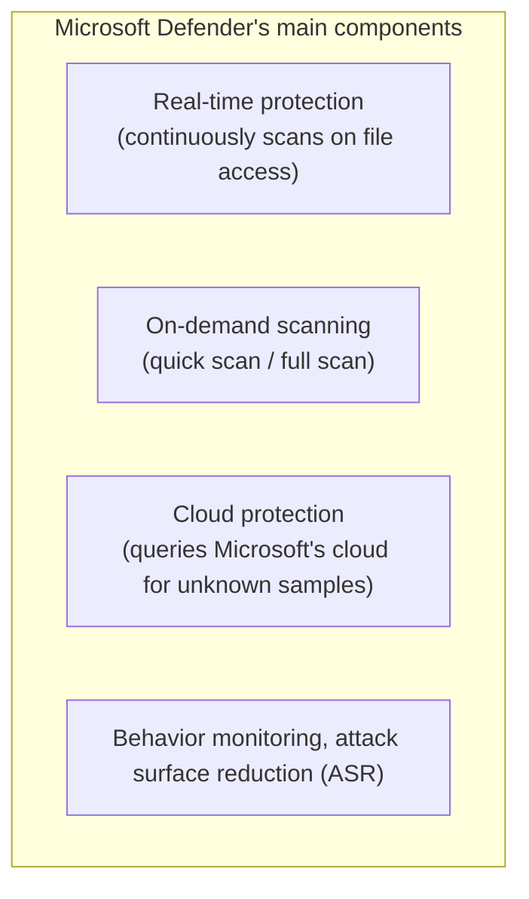
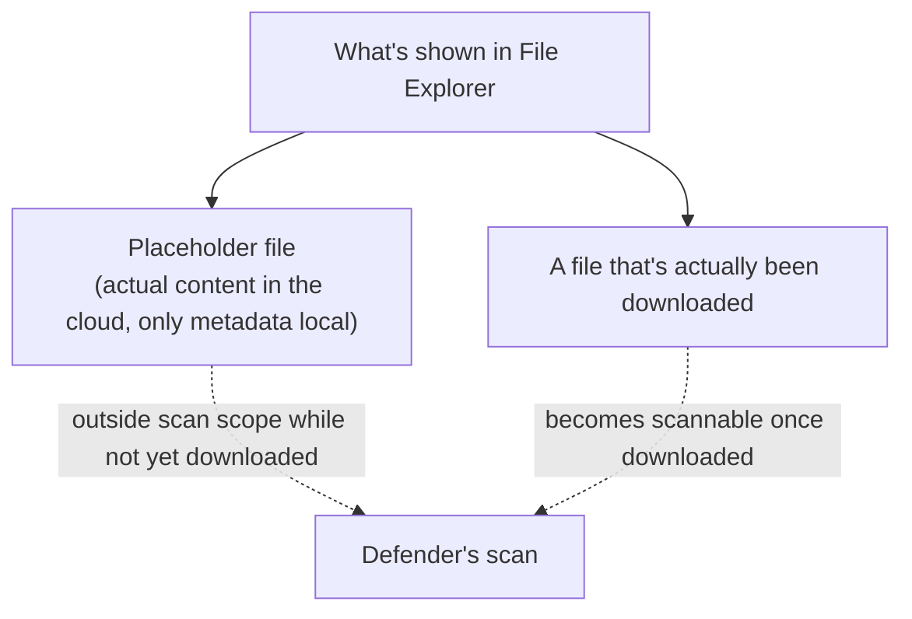

## Introduction

- **What You'll Learn From This Article**: This article explains how **Microsoft Defender**, built into Windows by default, actually detects malware, and then answers questions that come up constantly in practice: "if it's built in, why do some organizations deploy a separate security product like Apex One anyway," "what's the difference between a quick scan and a full scan," "what does passing the full scan required before connecting to production actually guarantee," and "when BoxDrive or Google Drive is integrated into File Explorer, are files on the cloud actually scanned?"
- **Intended Audience**: This article is aimed at engineers involved in PC security operations who can't concretely explain Defender's internal workings or the difference between its scan types.
- **Estimated Reading Time**: About 17 minutes

This article is part of the [Top 1% Series' full article guide](/en/sitemap), and the first article in a new series on Windows client operations.

## Prerequisites

- **Signature-based detection**: The most basic malware detection method, holding a database of known malware's characteristic patterns (signatures) and matching files against it.
- **Heuristic detection / behavioral detection**: A method that infers "whether a program behaves suspiciously" from rules or patterns, even without a matching known signature. This offers some protection against unknown threats (not yet registered in the existing signature database).

## Getting the Big Picture

### Microsoft Defender's Overall Structure

Microsoft Defender isn't a single mechanism — it's **a combination of multiple layers of defense.**

**The quick scan and full scan that are the theme of this article are just one component — "on-demand scanning" — and day-to-day protection is primarily carried by real-time protection.** Keeping this positioning in mind makes the rest of this article easier to follow.

## Fundamentals, Explained Thoroughly

### The Difference Between Real-Time Protection and On-Demand Scanning

**Real-time protection** is a mechanism that hooks access to a file every time it's created, modified, or executed, and immediately scans it. It's always running and carries the core of Defender's protection.

**On-demand scanning** (quick scan and full scan) is a separate inspection you run at any time, **"examining all — or some — of the files currently sitting on disk, all at once."** On the premise that most day-to-day threats are already blocked by real-time protection, **on-demand scanning is positioned as a complementary check — confirming there's nothing overlooked.**

### The Difference Between Quick Scan and Full Scan

| | Quick scan | Full scan |
|---|---|---|
| Scan target | A narrow scope limited to known locations malware tends to hide (registry auto-run keys, running process memory, key system folders, and so on) | Nearly every file across all connected drives (sometimes including the contents of archive files) |
| Duration | A few minutes | Tens of minutes to several hours, depending on disk capacity and file count |
| Primary use | Casual day-to-day confirmation, periodic checks while real-time protection is active | New deployment, before connecting to production, incident response — situations requiring a thorough check |

**The reason a quick scan is limited to "known locations" is that most malware leaves some trace in a place like auto-run settings triggered at OS boot (startup items, registry auto-run keys, and so on) or in the memory of a currently running process.** Conversely, **a dormant file that's simply sitting on disk, never executed, and not configured for auto-run** may not be included in a quick scan's scope. A full scan prevents this kind of oversight by covering the entirety of connected storage, including such dormant files.

### What Passing a Full Scan Before Connecting to Production Actually Guarantees

For the common practical requirement of "running and passing a full scan before connecting to production," it's important to accurately understand **what passing that full scan actually guarantees.**

**All that passing a full scan guarantees is the fact that "as of the moment the scan was run, based on Defender's detection capability at that time (its signature database, heuristics, and cloud lookups), no file matching a known threat pattern was found within the scan's scope."** While this carries real weight, it doesn't guarantee the following:

- **Zero-day threats (unknown threats not yet publicly known, with no existing signature)**: These can slip past both signature-based and heuristic detection.
- **Sophisticated malware using detection-evasion techniques**: Malware that detects the scan itself and hides its activity, or that uses encryption/obfuscation to avoid matching known patterns, can be missed in principle.
- **Files located outside the scan's scope**: Data that simply isn't included in the scan's scope in the first place — such as placeholder files for cloud drives, covered below — naturally isn't inspected at all.

**In other words, passing a full scan should accurately be understood not as "proof of absolute safety," but as securing a baseline — confirming a minimum clean state that eliminates the most basic and highest-volume risk: known threats.** Requiring this before connecting to production functions as a low-cost, first-pass filter against not even meeting this minimum baseline (such as accidentally bringing in a known piece of malware picked up on an external network).

### Why Deploy a Separate Security Product When Defender Is Built In?

Defender frequently scores well in independent malware-protection testing, so **the simple equation "free, therefore weaker" doesn't hold.** Even so, organizations choose to deploy or adopt a separate product like Apex One for reasons that mainly include:

- **EDR (Endpoint Detection and Response) and centralized management functionality**: If you want to unify visibility, investigation, and automated response (isolation, rollback, and so on) for threats across many endpoints in a single management console, going beyond basic malware detection, a dedicated product may offer richer functionality (Defender has an equivalent higher-tier offering, Microsoft Defender for Endpoint, but that's a separate license and product).
- **Organizational security policy and compliance requirements**: Industry or business-partner requirements sometimes explicitly mandate a specific security product or certification track record.
- **Unified management of a mixed-OS environment**: An operational requirement to centrally manage a mix of Windows, Linux, and macOS under a single vendor and console.

Practical caveats when running Defender alongside another vendor's product

Running multiple real-time-protection security products simultaneously in an "active" state can cause **conflicts or performance degradation from multiple products trying to scan the same file access at the same time.** For this reason, when a third-party product is installed, Windows itself is designed to automatically switch Defender into **passive mode** (a state where it performs no real-time scanning, functioning only as a supplementary background detector or as a fallback if the other AV is disabled). Without understanding this behavior, an operational habit of "keeping Defender enabled too, just in case" can unintentionally result in duplicate real-time protection running at once, becoming a source of performance problems.

### Are Cloud Drives (BoxDrive/Google Drive) Actually Scanned?

Many cloud storage clients — BoxDrive, Google Drive for desktop, and so on — achieve a state where **a file appears in File Explorer, but its actual content exists only in the cloud, with only a small piece of metadata (a placeholder, or stub file) on local disk indicating "this file lives in the cloud"** (a mechanism called on-demand files, or Files On-Demand). This lets a huge number of cloud files exist without consuming local disk space.

**Because Defender's real-time protection hooks the read/write (I/O) that actually occurs on the local file system, the content of a placeholder file that hasn't yet been downloaded isn't inspected until that file is actually opened (i.e., downloaded).** The same applies to a full scan: **even running a full scan doesn't normally inspect the content of a file that exists only in the cloud and hasn't been downloaded locally.** Only files that have actually been downloaded and expanded become scannable at that point.

**This behavior is a trade-off inherent to the design philosophy of cloud on-demand files (saving local storage).** If every cloud file's content had to be inspected locally, everything would eventually need to be downloaded, defeating the whole point of the on-demand approach. When using cloud storage in an organization, it's practically important **not to rely solely on endpoint-side Defender, but also to confirm what malware-scanning functionality the cloud storage service itself offers (such as scanning at upload time).**

## The View From the Top 1% Perspective

### Cloud Protection (MAPS) and Attack Surface Reduction (ASR)

Defender's cloud protection is a mechanism that **queries Microsoft's cloud in real time about the characteristics of an unknown file (a hash value or some behavioral information), matching it against threat intelligence gathered from devices worldwide.** Its strength is being able to leverage information about a new threat almost as soon as it's confirmed anywhere in the world, without waiting for a local signature database update.

**Attack Surface Reduction (ASR) rules** are a feature that lets an organization pre-emptively prohibit, as policy, specific behavioral patterns malware often abuses (such as an Office document spawning a child process, or a script downloading an executable). It's a more preventive approach — **not detection, but closing off the pathway that could be abused in the first place** — and is typically configured through enterprise management functionality (such as Microsoft Defender for Endpoint).

## Common Misconceptions and Pitfalls

- **Misconception 1: "Defender is just a free, built-in tool, so its detection performance must be weak"**
  Independent testing organizations frequently score Defender highly, so being free and having weaker detection aren't directly linked.
- **Misconception 2: "Passing a full scan proves that PC is 100% safe"**
  Passing a full scan only guarantees that no file matching a known threat pattern was found — it doesn't guarantee protection against zero-day threats, detection-evasion techniques, or content outside the scan's scope.
- **Misconception 3: "A folder integrated with a cloud drive is always scanned exactly as if it were local"**
  A placeholder file whose actual content exists only in the cloud isn't scanned until it's actually downloaded.

## The Troubleshooting Perspective

For practical questions related to Defender, the basic approach is to **isolate whether it's about real-time protection or on-demand scanning, and whether the target is a local file or a cloud file.**

1. **A full scan takes an abnormally long time**: Check whether it's configured or in a state where it actually downloads every cloud drive file while scanning it, or whether scan exclusions (such as a backup product's data area) are configured appropriately.
2. **The PC became sluggish after installing a third-party security product**: Check whether Defender has correctly switched into passive mode. Both products may be running as real-time protection simultaneously.
3. **There's a concern that malware may have entered via a cloud drive**: Check not just the endpoint-side scan results, but also the cloud storage service's own upload-time scan logs and any detection history on the sharing side.

### Preventive Measures and Permanent Fixes

- Recognize that a full scan before connecting to production is only a minimum baseline check against known threats, and pair it with other preventive measures (patching, access control, and so on).
- When deploying a third-party security product, confirm Defender's mode (active/passive) has switched as intended.
- When using cloud storage for work, combine endpoint-side measures with the cloud service's own security functionality, understanding the scope each one actually covers.

## Summary

- Microsoft Defender is a combination of multiple defense layers — real-time protection, on-demand scanning, cloud protection, and behavior monitoring — of which quick scan/full scan are just one part (on-demand scanning).
- A quick scan is a fast check limited to known locations malware tends to hide; a full scan is a thorough check covering all connected storage.
- Passing a full scan is a baseline confirmation that "no file matching a known threat pattern was found" — it isn't proof of absolute safety.
- Among files integrated with a cloud drive in File Explorer, those whose actual content hasn't yet been downloaded (placeholders) aren't scanned by Defender until they're actually downloaded.

**What to Keep in Mind From Today**
1. When you see the result "passed the full scan," keep in mind both what it guarantees (elimination of known threats) and what it doesn't (zero-day threats, undownloaded cloud files, and so on).
2. In an environment using cloud storage, don't rely solely on endpoint-side scanning — also check what security functionality the cloud service itself offers.

If you'd like to actually watch Defender's detection in action, check out [A Hands-On Lab: Confirming Detection with the EICAR Test File](/en/articles/windows-defender-eicar-handson-guide). To learn more about how real attacks slip past signature-based detection, see [Understanding How Malware Infection Actually Happens](/en/articles/malware-infection-mechanics-guide). And for what to actually do — and how far to go — when building and operating a server, see [Understanding Practical Security Measures for Building and Operating Servers](/en/articles/practical-server-security-measures-guide).

## References

- [Next-generation protection overview | Microsoft Learn](https://learn.microsoft.com/en-us/defender-endpoint/next-generation-protection-overview)
- [Cloud protection and Microsoft Defender Antivirus | Microsoft Learn](https://learn.microsoft.com/en-us/defender-endpoint/cloud-protection-microsoft-defender-antivirus)
- [Attack surface reduction rules overview | Microsoft Learn](https://learn.microsoft.com/en-us/defender-endpoint/attack-surface-reduction)
- [OneDrive Files On-Demand | Microsoft Learn](https://learn.microsoft.com/en-us/onedrive/files-on-demand)
