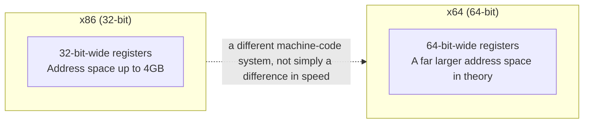
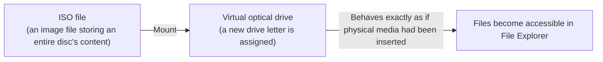

## Introduction

- **What You'll Learn From This Article**: This article systematically explains what the **x64 and x86 options** you often see on a software download page actually represent, **what happens if you install the wrong one, and why it still isn't unified today.** It also covers what the operation of **right-clicking an ISO file and choosing "Mount"** — as you'd do with a file downloaded from a tool like Dell Server Update Utility — actually does.
- **Intended Audience**: This article is aimed at engineers who've seen the x64/x86 choice when installing software or a driver, but who can't concretely explain the difference, or what happens if you choose the wrong one.
- **Estimated Reading Time**: About 16 minutes

This article is part of the [Top 1% Series' full article guide](/en/sitemap), and the fourth article in the [Windows Client Operations Series](/en/sitemap#series-list).

## Prerequisites

- **CPU Instruction Set Architecture (ISA)**: The system of machine-language instructions a CPU can directly understand and execute. Software is ultimately compiled down into machine code that follows this instruction set.
- **Registers**: Extremely fast storage locations inside a CPU used for computation and temporarily holding data. A register's width (how many bits it can hold) directly determines how much data, and how large an address space, that CPU can handle at once.

## Getting the Big Picture

### x64 and x86 Aren't "the Same Instruction Set at Different Speeds"

**x86** refers to an instruction set originating from Intel's 8086/386-family CPUs, **built around 32-bit-wide registers.** **x64 (also called AMD64, or x86-64)** extends this instruction set into **a distinct instruction set (operating mode) capable of handling 64-bit-wide registers and address spaces.**

**The key point is that x64 isn't simply a "faster version" of x86 — it's a distinct operating mode, differing in register width, address space, and instruction encoding.** Because a 32-bit program and a 64-bit program end up as different sequences of machine-code bytes that the CPU reads, **a single binary file doesn't just work as-is in either mode.**

## Fundamentals, Explained Thoroughly

### What Happens If You Install the Wrong Architecture?

What matters here is that **the behavior differs fundamentally between "an ordinary application the user operates directly" and "a driver that runs as part of the OS kernel."**

| Target | Installing the x86 version on a 64-bit OS |
|---|---|
| **An ordinary application (user mode)** | Thanks to a compatibility layer called **WoW64 (Windows on Windows 64)**, it typically runs as-is. However, performance and functional limitations occur, such as a single process being limited to a 32-bit address space (effectively just under 4GB). |
| **A device driver (kernel mode)** | **It generally won't work at all.** There's no WoW64-equivalent compatibility layer for drivers running in kernel mode — if the driver's bitness doesn't exactly match the OS's bitness, either the installation itself is refused, or the driver fails to load. |

**In other words, this isn't a simple story of "get it wrong and it crashes immediately" — the outcome differs dramatically depending on whether the target is an application or a driver.** For ordinary applications, the compatibility layer usually absorbs the mismatch, but **a driver's architecture must always match the OS's bitness exactly** — a critically important point in practice.

How WoW64 runs 32-bit apps

64-bit Windows has an internal subsystem called **WoW64** that emulates a 32-bit execution environment. On 64-bit Windows, the system folder holds a `System32` folder containing 64-bit DLLs, alongside **a separate folder, `SysWOW64`, containing 32-bit DLLs**, and WoW64 automatically redirects the system DLLs a 32-bit application calls into into this `SysWOW64` side. This mechanism lets a 32-bit application behave, on top of a 64-bit OS, exactly as if it were running in a native 32-bit environment.

### Why Aren't x64 and x86 Unified Even Today?

The question "why does x86 still get distributed today, when 64-bit CPUs are nearly universal" has a few answers.

- **Maintaining compatibility with older environments**: Some organizations still need to maintain compatibility with a lingering 32-bit OS, or old peripheral/driver environments exclusive to 32-bit.
- **The publisher's operational cost**: It's technically possible to bundle both architectures' programs into a single installer file (a so-called universal installer), but this **simply increases the file size**, and some publishers haven't invested the effort and cost to do so.
- **Generational differences in distribution methods**: Many recent consumer-facing applications have moved to a **"bootstrapper"-style installer, which automatically detects the runtime environment at startup and fetches/unpacks the appropriate payload behind the scenes**, so users never have to think about it. Tools that carry forward an older distribution convention — such as a hardware vendor's update utility like Dell's, or enterprise driver-distribution tools — **still explicitly ask the user to choose between x64 and x86.**

**In other words, much of the phenomenon of "this looks unresolved" is, in practice, actually "the technology to unify it exists, but whether the publisher has invested the effort into it varies."**

### What Does "Mounting" a Dell SUU ISO File Actually Do?

Downloading a tool like Dell Server Update Utility sometimes gives you an **ISO file** rather than an executable. **An ISO file is a "disk image" — the entire content of an optical medium like a CD or DVD, saved byte-for-byte as a single file.**

Right-clicking it and choosing **"Mount"** makes Windows **recognize the ISO file's content exactly as if a physical disc had actually been inserted into a physical optical drive.** Concretely, a new virtual optical drive (assigned a new drive letter) appears in File Explorer, showing the ISO file's contents as if they'd been unpacked directly into it.

**The key point is that mounting is strictly an operation that makes it recognized as a virtual, read-only drive — not an operation that actually unpacks or copies the ISO file's content to another location on disk.** Unmounting makes that virtual drive disappear, while the original ISO file itself remains untouched. Since Windows 8, this capability has been built into the OS by default, executable directly from a right-click without any additional software.

Why update utilities are often distributed as an ISO

The reason server firmware/driver update utilities are often distributed as an ISO rather than a standalone executable is that **the convention of originally being designed for distribution and boot via physical CD/DVD media has carried forward unchanged.** With an ISO, you can also **burn it directly onto physical media and boot the target server from it**, giving it a practical advantage: performing an update on a server that can't even boot its own OS, using this media on its own to boot and carry out the update.

## The View From the Top 1% Perspective

### How a Driver Architecture Mismatch Surfaces in Practice

In practice, if you obtain the wrong architecture's driver package without checking the server/PC's spec (its CPU and OS bitness) ahead of time, this mismatch surfaces as **the installer itself refusing to launch, or the device staying unrecognized in Device Manager.** This tends to be **more time-consuming to isolate the cause of** than an ordinary application malfunction, since this kind of driver-level mismatch doesn't always show up as a clear "wrong architecture" error message.

## Common Misconceptions and Pitfalls

- **Misconception 1: "x64 is just a faster version of x86, using the same instruction set"**
  x64 is a distinct operating mode, differing in register width, address space, and instruction encoding — not simply a difference in speed.
- **Misconception 2: "Getting the architecture wrong always crashes the system"**
  An ordinary user-mode application typically runs as-is via the WoW64 compatibility layer. Only kernel-mode software like a driver, for which no compatibility layer exists, fails to install outright on an architecture mismatch.
- **Misconception 3: "Mounting an ISO file actually unpacks and copies its content onto disk"**
  Mounting is an operation that makes the ISO file's content recognized as a virtual, read-only drive — not an operation that actually copies or unpacks its content elsewhere.

## The Troubleshooting Perspective

For installation-related issues, the basic approach is to **first isolate whether the target is a user-mode application or a kernel-mode driver.**

1. **An application behaves unstably or some functionality doesn't work after installation**: Check whether memory/address-space limitations from running via WoW64 are the cause.
2. **A driver's installer refuses to launch, or the device isn't correctly recognized in Device Manager**: Check whether that driver package's architecture (x64/x86) matches the target OS's bitness.
3. **Right-clicking an ISO file doesn't show a "Mount" option**: Older Windows versions may not have this built in as a default feature, requiring a third-party mounting tool.

### Preventive Measures and Permanent Fixes

- Before obtaining a driver/firmware update package, always confirm the target server/PC's CPU and OS bitness.
- When performing the same update work across many devices, build a check into a checklist or automation script ahead of time to prevent an architecture-selection mistake.

## Summary

- x64 and x86 are distinct operating modes, differing in register width, address space, and instruction encoding — not simply a difference in speed.
- An ordinary user-mode application typically runs as-is via the WoW64 compatibility layer, but a kernel-mode driver won't work unless it exactly matches the OS's bitness.
- x64/x86 still get distributed unresolved today less because of a technical constraint, and more because of whether the publisher has invested the effort into supporting a universal installer format.
- "Mounting" an ISO file is an operation that makes its content recognized as a virtual, read-only optical drive — not an operation that actually unpacks or copies its content onto disk.

**What to Keep in Mind From Today**
1. Be aware of whether the installation target is a driver or an application, and be especially strict about confirming an architecture match for drivers.
2. When you encounter "mounting" an ISO file, remember it's just recognition as a virtual, read-only drive.

## References

- [WOW64 Implementation Details | Microsoft Learn](https://learn.microsoft.com/en-us/windows/win32/winprog64/wow64-implementation-details)
- [x64 Architecture | Microsoft Learn](https://learn.microsoft.com/en-us/windows-hardware/drivers/kernel/x64-architecture)
- [Mount and unmount an ISO image | Microsoft Support](https://support.microsoft.com/en-us/windows/mount-and-unmount-a-disc-image-iso-or-vhd-in-windows-63d84dfc-a75f-4c3e-b298-84a3fbec7784)
