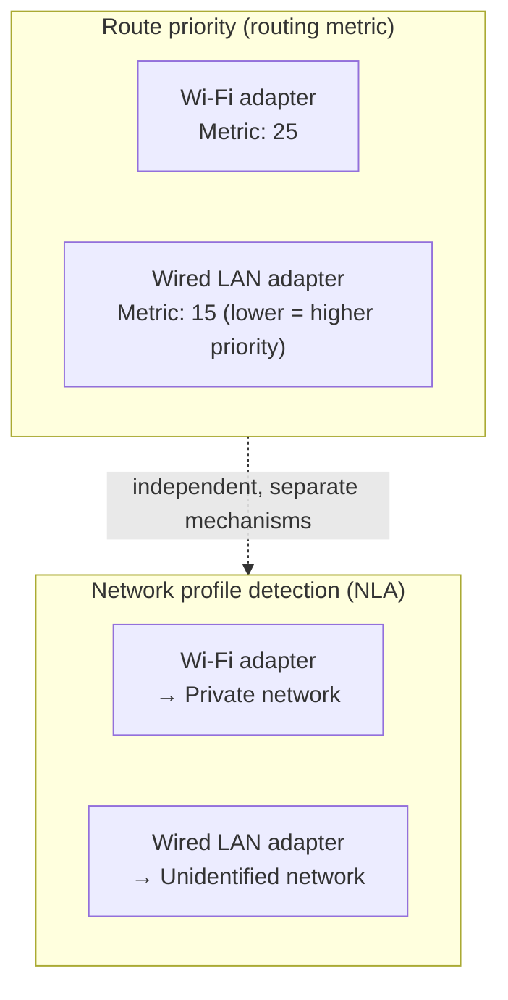

## Introduction

- **What You'll Learn From This Article**: Starting from a common practical symptom — "enabling Wi-Fi while plugging in a wired LAN cable can sometimes make devices on the wired LAN unreachable" — this article systematically explains two mechanisms: **which route Windows prioritizes when multiple network adapters are active at once (routing metrics)**, and **how a network gets classified as "Domain," "Private," or "Public," and which Windows Firewall profile gets applied as a result (NLA, Network Location Awareness)**. Along the way, it also covers a real-world incident where an "unidentified network" got lumped together in a NIC teaming + multiple logical NIC (VLAN) configuration.
- **Intended Audience**: This article is aimed at engineers who operate PCs or servers with multiple network adapters, but who can't concretely explain which route takes priority or how the network profile gets determined.
- **Estimated Reading Time**: About 19 minutes

This article is part of the [Top 1% Series' full article guide](/en/sitemap), and part of the [Networking Fundamentals Series](/en/sitemap#series-list). It assumes you understand the basic forwarding mechanisms of routers and switches from [Understanding the Difference Between Hubs, Switches (L2SW), L3SW, and Routers from a "Top 1%" Perspective](/en/articles/network-devices-guide).

## Prerequisites

- **Default gateway**: The IP address a device designates as the first hop when sending a packet addressed to a network other than its own.
- **Routing table**: A table defining which destination's packets get forwarded through which interface (NIC) to where. A PC with multiple network adapters can have multiple entries in its routing table.

## Getting the Big Picture

### In a Nutshell

**When multiple network adapters are active at once, Windows decides which route to prioritize based on a priority value assigned to each adapter — automatically or manually — called the "interface metric."** Separately, and independently from that, a service called **NLA (Network Location Awareness)** judges whether the network each adapter is connected to is "Domain," "Private," or "Public," and the Windows Firewall's applied rules (profile) switch based on that classification. **These two mechanisms have completely different purposes and criteria, but they share a common trait: both tend to cause problems in a situation where multiple network adapters are active at once.**

## Fundamentals, Explained Thoroughly

### Multiple Active Adapters and Default Gateway Priority (Interface Metric)

Each of Windows's network adapters is assigned a value called the **interface metric** (by default, calculated automatically, or set manually). This value **indicates how strongly the route through that adapter is preferred — the lower the value, the higher the priority.** When multiple adapters are active at once, each with its own default gateway, Windows effectively **prioritizes the default gateway of whichever adapter has the lowest interface metric** as the route actually used.

**The symptom "enabling Wi-Fi while plugging in a wired LAN cable can sometimes make devices on the wired LAN unreachable" is precisely explained by this metric priority.** If the Wi-Fi adapter's metric is lower (= higher priority) than the wired LAN adapter's, then even for traffic addressed to a device on the same segment as the wired LAN, if the PC judges the destination to be outside its own segment, it tries to send it toward the Wi-Fi side's default gateway first — and the intended wired LAN route never gets used.

The basis for automatic metric calculation

Under Windows's default setting (automatic metric), the interface metric is calculated automatically based on that adapter's **link speed** (a faster adapter tends to be assigned a lower — that is, higher-priority — metric). However, this is purely a mechanical calculation based on link speed, and **has nothing to do with whether that adapter is actually the right route to the network you want to reach.** When you run into a symptom like the one above, where the priority ends up different from what you intended, you can explicitly control the priority by manually specifying the metric value — from `ncpa.cpl`, open the target adapter's properties → the "Internet Protocol Version 4" properties → "Advanced," rather than relying on automatic calculation.

### Why Gateway Priority Matters Even for Traffic to the Same Segment

You might think, "if a device is on the same segment as the wired LAN, gateway priority shouldn't matter." But this only holds **as long as the PC itself can correctly determine, based on the IP address and subnet mask configured on the wired LAN adapter, whether the destination is genuinely within the same segment.** If, for some reason, there's ambiguity in resolving the route (for example, the Wi-Fi side happens to have a similar address scheme configured, or a VPN connection has complicated the routing table), a different adapter's route than intended can end up being chosen. For troubleshooting in practice, checking the actual routing table with the `route print` command, and directly confirming that the intended route has the intended priority, is the reliable approach.

### Network Profile Detection: NLA (Network Location Awareness)

As a mechanism entirely separate from the interface metric, Windows has a service called **NLA (Network Location Awareness)**. NLA's job is to **automatically determine whether the network each network adapter is connected to falls into the category "Domain," "Private," or "Public."**

| Category | Basis for classification | Default firewall tendency |
|---|---|---|
| Domain | Reachable and able to authenticate against the joined AD domain's DC via that network | A relatively lenient default rule set, allowing traffic needed for work |
| Private | Manually classified by the user as a "trusted network" (home, corporate LAN, and so on) | A moderate default rule set, allowing a certain amount of traffic |
| Public | Doesn't match either of the above (an untrusted network like café Wi-Fi) | The strictest default rule set, tightly restricting inbound traffic |

**This network category is determined individually, per adapter.** In other words, it's entirely normal for a Wi-Fi adapter to be classified as "Private" while a wired LAN adapter on the same PC is classified as "Domain," at the same time. And **Windows Firewall applies a different profile (a different set of default inbound rules) per category, on a per-adapter basis.**

What is an "unidentified network"?

A network that NLA judges to meet neither the "Domain" nor "Private" criteria (and that the user hasn't yet manually classified) is treated as an **"unidentified network,"** and by default gets the same strict firewall rules as a public network. Even a wired LAN that should be able to reach an AD domain's DC can end up being temporarily treated as an "unidentified network" if DNS resolution or the domain reachability check is delayed or fails temporarily for some reason, preventing NLA from finalizing its judgment.

## The View From the Top 1% Perspective

### A Real Incident in a NIC Teaming + Multiple Logical NIC (VLAN) Environment

Let's diagnose the following real-world incident.

> A server had two physical NICs configured as a team. On top of that team, four logical NICs were created, each assigned a different VLAN, and one of them had a gateway configured. Only that logical NIC with the gateway was recognized as "Ethernet 4" instead of "Unidentified network," and could have its Windows Firewall profile set individually. The other three logical NICs were lumped together as "Unidentified network" and couldn't be configured individually. After a server reboot, all the logical NICs became "Unidentified network." Restarting the NLA service was attempted but failed with an error, so the affected logical NIC was individually restarted (disabled then re-enabled) instead, after which it was recognized as Ethernet 4 again.

This incident shows that, within NLA's judgment logic, **"whether a default gateway is present" is a particularly important clue for identifying and naming a network.**

- **Why a logical NIC with a gateway is more easily recognized individually**: NLA identifies the uniqueness of a network by verifying actual reachability from that adapter — to the outside world, or to a specific confirmation target. An adapter with a gateway configured makes this reachability check easy to establish clearly, so **NLA more readily judges "this is a distinct network I can tell apart from the others."** A logical NIC without a gateway (one that has no route to the outside on its own), on the other hand, looks to NLA like "a network of unclear identity I can't confirm reachability for anywhere" — and multiple such logical NICs all end up lumped into the single "unidentified network" category.
- **Why everything reverted to "unidentified network" after a reboot**: At server startup, there can be some timing gap before the initialization of multiple logical NICs and the team itself completes, and reachability checks actually become possible. Due to a subtle mismatch in the timing of this initialization and reachability check, NLA can end up finalizing its state as the provisional "unidentified network" without ever completing its proper judgment.
- **Why restarting the individual logical NIC (disable then re-enable), rather than restarting the NLA service, resolved it**: In many cases, the NLA service itself can't simply be restarted (due to dependency constraints, since it's one of Windows's core networking services) — which is why that attempt errored out. Disabling and re-enabling a logical NIC, on the other hand, generates a fresh connection event for that adapter, and **this new connection event triggers NLA to re-run its network identification process for that adapter from scratch.** This explains why the judgment that failed to finalize properly at boot time was correctly redone afterward.

### Why an "Unidentified Network" Can't Be Configured Individually Per Logical NIC

Windows Firewall profiles are applied **per "network" unit as identified by NLA.** The logical NIC with a gateway was recognized by NLA as "a distinct network I can tell apart from the others," so it could be assigned an individual profile. The multiple logical NICs without a gateway, on the other hand, were all lumped by NLA into the same single classification — "an unidentified network with no clear basis for distinguishing it" — so from Windows Firewall's perspective too, they aren't treated as separate entities per logical NIC; they're treated as **one shared group called "unidentified network," with settings applied to all of them at once.** If you want to configure the firewall separately for each individual logical NIC, you need to put each one into a state NLA can reliably distinguish — for example, by giving each a reachability-checkable route, or by explicitly hardcoding the network classification via Group Policy.

## Common Misconceptions and Pitfalls

- **Misconception 1: "A device on the same segment is always reachable regardless of gateway configuration"**
  Gateway priority (interface metric) affects how the PC resolves the route to a destination. If a different adapter than expected takes priority, the intended route may not get used.
- **Misconception 2: "The network profile (Domain/Private/Public) is decided as a single value for the whole PC"**
  The network profile is determined and applied individually, per adapter. It's entirely normal for multiple adapters on the same PC to each hold a different profile.
- **Misconception 3: "An unidentified network is fixed immediately just by restarting the NLA service"**
  Simply restarting the NLA service itself is often impossible due to dependency constraints. In practice, it's more reliable to prompt NLA to re-judge by disabling and re-enabling the affected network adapter itself, generating a fresh connection event.

## The Troubleshooting Perspective

Networking trouble in a multi-adapter environment is best approached by **isolating whether it's a route priority (metric) issue or a network profile (NLA/firewall) issue.**

1. **A specific segment is unreachable**: Check the routing table with `route print`, and confirm whether the intended adapter's default gateway is actually taking priority (its interface metric value).
2. **An adapter that should be on a wired LAN (corporate domain) is treated as public/unidentified network, and the firewall is blocking traffic**: Check whether that adapter can successfully verify reachability to a domain controller, and whether there's a problem with DNS resolution.
3. **In a teaming + multiple logical NIC environment, network profiles aren't individualized as intended**: Check whether each logical NIC has a gateway (or some clear means of confirming reachability) configured.
4. **The network profile judgment resets every time the server reboots**: Suspect the startup order/timing of the NLA service and its dependent networking components, and consider building in a re-enable step for the affected adapter via a startup script if needed.

### Preventive Measures and Permanent Fixes

- In configurations with multiple active network adapters, explicitly set the intended priority manually rather than relying on automatic metrics.
- For any adapter where reliable firewall control within the domain matters, always provide a reachability-checkable gateway (or an equivalent means of confirming reachability).
- Confirm the network profile behavior in a teaming + multiple logical NIC environment ahead of time, through a test that actually involves a reboot.

## Summary

- When multiple network adapters are active at once, Windows decides which route (default gateway) to prioritize based on the interface metric value — the lower the value, the higher the priority.
- The network profile (Domain/Private/Public) is determined individually per adapter by the NLA service, and the firewall profile is applied on a per-adapter basis too.
- NLA identifies a network based on the results of a reachability check such as the presence of a gateway; multiple logical NICs without a gateway get lumped into a single "unidentified network" category and can't be configured individually.
- If restarting the NLA service itself isn't feasible, you can prompt NLA to re-judge by disabling and re-enabling the affected network adapter, generating a fresh connection event.

**What to Keep in Mind From Today**
1. When you run into a routing question in an environment with multiple active adapters, check the interface metric and actual priority with `route print`.
2. If a network profile isn't being individualized as intended, first check whether that adapter has a gateway (or some means of confirming reachability) configured.

That's all 9 articles in the Networking Fundamentals series. If you'd like to review the whole thing by ear during a commute or while doing chores, check out [[Listen] The Networking Fundamentals Series, Fully Recapped](/en/articles/network-audio-review-guide).

## References

- [Route command | Microsoft Learn](https://learn.microsoft.com/en-us/windows-server/administration/windows-commands/route)
- [Network Location Awareness (NLA) | Microsoft Learn](https://learn.microsoft.com/en-us/windows/win32/winsock/network-location-awareness-nla-and-how-it-relates-to-windows-firewall)
- [Windows Firewall Profiles Overview | Microsoft Learn](https://learn.microsoft.com/en-us/windows/security/operating-system-security/network-security/windows-firewall/best-practices-configuring)
