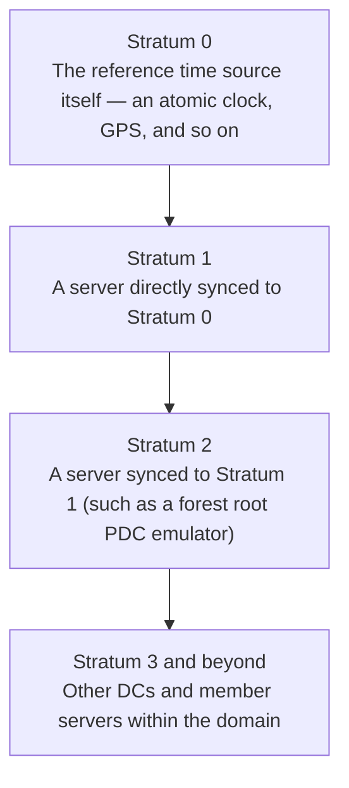
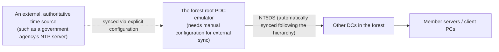

## Introduction

- **What You'll Learn From This Article**: This article systematically explains the concept of **Stratum**, which always comes up when configuring NTP (Network Time Protocol) server functionality on Windows Server, what the registry value **AnnounceFlags** actually controls, and **why the forest root PDC emulator specifically needs an explicit sync configuration to an external time source.**
- **Intended Audience**: This article is aimed at engineers who've worked with time synchronization settings on Windows Server, but who can't concretely explain what the AnnounceFlags setting means or why it's needed.
- **Estimated Reading Time**: About 17 minutes

This article is part of the [Top 1% Series' full article guide](/en/sitemap), and the second article in the [Windows Server Operations Series](/en/sitemap#series-list). The time synchronization hierarchy anchored by the PDC emulator is touched on in [Understanding FSMO (Operations Master) Roles from a "Top 1%" Perspective](/en/articles/fsmo-guide); this article focuses on its actual configuration values.

## Prerequisites

- **PDC emulator**: The FSMO role that anchors time synchronization within a domain. See [Understanding FSMO (Operations Master) Roles from a "Top 1%" Perspective](/en/articles/fsmo-guide) for details.
- **W32Time (Windows Time service)**: The service built into Windows by default that performs time synchronization via NTP.

## Getting the Big Picture

### The Concept of Stratum

NTP expresses a time source's trustworthiness and hierarchical position via a number called **Stratum.**



**Within an AD domain, this Stratum hierarchy corresponds to the time synchronization hierarchy anchored by the PDC emulator, explained in [Understanding FSMO (Operations Master) Roles from a "Top 1%" Perspective](/en/articles/fsmo-guide).** A domain-joined Windows machine, by default, automatically relies on a higher time source following its domain's hierarchy (the DC hierarchy), but **the forest root PDC emulator has no higher source to rely on within the domain.**

## Fundamentals, Explained Thoroughly

### Why Only the Forest Root PDC Emulator Needs Special Configuration

This is the most important point to understand about NTP configuration on Windows Server. **Every machine other than the forest root domain's PDC emulator functions fine with the default setting (a scheme called `NT5DS`, which automatically relies on a higher DC following AD DS's hierarchy).** But **the forest root PDC emulator itself has no higher DC left to rely on, no matter how far up the domain hierarchy you go.**

For this reason, only the forest root PDC emulator **needs to be manually configured to explicitly sync to an external, authoritative time source** (a publicly available NTP server run by a government agency, or a dedicated time server appliance with GPS reception, and so on). Without this configuration, the forest root PDC emulator ends up relying solely on its own hardware clock (the CMOS clock on the motherboard), carrying **the risk of accumulating time drift over time.**



### What Is AnnounceFlags?

**AnnounceFlags** is a registry value at `HKEY_LOCAL_MACHINE\SYSTEM\CurrentControlSet\Services\W32Time\Config` — a combination of bit flags that controls **whether that machine advertises itself as "a trustworthy time source" to clients seeking time synchronization.**

| Bit value | Meaning |
|---|---|
| `0x01` | Always act as a time server |
| `0x02` | Automatically act as a time server if this is the forest root PDC emulator |
| `0x04` | Always advertise as a reliable time source |
| `0x08` | Automatically advertise as a reliable time source if this is the forest root PDC emulator |

**The default value is `10` (`0x0A` in hex, i.e. the combination of `0x02` and `0x08`).** This default's meaning is a conditional behavior: **"automatically act as a time server and reliable time source if I'm the forest root PDC emulator, and don't otherwise."** Thanks to this default, administrators don't need to manually toggle the setting on individual DCs — **even after an FSMO transfer moves the PDC emulator role to a different DC, the AnnounceFlags setting itself stays untouched, and the new PDC emulator automatically inherits this role.**

<details>
<summary>What happens if you set AnnounceFlags to 0</summary>

Setting `AnnounceFlags` to `0` makes that machine stop advertising itself as "a time source available for use" to clients entirely. This is a configuration change that **breaks the time synchronization hierarchy itself** and generally shouldn't be done. Unless it's a special test environment, or you deliberately want to exclude that machine from the time synchronization hierarchy, it's recommended to leave the default value untouched.

</details>

### What's the Difference Between "Acting as a Time Server" and "Acting as a Reliable Time Source"?

Looking at AnnounceFlags' four bits, `0x01`/`0x02` (**time server**) and `0x04`/`0x08`(**reliable time source**) are easy to conflate since they sound similar. It helps to think of them as **two stages of the same switch**.

- **"Act as a time server" (`0x01`/`0x02`)**: Controls whether that machine **responds** to NTP queries on UDP port 123. If this bit is set, it'll return the time when explicitly queried (e.g. by another machine listing it in `NtpServer`) — but that alone doesn't make it "a source that gets automatically picked as an upstream authority within the hierarchy."
- **"Act as a reliable time source" (`0x04`/`0x08`)**: One level up from that — it controls whether clients doing automatic upstream discovery via NT5DS are allowed to formally adopt that machine's time as their sync source.

**For a machine to call itself a "reliable time source," it must also be a "time server"** — being reliable while not responding to queries at all isn't a coherent state. That's exactly why the default value `0x0A` combines `0x02` (time server, automatic) and `0x08` (reliable time source, automatic): the forest root PDC emulator needs to be both "something that answers queries" and "something that's safe to trust as an automatic-selection target" at the same time.

### Is the PDC Emulator's NTP Function a Separate Feature From What Gets Installed at DC Promotion?

The short answer is: **no, they're not separate.** W32Time (the Windows Time service) is a **single service built into every Windows machine**, regardless of whether it's a DC. Promoting a machine to a DC doesn't "install a new NTP server feature" — what actually happens is that the **existing W32Time service's configuration (its `Type` and the automatic AnnounceFlags bits) automatically switches** to match its position in the AD DS hierarchy.

- An ordinary domain-joined machine: `Type=NT5DS`, configured purely as a "client" that automatically follows AD DS's hierarchy to find an upstream DC.
- A DC that isn't the forest root PDC emulator: Also NT5DS, but the automatic AnnounceFlags bits make it act as a "time server" toward the member servers and client PCs beneath it.
- The forest root PDC emulator: As covered above, it has no upstream to rely on within the domain, so it needs an explicit sync configuration (e.g. `Type=NTP`) to an external time source, and the automatic AnnounceFlags bits make it act as a "reliable time source" itself.

In other words, **the PDC emulator's NTP function and the NTP function that activates at DC promotion aren't two differently-named features — they're the same W32Time service, running with different configuration values depending on its position.** The misconception that "the PDC emulator has some special software installed that other machines don't" tends to get in the way of real-world troubleshooting, so it's worth keeping straight.

### Other Key Configuration Items

Beyond AnnounceFlags, the following items also come up in Windows Server's NTP configuration:

| Setting | Content |
|---|---|
| `Type` | Specifies the sync method. Choose from `NTP` (sync to explicitly specified servers), `NT5DS` (automatically sync to a higher DC following AD DS's hierarchy), `AllSync` (try every available time source), or `NoSync` (don't sync at all). |
| `NtpServer` | The external NTP server address(es) explicitly specified as the sync target when `Type` is `NTP`. Multiple can be specified for redundancy. |
| `MaxPosPhaseCorrection`/`MaxNegPhaseCorrection` | The maximum amount of time correction (in seconds) allowed in a single sync. Used as a safeguard: a discrepancy larger than this range is treated as an error rather than automatically corrected. |

The `w32tm` command lets you check and change these settings.

```powershell
# Example: configure the forest root PDC emulator to sync to external NTP servers
w32tm /config /manualpeerlist:"time.example.com,0x8 time2.example.com,0x8" /syncfromflags:manual /reliable:yes /update
```

## The View From the Top 1% Perspective

### Why Time Sync Accuracy Is Directly Tied to Kerberos Authentication Stability

As touched on in [Why Is DNS in an AD Environment Designed This Way?](/en/articles/ad-dns-guide) and elsewhere, many features of an AD environment are, like DNS, closely tied to Kerberos authentication. **Kerberos authentication is extremely strict about clock accuracy — if the clock drift between a client and a DC exceeds the default tolerance (5 minutes), authentication itself fails outright.** If accuracy degrades at the forest root PDC emulator — the top of the time synchronization hierarchy — the effect ripples across the entire domain, surfacing as **a flood of unexplained authentication errors.** It's important to treat time synchronization configuration not as "just setting the clock," but as part of the authentication infrastructure itself.

### Redundancy for External Time Sources

The `NtpServer` setting lets you specify multiple external time sources, comma-separated. **Relying on a single external time source carries the risk that a failure of that time source itself could break time synchronization for the entire forest.** In large-scale, high-availability environments, it's recommended to specify multiple independent external time sources (from different providers, where possible).

## Common Misconceptions and Pitfalls

- **Misconception 1: "The W32Time service is just an auxiliary feature for keeping clocks looking right, of low importance"**
  Time synchronization is a prerequisite for Kerberos authentication, and its accuracy is directly tied to the stability of authentication across the entire domain.
- **Misconception 2: "Every DC in the forest needs an external time source sync configuration"**
  Only the forest root PDC emulator needs an explicit sync configuration to an external time source. Other DCs function fine automatically with the default NT5DS scheme, following the hierarchy.
- **Misconception 3: "AnnounceFlags should always be manually set to an explicit value"**
  The default value (`0x0A`) is a sensible design that automatically follows along when an FSMO transfer moves the PDC emulator role. Unless there's a specific reason, there's no need to change the default.

## The Troubleshooting Perspective

For time synchronization issues, the basic approach is to **isolate which layer's machine, and which setting, the problem stems from.**

1. **A specific machine's clock is off**: Run `w32tm /query /status` and check the Stratum value and source it's referencing.
2. **Kerberos authentication fails for no apparent reason**: Check the clock drift between the client and the DC to see whether it exceeds the 5-minute tolerance. Also check whether the forest root PDC emulator's own clock accuracy has a problem.
3. **The forest root PDC emulator's clock is significantly off from an external reference**: Check reachability to the external time source specified in `NtpServer` (whether UDP port 123 is allowed through the firewall).

### Preventive Measures and Permanent Fixes

- Explicitly configure the forest root PDC emulator with multiple independent external time sources, avoiding a single point of failure.
- Confirm the firewall allows traffic over UDP port 123, needed for syncing to an external time source.
- After an FSMO transfer, confirm that the time synchronization configuration (syncing to an external time source) has correctly carried over to the new PDC emulator.

## Summary

- NTP's Stratum corresponds to the time synchronization hierarchy anchored by the PDC emulator in AD DS.
- Only the forest root PDC emulator, which has no higher source to rely on within the domain, needs an explicit sync configuration to an external, authoritative time source.
- AnnounceFlags is a bit flag combination controlling whether a machine advertises itself as a reliable time source, and its default value (`0x0A`) is a sensible design that automatically follows an FSMO transfer.
- "Time server" (does it respond to queries) and "reliable time source" (is it safe to adopt via automatic selection) are two stages of one switch — a machine must be a time server to also be a reliable time source.
- The PDC emulator's NTP function isn't a separately-installed feature at DC promotion — it's the same W32Time service that every machine has, running with different settings depending on its position.
- Time synchronization accuracy is a prerequisite for Kerberos authentication and shouldn't be dismissed as merely setting the clock.

**What to Keep in Mind From Today**
1. When reviewing NTP configuration, first check whether that machine is the forest root PDC emulator, and judge whether it needs an explicit external time source sync.
2. When you run into an unexplained Kerberos authentication error, build the habit of first checking the clock drift between the client and the DC.

## References

- [Windows Time Service Technical Reference | Microsoft Learn](https://learn.microsoft.com/en-us/windows-server/networking/windows-time-service/windows-time-service-tech-ref)
- [How the Windows Time Service Works | Microsoft Learn](https://learn.microsoft.com/en-us/windows-server/networking/windows-time-service/how-the-windows-time-service-works)
- [Network Time Protocol Version 4: Protocol and Algorithms Specification | RFC 5905](https://datatracker.ietf.org/doc/html/rfc5905)
