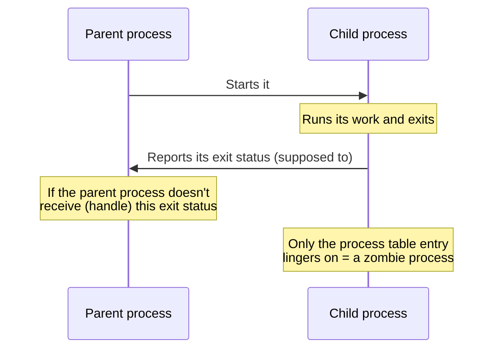

## Introduction

- **What You'll Learn From This Article**: Starting from a common practical fix — "Google Drive disappeared from File Explorer, and killing its process in Task Manager fixed it" — this article systematically explains the difference between the similar-sounding but distinct terms **process, thread, and task**, and **what a zombie process actually is and why it happens.** Along the way, it also covers other PC terminology that comes up in practice, such as the mechanism behind a monitor's screen layout automatically restoring itself when connected via HDMI.
- **Intended Audience**: This article is aimed at engineers who routinely kill processes in Task Manager as a fix, but who can't explain the difference between process, task, and thread, or the precise meaning of the term "zombie process."
- **Estimated Reading Time**: About 16 minutes

This article is part of the [Top 1% Series' full article guide](/en/sitemap), and the second article in the [Windows Client Operations Series](/en/sitemap#series-list).

## Prerequisites

- **OS process management**: An OS allocates a dedicated memory space and resources to each running program and manages it. This unit of management is a "process."

## Getting the Big Picture

### The Relationship Between Process, Thread, and Task

These three terms are often used interchangeably, but strictly speaking, they're **distinct concepts related in a hierarchy.**

```mermaid
graph TB
    Task["Task<br/>= a unit of \"one piece of work\" from the user's perspective<br/>(the display unit in Task Manager / Task Scheduler)"]
    Process["Process<br/>= an independent unit of memory space and resources the OS allocates to a running program"]
    Thread["Thread<br/>= the smallest unit of processing actually executed on the CPU, within a process"]

    Task -.roughly corresponds to.-> Process
    Process -->|"contains one or more threads"| Thread
```

## Fundamentals, Explained Thoroughly

### Process and Thread: A Unit of Resource Management, and the Smallest Unit of Execution

A **process** is the collection of independent memory space, file handles, and other resources the OS allocates to a single running program. If one process crashes, in principle it doesn't affect another process's memory area (since memory spaces are separated between processes).

A **thread** is the smallest unit of processing actually executed on the CPU, within that process. A single process can have multiple threads (multithreading), letting a single program advance several pieces of work in parallel. Threads within the same process share that process's memory space, so they aren't as strictly independent from each other as separate processes are.

### What Is a Task? A Unit of "One Piece of Work" From the User's Perspective

In a Windows context, the word **task** is used in a somewhat broader sense — less a strict technical term and more **"one piece of work" from the user's perspective.** The "tasks" shown in Task Manager typically correspond roughly to a running process (or an entire application spanning multiple processes), but **a "task" in Task Scheduler refers to a definition of processing that runs automatically at a specified time or under specified conditions** — so what it points to varies somewhat by context. In practice, keeping the distinction "task = a unit of work the user recognizes, process = a unit of execution the OS manages" in mind reduces confusion.

### What Is a Zombie Process?

A **zombie process** is a term referring to **a process whose actual work has already finished, but whose management information (its entry in the process table) lingers on in the OS.**



This term originates from the process model of Unix/Linux-family OSes, where a child process's exit information stays in the process table until the parent process explicitly retrieves it via an operation called `wait()`. **The child process's actual work (its executable code and most of its memory) has already been released, but the final piece of information — "how did this process exit" — hasn't been collected yet** — this pending-cleanup state is why it's called a "zombie."

The state colloquially called a "zombie process" in a Windows environment differs slightly from the strict Unix terminology, and is more often used in a broader sense: **the application itself has already become unresponsive (or its window has been closed), yet that process's entry still lingers in Task Manager.** A cloud storage client like Google Drive is a program that stays resident in the system tray, running sync work in the background, so **if its main display/response handling crashes or hangs for some reason, the process (or a related sub-process) may not fully terminate right away, lingering in a half-finished state.** In this state, the icon display in File Explorer and the sync functionality stop working correctly, and manually killing that process in Task Manager lets the OS correctly release its resources, so it can start cleanly again after a restart.

<details>
<summary>Why does this kind of half-finished exit state happen?</summary>

The main causes include **a bug in the program itself (a flaw in its resource-release handling)**, **a wait on an external resource (a network connection or file lock) that has deadlocked**, or **the program getting caught up in an OS-side abnormality (such as a graphics driver crash).** In every case, the program itself fails to complete a normal exit sequence, leaving the OS in an ambiguous state — "has it exited, or is it still running?" — which surfaces as an inconsistent display in Task Manager.

</details>

## The View From the Top 1% Perspective

### How a Monitor's Layout Settings Get Restored

Another "why does it work this way" question that comes up in practice is the behavior where **connecting a monitor via HDMI automatically remembers your previous screen split/layout settings.**

This happens because **monitors have a mechanism called EDID (Extended Display Identification Data), which conveys that monitor's own identifying information (manufacturer, model, serial number, supported resolutions, and so on) to the PC when it's connected.** Windows uses the **content of this EDID (particularly the combination of serial number and model)** to recognize "this is that monitor I've connected before," and restores the layout, resolution, and orientation settings previously configured for it, from information saved in the registry. Even a different monitor of the same model, if its serial number differs, gets recognized as a distinct monitor and requires a new configuration.

## Common Misconceptions and Pitfalls

- **Misconception 1: "Process, task, and thread are all just different names for the same thing"**
  A task is a unit of work from the user's perspective, a process is a unit of resource management the OS handles, and a thread is the smallest unit of processing executed within a process — these are distinct concepts related in a hierarchy.
- **Misconception 2: "Zombie processes don't exist as a concept in Windows"**
  The strict technical term "zombie process" originates from the Unix-family OS process model, but it's used colloquially in Windows environments too, in the closely related sense of "a process that stays lingering after becoming unresponsive."
- **Misconception 3: "Killing a process in Task Manager also resolves whatever caused it"**
  Killing a process in Task Manager is just a way to force the OS to reclaim the resources of a lingering process — it doesn't resolve the root cause that caused that state in the first place (a bug, a deadlock, and so on). If it happens frequently, investigating the root cause — updating the application, checking its logs — is needed.

## The Troubleshooting Perspective

For process-related issues, the basic approach is to **isolate whether that process is genuinely doing nothing, or simply responding slowly.**

1. **An application disappears from File Explorer, or its system tray icon vanishes**: Check the "Details" tab in Task Manager for whether that process still exists, and how its CPU/memory usage trends.
2. **The same problem keeps recurring even after killing the process in Task Manager**: Check the application's version and logs to determine whether it's a one-off issue or a known bug.
3. **The whole PC stays sluggish for an extended period**: Check whether a specific process is abnormally hogging CPU or memory, and isolate whether that's normal processing or an unintended loop (a bug).

### Preventive Measures and Permanent Fixes

- Keep resident background applications, such as a cloud storage client, updated regularly to pick up known bug fixes.
- If a specific application frequently gets stuck lingering, check its logs to identify the root cause (network instability, a file lock conflict, and so on).

## Summary

- Task is a unit of work from the user's perspective, process is a unit of resource management the OS handles, and thread is the smallest unit of processing executed within a process — distinct concepts related in a hierarchy.
- A zombie process refers to a state where the actual work has finished but the management information lingers on; in a Windows environment, it's used in the closely related sense of a process that stays lingering while unresponsive.
- Killing a process in Task Manager is a way to forcibly reclaim a lingering process's resources — separate from resolving the root cause.
- The mechanism behind a monitor's layout settings being restored is that Windows recognizes a previously connected monitor based on its unique identifying information, EDID.

**What to Keep in Mind From Today**
1. When you kill a process in Task Manager as a fix, keep in mind that it's a symptomatic treatment — investigate the root cause if it recurs frequently.
2. When you encounter the terms "process," "task," and "thread," consciously distinguish which layer each one refers to.

## References

- [Task Manager overview | Microsoft Learn](https://learn.microsoft.com/en-us/windows/win32/taskschd/task-manager)
- [About Processes and Threads | Microsoft Learn](https://learn.microsoft.com/en-us/windows/win32/procthread/about-processes-and-threads)
- [VESA Enhanced Extended Display Identification Data Standard (E-EDID) | VESA](https://vesa.org/vesa-standards/)
