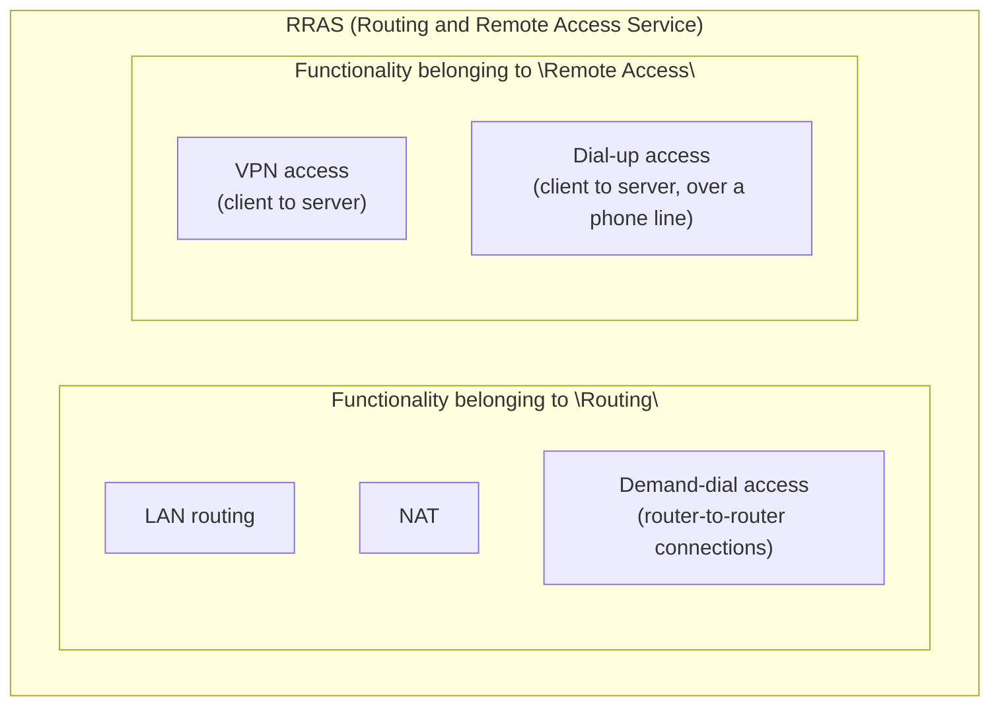
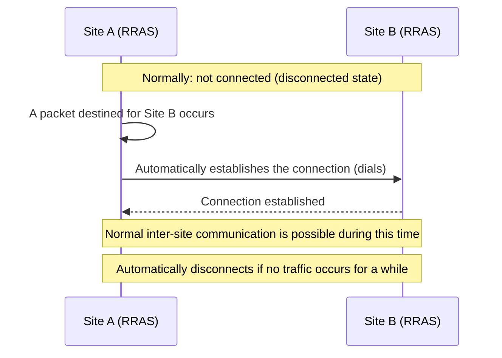

## Introduction

- **What You'll Learn From This Article**: When enabling RRAS (Routing and Remote Access Service) on Windows Server, you're presented with five role options: **VPN access, dial-up access, demand-dial access, NAT, and LAN routing.** This article systematically explains what each one actually achieves and when to use which. Along the way, it also covers the historical background of why these are entirely different capabilities, yet all bundled under a single service named "Routing and Remote Access."
- **Intended Audience**: This article is aimed at engineers who've seen options other than VPN listed in RRAS's configuration wizard, but who can't concretely explain what each one actually achieves.
- **Estimated Reading Time**: About 17 minutes

This article is part of the [Top 1% Series' full article guide](/en/sitemap), a follow-on in the [Remote-Access VPN / L2TP-IPsec Series](/en/sitemap#series-list). RRAS's VPN access functionality itself is covered in detail in [Why Does a VPN Client Need a Gateway on the Same Subnet? — Understanding IP Address Management in Windows Server (RRAS) L2TP/IPsec VPN from a "Top 1%" Perspective](/en/articles/windows-server-l2tp-vpn-guide); this article focuses on the other four roles.

## Prerequisites

- **RRAS (Routing and Remote Access Service)**: A service built into Windows Server by default that bundles together several networking-related capabilities. See [Why Does a VPN Client Need a Gateway on the Same Subnet?](/en/articles/windows-server-l2tp-vpn-guide) for details.
- **PPP (Point-to-Point Protocol)**: A protocol that performs authentication and IP address assignment over a link connecting two points directly. See [Understanding the Difference Between Telephone Lines and IP Networks from a "Top 1%" Perspective](/en/articles/circuit-switching-ppp-guide) for details.

## Getting the Big Picture

### Why Are Five Different Capabilities Bundled Into One Service?

The name RRAS (Routing and Remote Access Service) actually describes its structure precisely. **RRAS's true identity is a historical integration of two distinct sets of functionality with different purposes: a set that belongs to "Routing" and a set that belongs to "Remote Access."**

RRAS emerged in the Windows NT4/2000 era as a design that answered both a demand to use Windows Server as "an internal relay point for corporate network traffic (a router)" and a demand to use it as "an entry point for accessing the corporate network from outside (a remote-access server)," all within one service. **Today, using a dedicated router or VPN appliance is standard practice, but the historically integrated feature set still lives on today so a standalone Windows Server can shoulder these roles too** — a useful bit of context in practice.

## Fundamentals, Explained Thoroughly

### An Overall Comparison of the Five Roles

| Role | Who it connects to | What it achieves |
|---|---|---|
| **VPN access** | A remote client device | Lets clients access the corporate network over the internet through an encrypted tunnel (L2TP/IPsec, SSTP, and so on) |
| **Dial-up access** | A remote client device | Lets clients access the corporate network via a direct PPP connection over a phone line (a modem or ISDN adapter), bypassing the internet entirely |
| **Demand-dial access** | A router at another site (an RRAS server) | An inter-site connection that automatically establishes itself only when traffic between the sites occurs, and disconnects when idle |
| **NAT** | The internet | Relays traffic from a private-IP-addressed internal network to the internet by translating it to one (or a few) public IP addresses |
| **LAN routing** | Multiple LAN segments connected to the same server | Pure routing functionality that simply relays IP packets between multiple network interfaces — no VPN, dial-up, or NAT involved at all |

**VPN access and dial-up access share the same purpose — letting a remote client device join the corporate network — but the path used for the connection is completely different.** VPN access uses an encrypted tunnel over the internet, while dial-up access is a direct PPP connection over a phone line, with no concept of "the internet" involved at all.

### Dial-Up Access: A Direct Connection Over a Phone Line

**Dial-up access** is a capability where a remote client directly calls (dials) a modem or ISDN adapter attached to the server over a phone line, establishing a PPP connection. This is precisely the most primitive use case that PPP, covered in [Understanding the Difference Between Telephone Lines and IP Networks from a "Top 1%" Perspective](/en/articles/circuit-switching-ppp-guide), was originally designed for. While VPN access encapsulates PPP **inside a tunnel over the internet**, dial-up access uses PPP **directly over the phone line itself.** With the spread of broadband and VPN, it's rarely used in practice today, but it remains a listed option in RRAS.

### Demand-Dial Access: An Inter-Site Connection That Connects Only When Needed

**Demand-dial access** isn't about a client-server relationship — it's a capability for **connecting RRAS servers (routers) at two different sites to each other.** As the name suggests, its defining characteristic is establishing the connection **on demand — only when there's actually traffic destined for the other site.** If no traffic occurs for a certain period, the connection automatically disconnects.

The idea behind demand-dial comes from **the era when inter-site connections used a metered, usage-based line — an ISDN line or an early dial-up line — billed by connection time or traffic volume.** Keeping the connection between sites active at all times would have caused circuit costs to balloon, so the design philosophy was to keep costs down by "only connecting when truly needed." Today, an **always-on inter-site VPN premised on a persistent broadband connection**, as covered in [Understanding Site-to-Site VPN from a "Top 1%" Perspective](/en/articles/site-to-site-vpn-guide), is the mainstream approach, and demand-dial itself is rarely newly chosen.

Demand-dial access isn't exclusive to VPN

The demand-dial access capability itself **doesn't require the underlying connection to be a VPN (tunneling).** Historically, the demand-dial mechanism was also used over an actual analog phone line or ISDN dial-up connection. Today, using an internet-based VPN connection (PPTP, L2TP, and so on) as the demand-dial's connection method is the mainstream configuration. It's important to understand that **the control logic of "establish and disconnect the connection on demand" and "which protocol is actually used for the connection" are independent, separate design elements.**

### NAT: Using RRAS as a NAT Router

RRAS's **NAT** capability makes a Windows Server function directly as a **NAT router.** When a device on a private-IP-addressed internal network communicates with a resource on the internet, the RRAS server translates the traffic to its own public IP address (or a small number of public IP addresses) and relays it. NAT's own internal workings (the translation table, port number handling, and so on) are covered in detail in [Understanding How NAT/NAPT Works from a "Top 1%" Perspective](/en/articles/nat-guide).

In practice, a dedicated router or firewall appliance typically provides NAT functionality, so RRAS's NAT capability is chosen less often today as a primary component of a production environment. That said, it remains a valid option for a test environment or a small-scale setup where you want to relay internet connectivity from a standalone Windows Server without procuring additional equipment.

### LAN Routing: The Simplest, Purest Router Functionality

**LAN routing** is the simplest of the five roles. It performs none of VPN, dial-up, NAT, or demand-dial — it's simply **a capability that relays IP packets between multiple network interfaces (multiple LAN segments) connected to the server.** As noted in [Why Does a VPN Client Need a Gateway on the Same Subnet?](/en/articles/windows-server-l2tp-vpn-guide), RRAS's configuration wizard includes an option called **"Local area network (LAN) routing only,"** and choosing it accepts no VPN connections at all, enabling only this pure router functionality.

## The View From the Top 1% Perspective

### The Five Roles Aren't Mutually Exclusive — They Can Be Combined

These five roles **can all be enabled at the same time.** For example, it's technically possible to enable VPN access and NAT simultaneously, having the same RRAS server handle both traffic from VPN clients and internet-bound traffic from devices on the corporate LAN. In practice, since each role adds to the configuration's complexity, it's important to enable only the roles actually needed for your purpose and avoid unintentionally leaving unnecessary roles (particularly NAT or demand-dial) enabled.

### When Does Choosing LAN Routing Alone Still Make Sense Today?

In a very small environment without a dedicated L3 switch or router, where you just want a standalone Windows Server to relay traffic between several VLANs or segments, choosing LAN routing still makes practical sense today. That said, in terms of availability, throughput, and manageability, it generally remains preferable to leave this to dedicated networking equipment.

## Common Misconceptions and Pitfalls

- **Misconception 1: "RRAS exists solely for VPN server functionality"**
  As the name itself suggests, VPN access is just one capability belonging to "remote access" — NAT, LAN routing, and demand-dial access, which belong to "routing" and serve entirely different purposes, are also integrated into the same service.
- **Misconception 2: "Demand-dial access is a new feature that exists purely for VPN connections"**
  The "connect on demand" control logic that demand-dial refers to is a connection-method-independent mechanism that dates back to the era of actual dial-up lines.
- **Misconception 3: "Dial-up access and modern VPN access are essentially the same thing"**
  Both share the purpose of letting a remote client device join the corporate network, but dial-up access is a direct PPP connection over a phone line and lacks VPN access's essential characteristic of an encrypted tunnel over the internet.

## The Troubleshooting Perspective

The basic approach to RRAS trouble is to **check whether a role you don't think is enabled might actually be.**

1. **Devices on the corporate LAN can unexpectedly communicate out to the internet**: Check whether NAT functionality has been unintentionally enabled. Traffic that should be controlled by a dedicated firewall appliance might be slipping through via RRAS's NAT.
2. **Unexpected charges are occurring on a metered line like ISDN**: Check the demand-dial access's destination configuration and its idle timeout before disconnecting. Confirm the connection isn't being kept active more frequently, or for longer, than expected.
3. **Traffic routed through the RRAS server is being relayed by unexpected rules**: Check the combination of enabled roles (VPN access, NAT, LAN routing, and so on) in the Routing and Remote Access management console, and identify whether an unintended role is enabled.

### Preventive Measures and Permanent Fixes

- When configuring RRAS, explicitly enable only the roles needed for your purpose, and keep a record of what was selected in the configuration wizard.
- In an environment where demand-dial access over a metered line is still in use, periodically check connection logs and monitor for connections occurring more often than expected.
- In environments with a dedicated firewall appliance, generally disable NAT functionality to prevent unintended relaying via an unexpected path.

## Summary

- The name RRAS reflects the integration of two distinct sets of functionality — "routing" and "remote access" — into a single service, offering five roles: VPN access, dial-up access, demand-dial access, NAT, and LAN routing.
- VPN access and dial-up access both let a remote client connect, but they're fundamentally different: the former uses an encrypted tunnel over the internet, while the latter is a direct PPP connection over a phone line.
- Demand-dial access is an inter-site connection that establishes itself on demand only when traffic occurs, reflecting the design philosophy of the metered-line era — but an always-on inter-site VPN is the mainstream approach today.
- NAT and LAN routing are each capabilities more commonly handled by dedicated routers or firewall appliances today, but a standalone Windows Server can still provide equivalent functionality.

**What to Keep in Mind From Today**
1. When reviewing an RRAS configuration, check which of the five roles are actually enabled against the intended purpose.
2. Periodically check whether roles other than "VPN access" (particularly NAT or demand-dial) have been unintentionally enabled.

That's all 7 articles in the Remote-Access VPN / L2TP-IPsec series. If you'd like to review the whole thing by ear during a commute or while doing chores, check out [[Listen] The Remote-Access VPN / L2TP-IPsec Series, Fully Recapped](/en/articles/vpn-audio-review-guide).

## References

- [Routing and Remote Access overview | Microsoft Learn](https://learn.microsoft.com/en-us/windows-server/remote/remote-access/routing-and-remote-access-service)
- [Demand-Dial Routing | Microsoft Learn](https://learn.microsoft.com/en-us/previous-versions/windows/it-pro/windows-server-2003/cc757511(v=ws.10))
- [The PPP Internet Protocol Control Protocol (IPCP) | RFC 1332](https://datatracker.ietf.org/doc/html/rfc1332)
