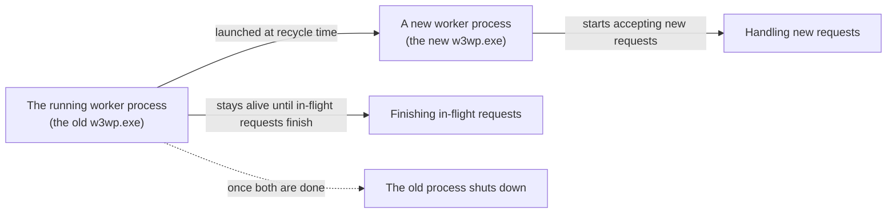

## Introduction

- **What You'll Learn From This Article**: Building on the application pool and worker process (`w3wp.exe`) fundamentals covered in [Understanding IIS and ASP.NET From a "Top 1%" Perspective](/en/articles/iis-fundamentals-guide), this article gives you a systematic understanding of **recycling** — an application pool's feature for periodically restarting its worker process — and the design philosophy behind it.
- **Intended Audience**: Readers who've seen the "recycle at a regular time interval" setting in IIS Manager, but can't explain why this feature exists, or what happens to a request that arrives during the restart.
- **Estimated Reading Time**: About 15 minutes

This article is part of the [Top 1% Series Complete Article Guide](/en/sitemap), the 11th article in the [Windows Server Operations Series](/en/sitemap#series-list).

## Prerequisite Knowledge

- **Application Pools and Worker Processes**: This assumes the division of roles covered in [Understanding IIS and ASP.NET](/en/articles/iis-fundamentals-guide) — an application pool as a process-level isolation unit, and the worker process (`w3wp.exe`) as what actually runs the code.

## The Big Picture

## A Thorough, Grounds-Up Explanation

### What Recycling Is: a Planned Restart of the Worker Process

**Recycling** is a feature configurable on an IIS application pool for **restarting the worker process on a planned basis.** IIS Manager's "recycling conditions" let you configure settings like these:

| Condition | Description |
|---|---|
| **Regular time interval** | Restarts every 1,740 minutes (29 hours) by default. |
| **Specific time** | Restarts at a specified time, such as the middle of the night when fewer users are active. |
| **Memory usage limit** | Restarts once the worker process's virtual or private memory exceeds a specified value. |
| **Request count limit** | Restarts once the cumulative number of processed requests exceeds a specified count. |

### Why Deliberately Stop Something That's Working Fine, on a Schedule?

At first glance, deliberately restarting a process that's operating normally, on a schedule, seems strange. **Behind this design is an empirically grounded, defensive idea: a process that keeps running for a long stretch accumulates memory leaks and resource fragmentation over time.** Even if the application's own code has a memory-leak bug, periodically returning the process to a clean state through recycling lets you **push back the time it takes for that bug to actually crash the server — without fixing the root cause.**

## What a Pro Sees Here (Top 1% Understanding)

### Overlapping Recycle: Switching Over Without Dropping a Single Request

The biggest concern with recycling is "what happens to a request that arrives at the exact moment the process is restarting?" IIS answers that concern with a mechanism called **overlapping recycle** (enabled by default). **When recycle time arrives, IIS doesn't terminate the old worker process right away. It first launches a new worker process, and routes every new request from that point onward to the new process. The old process only shuts down once it finishes every request it was already handling at that moment.** This design avoids a request that arrives at recycle time failing due to a momentary gap.

### Recycling Based on Memory Usage Is Life Support, Not a Fix for the Root Cause

A recycling setting based on memory usage is commonly used in practice, but it's important to understand **it never fixes the memory-leak bug itself — it's merely life support, temporarily suppressing the symptom.** If the memory-usage limit gets hit frequently, triggering recycling at an abnormal rate, treat that not as "proof the recycling setting is working correctly," but as **an important signal that the application's own code has a memory leak that needs addressing.** In real-world troubleshooting, keeping an eye on whether recycling frequency has suddenly risen is one metric worth monitoring.

## Common Misconceptions and Pitfalls

- **Misconception 1: "When recycling happens, every in-flight request fails at that instant."**
  Thanks to overlapping recycle, enabled by default, an in-flight request never fails — the old process finishes it before shutting down.
- **Misconception 2: "Tightening the memory-usage recycling setting fixes the memory leak problem."**
  Recycling is life support, temporarily suppressing the symptom — the root cause, the memory leak itself, remains unfixed.
- **Misconception 3: "Recycling only ever happens when something is wrong with the application."**
  Recycling at a regular interval is a planned, normal behavior, enabled by default.

## Troubleshooting Perspective

1. **Recycling happens at an abnormally high frequency**: Check whether a memory-usage-based recycling setting is frequently hitting its limit, and suspect a memory leak in the application's own code.
2. **Some requests fail right at recycle time**: Check IIS Manager's settings for whether overlapping recycle has been disabled.
3. **Access to a site temporarily slows down at a specific time**: Check whether a scheduled recycle is configured for that time — two worker processes, old and new, run simultaneously for a moment, temporarily increasing memory usage.

## Summary

- Recycling is a feature letting an IIS application pool restart its worker process on a planned basis.
- A scheduled restart is built in by default as a defense against memory leaks and accumulated resource fragmentation from long uptimes.
- Overlapping recycle ensures a request arriving at recycle time is still handled without being dropped.
- Memory-usage-based recycling is life support, temporarily suppressing the symptom rather than fixing the root cause.

**Takeaways to Apply Today**
1. Add recycling frequency to your monitoring, and treat a sudden increase as a signal of a memory leak.
2. Understand recycling as a planned defense mechanism, not an anomaly, and avoid disabling it more than necessary.

## References

- [Application Pools <applicationPools> | Microsoft Learn](https://learn.microsoft.com/en-us/iis/configuration/system.applicationhost/applicationpools/)
