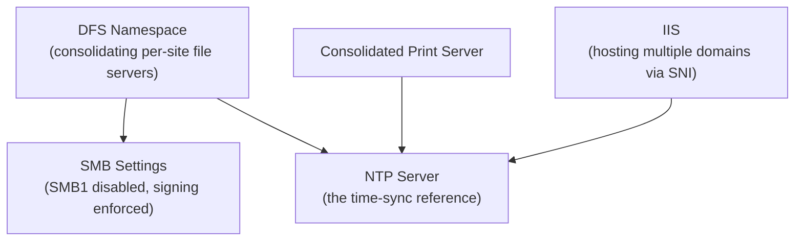

## Introduction

- **What You'll Learn From This Article**: This is the Windows Server Department's capstone project, where you'll **integrate, on your own, the techniques you've learned one at a time in earlier hands-on labs** (consolidating multi-site file servers with DFS namespace and replication, hosting multiple domains on IIS via SNI, hardening SMB by disabling SMB1, application pool recycling, operating the print spooler, time synchronization via NTP) **into a single fictional company's Windows Server infrastructure.** Where earlier articles aimed at "following steps to reliably master one technique," this article takes a format much closer to real-world work: **presenting only requirements, and leaving you to design which techniques to combine, and how.**
- **Intended Audience**: Readers who've worked through the Windows Server Department's Junior, Senior, and Graduate School content and can execute each individual hands-on lab, but have never designed a single Windows Server infrastructure combining them.
- **Estimated Reading Time**: Expect several days to about a week, including design, building, and documentation (the heaviest single hands-on in this series).

This article is part of the [Top 1% Series Complete Article Guide](/en/sitemap). It's positioned as the capstone project within the [Windows Server Department's full curriculum](/en/university#windows-server-department).

## Prerequisite Knowledge

This hands-on doesn't teach any new technique. **You'll combine and use the techniques you've already mastered in the following completed hands-on labs.**

- [The Top 1% Hands-On for Consolidating Multiple File Servers With DFS Namespace and DFS Replication, and Experiencing Automatic Failover](/en/articles/windows-server-dfs-handson-guide)
- [The Top 1% Hands-On for Using SNI in IIS to Run Multiple Domains' TLS Certificates on a Single IP Address](/en/articles/windows-server-iis-sni-handson-guide)
- [Understanding IIS Application Pool Recycling From a Top 1% Perspective](/en/articles/windows-server-app-pool-recycling-guide)
- [Understanding How a Print Server and Spooler Work From a Top 1% Perspective](/en/articles/windows-server-print-spooler-guide)
- [The Top 1% Hands-On for Seeing the Danger of SMB1 Firsthand and Defending by Disabling the Protocol and Enforcing Signing](/en/articles/windows-server-smb1-hardening-handson-guide)
- [Understanding the Settings for Building an NTP Server on Windows Server From a Top 1% Perspective](/en/articles/windows-ntp-server-guide)

## The Assignment: a Fictional Company's Windows Server Infrastructure

**You're an infrastructure engineer at a fictional manufacturing company, "KoiKoi Manufacturing." The company has independent file servers and print servers at each of several sites, and also runs internal web applications under multiple domain names. As it overhauls its aging infrastructure, your assignment is to build, on your own, a Windows Server infrastructure that satisfies all of the following requirements.**

### Requirement 1: Consolidate Site-by-Site File Servers Into One Namespace

**Consolidate the independently existing file servers at each site so users can reach them through a single, unified path.** Also build in a mechanism that automatically fails over to another site's server if one site's server goes down.

### Requirement 2: Consolidate Multi-Domain Web Applications Onto One IIS Server

**Consolidate multiple internal web applications, each previously running on its own server, onto a single IIS server, while each keeps its own distinct domain name and TLS certificate.**

### Requirement 3: Eliminate the Risk From an Older SMB Protocol Version

**Review your settings so the file server fleet never accepts an older, high-risk version of the SMB protocol.** Also consider additional hardening, such as enforcing signing.

### Requirement 4: Design Operations for the Web Applications' Stable Uptime

**Build in a preventive operational mechanism so a memory leak from long uptime, or a hung process, never cascades into a failure of the whole web application.**

### Requirement 5: Consolidate Print Services Across Multiple Sites

**Consolidate the print servers that previously existed independently at each site, and establish a setup that lets you rapidly isolate which part of the spooler is the cause when a failure occurs.**

### Requirement 6: Prevent Clock Drift Between All Servers

**In case clock drift between servers causes an unexpected failure — in file-server authentication, or certificate expiration validation, for instance — build a mechanism that keeps every server's clock accurately synchronized.**

## Deliverable Requirements: Assemble It as a Portfolio

**This hands-on's final deliverable isn't just screenshots of things working.** Put together a repository, on GitHub or similar, containing:

- **README.md**: An overview of this scenario, and the full picture of the Windows Server infrastructure you adopted (including diagrams, such as Mermaid).
- **A record of your design decisions**: Why you chose that specific configuration or setting — especially anywhere an availability-versus-security trade-off came up.
- **The steps you actually took**: A record of the PowerShell commands you ran and the configuration changes you made.
- **A retrospective**: What challenges you discovered while doing this, and what you'd additionally consider in genuine real-world work (a phased migration to the cloud, building a monitoring setup, and similar).

**This deliverable itself is a concrete accomplishment you can present in a job search or as a portfolio piece.** Being able to show "I designed a solution combining multiple techniques under the realistic constraints of multiple coexisting sites, and can articulate the availability-versus-security trade-offs" is far more persuasive than simply saying "I did the DFS hands-on."

## What a Pro Sees Here (Top 1% Understanding)

### "Following Steps" and "Designing From Requirements" Are Entirely Different Skills

Every earlier hands-on in this series took the form of "Step 1, Step 2, ..." — following a fixed, predetermined sequence. **But what actually gets valued in real-world work isn't the ability to execute a procedure exactly as written — it's the ability to look at given requirements (Requirements 1 through 6 in this article) and design, yourself, which techniques to combine, and how.** These are similar-looking but entirely different skills. Completing every individual hands-on doesn't make you immediately effective in real work if you've never designed one coherent Windows Server infrastructure combining them. This capstone project is deliberately designed to bridge exactly that gap.

### Why a "Multi-Site Consolidation" Setting?

There's a reason this hands-on deliberately models a realistic project — consolidating servers scattered across multiple sites into one infrastructure — instead of a single-shot technical demo. **Most real-world Windows Server infrastructure overhauls never wrap up with building a single server alone — they need to simultaneously satisfy multiple axes (availability, security, operability) while cleaning up an existing, scattered environment.** Knowing how to build DFS alone doesn't help in a real project if you can't also see ahead to security hardening, operational design, and time synchronization. The ultimate goal of this capstone is elevating your knowledge of individual techniques into **the design ability to see an entire scattered environment at once.**

## Common Misconceptions and Pitfalls

- **Misconception 1: "This hands-on has one fixed, correct configuration."**
  There's no single correct answer here. Multiple valid approaches exist as long as they satisfy the requirements. Recording the design you chose, and why, in README.md is what matters.
- **Misconception 2: "Screenshots proving it worked are sufficient as a deliverable."**
  Screenshots matter, but they're not enough on their own. Being able to articulate the reasoning behind your design decisions is this hands-on's real value.
- **Misconception 3: "Having completed every individual hands-on means this one will go quickly too."**
  There's a real gap between knowing individual techniques and integrating them into one coherent design. Expect this to take considerable time.

## Troubleshooting Perspective

This hands-on's main challenge isn't individual technical troubleshooting — it's **design rework.**

1. **You thought you satisfied the requirements, but notice a contradiction later**: Before starting implementation, write out only the design section of README.md first, and confirm on paper that all six requirements are genuinely satisfied.
2. **You've forgotten the steps for an individual hands-on**: Don't hesitate to go back and re-read the prerequisite article for that requirement. This capstone tests design ability, not memorization.
3. **You're not sure how thorough to make this**: Use "could I show this README.md to an interviewer I've never met and explain my design decisions" as your bar for completeness.

## Summary

- This capstone project is an integrative exercise combining the techniques you've learned individually in the Windows Server Department, into a single fictional company's Windows Server infrastructure.
- What's being tested is the ability to design from requirements yourself, not the ability to follow a procedure.
- Assemble your deliverable as a portfolio piece — a document articulating the reasoning behind your design decisions, not just proof it worked.

**Takeaways to Apply Today**
1. Even while learning individual hands-on labs, build the habit of asking "under what future requirements would I actually use this?"
2. Beyond the technical deliverable itself, build the habit of articulating availability-versus-security trade-offs in your day-to-day work too.

## References

- [The Windows Server Department's Full Curriculum](/en/university#windows-server-department)
