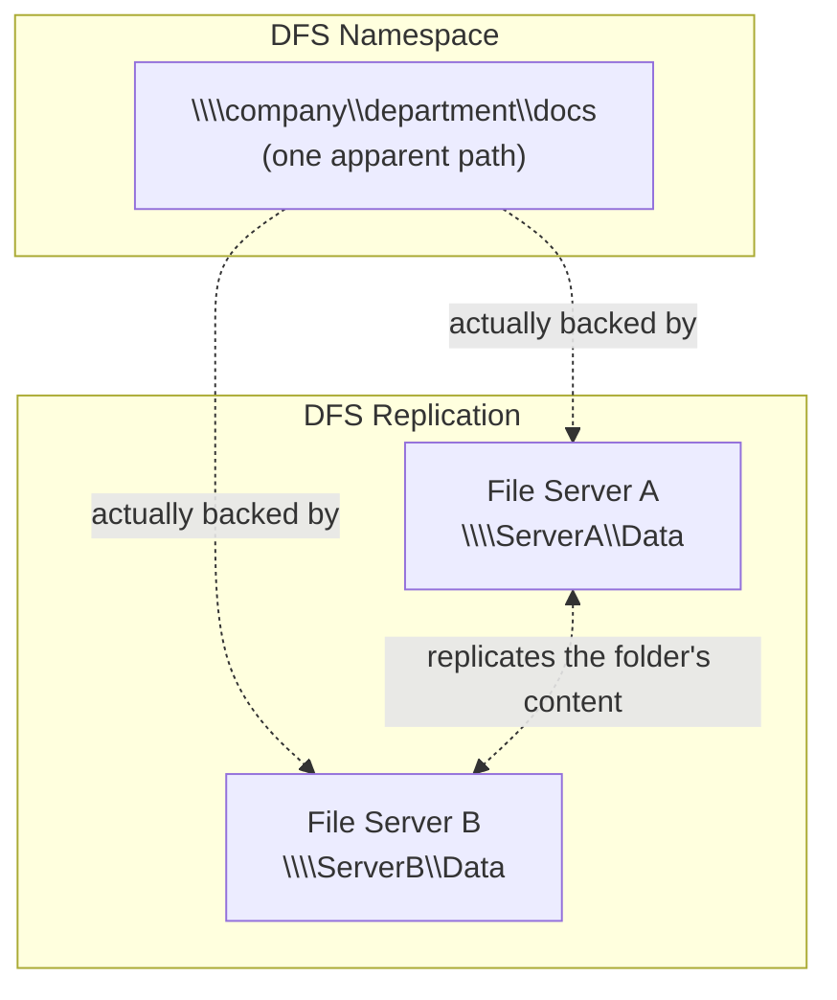

## Introduction

- **What You'll Learn From This Article**: Building on the ordinary shared folder covered in [Understanding SMB File Sharing on Windows Server From a "Top 1%" Perspective](/en/articles/smb-file-sharing-guide), this article gives you a systematic understanding of **DFS** (Distributed File System) as the combination of two independent capabilities: a **Namespace** that consolidates multiple servers' shared folders under a single path, and **Replication** that copies a folder's content between servers.
- **Intended Audience**: Readers who've accessed a file server through a path with no actual server name in it — something like `\\company\department\docs` — but can't explain the mechanism underneath.
- **Estimated Reading Time**: About 16 minutes

This article is part of the [Top 1% Series Complete Article Guide](/en/sitemap), the 10th article in the [Windows Server Operations Series](/en/sitemap#series-list).

## Prerequisite Knowledge

- **SMB Shares and UNC Paths**: This assumes the `\\server\share` path format covered in [Understanding SMB File Sharing on Windows Server](/en/articles/smb-file-sharing-guide).

## The Big Picture

## A Thorough, Grounds-Up Explanation

### DFS Namespace: Consolidating Multiple Shared Folders Under a Single Path

A **DFS namespace** presents data that's actually spread across multiple different servers and different shared folders to the user as **a single, unified path.** Access a path like `\\company\department\docs`, and a DFS namespace server resolves, on the user's behalf, which server actually holds the data behind it (`\\ServerA\Data`, say). **The user never has to be aware of which server actually holds the data.** When the data itself moves to a different server through a server consolidation, only the DFS namespace's own configuration needs to change — the path the user is used to never has to change.

### DFS Replication: Copying a Folder's Content Between Servers

**DFS Replication** (DFS-R) is a **separate feature**, independent of the DFS namespace. It keeps a specified folder's content synchronized bidirectionally, replicated across multiple servers. **Where a DFS namespace is a feature unifying "how it's presented," DFS Replication is a feature that copies "the actual data itself" across multiple sites.** It's commonly used where the link between sites is thin — each site's file server holds a copy of the same data, so access within a site stays entirely local to that site's server.

## What a Pro Sees Here (Top 1% Understanding)

### The Trap of a Single Name, "DFS," Referring to Two Independent Features

**A DFS namespace and DFS Replication can each be used entirely on their own.** A setup using only the namespace, with the actual data on just one server, and a setup using only replication, where users access individual servers directly by name, are both equally valid. **When a conversation mentions "we set up DFS," you always need to clearly separate whether it's about the namespace, the replication, or a combination of both.** Skip that distinction, and you get the common real-world mismatch of "we built DFS, but the data isn't being replicated" (only the namespace was actually built), or "the data is being replicated with DFS, but the path isn't unified" (only replication was actually built).

### A Caveat When Combining Replication: Update Conflicts

Combine a namespace and replication into a setup where multiple sites write to the same shared folder at the same time, and **you can end up with an "update conflict" — the same file getting updated at nearly the same moment from different sites.** When this happens, DFS Replication **keeps whichever version was updated last as the official one, and automatically moves the losing, conflicting file into a hidden folder, `DfsrPrivate\ConflictAndDeleted`.** Not knowing about this behavior leads to the confusing experience of "the change I saved has somehow vanished."

## Common Misconceptions and Pitfalls

- **Misconception 1: "Adopting DFS automatically replicates files between servers."**
  A DFS namespace unifies the path; the actual copying is handled by DFS Replication, a separate, independent feature.
- **Misconception 2: "DFS namespaces and DFS Replication must always be used together."**
  Using either one alone is common in real-world setups.
- **Misconception 3: "Editing the same file simultaneously from multiple sites gets automatically merged by DFS Replication."**
  DFS Replication never merges content — on a conflict, it keeps the last update as official and moves the losing side into a quarantine folder.

## Troubleshooting Perspective

1. **Can't access something through the DFS namespace**: Check whether the DFS namespace server itself is running, and whether the target server is correctly registered in the namespace configuration.
2. **Data isn't being replicated**: Check the possibility that only the DFS namespace was built, without DFS Replication configured separately.
3. **A saved file's change has vanished**: Check the `DfsrPrivate\ConflictAndDeleted` folder for a file quarantined there due to a conflict.

## Summary

- A DFS namespace presents multiple servers' shared folders as a single, unified path.
- DFS Replication is a separate feature, independent of the namespace, that copies a folder's content between servers.
- Simultaneous editing from multiple sites can cause update conflicts, and DFS Replication automatically quarantines the conflicting file into a hidden folder.

**Takeaways to Apply Today**
1. Whenever "DFS" comes up, always be explicit about whether you mean the namespace or the replication.
2. If simultaneous editing from multiple sites is expected, share the update-conflict and auto-quarantine behavior with stakeholders ahead of time.

## References

- [DFS Namespaces and DFS Replication Overview | Microsoft Learn](https://learn.microsoft.com/en-us/windows-server/storage/dfs-namespaces/dfs-overview)
