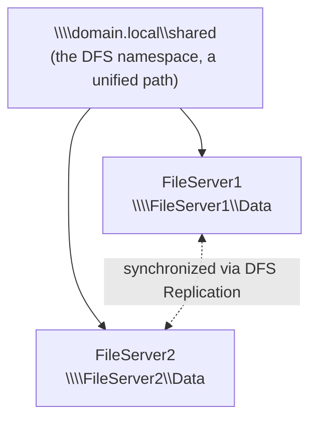

## Introduction

- **What You'll Learn From This Article**: This verifies what you learned in [Understanding DFS Namespaces and DFS Replication](/en/articles/windows-server-dfs-guide) by actually building it with two file servers, and watching firsthand as **automatic failover** lets users keep accessing the exact same path even after one server goes down.
- **Intended Audience**: Readers who've already read [Understanding DFS Namespaces and DFS Replication](/en/articles/windows-server-dfs-guide) and have access to multiple Windows Servers already joined to an AD domain.
- **Estimated Reading Time**: About 40 minutes

This article is part of the [Top 1% Series Complete Article Guide](/en/sitemap).

## Prerequisite Knowledge

- **The Division of Roles Between a DFS Namespace and DFS Replication**: This assumes [Understanding DFS Namespaces and DFS Replication](/en/articles/windows-server-dfs-guide).
- **AD Domain Membership**: Since this hands-on builds a domain-based namespace, it assumes both file servers are already joined to the same AD domain.

## The Big Picture



## Hands-On Steps

### Step 1: Set Up a Shared Folder on Both File Servers

Create a shared folder with the same name on both `FileServer1` and `FileServer2`.

```powershell
New-Item -Path "C:\Data" -ItemType Directory
New-SmbShare -Name "Data" -Path "C:\Data" -FullAccess "Everyone"
```

For testing, create a single test file on `FileServer1` only.

```powershell
"Hello from FileServer1" | Out-File C:\Data\test.txt
```

### Step 2: Install DFS Namespaces and Create the Namespace

On either server (or a domain controller), install the DFS Namespaces feature.

```powershell
Install-WindowsFeature FS-DFS-Namespace -IncludeManagementTools
```

Create a new domain-based namespace.

```powershell
New-DfsnRoot -TargetPath "\\domain.local\shared" -Type DomainV2 -Path "\\domain.local\shared"
```

Add both file servers' shared folders to the new namespace, each as a folder target.

```powershell
New-DfsnFolder -Path "\\domain.local\shared\docs" -TargetPath "\\FileServer1\Data"
New-DfsnFolderTarget -Path "\\domain.local\shared\docs" -TargetPath "\\FileServer2\Data"
```

Access `\\domain.local\shared\docs` and confirm `test.txt` is visible. **At this point, you're actually accessing FileServer1's data, but the user never has to know that.**

### Step 3: Sync the Two Folders' Content With DFS Replication

Install DFS Replication and create a replication group.

```powershell
Install-WindowsFeature FS-DFS-Replication -IncludeManagementTools
New-DfsReplicationGroup -GroupName "DocsReplication"
New-DfsReplicatedFolder -GroupName "DocsReplication" -FolderName "Data"
Add-DfsrMember -GroupName "DocsReplication" -ComputerName "FileServer1","FileServer2"
Set-DfsrMembership -GroupName "DocsReplication" -FolderName "Data" -ContentPath "C:\Data" -ComputerName "FileServer1" -PrimaryMember $true
Set-DfsrMembership -GroupName "DocsReplication" -FolderName "Data" -ContentPath "C:\Data" -ComputerName "FileServer2" -PrimaryMember $false
Add-DfsrConnection -GroupName "DocsReplication" -SourceComputerName "FileServer1" -DestinationComputerName "FileServer2"
```

Wait a few minutes, then check `C:\Data` on `FileServer2`.

```powershell
Get-ChildItem C:\Data
```

**`test.txt` should now be replicated onto FileServer2 too.** Both servers now hold the same data, no matter which one the namespace routes you to.

### Step 4: Deliberately Stop FileServer1 and Confirm Automatic Failover

First, reconfirm you can access `test.txt` through the namespace.

```powershell
Get-Content \\domain.local\shared\docs\test.txt
```

Next, stop `FileServer1`'s server service (or its network interface), making it unreachable.

```powershell
# Run on FileServer1
Stop-Service LanmanServer -Force
```

With `FileServer1` unreachable, access **the exact same path** again.

```powershell
Get-Content \\domain.local\shared\docs\test.txt
```

**Despite some delay, this should succeed without an error — the same content returned from FileServer2.** The client side never had to change its path, or even be aware of which server was still alive; the DFS namespace switched its connection target to the surviving target automatically, behind the scenes.

## What a Pro Sees Here (Top 1% Understanding)

### What Powers Failover Is the "Namespace," Not the "Replication"

The automatic failover experienced in Step 4 comes from **the DFS namespace's ability to choose a reachable target among multiple folder targets and switch its connection there.** **DFS Replication only keeps both targets' content in the same state — it doesn't implement failover itself.** The "two independent features" understanding covered in [Understanding DFS Namespaces and DFS Replication](/en/articles/windows-server-dfs-guide) becomes distinguishable here as actual, observed behavior. Build only the namespace and forget the replication, and failover itself still happens, but **the server it switches to has no up-to-date data** — a serious incident.

### Replication Lag Directly Affects Consistency at Failover Time

DFS Replication isn't real-time synchronization — **some lag exists** between detecting a change and finishing replicating it. Depending on when the failover happens, **a change written to one server moments earlier may not have replicated to the other yet, leaving only stale data visible right after failover.** In practice, distinguish uses that can tolerate this lag (document sharing, say) from ones that can't (data demanding real-time consistency), and consider a different high-availability mechanism for the latter, rather than DFS Replication.

## Common Misconceptions and Pitfalls

- **Misconception 1: "Setting up DFS Replication alone achieves automatic failover."**
  Automatic failover is a DFS namespace feature; replication only keeps the content synchronized.
- **Misconception 2: "A DFS namespace alone is sufficient for a high-availability setup."**
  A namespace alone gives no guarantee that up-to-date data exists at the failover target — it only becomes practical combined with replication.
- **Misconception 3: "DFS Replication syncs in real time, so data never goes stale at failover."**
  Replication carries some lag, and depending on timing, only stale data may be visible right after failover.

## Troubleshooting Perspective

1. **Failover doesn't happen, and access fails while a server is down**: Use `Get-DfsnFolderTarget` to check whether both folder targets are correctly registered in the namespace.
2. **Data is stale after failover**: Failover may have happened before DFS Replication finished. Check the replication backlog with `Get-DfsrBacklog`.
3. **Can't access the namespace**: Check whether communication with the domain controller is healthy, and whether the path specified in `New-DfsnRoot` is correct.

## Summary

- A DFS namespace can automatically switch its connection to a reachable folder target among multiple targets — a failover feature.
- DFS Replication is a separate synchronization mechanism ensuring the failover target has correct data.
- Making automatic failover practical requires combining both the namespace and replication.
- Replication carries some lag, and depending on timing, stale data may be visible right after a failover.

**Takeaways to Apply Today**
1. When building a DFS namespace, always combine it with DFS Replication, keeping the failover target's data current.
2. For data demanding real-time consistency, evaluate ahead of time whether DFS Replication's lag is acceptable.

## References

- [DFS Namespaces and DFS Replication Overview | Microsoft Learn](https://learn.microsoft.com/en-us/windows-server/storage/dfs-namespaces/dfs-overview)
- [New-DfsnRoot (DFSN) | Microsoft Learn](https://learn.microsoft.com/en-us/powershell/module/dfsn/new-dfsnroot)
