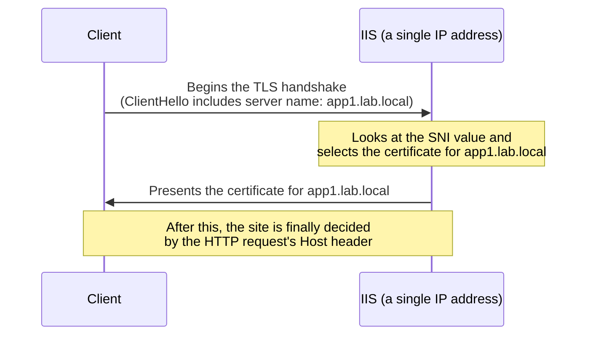

## Introduction

- **What You'll Learn From This Article**: Building on the binding configuration covered in [Understanding How IIS and ASP.NET Work](/en/articles/iis-fundamentals-guide), this article has you actually build two sites to experience **SNI (Server Name Indication)** — a mechanism for serving HTTPS with a dedicated TLS certificate per domain, all from a single IP address.
- **Intended Audience**: Readers who need to run multiple customers' or brands' sites over HTTPS on a single server, but find provisioning a separate IP address per domain impractical.
- **Estimated Reading Time**: About 35 minutes

This article is part of the [Top 1% Series Complete Article Guide](/en/sitemap).

## Prerequisite Knowledge

- **IIS Binding Configuration**: This assumes the mechanism covered in [Understanding How IIS and ASP.NET Work](/en/articles/iis-fundamentals-guide), where the combination of IP address, port, and hostname decides which website handles a request.

## The Big Picture



## Hands-On Steps

### Step 1: Create Two Self-Signed Certificates

In PowerShell, create self-signed certificates for two different hostnames.

```powershell
New-SelfSignedCertificate -DnsName "app1.lab.local" -CertStoreLocation "cert:\LocalMachine\My"
New-SelfSignedCertificate -DnsName "app2.lab.local" -CertStoreLocation "cert:\LocalMachine\My"
```

Note down each certificate's thumbprint from `certlm.msc` (the local computer certificate store).

### Step 2: Create Two IIS Sites

Create two independent websites, one for `app1.lab.local` and one for `app2.lab.local`.

```powershell
New-Item "C:\inetpub\app1" -ItemType Directory
New-Item "C:\inetpub\app2" -ItemType Directory
"app1" | Out-File "C:\inetpub\app1\index.html"
"app2" | Out-File "C:\inetpub\app2\index.html"

Import-Module WebAdministration
New-Website -Name "App1Site" -PhysicalPath "C:\inetpub\app1" -Port 443 -HostHeader "app1.lab.local" -Ssl
New-Website -Name "App2Site" -PhysicalPath "C:\inetpub\app2" -Port 443 -HostHeader "app2.lab.local" -Ssl
```

### Step 3: Bind SNI-Enabled Bindings to Each Certificate

**This is the heart of this hands-on.** In IIS Manager (or via `netsh`), assign each site's HTTPS binding to its matching certificate, and **enable the "Require Server Name Indication" checkbox.**

```powershell
$cert1 = Get-ChildItem Cert:\LocalMachine\My | Where-Object { $_.Subject -match "app1.lab.local" }
$cert2 = Get-ChildItem Cert:\LocalMachine\My | Where-Object { $_.Subject -match "app2.lab.local" }

netsh http add sslcert hostnameport=app1.lab.local:443 certhash=$($cert1.Thumbprint) certstorename=MY appid="{00000000-0000-0000-0000-000000000000}"
netsh http add sslcert hostnameport=app2.lab.local:443 certhash=$($cert2.Thumbprint) certstorename=MY appid="{00000000-0000-0000-0000-000000000000}"
```

**This `hostnameport` specification is the real substance of an SNI-aware binding.** Where a traditional (SNI-unaware) binding could only attach one certificate per "IP address:port" combination, a `hostnameport`-style binding can **attach a different certificate per hostname, all under the same "IP address:port."**

### Step 4: Confirm You Actually Get Different Certificates Back

From the client side, use `openssl s_client`'s `-servername` option to connect with a different hostname via SNI.

```bash
openssl s_client -connect <server's IP>:443 -servername app1.lab.local
```

Check the `subject=` line in the output and confirm the certificate for `app1.lab.local` comes back. Now connect to the exact same IP address and port, with a different `-servername`.

```bash
openssl s_client -connect <server's IP>:443 -servername app2.lab.local
```

**Despite connecting to the exact same IP address and port, this time a different certificate for `app2.lab.local` should come back.** You've confirmed, firsthand, that the server dynamically switches which certificate it returns, based solely on the SNI field in the `ClientHello` message — before encryption even begins.

## What a Pro Sees Here (Top 1% Understanding)

### The "Ordering" Contradiction Between TLS and HTTP That SNI Resolves

Before SNI existed, TLS carried a structural contradiction. **The mechanism of routing to multiple sites on one IP address via HTTP's Host header is information you can only read once TLS encryption has finished. But which certificate the server should present has to be decided the moment it starts that very encryption (the TLS handshake).** In other words, a circular problem: "figuring out which site the request is for requires looking inside the HTTP content, but starting the TLS needed to see that content requires already knowing which site it's for." SNI breaks that cycle by **including the hostname in plaintext (before encryption begins), right inside ClientHello, the very first message of the TLS handshake.**

### The Reality That Old Clients That Don't Support SNI Still Exist

SNI is now widely deployed, but **some extremely old OS/browser combinations (Internet Explorer on Windows XP, say) still exist that don't support SNI at all.** When such a client connects, the server never receives the SNI information, so it **has no choice but to return the "default certificate" configured for that IP address and port (usually the certificate from whichever binding was registered first).** The result is the client presented with an unintended domain's certificate, triggering a certificate-name-mismatch warning. This constraint rarely matters in modern real-world work, but **an environment that must support old clients can't rely purely on an SNI-dependent setup** — a constraint worth understanding.

## Common Misconceptions and Pitfalls

- **Misconception 1: "A single IP address can only serve HTTPS for one domain."**
  With SNI, you can attach a different certificate per hostname, all under the same IP address and port combination.
- **Misconception 2: "SNI just duplicates the same information as HTTP's Host header, sent somewhere else."**
  SNI is information needed at the TLS handshake stage, before encryption even begins — a fundamentally different timing requirement than HTTP's Host header.
- **Misconception 3: "Clients that don't support SNI are effectively nonexistent today."**
  Extremely old OS/browser combinations that don't support SNI still exist, and can receive the default certificate as a result.

## Troubleshooting Perspective

1. **An unintended domain's certificate comes back**: Check with `netsh http show sslcert` whether that binding is correctly registered in `hostnameport` (SNI-aware) form.
2. **Only a specific client gets a certificate error**: Check whether that client supports SNI (especially with an old OS or browser).
3. **A renewed certificate isn't reflected**: You need to delete the old binding with `netsh http delete sslcert`, then re-register it with the new certificate's thumbprint.

## Summary

- SNI includes the hostname, unencrypted, in the first message of the TLS handshake, letting a single IP address serve certificates for multiple domains.
- The `hostnameport` form of `netsh http add sslcert` is the real substance of an SNI-aware binding.
- Extremely old clients that don't support SNI receive the default certificate, potentially triggering a certificate-name-mismatch warning.

**Takeaways to Apply Today**
1. Before provisioning more IP addresses for multiple HTTPS domains, consider distinguishing certificates via SNI.
2. In an environment that must support old clients, check the constraints of an SNI-dependent setup ahead of time.

## References

- [Server Name Indication | RFC 6066](https://datatracker.ietf.org/doc/html/rfc6066)
- [netsh http Commands | Microsoft Learn](https://learn.microsoft.com/en-us/windows-server/networking/technologies/netsh/netsh-http)
