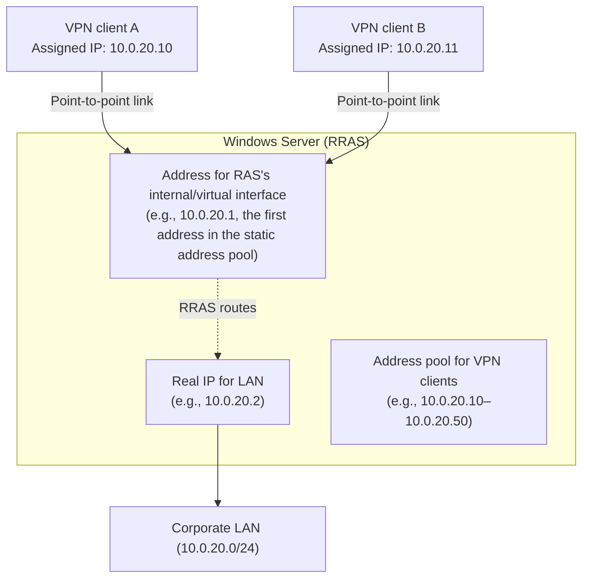
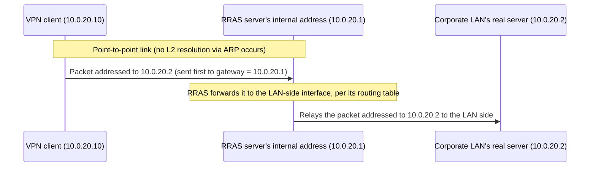
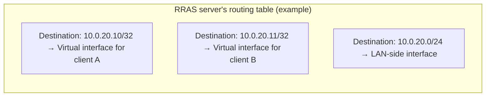

## Introduction

- **What You'll Learn From This Article**: What actually happens with IP address management when you build an L2TP/IPsec VPN with Windows Server's RRAS (Routing and Remote Access Service)—where and how the IP address handed to the VPN client comes from, how many IP addresses the server itself uses internally and for what, and—the question you almost inevitably run into once you actually build one—"why do I need to specify a gateway at all, when the IP address handed to the client appears to be on the same subnet as the corporate LAN?" This article answers that question by examining the nature of the PPP protocol itself.
- **Intended Audience**: This article is aimed at infrastructure engineers who have built or operated an L2TP/IPsec VPN on Windows Server, or are about to, but can't systematically explain the specification for IP addresses handed to clients or how IP addresses are handled internally on the server.
- **Estimated Reading Time**: About 20 minutes

This article is part of the [Top 1% Series' full article guide](/en/sitemap).

## Prerequisites

- **RRAS (Routing and Remote Access Service)**: A role built into Windows Server that provides VPN server functionality and routing functionality. It supports multiple VPN protocols including L2TP/IPsec, and once enabled, the server itself also begins to act as a router.
- **PPP (Point-to-Point Protocol)**: A protocol that performs authentication and IP address assignment over a link connecting two points directly. Its detailed origins are covered in [Understanding the Difference Between Telephone Lines and IP Networks from a "Top 1%" Perspective](/en/articles/circuit-switching-ppp-guide).
- **Default Gateway**: The IP address that a device designates as the first hop when sending a packet addressed to a network other than its own.

You Can Also Enable Just the Routing Function, Without VPN

RRAS lets you enable its VPN server functionality and its routing functionality independently. In fact, the RRAS configuration wizard and the server's properties screen include an option called **"Local area network (LAN) routing only"** (or, via PowerShell, `Install-RemoteAccess -VpnType RoutingOnly`), which, when selected, accepts no VPN connections at all and lets the server act purely as a software router relaying IP packets between multiple network interfaces. This article covers the case where VPN server functionality (and the routing that comes with it) is enabled.

## Getting the Big Picture

### In a Nutshell

**When you build an L2TP/IPsec VPN with RRAS, the server ends up with, in addition to "the ordinary IP address it uses to connect to the LAN," one more address: "an internal address that acts as the counterpart in the point-to-point link with the VPN client"—and this internal address is the true identity of what appears as the "gateway" in the client's configuration.**

**The "default gateway" that shows up in the client's `ipconfig` output doesn't actually point to some specific router device on the corporate LAN—it points to this internal address held by the RRAS server itself (10.0.20.1 in the diagram above).** To understand why the configuration ends up this way, we need to go back to the nature of PPP as a protocol.

## Fundamentals, Thoroughly Explained

### Assigning IP Addresses to Clients: Static Address Pools and DHCP Relay

There are broadly two ways RRAS hands out IP addresses to VPN clients.

| Method | Behavior | Characteristics |
|---|---|---|
| Static address pool | Hands out addresses, in connection order, from a range of IP addresses (e.g., 10.0.20.10–10.0.20.50) specified in advance in the RRAS configuration screen | Simple, with no dependency on an additional DHCP server. RRAS itself tracks the range and the assignment status |
| DHCP relay agent | RRAS relays DHCP requests to a real DHCP server that exists on the corporate LAN, as if it were an intermediary, and passes the address handed out from there to the client | Lets the same DHCP server and scope (address range) used by other devices on the corporate LAN be reused, making centralized address management easier |

Regardless of the method, what ultimately gets configured on the client's PPP virtual adapter is the result of an assignment via IPCP (IP Control Protocol). Given the nature of PPP discussed in the prerequisites, **the IP address the client obtains at this point is, strictly speaking, only the address of "one side" of that single point-to-point link**—it does not directly participate in the physical Ethernet segment of the corporate LAN.

### Why Does the First Address in the Static Address Pool Become the Server's Own Address?

In configurations using a static address pool, in many implementations and versions, the behavior is that **the first IP address in the specified range is reserved for the RRAS server's own internal interface, and the remaining addresses are actually handed out to clients** (for example, if you specify 10.0.20.1–10.0.20.50 as the range, 10.0.20.1 is used by the server itself, and 10.0.20.2 onward is handed out to clients).

What's important here is that **this server-side address (10.0.20.1) is used in common by every VPN client that connects**. RRAS dynamically creates an individual virtual PPP adapter (interface) for each client as it connects, but the address it communicates to the client during IPCP negotiation as "the server-side counterpart" is always this same single internal address. The "peer address" that IPCP communicates is 10.0.20.1 for both client A and client B alike.

Doesn't It Cause a Conflict for Multiple Clients to Share the Same "Peer Address"?

At first glance it might seem contradictory for multiple clients to share the same "peer" on a point-to-point link, but this is not actually a contradiction, once you consider that PPP is **individually reproducing a circuit-switched-style, 1-to-1 link on top of an IP network**. Thanks to L2TP's Tunnel ID/Session ID, the link with client A and the link with client B are each treated as completely independent, separate virtual links. From the RRAS server's point of view, it is "using its own address, 10.0.20.1, to separately maintain dedicated link A with client A and dedicated link B with client B"—the same idea as a telephone switch handling multiple simultaneous calls under one shared representative number. This historical background is covered in [Understanding the Difference Between Telephone Lines and IP Networks from a "Top 1%" Perspective](/en/articles/circuit-switching-ppp-guide).

### Why Is a Gateway Needed Even Though It Looks Like the Same Segment?

This is the biggest point of confusion. The IP address handed to the client (e.g., 10.0.20.10), the server's internal address (10.0.20.1), and even the real IP address of a server on the corporate LAN (10.0.20.2) all appear to belong to the same subnet, `10.0.20.0/24`. **"If it's the same segment, shouldn't we be able to communicate directly without specifying a gateway at all?"—that is a perfectly reasonable question, going by ordinary Ethernet LAN intuition.**

However, this premise only holds **when devices within the same segment can resolve each other's MAC addresses via ARP (Address Resolution Protocol) and exchange frames directly at L2.** The VPN client's virtual PPP adapter **does not participate in the corporate LAN's Ethernet segment, either physically or logically, in any way.** All the client has is a single point-to-point link to the VPN server. Over this point-to-point link, the very concept of "another device within the same segment" doesn't even exist—because whoever is on the other end of the link is always exactly one entity (the RRAS server's internal address), and nothing else.

What Kind of Configuration Actually Lets Devices Resolve Each Other's MAC via ARP?

Take, for example, a real server on the corporate LAN (10.0.20.2) and another physical server or management workstation on the same floor (say, 10.0.20.3), where both are **connected directly by cable to the same physical switch (or to multiple switches that belong to the same VLAN)**. In that case, the two genuinely belong to the same L2 segment. If 10.0.20.3 wants to send a packet to 10.0.20.2, it can send an ARP request ("please tell me the MAC address for 10.0.20.2") directly over the switch, with no router in between; once it receives the ARP reply from 10.0.20.2, it simply addresses subsequent Ethernet frames directly to that MAC address, and communication succeeds. In a virtualized environment, the same holds for multiple VMs connected to the same virtual switch and the same port group. The detailed mechanics of ARP and MAC-address-table-based forwarding are covered in [Understanding the Differences Between Hubs, Switches (L2SW), L3 Switches, and Routers from a "Top 1%" Perspective](/en/articles/network-devices-guide).

By contrast, the VPN client's virtual PPP adapter discussed in this article is **one end of a purely logical point-to-point link, not connected to any port of any physical switch or VLAN at all.** So even if it wanted to send an ARP request, there's no switch or segment—no "place"—to receive that request in the first place. That, as described above, is the fundamental reason direct L2 reachability isn't possible here.

Consequently, even if a VPN client wants to communicate with **another device on the corporate LAN that appears, by IP address, to be on the same subnet (such as the real server at 10.0.20.2), that traffic must always first be sent to the single peer on the other end of the point-to-point link—the RRAS server (10.0.20.1)—which then routes (relays) it out to the corporate LAN side.** There is no other path. The "default gateway = 10.0.20.1" configured on the client's OS is precisely this behavior—"send everything first to the single peer on the other end of the point-to-point link"—expressed using the ordinary IP-networking term "gateway."

In other words, **even though the arrangement of the numbers makes it look like the same subnet, the way communication actually succeeds is through routing (L3 relay), not direct reachability on an Ethernet segment (L2)**—this is the accurate way to understand it. This general rule—"the client obtains an L3-level IP address that belongs to the corporate address scheme, but is not an L2 neighbor"—holds for remote access VPNs in general, not just L2TP/IPsec. As we've seen in this article, on Windows Server RRAS specifically, this rule manifests in the concrete implementation detail of "using the first address of the address pool as a shared gateway."

### Why the LAN's Real IP and the RAS Internal Address Can't Be the Same, and How Traffic from the LAN Side Actually Reaches RRAS

At this point you might wonder: "couldn't we just merge the server's real LAN IP (10.0.20.2) and the internal address acting as the VPN client's counterpart (10.0.20.1) into a single IP address?" The short answer is **no, you can't.** When RRAS's VPN server functionality is enabled, it automatically creates a virtual network interface called the "internal interface (RAS Dial-in adapter)," separate from the physical LAN NIC, and assigns it one IP address from the address pool. The OS's networking stack requires each active network interface running on a single machine to have its own unique, non-overlapping IP address (attempting to bind the same IP address to two active interfaces simultaneously would create an address conflict inside the machine itself). So, even though the LAN NIC (10.0.20.2) and the RAS Dial-in adapter (10.0.20.1) both belong to the same `10.0.20.0/24` subnet, since the OS treats them as separate interfaces internally, they're necessarily forced to have different IP addresses.

There's a second thing easy to overlook in this setup: the reverse-direction question of **"why would another device on the corporate LAN (say, 10.0.20.2) even bother sending traffic addressed to a VPN client's IP address (10.0.20.10) to the RRAS server in the first place?"** Since 10.0.20.10 numerically appears to belong to the same `10.0.20.0/24` segment, another LAN device would naturally assume "I should be able to resolve 10.0.20.10's MAC address directly via ARP," and try sending an ARP request straight to that address without going through any gateway. This is where **Proxy ARP** comes in. When the RRAS server detects an ARP request for an address within the range it has handed out to VPN clients, it **responds with its own (LAN-side NIC's) MAC address, on behalf of the address's actual owner (the VPN client).** As a result, from the LAN-side device's point of view, "10.0.20.10 lives just past the RRAS server's LAN-side NIC," and the frame correctly arrives at the RRAS server. From there, it's handed off to the relay described above, via the RRAS server's internal routing table (the per-client host route), to the correct virtual interface. **In other words, the "path from the LAN side to a VPN client" is established through the combination of two mechanisms: a proxy reply via Proxy ARP, and relay via RRAS's internal host routes.**

### Multiple Virtual Interfaces on the Server Side and the Routing Table

Every time a client connects, the RRAS server dynamically creates a dedicated virtual PPP interface for that session (in the Windows implementation, an interface instance based on a "WAN Miniport"). In the server's internal routing table, **a host route (a route entry for that single IP address alone) to the corresponding virtual interface is automatically added for each connected client's assigned IP address**.

Because of this, when a device on the corporate LAN side sends traffic back to a VPN client, the RRAS server determines "which client's virtual interface this destination IP address corresponds to" using this host route, and forwards it to the correct session. **If you forget to check the "Enable IPv4 routing" checkbox (or equivalent setting) when enabling RRAS, the VPN itself can still connect, but you end up unable to communicate at all with other devices on the corporate LAN**—because the routing-table-based relay described above simply isn't functioning. This is a frequent stumbling point in practice.

## The View from the Top 1% (What Experts See)

### The Relationship with Virtual IPs in Redundant Configurations

In cases where the server running RRAS is itself made redundant for availability, using an active/standby pair (or more), the destination clients use to establish a VPN connection (or the destination of a corporate application reached through the VPN) is generally not the individual real server's IP address, but a **virtual IP (VIP)**. How this virtual IP is "actually" implemented (via NAT translation, or by having the active server hold the IP address directly) is not something specific to RRAS—it's a mechanism common to redundant configurations in general. This is covered in detail in [Understanding Virtual IPs (VIPs) and NIC Teaming's Virtual IP from a "Top 1%" Perspective](/en/articles/virtual-ip-guide). What matters here is that **the internal address discussed in this article for VPN clients (10.0.20.1 above) and the virtual IP in a redundant configuration are entirely separate IP addresses serving entirely different purposes**. The former is "the counterpart of the VPN's point-to-point link," and the latter is "an abstraction that keeps clients from needing to know which real server is currently active." Both can coexist on the same server (or its NIC) at the same time, each fulfilling its own independent role.

As we've seen in this article, a single RRAS server juggles multiple IP addresses—a real LAN IP and an internal RAS address—but this isn't some RRAS-specific quirk. It's one application of the more general fact that **a single physical NIC can hold multiple IP addresses at once.** Why you can publish a web server or application on Windows Server under an IP address other than the one the NIC originally held, and what purposes there are for splitting traffic across physical NICs and cables beyond redundancy, are covered in [Understanding Virtual IPs (VIPs) and NIC Teaming's Virtual IP from a "Top 1%" Perspective](/en/articles/virtual-ip-guide).

### How "Gateway" Is Handled When Using DHCP Relay

Even in a configuration that uses a DHCP relay agent rather than a static address pool, the conclusion about the gateway doesn't change. With DHCP relay, the IP address handed to the client is drawn from a scope managed by a real DHCP server on the corporate network, but **regardless of what gateway (Option 3, Router) is configured to be distributed by that scope, since this is still a PPP link over RRAS, the only thing that actually functions as the gateway is the RRAS server's internal address**. This is a VPN-specific caveat that differs from an ordinary wired LAN client, where the DHCP scope's settings are simply used as-is. In practice, you need to be mindful of whether the gateway setting on the DHCP scope side conflicts with the route that PPP actually makes functional.

## Common Misconceptions and Pitfalls

- **Misconception 1: "If a VPN client's IP address is on the same subnet as the corporate LAN, it should be able to communicate directly, P2P-style."**
  The VPN client's virtual adapter does not participate in the corporate LAN's Ethernet segment, either physically or logically, and communication is always achieved through L3 routing via the RRAS server. The subnet numbers looking the same and actual L2 direct reachability are two different things.
- **Misconception 2: "It's odd for multiple VPN clients to have the same gateway address."**
  In a typical configuration using a static address pool, every VPN client has the same RRAS server internal address as its gateway. This works without contradiction because PPP's point-to-point links are established independently for each client—the same idea as a telephone switch handling multiple simultaneous calls under one shared representative number.
- **Misconception 3: "Connecting to the VPN automatically enables communication with other devices on the corporate LAN too."**
  If IPv4 routing isn't enabled on RRAS, the VPN connection itself may succeed, but relay to the LAN side won't happen. Establishing the VPN connection and enabling routing are separate configuration items.

## Troubleshooting Perspective

RRAS-specific issues are best approached by identifying **"whether the problem is with handing out IP addresses to clients, or with routing on the server side."**

1. **The VPN connection itself succeeds, but there's no communication with any device on the corporate LAN**: Check whether RRAS's IPv4 routing is enabled, and whether a route to the corporate LAN exists in the routing table (something equivalent to the `10.0.20.0/24 → LAN-side interface` entry discussed above).
2. **Only some clients aren't getting an IP address assigned**: Check whether the static address pool has been exhausted (whether the number of simultaneous connections exceeds expectations), or, in a DHCP relay configuration, whether the relayed DHCP server's scope has been exhausted.
3. **A specific client can't reach a specific device on the corporate LAN**: Check whether a host route for that client is correctly registered in the RRAS server's routing table, and whether the corporate LAN-side firewall/ACL permits the VPN client address range (e.g., 10.0.20.10–10.0.20.50).
4. **No IP address is assigned in a DHCP relay configuration**: Check whether the route from the RRAS server to the relay-target DHCP server is up, and whether the DHCP server is configured to accept relayed requests (including the DHCP relay agent information option) from the RRAS server.

### Prevention and Long-Term Countermeasures

- Design the static address pool's range with sufficient headroom for the expected number of simultaneous connections.
- Given the reliance on enabling routing and on automatic host route registration, always verify the full chain—from "client connects" through "reaches a device on the corporate LAN"—as a single sequence after building the VPN.
- If using DHCP relay, confirm in advance that the relayed DHCP server's scope and gateway (Option 3) settings don't conflict with the assumptions of a VPN-based connection.

## Summary

- When you build an L2TP/IPsec VPN with RRAS, the server holds an internal address, separate from its real IP for the LAN, that acts as the counterpart in the point-to-point link with VPN clients.
- In configurations using a static address pool, many implementations reserve the first address in the pool as this internal address, used as the common "gateway" for every VPN client.
- Even though a VPN client's IP address numerically appears to be on the same subnet as the corporate LAN, actual communication is achieved not through direct L2 reachability but through L3 routing—this is the answer to the question of "why is a gateway needed even though it's the same segment."
- The server dynamically manages a dedicated virtual interface and host route for each connected client, and forgetting to enable IPv4 routing means relay to the corporate LAN simply won't function.

**Starting Today**
1. When you run into the question "why is a gateway needed" while building an RRAS VPN, remember that PPP is a point-to-point link, and L2 reachability via ARP doesn't apply.
2. After building a VPN, verify not just that the connection establishes, but also actual reachability to the corporate LAN (whether routing is functioning).

## References

- [The PPP Internet Protocol Control Protocol (IPCP) | RFC 1332](https://datatracker.ietf.org/doc/html/rfc1332)
- [Routing and Remote Access overview | Microsoft Learn](https://learn.microsoft.com/en-us/windows-server/remote/remote-access/routing-and-remote-access-service)
- [Configure VPN device tunnels and address assignment | Microsoft Learn](https://learn.microsoft.com/en-us/windows-server/remote/remote-access/vpn/always-on-vpn/deploy/vpn-device-tunnel-configure)
