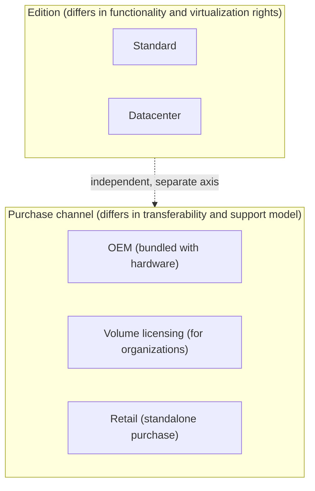
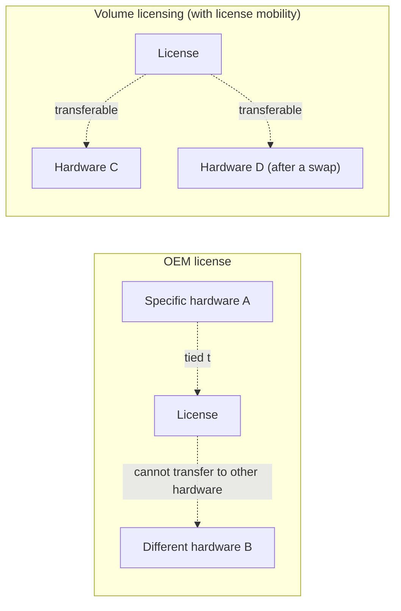

## Introduction

- **What You'll Learn From This Article**: This article systematically explains the difference between Windows Server's **Standard and Datacenter editions**, always a topic when procuring the product, along with the difference between **OEM, volume licensing, and retail purchase channels.** It covers the basic question of "what is an OEM license," how the core-based licensing billing model works, and the criteria for deciding which edition to choose in an era where virtualization is the norm.
- **Intended Audience**: This article is aimed at engineers involved in building or procuring Windows Server who can't concretely explain the difference between editions or licensing channels.
- **Estimated Reading Time**: About 17 minutes

This article is part of the [Top 1% Series' full article guide](/en/sitemap), and the first article in a new series on Windows Server operations.

## Prerequisites

- **License**: The right to use software itself. Separately from the software's own functionality, it defines usage conditions — on which hardware, and up to how many instances, it may be used.

## Getting the Big Picture

### The Two Independent Axes That Decide a Windows Server License

Windows Server licensing is decided by **two independent axes: "which edition to choose" and "which purchase channel to obtain it through."**

## Fundamentals, Explained Thoroughly

### The Difference Between Standard and Datacenter: Mainly Virtualization Rights

A point many people get wrong: **the biggest difference between Standard and Datacenter isn't simply how much functionality each has — it's the number of virtual machines a single license can run (virtualization rights).**

| | Standard | Datacenter |
|---|---|---|
| Virtualization rights | A single license (a set of core licenses) can run up to 2 virtual machines on the physical host (or 1 physical instance plus 1 virtual machine) | A single license can run **an unlimited** number of virtual machines on that physical host |
| Datacenter-exclusive features | Not available | Large-scale, high-availability-oriented features become available, such as Storage Spaces Direct (distributed storage pooling servers' local disks), Shielded VM (protecting a VM's content even from the virtualization host's own administrator), and Storage Replica |
| Price | Relatively lower | Relatively higher |

**When you want to run more virtual machines on the same physical host, there's a break-even point — beyond a certain number, switching to Datacenter becomes more cost-effective than buying additional Standard licenses per VM.** As virtualization consolidation becomes the norm, with a single physical host running many virtual machines, Datacenter tends to be chosen more often today.

### Core-Based Licensing: Counted by Core Count, Not Server Count

Since Windows Server 2016, licensing has been billed based on **the number of physical cores (or virtual cores assigned to a virtual machine), not the number of servers.** There's a rule requiring **licensing for at least 16 cores per physical server**, and licenses are typically purchased combining 2-core and 8-core packs. This design means the more powerful, higher-core-count the server you deploy, the more licenses you need.

Why core-based licensing was introduced

Before Windows Server 2012 R2, licensing was mainly counted by CPU socket count. But as the core count within a single CPU socket kept growing year after year, this "socket count" basis created an imbalance — the actual CPU performance (core count) you got for the same licensing cost varied wildly depending on which hardware you deployed. Switching to a core-based basis let the licensing cost more accurately reflect the actual CPU performance being used.

### What Is an OEM License?

An **OEM (Original Equipment Manufacturer) license** is a licensing form provided bundled with the hardware when you buy a server. While relatively cheap, it comes with clear constraints:

- **It's tied to that hardware**: An OEM license is valid only on that specific hardware you purchased. Even within the same organization, the license can't be transferred as-is to a different, new piece of hardware.
- **The hardware provider becomes your support point of contact**: Technical support for the OS itself is also typically provided through the manufacturer (the OEM vendor) that sold that hardware.

By contrast, **volume licensing** (a contract form where an organization bundles multiple licenses together) can typically be contracted **with license mobility (the right to transfer a license to different hardware) included**, giving greater flexibility when swapping server hardware or migrating from on-premises to the cloud (or between clouds). This transfer flexibility is why **volume licensing is generally chosen over OEM licensing when an organization procures and operates a large number of servers as a planned effort.**

## The View From the Top 1% Perspective

### Where an OEM License Becomes a Practical Constraint

An OEM license is advantageous in terms of upfront cost, but the constraint of **needing to repurchase the license itself when swapping server hardware a few years later, or migrating to a virtualization platform or the cloud**, sometimes surfaces as a real practical cost. In particular, when there's a plan to consolidate multiple physical servers onto a single virtualization platform (a P2V, physical-to-virtual migration), it's important to keep in mind from the procurement stage that **individual OEM licenses may not carry over as-is.**

### How to Think About Switching From Standard to Datacenter

As the number of virtual machines grows beyond the initial expectation, a key practical decision point is to **compare the cost of buying additional Standard licenses per VM against the cost of upgrading to Datacenter, based on the current VM count.** In an environment expecting significant future growth in VM count, choosing Datacenter from the start is often advantageous both for long-term cost and operational flexibility.

## Common Misconceptions and Pitfalls

- **Misconception 1: "Datacenter is simply a higher-tier product with more features"**
  The main difference between Standard and Datacenter is virtualization rights (the number of VMs it can run), not simply how much functionality it has — thinking of it purely as "more features" can lead to a wrong choice.
- **Misconception 2: "An OEM license has less functionality than an ordinary license"**
  There's no difference in OS functionality itself between an OEM and a volume license. The difference is transferability (whether license mobility is included) and the support model.
- **Misconception 3: "The number of licenses needed is decided purely by the number of servers"**
  Since Windows Server 2016, licenses are billed based on the number of physical (or virtual) cores, not the number of servers.

## The Troubleshooting Perspective

For practical licensing issues, the basic approach is to **isolate whether it stems from an edition constraint or a purchase-channel (transferability) constraint.**

1. **Adding a virtual machine hits a licensing constraint**: Check whether you've exceeded the Standard edition's virtualization rights (the number of VMs runnable per license). Consider purchasing additional licenses or upgrading to Datacenter.
2. **A license activation error occurs after swapping server hardware**: Check whether that license was purchased as an OEM license, tied to the old hardware.
3. **Planning a consolidation onto a virtualization platform**: Inventory each physical server's license (OEM or volume) ahead of time, and understand how many are actually transferable.

### Preventive Measures and Permanent Fixes

- When procuring a new server, decide between OEM and volume licensing ahead of time, factoring in future hardware swaps or virtualization consolidation plans.
- In an environment where VM count trends upward, periodically re-evaluate the Standard/Datacenter break-even point.
- When planning a large-scale virtualization or cloud migration, inventory the transferability of existing licenses early on.

## Summary

- The main difference between Standard and Datacenter isn't simply how much functionality each has — it's the number of VMs a single license can run (virtualization rights) and Datacenter-exclusive features.
- Since Windows Server 2016, licensing is billed based on the number of physical (or virtual) cores, not the number of servers.
- An OEM license is tied to specific hardware and can't be transferred to different hardware, while volume licensing offers greater transfer flexibility via license mobility.
- In an environment expecting VM count to grow, comparing the cost of buying additional Standard licenses against upgrading to Datacenter is practically important.

**What to Keep in Mind From Today**
1. When choosing a Windows Server edition, judge based on virtualization rights (the number of VMs it can run), not how much functionality it has.
2. When procuring a new server, choose between OEM and volume licensing with future hardware swaps or virtualization consolidation in mind, factoring in the difference in transferability.

## References

- [Windows Server pricing and licensing | Microsoft](https://www.microsoft.com/en-us/windows-server/pricing)
- [Licensing Windows Server 2022 | Microsoft](https://www.microsoft.com/licensing/docs/view/Windows-Server-2022)
- [How to license Windows Server 2016 or later | Microsoft Learn](https://learn.microsoft.com/en-us/windows-server/get-started/how-to-buy)
