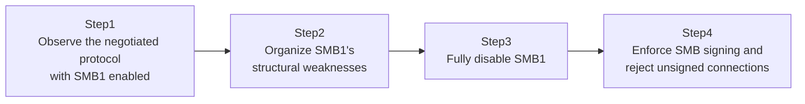

## Introduction

- **What You'll Learn From This Article**: Building on the SMB protocol covered in [Understanding Windows Server SMB File Sharing](/en/articles/smb-file-sharing-guide), this article confirms, by actually observing a connection, why **SMB1**, an old version still lingering in some environments today, is considered dangerous. You'll then cover how fully disabling SMB1, plus enforcing **SMB Signing**, prevents that dangerous state.
- **Intended Audience**: Readers who know "SMB1 is dangerous and should be disabled" as a fact, but have never confirmed firsthand specifically how it's dangerous, or how to verify it's been disabled. **This hands-on is for educational, defensive purposes — to strengthen the defenses of a test environment you manage yourself. Do not run these steps against someone else's production environment without authorization.**
- **Estimated Reading Time**: About 30 minutes

This article is part of the [Top 1% Series Complete Article Guide](/en/sitemap).

## Prerequisite Knowledge

- **SMB File Sharing Fundamentals**: This assumes [Understanding Windows Server SMB File Sharing](/en/articles/smb-file-sharing-guide).

## The Big Picture



## Hands-On Steps

### Step 1: Observe the Actual Protocol in Use, With SMB1 Enabled

On the server, check whether the SMB1 feature is installed.

```powershell
Get-WindowsFeature FS-SMB1
```

If enabled, connect from a client and check the actual negotiated SMB version (dialect).

```powershell
Get-SmbConnection
```

Check the `Dialect` column. **In some environments, despite both the client and server supporting newer versions, an old dialect like `SMB 1.0` still ends up negotiated for some reason.** This can happen when a client-side setting, or an old device somewhere along the path, unintentionally forces a downgrade to the older protocol.

### Step 2: Organize SMB1's Structural Weaknesses

Compared to current SMB2/SMB3, SMB1 has structural weaknesses like these:

- **No encryption option exists at all**: The ability to encrypt the traffic itself, added in SMB3, doesn't exist in SMB1 at all.
- **Its signing feature is weak, and often disabled by default**: A signing feature for tamper detection does exist, but it's still commonly left disabled by default in many environments.
- **It was the breeding ground for a critical historical vulnerability**: EternalBlue, the vulnerability abused to spread large-scale ransomware like WannaCry and NotPetya, existed in this very SMB1 implementation.

**This hands-on never performs an actual exploit against the vulnerability.** It only covers understanding the design weakness SMB1 carries, and the defensive response of disabling it.

### Step 3: Fully Disable SMB1

On the server, fully uninstall the SMB1 feature.

```powershell
Remove-WindowsFeature FS-SMB1
Set-SmbServerConfiguration -EnableSMB1Protocol $false -Force
```

After restarting, try connecting from the client again.

```powershell
Get-SmbConnection
```

**`Dialect` should now show only a current version, something like `SMB 3.1.1`.** Also confirm that a client with old settings that only speaks SMB1 now fails to connect at all. **The connection failing is itself the proof that the dangerous SMB1 pathway has actually been closed.**

### Step 4: Enforce SMB Signing and Reject Unsigned Connections

Alongside disabling SMB1, also configure SMB signing as mandatory.

```powershell
Set-SmbServerConfiguration -RequireSecuritySignature $true -Force
```

Deliberately try connecting with the client's signing setting disabled.

```powershell
Set-SmbClientConfiguration -RequireSecuritySignature $false -Force
```

```powershell
Get-SmbConnection
```

**Because the server requires signing while the client is set to no signing, the connection itself should be rejected.** Confirm that restoring the client's setting to `$true` lets it connect normally again.

## What a Pro Sees Here (Top 1% Understanding)

### Why SMB1 Still Lingers, Despite Being Known as Dangerous

SMB1's danger has been widely known in the security industry for years. **The biggest reason it still lingers in some environments anyway is that certain extremely old dedicated devices that only support SMB1 (an old NAS, an old multifunction printer, an old business system's integration feature, and similar) are still running in production.** Compatibility with such devices is a real reason many organizations haven't been able to disable SMB1. **When rolling out SMB1 disabling in practice, the first step is an asset inventory — identifying in advance whether any device on the network only speaks SMB1.**

### Why SMB Signing Only Matters "Paired" With Disabling SMB1

Even after disabling SMB1, **if SMB2/SMB3 itself runs without signing, the risk of tampered traffic or a man-in-the-middle interception never fully goes away.** SMB signing attaches a tamper-detection signature to every SMB packet sent and received — **upgrading the protocol version and operating that protocol securely are independent, separate defenses.** Disabling SMB1 is the defense of "closing off the old, weak pathway itself," while enforcing SMB signing is the defense of "protecting the remaining pathway (SMB2/SMB3) itself from tampering" — **only combining both actually gives you adequate real-world protection.**

## Common Misconceptions and Pitfalls

- **Misconception 1: "Disabling SMB1 alone completes SMB-related security measures."**
  Disabling SMB1 closes off the old, dangerous protocol itself, but operating the remaining SMB2/SMB3 securely requires a separate measure, such as enforcing SMB signing.
- **Misconception 2: "SMB1 being left enabled is simply a misconfiguration."**
  In practice, SMB1 often remains for a legitimate reason: maintaining compatibility with old, dedicated devices that only support SMB1.
- **Misconception 3: "As long as both the client and server support SMB3, it always negotiates SMB3."**
  A client-side setting, or an old device somewhere along the path, can unintentionally force a downgrade to an older dialect.

## Troubleshooting Perspective

1. **Disabling SMB1 broke communication with a specific old device**: That device likely only supports SMB1 — consider updating the device itself, or planning an exceptional migration.
2. **Enforcing SMB signing causes connection errors on some clients**: Check that client's `RequireSecuritySignature` setting and enable signing there.
3. **An old dialect gets negotiated unintentionally**: Check the actual Dialect with `Get-SmbConnection`, and investigate the client-side setting or any old device along the path.

## Summary

- SMB1 carries structural weaknesses: no encryption option, and a critical historical vulnerability (EternalBlue, among others).
- `Remove-WindowsFeature FS-SMB1` plus `Set-SmbServerConfiguration -EnableSMB1Protocol $false` fully disables SMB1.
- Disabling SMB1 and enforcing SMB signing are independent, separate defenses — "closing the old pathway" and "protecting the remaining pathway" — and combining both is what provides real-world protection.
- When SMB1 remains active, it's often because of an old, dedicated device that only supports SMB1, so an asset inventory is needed before disabling it.

**Takeaways to Apply Today**
1. Periodically check whether SMB1 is enabled, with `Get-WindowsFeature FS-SMB1`.
2. Before disabling SMB1, always identify whether any device on the network only speaks SMB1.

## References

- [SMB security hardening in Windows Server | Microsoft Learn](https://learn.microsoft.com/en-us/windows-server/storage/file-server/smb-security)
- [Stop using SMB1 | Microsoft Learn](https://learn.microsoft.com/en-us/windows-server/storage/file-server/troubleshoot/smbv1-not-installed-by-default-in-windows)
