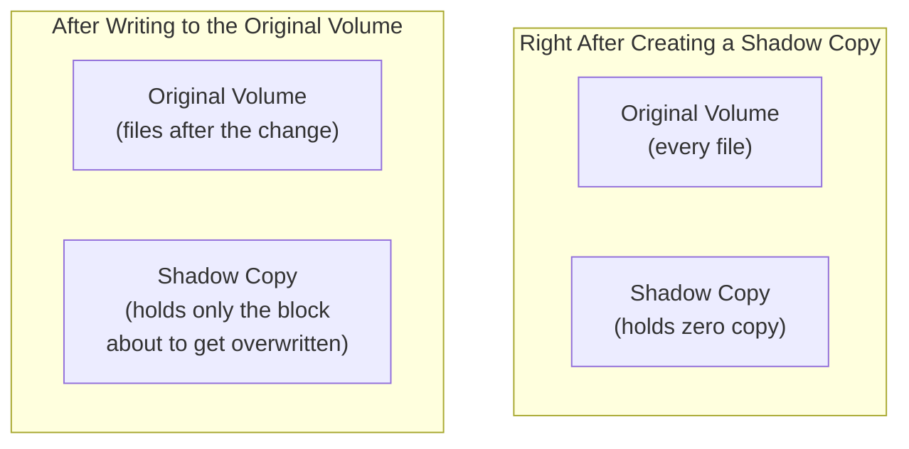

## Introduction

- **What You'll Learn From This Article**: Systematically understand the real behavior of **Shadow Copies** (VSS, Volume Shadow Copy Service) — the feature letting a user restore a file's "previous version" themselves, on the file server you built in [Windows Server's SMB Shares](/en/articles/smb-file-sharing-guide). You'll learn that this feature isn't achieved by periodically duplicating an entire volume, but through the more efficient mechanism of **copy-on-write**, together with its decisive limitation: it's never a substitute for a backup.
- **Intended Audience**: Readers who've used a file server's "Previous Versions" tab, but can't explain how this feature actually works behind the scenes.
- **Estimated Reading Time**: About 16 minutes

This article is part of the [Top 1% Series Complete Article Guide](/en/sitemap), and article 5.1 in the [Windows Server Operations Series](/en/sitemap#series-list).

## Prerequisite Knowledge

- [Windows Server's SMB Shares](/en/articles/smb-file-sharing-guide): The basic mechanism of file sharing is a prerequisite.

## Getting the Big Picture

Even if a file on a Shadow Copy-enabled volume gets accidentally edited or deleted, a user can **restore an earlier state themselves, with no need to ask IT, simply by opening that file's "Properties" and the "Previous Versions" tab.** Assuming "it must be periodically duplicating the entire volume" makes this feature's real efficiency impossible to explain.



## Deep Dive Into the Fundamentals

### A Shadow Copy Runs on Copy-on-Write, the Same Mechanism That Separates Apparent Capacity From Actual Consumption

**The instant a shadow copy gets created, zero copy of the original volume gets made at all.** From there, every time a write actually occurs against a file on the original volume, **only the block about to be overwritten gets preserved into a dedicated shadow-copy storage area, through copy-on-write.** This is **the exact same underlying idea** covered in [A Top 1% Hands-On for Creating an LVM Snapshot Yourself and Confirming What Copy-on-Write Really Is](/en/articles/lvm-snapshot-handson-guide). The OS and file server implementations differ, but the core design — "preserve only the pre-change block, only once it's actually needed" — is shared.

<details>
<summary>What Exactly Is the "Previous Version" a User Sees Actually Referencing?</summary>

**When a user selects a past state from the "Previous Versions" tab, Windows combines the current file's content with the "pre-change blocks" preserved in the dedicated shadow-copy storage area, reconstructing that file's complete content as of that moment, on the spot.** The dedicated shadow-copy storage area never holds a complete, individually saved copy of the file itself.

</details>

### A Shadow Copy Is a "Snapshot" Taken on a Schedule, Not Continuously

**A Shadow Copy never continuously records every change to a file.** By default, a "snapshot" recording the state as of that moment gets created on a fixed schedule — something like **twice a day (7 AM and noon on weekdays).**

```powershell
# Check the existing shadow copy schedule
vssadmin list shadowstorage
```

**You need to understand the constraint that it can't restore "the state right after you finished editing a file" — it can only ever revert to the state as of the most recent scheduled snapshot.**

## What a Pro Sees Here (Top 1% Understanding)

### A Shadow Copy Is Never a Substitute for a Backup

This is the single most important caveat. **A Shadow Copy gets stored on the exact same physical disk as the original volume.** If that disk itself fails, the shadow copy gets lost at the exact same moment as the original file — not just the file itself. This is **the exact same structural limitation** as [an LVM snapshot offering no protection against a physical failure, due to its dependency on the original volume](/en/articles/lvm-snapshot-handson-guide). **A Shadow Copy needs to be understood as "a feature letting a user quickly revert to a state from hours ago, or the previous day," serving an entirely different purpose from a real backup, which stores data in a physically independent location.** Where [recovering from accidental deletion via the AD Recycle Bin](/en/articles/ad-recycle-bin-handson-guide) was an "undo" mechanism on the directory-service side, a Shadow Copy is the file-server-side mechanism belonging to the exact same underlying lineage of idea.

## Common Misconceptions and Pitfalls

- **Misconception 1: "A Shadow Copy periodically duplicates the entire volume, on schedule."**
  Right after creation, a shadow copy holds almost no data at all; only the block about to be overwritten gets preserved via copy-on-write, each time the original volume gets written to.
- **Misconception 2: "Having Shadow Copies means a backup isn't necessary."**
  A Shadow Copy gets stored on the exact same physical disk as the original volume, offering no protection against that disk itself failing. A real backup stores data in a physically independent location.
- **Misconception 3: "A Shadow Copy continuously records every change to a file."**
  A Shadow Copy creates a snapshot on a fixed schedule by default, something like twice a day, and can't restore the state right after an edit.

## Troubleshooting Perspective

1. **No past version at all shows up in the "Previous Versions" tab**: Check whether Shadow Copies are actually enabled on that volume.
2. **The dedicated shadow-copy storage area fills up faster than expected**: A high volume of file changes increases the amount of copy-on-write preserved data too. Consider reviewing the storage area's allocated size.
3. **The state at an expected moment doesn't show up as a restore candidate**: Since a Shadow Copy only gets created at scheduled moments, not continuously, check the timing relative to that schedule.

## Summary

- Shadow Copies (VSS) is a feature letting a user restore a file's previous version themselves, with no need to ask IT.
- This feature is achieved not by duplicating the entire volume, but through copy-on-write, preserving only the block about to be overwritten.
- A Shadow Copy creates a snapshot on a fixed schedule by default, something like twice a day — it's never a continuous record of changes.
- A Shadow Copy gets stored on the exact same physical disk as the original volume, offering no protection against a physical failure, and is never a substitute for a real backup.

**Takeaways to Apply Today**
1. When building a file server, always treat enabling Shadow Copies and backing up to a physically independent location as features serving entirely different purposes.
2. Regularly check the Shadow Copy schedule, confirming it doesn't mismatch the restore timing users actually expect.

## References

- [Volume Shadow Copy Service | Microsoft Learn](https://learn.microsoft.com/en-us/windows-server/storage/file-server/volume-shadow-copy-service)
- [A Top 1% Hands-On for Creating an LVM Snapshot Yourself and Confirming What Copy-on-Write Really Is](/en/articles/lvm-snapshot-handson-guide)
