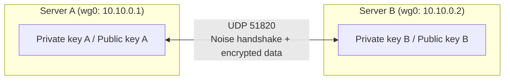

## Introduction

- **What You'll Learn From This Article**: This hands-on lets you feel the **Cryptokey Routing** design covered in [Understanding How WireGuard Works From a "Top 1%" Perspective](/en/articles/wireguard-internals-guide) by actually building a WireGuard tunnel between two Linux servers. You'll confirm, hands-on, the claim that "who you can reach and which route gets used is decided entirely by one table mapping public keys to AllowedIPs" by editing the config yourself and watching `wg show`'s output change.
- **Intended Audience**: Readers who've already read [Understanding How WireGuard Works](/en/articles/wireguard-internals-guide) but have never built WireGuard themselves.
- **Estimated Reading Time**: About 60 minutes, including environment setup

This article is part of the [Top 1% Series Complete Article Guide](/en/sitemap).

## Prerequisite Knowledge

- **Basic Linux Operations**: Package management with `apt`, service management with `systemctl`, and editing config files in a text editor. If you're not comfortable with these, read [Hands-On Prep Manual: Setting Up an Ubuntu Server for the First Time](/en/articles/ubuntu-server-setup-guide) first.
- **The Concept of Cryptokey Routing**: This assumes the design covered in [Understanding How WireGuard Works](/en/articles/wireguard-internals-guide), where public keys and AllowedIPs are mapped one-to-one.

## The Big Picture

Prepare two Ubuntu servers (or VMs), install WireGuard on each, and build a tunnel between them.



## Hands-On Steps

### Step 1: Install WireGuard on Both Sides and Generate a Key Pair

On both servers, install WireGuard and generate a public-key-cryptography key pair.

```bash
sudo apt update && sudo apt install -y wireguard
wg genkey | sudo tee /etc/wireguard/privatekey | wg pubkey | sudo tee /etc/wireguard/publickey
```

This produces two files: `privatekey` and `publickey`. **At this point, neither side knows anything about the other yet.** A key pair is purely your own identity.

### Step 2: Create the Config File and Bring Up the Tunnel

Create `/etc/wireguard/wg0.conf` on Server A:

```ini
[Interface]
PrivateKey = <Server A's private key>
Address = 10.10.0.1/24
ListenPort = 51820

[Peer]
PublicKey = <Server B's public key>
AllowedIPs = 10.10.0.2/32
Endpoint = <Server B's global IP>:51820
PersistentKeepalive = 25
```

Create the matching config on Server B, with keys and addresses swapped:

```ini
[Interface]
PrivateKey = <Server B's private key>
Address = 10.10.0.2/24
ListenPort = 51820

[Peer]
PublicKey = <Server A's public key>
AllowedIPs = 10.10.0.1/32
Endpoint = <Server A's global IP>:51820
PersistentKeepalive = 25
```

Bring it up on both:

```bash
sudo wg-quick up wg0
```

From Server A, ping `10.10.0.2`:

```bash
ping -c 3 10.10.0.2
```

**With no IKE-style negotiation happening at all, connectivity already works at this point.** Run `wg show`, and you'll see the handshake completed and recent send/receive volume recorded.

### Step 3: Rewrite AllowedIPs and Feel Cryptokey Routing in Action

This is the heart of this hands-on. Rewrite Server A's `AllowedIPs` from a single address for Server B to a broader range:

```ini
AllowedIPs = 10.10.0.0/24
```

Apply the change:

```bash
sudo wg syncconf wg0 <(wg-quick strip wg0)
```

**Rewriting that one line alone completely changed the criterion Server A uses to decide "packets addressed to 10.10.0.0/24 get encrypted and sent to this public key's peer."** You never touched the routing table (`ip route`) at all — see for yourself that **the entity actually deciding whether a packet gets forwarded was always this `AllowedIPs` value.**

### Step 4: Observe Handshake Re-Establishment With tcpdump

On Server A, deliberately bring the interface down, set up `tcpdump`, and bring it back up.

```bash
sudo tcpdump -i any udp port 51820 -n &
sudo wg-quick down wg0 && sudo wg-quick up wg0
```

Send a ping, and you'll see the first few packets in `tcpdump`'s output have a different size than the rest (the handshake messages). **WireGuard keeps re-establishing the session key in the background, roughly every two minutes, without interrupting ongoing traffic.** You can also confirm this by watching `wg show`'s `latest handshake` value keep updating over time.

## What a Pro Sees Here (Top 1% Understanding)

### PersistentKeepalive Isn't About "Keeping the Connection Alive" — It's About Keeping the NAT Mapping Alive

`PersistentKeepalive = 25` sends an empty packet every 25 seconds. **This isn't for keeping WireGuard's own connection alive — it's for keeping alive the NAT router's or firewall's record that "this UDP port is an active session" (the NAT binding).** In an environment where both sides have a global IP, it's basically unnecessary, but in the common setup where one side sits behind NAT, skipping this on that side means a reconnection request from the other side gets silently blocked by NAT before it ever arrives. In practice, an asymmetric setup — "not needed on the server side, only set on the client side" — is common.

### A Too-Narrow AllowedIPs Misconfiguration Becomes an Annoyingly Hard-to-Diagnose Failure

As you confirmed in Step 3, `AllowedIPs` is the actual range of what gets forwarded. **In a hub-style setup relaying multiple internal networks, a mistake in the AllowedIPs range produces the confusing failure of "everything works except this one specific host."** Unlike an IPsec SA (security association), which gets established per tunnel, every single line in this WireGuard mapping table is, in effect, an actual routing policy — worth keeping firmly in mind.

## Common Misconceptions and Pitfalls

- **Misconception 1: "AllowedIPs is just a firewall-like filter setting."**
  AllowedIPs is a filter, but it's also the actual routing mechanism, deciding which public key's peer gets sent packets addressed to that IP range, encrypted.
- **Misconception 2: "Without PersistentKeepalive, WireGuard's connection itself drops quickly."**
  WireGuard's own design is close to stateless — the connection itself doesn't drop. The setting exists to maintain reachability through NAT.
- **Misconception 3: "The handshake only happens once, at the initial connection."**
  WireGuard automatically re-establishes the session key in the background roughly every two minutes, without interrupting ongoing traffic.

## Troubleshooting Perspective

1. **Ping works, but one specific subnet is unreachable**: Check whether the peer's `AllowedIPs` includes that destination.
2. **A reconnection from a client behind NAT fails after some time**: Check whether `PersistentKeepalive` is set.
3. **`wg show`'s latest handshake never updates**: Check whether the `Endpoint` IP address or port has changed, and whether `UDP 51820` is permitted through the firewall.

## Summary

- WireGuard decides who you can reach and which route gets used through a mapping table (Cryptokey Routing) between public keys and AllowedIPs.
- Rewriting `AllowedIPs` alone changes the forwarding range, with no need to touch the routing table.
- WireGuard automatically re-establishes its session key roughly every two minutes, and `PersistentKeepalive` exists to maintain the NAT binding.

**Takeaways to Apply Today**
1. When reading a WireGuard config, read `AllowedIPs` as the routing table itself.
2. Don't forget to set `PersistentKeepalive` on any client sitting behind NAT.

## References

- [WireGuard: Conceptual Overview](https://www.wireguard.com/#conceptual-overview)
- [wg-quick(8) — Linux man page](https://man7.org/linux/man-pages/man8/wg-quick.8.html)
