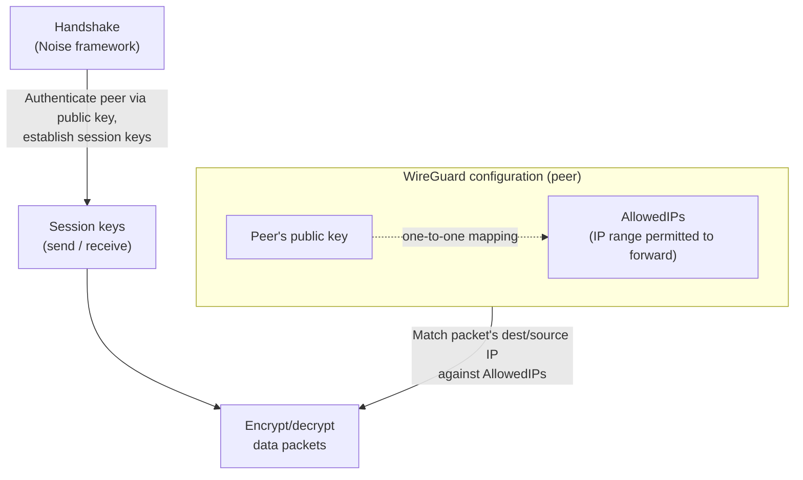
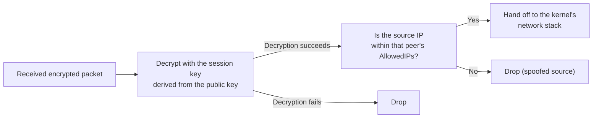
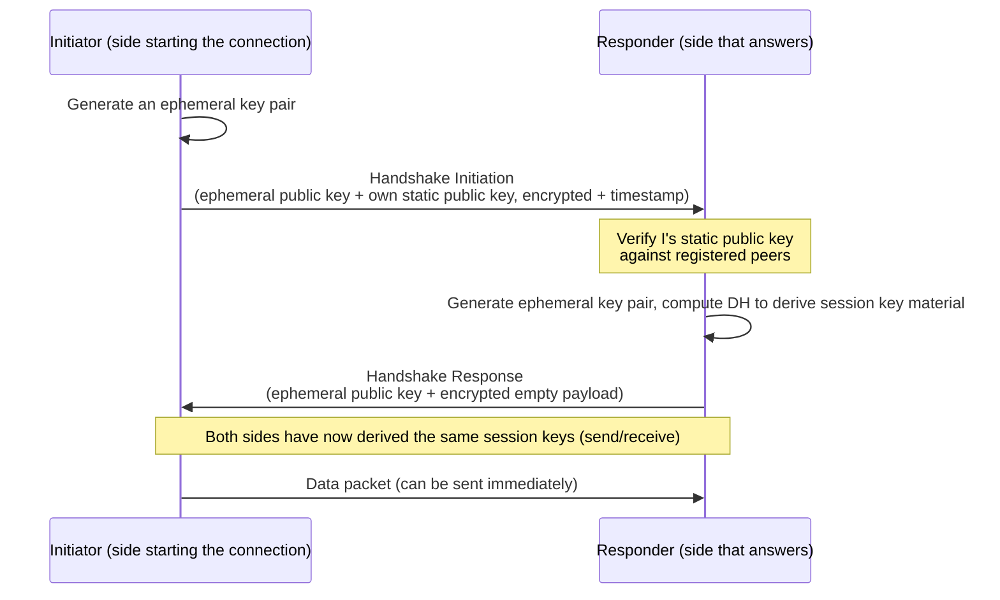

## Introduction

- **What You'll Learn From This Article**: Beyond "a minimal design with a fixed cipher suite," you'll learn exactly what steps WireGuard's Noise-framework-based handshake goes through to establish keys, why the design that ties a public key to an allowed IP range — **Cryptokey Routing** — can stand in for a routing table, and how session keys keep rotating automatically.
- **Intended Audience**: This article is aimed at readers who already understand WireGuard's high-level story — a fixed cipher suite, a small implementation, peer identification by public key — from [Comparing L2TP/IPsec to Modern VPN Protocols](/en/articles/vpn-protocols-comparison-guide), and want to go deeper into what actually happens when a connection is established.
- **Estimated Reading Time**: About 18 minutes

This article is part of the [Top 1% Series' full article guide](/en/sitemap).

## Prerequisites

- **Public-Key vs. Symmetric-Key Cryptography**: Public-key cryptography uses a different key pair for encryption/decryption (or key exchange); symmetric-key cryptography uses the same key. Covered in more depth in [How PKI and Digital Certificates Work](/en/articles/pki-guide).
- **Diffie-Hellman Key Exchange (DH)**: A procedure that lets two parties derive a shared secret that stays hidden from any third party observing the channel, using each side's public key and their own private key.
- **UDP**: A lightweight, connectionless protocol that doesn't require a connection-establishment step before every exchange.

## Getting the Big Picture

### In a Nutshell

**WireGuard's core idea is a small lookup table (the Cryptokey Routing Table) that ties each pre-exchanged public key one-to-one to the range of IP addresses that peer is allowed to send through. Keys are established with a one-round-trip-and-a-half handshake based on the well-established Noise framework, and every packet from then on is encrypted and forwarded according to that same lookup table.** There's no concept of "negotiation" at all, the way IKE has one — who you talk to and what you allow is expressed entirely through the simple data structure of a key pair plus a lookup table.

## Fundamentals, Thoroughly Explained

### Cryptokey Routing: Deciding Routes with a "Key Lookup Table," Not a Routing Table

WireGuard has no separate matching-rule mechanism like IPsec's SPD (Security Policy Database). Instead, **the peer configuration itself** handles encryption and routing at the same time. Each peer entry is nothing more than a pairing of two pieces of information.

- **The peer's public key**: Only the party holding this key can decrypt data addressed to it.
- **AllowedIPs**: The range of IP addresses (as CIDRs) permitted to be sent to, and accepted from, this peer.

When sending, WireGuard looks up which peer's AllowedIPs contain the destination IP address of the packet, then encrypts it with the session key derived from that peer's public key. When receiving, once a packet has been successfully decrypted (meaning it came from a peer holding the correct key), WireGuard checks the packet's **source IP address** again against that same peer's AllowedIPs. If it isn't in range, the packet is dropped, even if the cryptography checked out.

**The essence of this design is that "authentication" (who sent this packet) and "authorization" (what IP range this peer is allowed to claim) are both handled through a single identifier: the public key.** Where IPsec establishes an SA via IKE and then checks it against a separately maintained rule set (the SPD), WireGuard collapses the whole thing into one relationship: "the peer holding this public key = this AllowedIPs range." Even when building a configuration that relays multiple sites (a site-to-site setup), you get route control just by listing multiple CIDRs (an entire remote-site internal network, say) in one peer's AllowedIPs — no separate routing protocol required.

### The Handshake: A One-Round-Trip-and-a-Half Key Exchange Built on the Noise Framework

WireGuard's handshake isn't a custom-designed cryptographic protocol — it directly adopts the `Noise_IK` pattern from the **Noise Protocol Framework**, an existing blueprint that systematically catalogs key-exchange patterns. This approach — picking the right pattern from a battle-tested framework instead of designing a cryptographic protocol from scratch every time — directly reflects a lesson learned from the complexity and vulnerabilities that resulted from specifying custom protocols like IKE from the ground up.

The "IK" in `Noise_IK` refers to the Noise framework's naming convention: **"I" means the Initiator's static key is not known in advance, and "K" means the Responder's static key is already Known.** In WireGuard, you have to write a peer's public key into your configuration before you can communicate with them, so the handshake always starts with both sides already knowing each other's static public key.

The crucial characteristic of this handshake is that **there's no multi-stage negotiation at all, unlike IKE's Phase 1 (six round trips in Main Mode) — session keys are established in a single round trip (Initiation → Response), and the Initiator can start sending data the instant it receives the Response.** Fewer round trips mean less time and fewer packets spent establishing a connection, which translates into less perceptible delay even on high-latency mobile links.

Aside: Why is the static public key sent encrypted?

Inside the Handshake Initiation message, the Initiator's static public key is sent encrypted, not in plaintext. This hides the relationship itself — who is trying to talk to whom — from any third party observing the channel (a cryptographic property called **identity hiding**). Some IKEv1/IKEv2 modes leak identity information in plaintext or with insufficient protection, and this is another lesson WireGuard's design took into account.

### DoS Resistance: Pushing the Cost Back onto the Attacker with Cookies

Processing a Handshake Initiation message requires an expensive DH computation. If anyone could freely fire off Initiation messages, an attacker could spoof the source IP address and send a flood of fake Initiations, forcing the Responder into a mountain of costly DH computations — a straightforward DoS attack.

WireGuard counters this with a mechanism: **when a Responder receives a large volume of handshake requests in a short time, it demands a lightweight "cookie" before starting the expensive DH computation, and only proceeds to full processing for peers that resend the correct cookie.** Generating and verifying the cookie itself is a cheap operation (a MAC) that requires none of the heavy public-key math DH does, so the Responder can filter out load from spoofed sources at low cost before ever touching the expensive path. This is the same idea behind IKEv2's cookie-based DoS resistance, and WireGuard follows the same pattern.

### Automatic Session-Key Rotation (Rekey)

WireGuard's session keys aren't used indefinitely. **Once either the amount of data sent reaches a threshold (2^60 packets) or a fixed amount of time (120 seconds) has passed since the last handshake, a new handshake happens automatically in the background and the session switches to fresh keys.** This rotation requires no user action and doesn't interrupt existing traffic — it completes behind the scenes while communication continues.

The reason for rotating keys periodically is that **the longer a single key stays in use, the wider the blast radius if that key is ever compromised (how far back an attacker could decrypt).** Discarding keys at regular intervals is the standard technique cryptography uses to achieve a property called **Forward Secrecy**, an idea shared with TLS 1.3 and most modern key-exchange protocols.

### The Structure of a Data Packet, and Replay-Attack Protection

Once the handshake is complete, data packets follow this simple structure.

| Field | Role |
|---|---|
| Type | Identifies whether this is a handshake-related message or a data packet |
| Receiver Index | An identifier letting the peer instantly find which session's key to decrypt with |
| Counter | A 64-bit sequence number showing how many packets have been sent in this session |
| Encrypted payload | The IP packet body plus authentication tag, encrypted with ChaCha20-Poly1305 |

This Counter field is what protects against **replay attacks** — where an eavesdropper resends a previously captured, legitimately encrypted packet as-is, hoping it gets treated as genuine new traffic. The receiver tracks previously received Counter values in a sliding window for that session, and unconditionally drops any packet whose Counter value has already been seen, or is far too old (outside the window) — even if it decrypts correctly as valid ciphertext.

### Staying Connected on Mobile Networks: Dynamic Endpoint Updates

A WireGuard peer entry can specify the peer's current IP address and port (its **endpoint**), but this doesn't have to stay fixed. **The Responder continuously updates a peer's "current endpoint" to the source IP address and port of the most recent packet it successfully decrypted with that peer's session key.** Even if the client's IP address changes — switching from Wi-Fi to a mobile connection, say — as long as packets arriving from the new address still decrypt correctly, the server immediately recognizes "this peer's new endpoint is here" and keeps the session going. No dedicated extension protocol or extra message exchange like IKEv2's MOBIKE is needed — the accurate way to understand this is that **the roaming behavior is simply a side effect of the authentication mechanism itself: "decrypted correctly = genuinely from this peer."**

## The View from the Top 1% (What Experts See)

### What "No Negotiation" Actually Means for Security

In a negotiation-style protocol like IKE, the very mechanism of "negotiating which combination of cryptographic algorithms to use each time" hands an attacker a foothold for **downgrade attacks** — tricking the two sides into using a weaker algorithm. WireGuard fixing its cipher suite completely isn't just an operational convenience ("fewer choices means easier configuration"). **Because the negotiation step doesn't exist at all, the entire class of downgrade attacks is structurally impossible.** The kind of room IKEv1's Aggressive Mode leaves — allowing a weaker configuration for compatibility's sake — is eliminated at the design level.

### The Operational Tradeoff of Pre-Distributing Public Keys

Cryptokey Routing is a powerful design, but it rests on the assumption that **you've already obtained the peer's public key by some means and written it into your configuration before communication begins.** This contrasts with a [PKI](/en/articles/pki-guide)-style system, where a CA (certificate authority) issues and revokes certificates. PKI lets a CA centrally manage new members joining or keys being revoked, but bare WireGuard has no built-in mechanism for automating key distribution or revocation. That's manageable with a handful to a few dozen manually managed configs, but at the scale of hundreds of devices, solving this "key distribution problem" becomes a serious operational challenge. That's precisely the layer that [How Tailscale Works](/en/articles/tailscale-internals-guide) covers — automatic key distribution built on top of IdP integration.

## Common Misconceptions and Pitfalls

- **Misconception 1: "WireGuard has no concept of a handshake — encrypted communication just starts immediately."**
  A handshake based on the Noise framework always happens first. What's missing is IKE's multi-stage negotiation — the procedure for establishing keys still exists.
- **Misconception 2: "Without configuring an endpoint, WireGuard can't find the other side."**
  The Responder (usually the server side) dynamically learns the endpoint from the most recent source that successfully decrypted, so communication continues even if the client-side endpoint changes. The Initiator (the side that starts the connection), however, needs to know the peer's endpoint at least for that first message.
- **Misconception 3: "Since the cipher algorithms are fixed, the day that cipher is broken, it's over."**
  There's non-zero risk that a fixed cipher suite becomes outdated eventually, but WireGuard's development team's approach to moving to a new cipher suite is to add it as a separate version alongside the existing `Noise_IK` pattern. "There's only one algorithm" and "the algorithm can't be updated" are two different claims.

## Troubleshooting Perspective

WireGuard connection issues are best approached by first isolating **whether the handshake succeeded, and whether the AllowedIPs configuration is correct.**

1. **The handshake never succeeds (`latest handshake` in `wg show` never updates)**: Typical causes include a misconfigured peer public key, the UDP port being blocked by a firewall, or a stale endpoint behind NAT. Start by checking whether traffic to that UDP port is actually reaching the destination.
2. **The handshake succeeds, but a specific destination is unreachable**: A gap in the AllowedIPs range is the most common cause. Given how Cryptokey Routing works, traffic to a destination not covered by AllowedIPs is treated as if the route doesn't exist at all, even though the cryptography is perfectly valid.
3. **Communication briefly drops at regular intervals**: This can happen around a rekey. It's normally invisible, completing in the background, but on a system under extreme CPU load it can surface as a noticeable delay.

### Prevention and Long-Term Countermeasures

- For configurations spanning multiple sites or peers, list out the AllowedIPs design (which range gets assigned to which peer) ahead of time, and review it for overlaps or gaps before deploying.
- If you're using WireGuard at a scale beyond a few dozen devices, look early into automating key distribution and revocation (a wrapper product like Tailscale, or your own key-distribution infrastructure) rather than managing raw configs by hand.
- Add `wg show`'s `latest handshake` to your monitoring, and routinely confirm that handshakes keep refreshing at the expected interval (at most a few minutes, by default).

## Summary

- WireGuard achieves route control and encryption at the same time, without a dedicated routing protocol, through Cryptokey Routing — a one-to-one mapping between public keys and AllowedIPs.
- The handshake is based on the Noise framework's `Noise_IK` pattern and establishes both sides' session keys in a single round trip. There's no multi-stage negotiation like IKE has.
- Behind its simple appearance, WireGuard bundles multiple security properties: cost-shifting via cookies for DoS resistance, Counter-based replay protection, and periodic automatic session-key rotation for Forward Secrecy.
- Resilience to IP address changes isn't a dedicated extension feature — it's a side effect of the authentication mechanism itself, which dynamically learns the endpoint from whatever source successfully decrypts.
- The lack of a built-in mechanism for pre-distributing and revoking public keys is a real practical weakness that makes bare WireGuard a poor fit for large organizations as-is — and it's exactly why wrapper products like Tailscale exist.

**Things to Keep in Mind Starting Today**
1. When you hit a WireGuard connection problem, start by checking whether the handshake has succeeded with `wg show` — if it has, suspect a gap in the AllowedIPs configuration.
2. When considering a rollout beyond a few dozen devices, work out your key-distribution and revocation operations as early in the process as your protocol selection itself.

## References

- [WireGuard: Next Generation Kernel Network Tunnel | Official WireGuard paper](https://www.wireguard.com/papers/wireguard.pdf)
- [WireGuard Protocol & Cryptography | Official WireGuard site](https://www.wireguard.com/protocol/)
- [The Noise Protocol Framework](https://noiseprotocol.org/noise.html)
