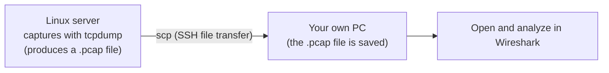

## Introduction

- **What You'll Learn From This Article**: The full workflow of taking a packet capture file (`.pcap`) recorded with `tcpdump` on a remote Linux server (e.g., a VM on Proxmox VE), transferring it to your own PC with the `scp` command, and opening it in Wireshark to analyze it.
- **Intended Audience**: Anyone completely new to Wireshark and packet captures who's about to work through a hands-on article involving capture analysis, like the [L2TP/IPsec hands-on lab](/en/articles/l2tp-ipsec-lab-guide).
- **Estimated Reading Time**: About 10 minutes

This article is part of the [Top 1% Series' full article guide](/en/sitemap), one of the theme-specific articles split off from the [hands-on prep manual](/en/articles/handson-prep-guide). Using an SSH client is covered in [How to Use Teraterm (a Terminal Client)](/en/articles/teraterm-guide).

## The Workflow This Article Covers

This blog's hands-on articles don't run Wireshark itself on the remote Linux server — instead, **the server side captures with `tcpdump`, and you transfer the resulting file to your own PC before opening it in Wireshark.** This means the server doesn't need a GUI environment, and since the capture is just a saved file, you can revisit it anytime later.



## Step 1: Install Wireshark

Download the installer for your OS (Windows/macOS) from the [official Wireshark site](https://www.wireshark.org/download.html) and install it. If you're prompted to also install "Npcap" (a driver for packet capture) during setup, go ahead and install it too — even if you're only opening files for now, you'll need it if you ever want to run a live capture on your own PC directly.

## Step 2: Transfer the Capture File to Your PC with `scp`

`scp` (Secure Copy) transfers files over SSH's encrypted channel. Windows 10/11 ships with an OpenSSH client built in, so it works right out of the command prompt or PowerShell (and works the same way from a terminal on macOS/Linux).

Once you've captured something with `tcpdump` on the server side (say, `/tmp/l2tp-capture.pcap`), run the following from your own PC's command prompt/PowerShell/terminal.

```bash
scp <username>@<server's IP address>:/tmp/l2tp-capture.pcap ./
```

The command's structure is `scp <source> <destination>`. The remote file is specified with `username@server's IP address:path`, and the trailing `./` means "save it in the current directory." Running it prompts for a password (or key-based auth) just like SSH, and copies the file on success.

<details>
<summary>If you get "Permission denied"</summary>

If you captured with root privileges (`sudo tcpdump`), the resulting `.pcap` file is owned by root. If the regular user you're SSH-connecting as doesn't have read permission on that file, `scp` fails with `Permission denied`. On the server side, you need to do one of the following.

- After capturing, loosen the read permission with something like `sudo chmod 644 /tmp/l2tp-capture.pcap` (it's fine to delete this temporary lab file once you're done transferring it).
- Use `tcpdump`'s `-Z` option to set the file's owner at capture time (e.g., `sudo tcpdump ... -Z <username> -w /tmp/l2tp-capture.pcap`).

</details>

<details>
<summary>You can also use Teraterm's file transfer feature</summary>

Instead of the `scp` command line, you can also fetch a file through the GUI via [Teraterm](/en/articles/teraterm-guide)'s menu: "File" → "Transfer" → "SCP" → "Receive file." If remembering the command feels like a hassle, this works just as well.

</details>

## Step 3: Open the File in Wireshark

Launch Wireshark and select "File" → "Open..." to pick the `.pcap` file you transferred in Step 2. You can also open it by dragging the `.pcap` file from your file explorer onto Wireshark's icon.

Once opened, packets are listed chronologically from the top. Typing a condition into the "Filter" field at the top of the screen narrows the list down to matching packets only (this is called a **display filter**).

| Example input | What it narrows down to |
|---|---|
| `isakmp` | Only IKE (key exchange) traffic |
| `l2tp` | Only L2TP control messages |
| `tcp.port == 443` | Only packets on TCP port 443 (HTTPS) |
| `ip.addr == 10.10.10.1` | Only packets where the source or destination matches the given IP address |

<details>
<summary>Display filters vs. capture filters</summary>

Wireshark has two distinct kinds of filters: a **display filter** (the Filter field at the top of the screen, using syntax like `isakmp`), which narrows down which of the packets you already have (opened or currently recording) get displayed; and a **capture filter** (using `tcpdump`'s BPF syntax, like `udp port 500`), which narrows down which packets get recorded in the first place, at the moment you start capturing. When you're just opening and analyzing an already-recorded file, as in this article, you only use display filters — but the command used to actually capture with `tcpdump` (something like the `udp port 500 or udp port 4500` used in the [L2TP/IPsec hands-on lab](/en/articles/l2tp-ipsec-lab-guide)) is a capture filter. Note that the syntax for the two is different.

</details>

Clicking a packet shows its protocol layers stacked from bottom to top (Ethernet → IP → UDP → ISAKMP, for example) in the middle of the screen — expand each one to inspect individual field values.

## Summary

- This blog's hands-on articles capture with `tcpdump` on the server side, transfer the file to your own PC with `scp`, and then open it in Wireshark.
- `scp <username>@<server's IP address>:<source path> ./` transfers a remote file into your current directory. Watch for permission errors on files captured with `sudo`.
- Typing a condition like `isakmp` or `ip.addr == ...` into the Filter field at the top of the screen (a display filter) narrows a huge packet list down to just what you want to look at.

## References

- [Wireshark official site](https://www.wireshark.org/)
- [Wireshark User's Guide](https://www.wireshark.org/docs/wsug_html_chunked/)
- [scp(1) — Linux manual page](https://man7.org/linux/man-pages/man1/scp.1.html)
