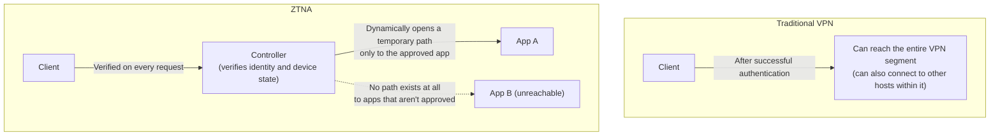
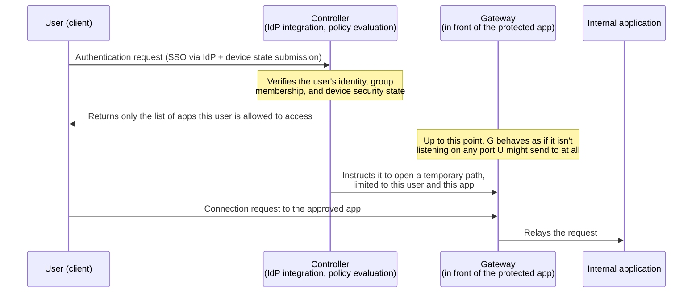

## Introduction

- **What You'll Learn From This Article**: ZTNA (Zero Trust Network Access) isn't simply "a newer VPN" — **it abandons the model VPN assumes (once you authenticate, you're trusted at the network level) and stands on a different trust model entirely: verifying on every single request.** You'll understand this systematically through the concrete mechanics of the SDP (Software-Defined Perimeter) architecture.
- **Intended Audience**: This article is aimed at readers who encountered the term ZTNA in [Comparing L2TP/IPsec to Modern VPN Protocols](/en/articles/vpn-protocols-comparison-guide) but can't explain how it actually differs from VPN, or what's happening under the hood.
- **Estimated Reading Time**: About 17 minutes

This article is part of the [Top 1% Series' full article guide](/en/sitemap).

## Prerequisites

- **VPN (Virtual Private Network)**: A general term for technology that creates a logical dedicated line over a public network. Covered in depth in [Comparing L2TP/IPsec to Modern VPN Protocols](/en/articles/vpn-protocols-comparison-guide).
- **IdP (Identity Provider)**: An external service that centrally handles user authentication (Google Workspace, Okta, Microsoft Entra ID, and so on).
- **Principle of Least Privilege**: A design principle that a user or process should never be granted more authority than is actually needed for the task at hand.

## Getting the Big Picture

### In a Nutshell

**Where VPN operates on a model of "trust a device that has successfully authenticated as a member of the network segment," ZTNA has no concept of "joining a network" at all — instead, for every single request to an individual application, it verifies the user's and the device's state, then temporarily opens only the minimum necessary path.** The accurate way to understand this isn't "the next version of VPN" — it's that **the very unit of trust each model assumes is fundamentally different.**

## Fundamentals, Thoroughly Explained

### Why VPN Ends Up Assuming "Network-Level Trust"

VPN establishes a connection using the IP address — a Layer 3 (network layer) concept — as its unit. Once a client succeeds at connecting via VPN, it typically becomes **reachable at the routing level** across the IP address range within that VPN segment. This is an intrinsic property of VPN as a Layer 3 technology, arising from the combination of the virtual IP address handed out at connection time and the corporate network's routing table.

This structure carries a specific risk. **Once authentication is breached — stolen credentials get used to log in, or a malware-infected device connects through VPN as a legitimate user — an attacker gains network-layer reachability to every other host within that VPN segment too.** This phenomenon, where the network itself hands an attacker a path into internal systems they were never meant to reach, is called **lateral movement**. No matter how strong the encryption and authentication of the VPN itself are, the design assumption that "once you're connected, you get to act as a member of that network" is exactly what lays the groundwork for lateral movement.

### The SDP (Software-Defined Perimeter) Model: Making the Network "Invisible"

Most ZTNA products are implemented on an architecture model called **SDP (Software-Defined Perimeter)**. At its core, SDP separates the control plane from the data plane and is built on the idea that **"until you're authenticated, the protected resource behaves as if it doesn't exist on the network at all."**

The property shown in this diagram — **the gateway behaves as if it doesn't respond to anything until authentication happens** — is often implemented with a technique called **SPA (Single Packet Authorization)**. An unauthenticated client running a port scan against the gateway's port can't even tell whether the port is open or closed (an ordinary firewall responds to indicate a "closed port," whereas SPA simply doesn't respond at all, so the network's very existence becomes invisible from the outside). This property — where the protected infrastructure behaves as if it simply doesn't exist, from an outside observer's perspective — is sometimes described as a **"dark cloud."** It's a design in stark contrast to VPN, where an IKE or OpenVPN port still responds (even pre-authentication).

### Two Implementation Approaches: Agent-Based and Clientless

ZTNA products broadly split into two implementation approaches.

- **Agent-based (service-initiated / endpoint-initiated)**: A dedicated client is installed on each device, and it establishes a tunnel through a **connector** — software installed inside the corporate network that maintains a persistent outbound connection to the cloud-based controller. The advantage is that it works not just for web apps but for arbitrary TCP/UDP applications, like SSH or RDP.
- **Clientless (browser-based)**: No dedicated client is installed; the user accesses a web application from their browser, through an IdP-integrated reverse proxy. Easier to roll out, but limited to HTTP(S)-based web applications.

Both approaches share one thing in common: **the connector initiates an outbound connection from inside the corporate network toward the cloud.** This lets external access work while keeping a safer default firewall posture — "allow no inbound connections at all" — in place on the corporate side (in contrast to a VPN server, which has to open and listen on a specific inbound port).

Aside: ZTNA products still use VPN-protocol technology for their internal transport

Even though this article has framed "ZTNA is something different from VPN," the actual transport connecting a connector to a controller, or a client to a gateway, is typically implemented with TLS, or sometimes an encrypted tunnel built on [WireGuard](/en/articles/wireguard-internals-guide) (Cloudflare Access and Twingate, for example). What ZTNA actually changes isn't "whether it uses an encrypted transport" — it's **the control logic that decides who that transport gets opened for, when, and how far.** Keeping that distinction in mind connects your existing VPN-protocol knowledge to your understanding of ZTNA.

### Continuous Verification: Authentication Isn't a "One-Time Event"

Another key characteristic of ZTNA is that **it keeps verifying continuously throughout the session, even after access has been granted.** Under a traditional VPN, once authentication succeeds, that session typically stays trusted until it's disconnected. ZTNA continuously or intermittently checks factors like the following, and revokes access the moment a condition is no longer met.

- **Device posture (the device's security state)**: Whether OS patches are current, whether disk encryption is enabled, whether an EDR (Endpoint Detection and Response) tool is running normally, and so on.
- **Anomalous behavior patterns**: Access from an unusual geographic location, a sudden burst of large downloads in a short window, and so on.
- **Changes in user/group membership**: If the IdP marks a user as having transferred departments or left the organization, that gets reflected in policy evaluation in near real time.

The idea of not treating "authentication (who is this)" and "authorization (what can they do)" as something resolved once, at connection time, but instead **evaluating them repeatedly for as long as the session lasts**, is the practical implementation of Zero Trust's slogan: "Never trust, always verify."

## The View from the Top 1% (What Experts See)

### Why "Making the Network Invisible" Works as a Defense Against Lateral Movement

From an intruder's (or a compromised device's) perspective, the first stage of an attack is usually **reconnaissance** — scanning for reachable hosts and open ports. In a configuration like VPN, where a device gains reachability to an entire network segment, there's no structural way, at the network level, to stop that reconnaissance from happening in the first place. ZTNA's insistence on a gateway that doesn't respond at all before authentication (stealth via SPA) is a defense positioned as far upstream as possible in the fight against lateral movement, precisely because **it denies the attacker the raw material for reconnaissance in the first place.** Microsegmentation — reachability limited strictly to individual applications — also serves as a last line of defense in depth: even if access to one application is ever compromised, the blast radius stays confined to that single application.

### ZTNA Is "One Implementation of Zero Trust," Not Zero Trust Itself

**Zero Trust** is the name of a broader security design philosophy and set of architectural principles, defined in documents like NIST SP 800-207. ZTNA is just one implementation of that principle applied to a specific scenario: remote access (accessing internal resources from outside the organization). Zero Trust's principles are meant to apply equally to traffic inside the corporate network as well (communication between microservices, for instance), not just remote access — so equating "we deployed ZTNA" with "we've achieved Zero Trust" isn't accurate.

## Common Misconceptions and Pitfalls

- **Misconception 1: "Deploying ZTNA makes VPN completely unnecessary."**
  There are scenarios where ZTNA's underlying assumptions (per-user authentication, access scoped to the web or a specific TCP/UDP application) simply don't apply — site-to-site links between locations, or legacy OT (operational technology) equipment that can't be integrated with a per-user IdP. For many organizations, the realistic outcome is replacing remote-access VPN with ZTNA while keeping site-to-site VPN running in parallel.
- **Misconception 2: "Zero Trust means never using network perimeter defenses like VPN at all."**
  What Zero Trust rejects is the assumption that "being inside the network" is itself grounds for trust — not the use of encrypted tunnels or perimeter-defense technology as such. ZTNA itself relies on encrypted tunnels built on TLS or WireGuard for its internal transport.
- **Misconception 3: "ZTNA refers to one specific product or standard."**
  ZTNA is a category name for products from multiple vendors — Zscaler Private Access, Cloudflare Access, Twingate, and others — all built on a shared architectural model (SDP). Implementation approach (agent-based vs. clientless) and the underlying transport technology vary by vendor.

## Troubleshooting Perspective

Troubleshooting a ZTNA access failure starts with isolating **which stage the denial is happening at: authentication, device posture, or authorization (policy).**

1. **Login at the IdP itself fails**: Caused by an authentication error on the IdP side (wrong password, MFA not configured) — this is a problem upstream of the ZTNA controller entirely. Check the IdP's own logs.
2. **Login succeeds, but a specific app is unreachable**: Typically an authorization-stage problem — a gap in the policy (who's allowed to access which app), or the user isn't in the group the policy expects.
3. **Access usually works, but is denied from one specific device**: Likely tripping a device posture check (unpatched OS, EDR not running, and so on). Check the ZTNA admin console's access logs to see whether the denial reason is an authentication error or a failed posture check.

### Prevention and Long-Term Countermeasures

- Before applying a policy change, use the admin console's simulation feature to check the affected combination of users and apps ahead of time, avoiding unintended access denials.
- Coordinate device-posture requirements (patch deadlines, EDR mandates, and so on) between security and the business units up front, so they don't drift too far from operational reality.
- For site-to-site links or legacy equipment that can't integrate with an IdP, don't force everything into ZTNA — deliberately keep an existing VPN (or network segmentation) running alongside it.

## Summary

- ZTNA isn't "a newer VPN" — it abandons VPN's assumption of "trust at the network level once authenticated" and verifies the user's and device's state on every single request, making it an architecture built on a fundamentally different trust model.
- Under the SDP (Software-Defined Perimeter) model, the gateway doesn't respond at all until authentication happens (stealth via SPA), structurally denying attackers the raw material for reconnaissance and suppressing lateral movement.
- In both agent-based and clientless implementations, the connector initiates an outbound connection from inside the organization to the outside, so no inbound port needs to be opened on the corporate firewall.
- The underlying transport itself is usually an encrypted tunnel built on TLS or WireGuard — what ZTNA actually changes isn't the encryption technology, but the control logic deciding who a transport gets opened for, when, and how far.
- ZTNA is one implementation of the broader Zero Trust principle, and doesn't necessarily replace an existing VPN entirely — site-to-site links and legacy equipment are common cases where it coexists alongside VPN.

**Things to Keep in Mind Starting Today**
1. When you hit a ZTNA access failure, first isolate which stage the denial is happening at — authentication, device posture, or authorization — using the admin console's logs.
2. When evaluating a new remote-access requirement, don't frame it as a binary "VPN or ZTNA" choice — judge the scope based on whether per-user authentication is possible and whether the target can be scoped to the web or a specific application.

## References

- [NIST SP 800-207: Zero Trust Architecture](https://nvlpubs.nist.gov/nistpubs/specialpublications/nist.sp.800-207.pdf)
- [Cloud Security Alliance: Software-Defined Perimeter (SDP) and Zero Trust](https://cloudsecurityalliance.org/artifacts/software-defined-perimeter-zero-trust)
