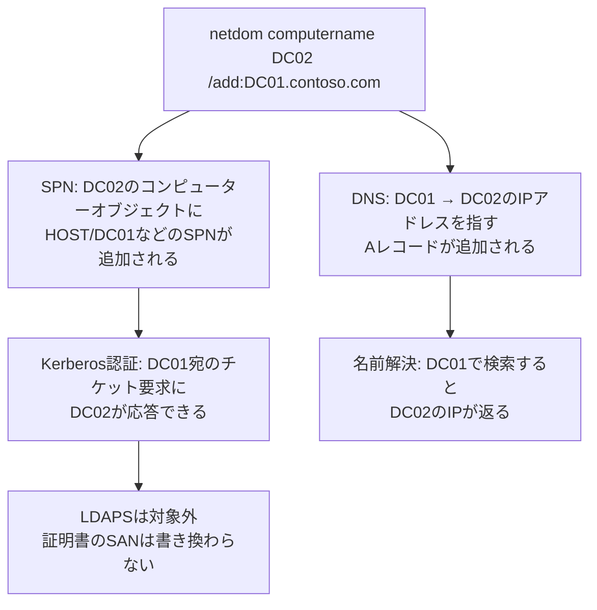

## はじめに

- **この記事で得られること**: [sysdm.cplとnetdom computernameの違い](/articles/ad-computername-netdom-guide)で扱った`/makeprimary`は、新DCの名前を旧DCの名前へ**完全に入れ替える**手順でした。この記事では、それとは別の、実務のDC更改でよく使われる、**「新DCには固有の新しい名前をそのまま使わせ、旧DCの名前は代替名として追加するだけ」という手法**を扱います。この手法が、SPNとDNSをどう書き換えるのかを理解した上で、**なぜLDAPSを使う連携システムだけは、この代替名だけでは足りず、証明書への追加対応が別途必要になるのか**を体系的に理解します。
- **対象読者**: [netdom computernameの`/add`と`/makeprimary`の違い](/articles/ad-computername-netdom-guide)は理解しているものの、「`/makeprimary`せずに`/add`だけで運用し続ける」という選択肢の意味や、証明書を使う連携システムだけが別対応を要する理由を説明できない方を想定しています。
- **読むのにかかる想定時間**: 約17分

この記事は[『上位1%』シリーズ 全記事ガイド](/sitemap)の一部、[Active Directoryシリーズ](/sitemap#シリーズ一覧)の2.1本目です。

## 前提知識

- [sysdm.cplとnetdom computernameは何が違うのか](/articles/ad-computername-netdom-guide): `/add`で代替名を追加する操作と、`/makeprimary`でそれをプライマリへ昇格させる操作が、別々の独立したステップであるという理解が前提になっています。
- [SPN(サービスプリンシパル名)の仕組み](/articles/ad-spn-guide): SPNがKerberos認証において「どの名前で呼ばれたら、どのアカウントとして応答するか」を紐づける識別子であるという理解が前提になっています。

## 全体像をつかむ

[既存記事](/articles/ad-computername-netdom-guide)で扱った「新DCを旧DCの名前へ改名する」手順は、**旧DCを完全に撤去し、名前の重複が存在しない瞬間を作らない**ことを前提とした、丁寧な手順でした。しかし実務では、**新DCには最初から固有の新しい名前(例: `DC02`)を使わせたまま、旧DCの名前(例: `DC01`)を代替名として追加するだけで、改名(`/makeprimary`)は一切行わない**という、もう1つの選択肢がよく使われます。**この手法の利点は単純です。新DCの名前は最初から新DCとして一意であり続けるため、改名に伴うリスクがそもそも存在しません。** その代わり、旧DC名でハードコードされたレガシーシステム・スクリプトは、新DCに追加された代替名を通じて、変更なしにそのまま動作を継続できます。

## 基礎から徹底解説

### 代替名の追加が、SPNとDNSに対して具体的に行うこと

`netdom computername DC02 /add:DC01.contoso.com`を実行すると、2つのことが起こります。1つは、**DC02のコンピューターオブジェクトの`servicePrincipalName`属性に、`HOST/DC01`や`HOST/DC01.contoso.com`といったSPNが追加書き込みされる**ことです。これにより、クライアントが旧DC名`DC01`宛にKerberosチケットを要求してきても、DCはADを検索して「`DC01`というSPNを持つアカウント」としてDC02自身を特定し、正しくチケットを暗号化して応答できます。もう1つは、**DNSサーバーに対して、`DC01`という名前が、DC02の実際のIPアドレスを指すAレコードとして追加される**ことです。これにより、クライアントが`DC01`という名前で名前解決を試みても、返ってくるIPアドレスはDC02自身のものになります。**SPNとDNSの両方が書き換わることで初めて、旧DC名を使ったKerberos認証と名前解決の両方が、新DC(DC02)に対してそのまま成立する**ようになるわけです。

この手法と、既存記事の「完全な改名」は、何が違うのか

**[既存記事](/articles/ad-computername-netdom-guide)の手法は、`/makeprimary`を実行することで、旧DC名を「主たる名前」そのものに昇格させます。** 昇格後は、OS自身が`DC01`という名前を「自分の名前」として認識し、積極的に管理・更新していきます。**一方、この記事で扱う手法は、`/add`だけで止め、`/makeprimary`を一切実行しません。** この場合、DC02の主たる名前は、最後まで`DC02`のままです。`DC01`は、あくまで**SPNとDNSレコードの上でだけ機能する、従属的な別名**にとどまります。どちらを選ぶべきかは、「旧DC名を今後も正式名称として使い続けたいか」、それとも「旧DC名は過去のレガシー資産との互換性のためだけに、裏側で静かに残しておきたいか」という、運用方針の違いによって決まります。

### 代替名の追加だけでは対応できない範囲

代替名の追加がカバーするのは、**AD DS(SPN)とDNS(Aレコード)という、2つの『名前の対応表』だけ**です。このため、次のようなケースは、代替名の追加だけでは解決しません。

- **IPアドレスを直接指定している設定**: 接続先をIPアドレスで直打ちしている設定(IPアドレス自体、NTPサーバーの参照先、DNSサーバーの参照先など)は、そもそも名前解決を経由しないため、代替名の追加とは無関係に、設定値そのものを新DCのIPアドレスへ変更する必要があります。
- **ファイアウォールのルール**: 旧DCのIPアドレスを明示的に許可していたファイアウォールルールは、新DCのIPアドレスを許可するように、別途設定を変更する必要があります。
- **LDAPSを利用している連携システム**: 次節で詳しく扱います。

## プロが見ている視点(上位1%の理解)

### なぜLDAPSだけは、代替名の追加では解決しないのか

**LDAPSは、接続の最初からTLSで暗号化される**([LDAPプロトコルの仕組み](/articles/ad-ldap-protocol-guide)で扱った通り、ポート636)仕組みです。**TLS接続では、クライアントが、相手から提示されたサーバー証明書の`CN`(コモンネーム)または`SAN`(サブジェクト代替名)に、自分が接続しようとしている名前が含まれているかを検証します。** ここが、SPNやDNSとはまったく別の、**3つ目の独立した『名前の対応表』にあたります**。

**`netdom computername`の`/add`は、SPN(AD DS)とDNS(ゾーンデータ)を書き換えますが、証明書そのものには一切手を加えません。** DC02にインストールされているサーバー証明書のSANには、DC02自身の名前しか含まれていないのが通常であり、`DC01`という代替名を追加しても、証明書のSANには`DC01`は自動的に追加されません。この結果、**旧DC名`DC01`でLDAPS接続を試みるクライアントは、名前解決(DNS)とポート到達性(ファイアウォール)までは成功するものの、TLSのハンドシェイクの段階で「証明書のSANに`DC01`が含まれていない」ことを検知し、証明書エラーで接続を拒否します。**

LDAPSを利用する連携システムへの、具体的な対処方法

[AD CS(証明書サービス)でエンタープライズCAを構築するハンズオン](/articles/ad-cs-handson-guide)のような社内PKIを前提に、次の3つの対応が必要になります。

1. **新DC(DC02)に、サーバー証明書をインストールする**: クライアント認証ではなく、サーバー認証用のEKU(拡張キー使用法)を持つ証明書を、DC02に発行・インストールします。
2. **その証明書のSANに、旧DC名(`DC01`)を含める**: 証明書発行時のリクエストで、SANとして`DC02`自身の名前に加えて`DC01`も明示的に指定します。これにより、`DC01`という名前でTLS接続してきたクライアントに対しても、証明書の検証が正しく通るようになります。
3. **連携システム側に、発行元のルートCA証明書を登録する**: 連携システムが、新しく発行された証明書の発行者(社内CA)を信頼していなければ、SANが正しくても証明書チェーンの検証自体が失敗します。連携システム側の信頼されたルート証明機関ストアに、社内CAのルート証明書を登録する必要があります。

**この3点がすべて揃うまでは、代替名の追加だけでLDAPS接続が解決すると考えてはいけません。** LDAPSへの移行を計画に含める場合は、SPN・DNSの代替名追加と並行して、証明書の準備を独立したタスクとして進める必要があります。

## よくある誤解・つまずきポイント

- **誤解1: 「代替名を追加すれば、旧DC名でのアクセス方法はすべて引き継がれる」**
  代替名の追加がカバーするのは、SPN(AD DS)とDNS(Aレコード)という2つの対応表だけです。IPアドレス直打ちの設定、ファイアウォールのルール、そしてLDAPS証明書のSANは、別途個別の対応が必要です。
- **誤解2: 「LDAPがつながるなら、LDAPSも同じように問題なくつながるはずだ」**
  平文のLDAP(389番)は、SPN・DNSが正しければそのまま接続が成立します。しかしLDAPS(636番)は、証明書のSAN検証という、まったく別の層の確認を追加で通過する必要があります。
- **誤解3: 「`/add`だけで運用するのは、`/makeprimary`するより『不完全』な状態だ」**
  `/add`だけで止める運用は、不完全な状態ではなく、旧DC名を正式名称として使い続けないという、明確な運用方針に基づいた正当な選択です。

## 障害・トラブルシューティングの視点

1. **旧DC名でLDAP(389番)は接続できるが、LDAPS(636番)だけ証明書エラーになる**: 新DCにインストールされている証明書のSANに、旧DC名が含まれているかを確認します。
2. **旧DC名でのアクセスは一見成功しているが、一部のシステムだけ接続に失敗する**: その失敗しているシステムが、IPアドレスを直接指定していないか、あるいはLDAPSを使用していないかを確認します。
3. **代替名を追加したはずなのに、旧DC名での名前解決ができない**: DNSサーバー側に、該当するAレコードが実際に作成されているかを`nslookup`や`Resolve-DnsName`で確認します。

## まとめ

- `netdom computername`の`/add`だけを使い`/makeprimary`を行わない運用は、新DCに固有の名前をそのまま使わせつつ、旧DC名を代替名として追加する、改名リスクのない選択肢です。
- 代替名の追加は、SPN(AD DS)へのSPN追加と、DNSへのAレコード追加という、2つの対応表の書き換えによって実現されています。
- IPアドレス直打ちの設定とファイアウォールのルールは、代替名の追加とは無関係に、個別の設定変更が必要です。
- LDAPSは、SPN・DNSとは独立した3つ目の対応表である証明書のSANを検証するため、代替名の追加だけでは解決せず、証明書の発行・SAN追加・ルートCA信頼という3つの追加対応が必要です。

**今日から意識すべきこと**
1. DC更改で代替名を使う場合は、SPN・DNS・証明書という3つの独立した対応表それぞれについて、対応が完了しているかを個別に確認しましょう。
2. LDAPSを使う連携システムがある場合は、代替名の追加作業と並行して、証明書の準備を独立したタスクとして計画に組み込みましょう。

## 参考文献

- [Netdom computername | Microsoft Learn](https://learn.microsoft.com/en-us/windows-server/administration/windows-commands/netdom-computername)
- [Add SAN to secure Lightweight Directory Access Protocol (LDAP) certificate | Microsoft Learn](https://learn.microsoft.com/en-us/troubleshoot/windows-server/certificates-and-public-key-infrastructure-pki/add-san-to-secure-ldap-certificate)
- [Troubleshoot LDAP over SSL connection problems | Microsoft Learn](https://learn.microsoft.com/en-us/troubleshoot/windows-server/active-directory/ldap-over-ssl-connection-issues)
