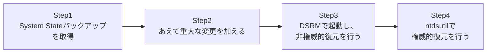

## はじめに

- **この記事で得られること**: [AD ごみ箱(AD Recycle Bin)を有効化したうえでの誤削除からの復旧ハンズオン](/articles/ad-recycle-bin-handson-guide)は、あくまで`tombstoneLifetime`(既定180日)以内、かつAD DS自体は正常に動いている、という前提のもとでの復旧手段でした。この記事では、その前提が崩れた場合、つまりAD DS自体が正常に動いていない、深刻な障害・データ破損に備えるための、**System Stateバックアップ**と、`ntdsutil`を使った**権威的復元**(Authoritative Restore)を、実際に手を動かして体験します。
- **対象読者**: AD ごみ箱の使い方は理解しているが、それでは救えない、もっと深刻な障害への備えを実際に試したことがない方を想定しています。
- **読むのにかかる想定時間**: 約25分(実際に構築しながら進める場合は1時間程度を見込んでください)

この記事は[『上位1%』シリーズ 全記事ガイド](/sitemap)の一部、[Active Directoryシリーズ](/sitemap#シリーズ一覧)の33本目です。

## 前提知識

- [誤って削除したユーザー・OUを復元するAD ごみ箱のハンズオン](/articles/ad-recycle-bin-handson-guide): tombstoneという概念、AD ごみ箱の限界について、この記事の前提になっています。

## 全体像をつかむ

このハンズオンで行うことは、次の4ステップです。



## ハンズオン手順

### Step 1: System Stateバックアップを取得する

Windows Server Backupの機能を使い、DCの`System State`(AD DSのデータベースを含む、OSの構成情報一式)をバックアップします。

```powershell
Install-WindowsFeature Windows-Server-Backup
wbadmin start systemstatebackup -backupTarget:E: -quiet
```

**System Stateバックアップには、AD DSのデータベースファイル(ntds.dit)だけでなく、SYSVOL、レジストリ、証明書ストアなど、DCとして機能するために必要な情報一式が含まれます。** バックアップが完了したら、テスト用に、`TestOU`というOUと、その中にテストユーザーを作成しておきます。

### Step 2: あえて重大な変更を加える

バックアップ取得後の状態を汚すため、`TestOU`を削除します。

```powershell
Remove-ADOrganizationalUnit -Identity "OU=TestOU,DC=example,DC=com" -Recursive -Confirm:$false
```

**ここが重要なポイントです。** AD ごみ箱が有効になっていない環境や、`tombstoneLifetime`をとうに過ぎてしまった状況を想定して、今回はAD ごみ箱を使わずに、Step 1で取得したバックアップからの復元を試みます。

### Step 3: DSRMで起動し、非権威的復元を行う

DCを再起動し、起動時に**DSRM**(ディレクトリサービス復元モード)で起動します。

```powershell
bcdedit /set safeboot dsrepair
Restart-Computer
```

DSRM用の管理者パスワード(DC構築時に設定したもの)でログオンし、バックアップからの復元を実行します。

```powershell
wbadmin start systemstaterecovery -version:<バックアップのバージョン識別子> -quiet
```

**この時点で行われる復元は、「非権威的復元」と呼ばれます。** これは、バックアップ時点の状態にいったん戻すものの、その後DCを通常モードで再起動すると、他の健全なDCから、バックアップ取得後に発生した変更点(レプリケーション)を受け取って、最終的には最新の状態(つまり、`TestOU`が削除された状態)に追いついてしまう、という復元方法です。**単に非権威的復元をしただけでは、削除してしまった`TestOU`は結局復活しません。**

### Step 4: ntdsutilで権威的復元を行う

`TestOU`を実際に復活させるには、復元したオブジェクトに対して、**「このオブジェクトは、他のDCから受け取るどんな変更よりも新しいものとして扱ってほしい」という、明示的なマークを付ける**必要があります。これが`ntdsutil`の役割です。DSRMモードのまま、次のコマンドを実行します。

```
ntdsutil
activate instance ntds
authoritative restore
restore subtree "OU=TestOU,DC=example,DC=com"
quit
quit
```

コマンドを実行すると、対象のオブジェクトと、その配下のオブジェクトの**USN**(更新シーケンス番号)が、他のどのDCが持っている値よりも大きな値に、意図的に書き換えられます。この状態でDCを通常モードで再起動すると、他のDCは、この書き換えられたUSNを「自分が持っている情報より新しい」と判断し、`TestOU`の復活を、レプリケーションを通じて他のすべてのDCへ広めます。

## プロが見ている視点(上位1%の理解)

### USNの書き換えが、なぜ復元の決め手になるのか

AD DSのレプリケーションは、[DCの正常性を確認する『上位1%』の視点](/articles/dc-health-check-guide)や、[サイトの仕組み](/articles/ad-sites-guide)で扱った通り、基本的に「より新しい変更で、より古い変更を上書きする」という、USNベースの仕組みで動いています。非権威的復元だけでは、バックアップ時点のUSNのまま復元されるため、他の健全なDCから見れば「古い情報」でしかなく、結局レプリケーションによって上書きされてしまいます。**権威的復元が行っているのは、まさにこのUSNを意図的に未来の値へ書き換えることで、「これが正しい最新の状態である」と、他のDCに信じ込ませる操作**です。この仕組みを理解していると、なぜ「復元しただけでは戻らない」のか、そしてなぜ`ntdsutil`という特別な手順が必要なのかが、腑に落ちるようになります。

### 「巻き戻し攻撃」への耐性としてのUSN

このUSNベースの仕組みは、裏を返せば、悪意を持って古いバックアップからDCを復元し、意図的に古い状態(たとえば、まだ無効化されていない退職者のアカウントが有効なままの状態)へ「巻き戻す」攻撃に対する防御としても機能します。通常の(権威的でない)復元では、古いUSNのまま復元されたDCは、他の健全なDCとのレプリケーションによって、結局は正しい最新の状態へ引き戻されます。**この「レプリケーションによって正しい状態に引き戻される」という性質こそが、AD DSが単一障害点を持つシステムではなく、複数のDCによる合意形成のうえに成り立っている分散システムであることの、具体的な現れです。**

## よくある誤解・つまずきポイント

- **誤解1: 「バックアップから復元(非権威的復元)しさえすれば、削除したオブジェクトは元に戻る」**
  非権威的復元だけでは、他のDCとのレプリケーションによって、最終的には削除された状態に戻ってしまいます。復元したオブジェクトを実際に定着させるには、権威的復元が必要です。
- **誤解2: 「権威的復元は、フォレスト全体を対象にしないと実行できない」**
  `restore subtree`コマンドを使えば、特定のOU配下だけを対象にした、部分的な権威的復元が可能です。
- **誤解3: 「AD ごみ箱があれば、System Stateバックアップはもう不要である」**
  AD ごみ箱は`tombstoneLifetime`以内かつAD DS自体が正常な場合の復旧手段であり、それを超える深刻な障害には、System Stateバックアップからの復元が必要です。両者は補完関係にあります。

## 障害・トラブルシューティングの視点

1. **DSRMのパスワードを忘れてログオンできない**: 通常モードで起動しているドメイン管理者権限を使い、`ntdsutil`の`set dsrm password`コマンドで、事前にリセットしておく必要があります。
2. **`authoritative restore`実行後も、オブジェクトが復活しない**: 対象のDNパス(識別名)が正確か、そして復元対象のDCが実際にレプリケーションパートナーを持っているか(単独のDCでは検証できない)を確認してください。
3. **バックアップの取得自体に失敗する**: `Windows-Server-Backup`機能が正しくインストールされているか、バックアップ先のディスク容量が十分かを確認してください。

## まとめ

- System Stateバックアップには、AD DSのデータベースを含む、DCとして機能するために必要な情報一式が含まれます。
- 非権威的復元は、バックアップ時点の状態に戻すだけで、その後のレプリケーションで最終的には最新の状態(削除済みなど)に追いつきます。
- 権威的復元は、`ntdsutil`を使ってUSNを意図的に書き換えることで、復元したオブジェクトを他のDCに「正しい最新の状態」として認識させます。
- このUSNベースの仕組みは、悪意ある巻き戻し攻撃への防御としても機能しています。
- AD ごみ箱とSystem Stateバックアップは、対応できる障害の深刻度が異なる、補完関係にある備えです。

**今日から意識すべきこと**
1. AD ごみ箱を有効化していても、System Stateバックアップは別途、定期的に取得する運用を維持しましょう。
2. DSRMのパスワードは、忘れずに定期的にリセット・記録しておきましょう。

## 参考文献

- [Back up and Restore Active Directory Domain Services | Microsoft Learn](https://learn.microsoft.com/en-us/windows-server/identity/ad-ds/manage/ad-forest-recovery-backing-up-ad)
- [ntdsutil | Microsoft Learn](https://learn.microsoft.com/en-us/windows-server/administration/windows-commands/ntdsutil)
