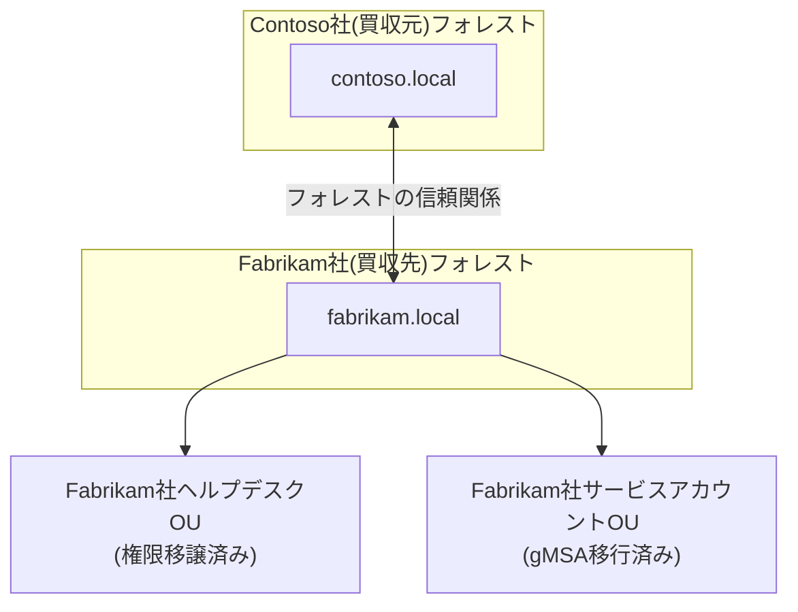

## はじめに

- **この記事で得られること**: ここまでのハンズオンで、1つずつ個別に習得してきた技術(フォレスト間の信頼関係、GPO、権限移譲、gMSA、バックアップ、Kerberoasting/DCSync監査など)を、**1つの架空の企業買収シナリオへ、自分の力で統合する**、ActiveDirectory学科の卒業制作です。これまでの記事が「手順をなぞって、1つの技術を確実に身につける」ことを目的としていたのに対し、この記事は**要件だけを提示し、どの技術を、どう組み合わせるかを、自分で設計する**という、実務そのものに近い形式を取ります。
- **対象読者**: ActiveDirectory学科の3年生・4年生・大学院の内容を一通り終え、個々のハンズオンは実施できるが、それらを組み合わせて1つの環境を設計した経験がない方を想定しています。
- **読むのにかかる想定時間**: 設計・構築・文書化を含めて、数日〜1週間程度を想定しています(1回のハンズオンとしては最も重量級です)。

この記事は[『上位1%』シリーズ 全記事ガイド](/sitemap)の一部です。[ActiveDirectory学科の全カリキュラム](/university#activedirectory学科)の、卒業制作にあたる位置づけです。

## 前提知識

このハンズオンは、新しい技術を教えるものではありません。**以下の、すでに実施済みのハンズオンで習得した技術を、組み合わせて使います。**

- [マルチドメイン・マルチツリーのADフォレストを構築するハンズオン](/articles/ad-multidomain-handson-guide)
- [買収を想定した2つの独立フォレスト間の信頼関係構築ハンズオン](/articles/ad-forest-trust-handson-guide)
- [GPOを実際に作成・リンクし、優先順位とトラブルシューティングを体験するハンズオン](/articles/ad-gpo-handson-guide)
- [OUへの権限移譲(Delegation of Control)でヘルプデスクに権限だけを渡すハンズオン](/articles/ad-delegation-handson-guide)
- [gMSA(グループ管理サービスアカウント)でパスワード管理から解放されるハンズオン](/articles/ad-gmsa-handson-guide)
- [System Stateバックアップと権威的復元(Authoritative Restore)のハンズオン](/articles/ad-backup-restore-handson-guide)
- [Kerberoasting攻撃を自分の手で再現し、サービスアカウントを守るハンズオン](/articles/ad-kerberoasting-handson-guide)
- [DCSyncが悪用する複製権限を監査し、Tier 0管理モデルで守るハンズオン](/articles/ad-dcsync-audit-handson-guide)

## 課題設定:架空の企業買収シナリオ

**あなたは、架空の企業「Contoso社」のインフラエンジニアです。Contoso社は、これも架空の企業である「Fabrikam社」を買収しました。あなたに与えられた課題は、次の要件をすべて満たす、統合されたAD環境を、自分の手で構築することです。**

### 要件1: フォレスト間の信頼関係を構築する

Contoso社とFabrikam社は、当面は別々のフォレストとして運用し続けます。**両社の従業員が、互いのリソースへアクセスできるよう、フォレストの信頼関係を構築してください。**

### 要件2: Fabrikam社側に、統一されたセキュリティポリシーを適用する

Contoso社のセキュリティ基準に合わせ、**Fabrikam社側のユーザーに対して、パスワードポリシーやロック画面設定などを統一するGPOを設計・適用してください。**

### 要件3: Fabrikam社のヘルプデスクチームに、限定された権限だけを移譲する

Fabrikam社には、既存のヘルプデスクチームが残ります。**Domain Adminsの権限を渡すことなく、パスワードリセットなど、ヘルプデスク業務に必要な権限だけを、該当OUに対して移譲してください。**

### 要件4: Fabrikam社のレガシーなサービスアカウントを、gMSAへ移行する

調査の結果、Fabrikam社では、複数のサービスが、人間が管理する固定パスワードのサービスアカウントを使い続けていたことが判明しました。**これらをgMSAへ移行し、パスワード管理の負担と漏洩リスクを解消してください。**

### 要件5: バックアップ体制を確立する

統合作業中の事故に備え、**Fabrikam社側のDCについて、System Stateバックアップの体制を確立し、実際に復元できることを検証してください。**

### 要件6: セキュリティ監査を実施する

統合前のFabrikam社の環境が、Contoso社と同等のセキュリティレベルにあるかを確認するため、**Kerberoasting・DCSyncの観点から、Fabrikam社のAD環境を監査し、発見した問題点と対策を報告してください。**

## 成果物の要件:ポートフォリオとしてまとめる

**このハンズオンの最終的な成果物は、実際に動いた画面のスクリーンショットや、PowerShellの実行結果だけではありません。** GitHubなどのリポジトリに、次の内容を含む形でまとめてください。

- **README.md**: このシナリオの概要、あなたが採用した設計の全体像(mermaidなどの図を含む)
- **設計判断の記録**: 「なぜその設定値・構成を選んだのか」という、判断の理由。特に、複数の選択肢があった箇所(信頼関係の方向、GPOの適用範囲、権限移譲の粒度など)について
- **実施手順**: 実際に実行したコマンド・設定変更の記録(機密情報は必ず除去してください)
- **振り返り**: 実施してみて分かった課題、実際の実務であれば追加で検討すべき点

**この成果物こそが、転職活動やポートフォリオとして提示できる、具体的な実績になります。** 単に「Kerberoastingのハンズオンをやりました」と説明するよりも、「買収統合という現実的な制約の中で、複数の技術を組み合わせて設計し、判断の理由を言語化できる」ことを示せる方が、はるかに説得力があります。

## プロが見ている視点(上位1%の理解)

### 「手順をなぞる力」と「要件から設計する力」は、まったく別のスキルである

これまでのハンズオンは、いずれも「Step 1、Step 2……」という、決められた手順をなぞる形式でした。**しかし、実際の実務で評価されるのは、手順書通りに作業を実行する力ではなく、与えられた要件(この記事でいう「要件1〜6」)から、どの技術を、どの順序で、どう組み合わせるべきかを、自分で設計する力です。** この2つは、似ているようでまったく別のスキルです。個々のハンズオンをすべて完了していても、それらを組み合わせて1つの一貫した環境を設計した経験がなければ、実務での即戦力にはなりません。この卒業制作は、その橋渡しを行うための、意図的な設計になっています。

### なぜ「架空の企業買収」という設定なのか

このハンズオンが、単発の技術デモではなく、あえて「買収統合」という、複数年にわたる現実的なプロジェクトを模した設定にしているのには理由があります。**実務のADプロジェクトの多くは、単一の技術を導入するだけでは完結せず、組織統合・セキュリティ強化・運用引き継ぎといった、複数の目的が同時に絡み合う形で発生します。** フォレスト信頼だけを知っていても、その先にあるGPO統一・権限移譲・セキュリティ監査までを見通せなければ、実際のプロジェクトでは通用しません。この卒業制作を通じて、個々の技術の知識を、**プロジェクト全体を見通す設計力**へと昇華させることが、最終的な狙いです。

## よくある誤解・つまずきポイント

- **誤解1: 「このハンズオンは、決められた1つの正解の手順が存在する」**
  このハンズオンには、唯一の正解はありません。要件を満たす設計であれば、複数の妥当なアプローチが存在します。README.mdに、あなたが選んだ設計とその理由を記録することが重要です。
- **誤解2: 「成果物は、動作した証拠のスクリーンショットだけで十分である」**
  スクリーンショットは重要ですが、それだけでは不十分です。設計判断の理由を言語化できることが、このハンズオンの本当の価値です。
- **誤解3: 「個々のハンズオンをすべて完了していれば、このハンズオンも簡単に終わる」**
  個々の技術を知っていることと、それらを1つの一貫した設計へ統合することの間には、大きな距離があります。多くの時間を要することを想定しておいてください。

## 障害・トラブルシューティングの視点

このハンズオンは、個々の技術的なトラブルシューティングよりも、**設計上の手戻り**が主な課題になります。

1. **要件を満たしているつもりが、後から矛盾に気づく**: 実装を始める前に、README.mdの設計部分だけを先に書き上げ、要件1〜6のすべてを満たせているかを、文章の段階で確認してください。
2. **個々のハンズオンの手順を忘れてしまっている**: 各要件に対応する前提記事のリンクを、遠慮なく読み返してください。この卒業制作は、暗記力ではなく設計力を試すものです。
3. **どこまで作り込めばよいか分からない**: 「転職活動で、初対面の面接官にこのREADME.mdを見せて、設計判断を説明できるか」を、完成度の目安にしてください。

## まとめ

- この卒業制作は、ActiveDirectory学科でこれまで個別に習得した技術を、1つの架空の企業買収シナリオへ統合する、総合演習です。
- 求められているのは、手順をなぞる力ではなく、要件から自分で設計する力です。
- 成果物は、動作の証跡だけでなく、設計判断の理由を言語化した文書として、ポートフォリオにまとめてください。

**今日から意識すべきこと**
1. 個々のハンズオンを学ぶときも、「これは、将来どんな要件の中で使うことになるか」を意識する習慣をつけましょう。
2. 技術的な成果物だけでなく、判断の理由を言語化する習慣を、日々の業務でも意識しましょう。

## 参考文献

- [ActiveDirectory学科の全カリキュラム](/university#activedirectory学科)
