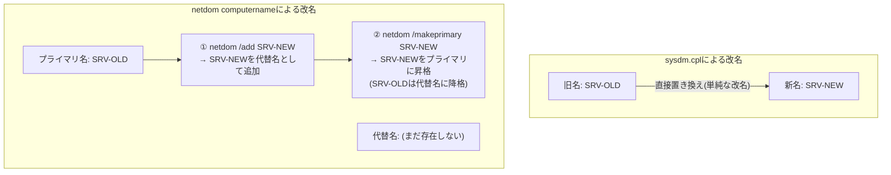

## はじめに

- **この記事で得られること**: Windowsのコンピューター名を変更する2つの手段——システムのプロパティ(`sysdm.cpl`)からの変更と、`netdom computername`コマンドによる変更——が、何をどう違う仕組みで実現しているのかを理解できます。特に、既存のホスト名を引き継ぐ場合に「`/add`でいったん別名として追加してから`/makeprimary`でプライマリに昇格させる」という2段階の操作が必要な理由と、そもそも「プライマリホスト名」とは何を指しているのかを掘り下げます。後半では、これらの知識を使って、実際のAD移行作業で発生した「同一ホスト名のまま2台が存在してしまい、ログオンできなくなった」という実例を診断します。
- **対象読者**: AD移行やドメインコントローラーの入れ替え作業で、コンピューター名の変更・引き継ぎに関わったことがあるものの、`netdom`コマンドの`/add`と`/makeprimary`という2段階操作の意味や、「プライマリホスト名」という言葉が具体的に何を指しているのかを説明できない方を想定しています。
- **読むのにかかる想定時間**: 約18分

この記事は[『上位1%』シリーズ 全記事ガイド](/sitemap)の一部、[Active Directoryシリーズ](/sitemap#シリーズ一覧)の2本目です。1本目の[ADとDC、ドメインとフォレストの違いを『上位1%』の視点で理解する](/articles/ad-dc-fundamentals-guide)を先に読んでおくと、本記事に登場するドメインコントローラー(DC)という用語がスムーズに理解できます。

## 前提知識

- **NetBIOS名とDNSホスト名**: Windowsのコンピューターは、伝統的に15文字までの短い**NetBIOS名**と、`hostname.example.com`のような**DNSホスト名(FQDN)**という、2種類の名前を持ちます。現在では多くの用途でDNSホスト名が主に使われますが、レガシーな互換性のためNetBIOS名も引き続き併存しています。
- **SPN(Service Principal Name)**: Kerberos認証において、「このサービスはこの名前で呼び出されたときに、このアカウントとして応答する」ことを紐づける識別子です。`HOST/コンピューター名`という形式のSPNが、コンピューターアカウントに既定で登録されています。
- **コンピューターアカウント**: ドメインに参加した端末1台ごとに、AD DS上に作成される専用のアカウント(オブジェクト)です。ユーザーアカウントと同様にパスワード(実際にはコンピューター自身が定期的に自動更新するランダムな値)を持ち、これによってドメインとの信頼関係(セキュアチャネル)を確立します。

## 全体像をつかむ

### 一言で言うと

**`sysdm.cpl`によるコンピューター名の変更は、「今の名前を新しい名前へその場で置き換える」単純な改名操作です。一方`netdom computername`は、「1台のコンピューターに複数の名前(プライマリ+代替名)を持たせられる」という、まったく別の仕組みを利用しており、`/makeprimary`はその中のどれを「主たる名前」として扱うかを切り替えているだけ**です。この仕組みの違いを理解しないまま、既存のホスト名を引き継ごうとして`netdom`を使うと、「なぜ`/add`が先に必要なのか」が謎のまま残ります。



## 基礎から徹底解説

### sysdm.cplによる改名:単純な置き換え

コントロールパネルの「システム」→「コンピューター名の変更」(`sysdm.cpl`)から行う改名は、**旧名を新名へその場で置き換える、単純な改名操作**です。内部的には、ドメイン参加済みの端末であれば、AD DS上のコンピューターアカウントのSPN(`HOST/新名`など)やDNSのホストレコード、NetBIOS名を新しい名前に基づいて更新し、再起動によって反映されます。この操作の最中、旧名は一時的にも新名と共存することはなく、**常にどちらか一方の名前だけがそのコンピューターの名前**です。

### netdom computernameによる改名:複数の名前を持たせる仕組み

これに対し`netdom computername`は、そもそも**改名のためのコマンドというより、1台のコンピューターに複数の名前(プライマリ名+0個以上の代替名)を持たせるための管理コマンド**です。主なサブコマンドは次の通りです。

| サブコマンド | 動作 |
|---|---|
| `/enumerate` | 現在登録されているプライマリ名・代替名の一覧を表示する |
| `/add <名前>` | 指定した名前を**代替名**として新規に登録する(この時点ではプライマリ名は変わらない) |
| `/remove <名前>` | 登録済みの代替名を削除する(プライマリ名は削除できない) |
| `/makeprimary <名前>` | **既に登録済みの**名前(代替名)を、新しいプライマリ名に昇格させる(実行には再起動が必要) |

複数の名前を持たせられると何が嬉しいのか。典型的な用途は、**サーバーの統合や入れ替えにおいて、古い名前で呼び出しているクライアント・アプリケーション・スクリプトを壊さずに、新しいサーバーに移行する**ことです。たとえば複数台のファイルサーバーを1台に統合する際、統合後のサーバーに旧サーバー全台分の名前を代替名として登録しておけば、`\\旧サーバー名A\共有`という形でハードコードされたパスも、`\\旧サーバー名B\共有`という形のパスも、両方とも新しい1台のサーバーがそのまま応答できます。

### なぜ`/add`してから`/makeprimary`という2段階が必要なのか

ここで本題です。既存のホスト名(例: `SRV-OLD`)を新しいサーバーに引き継がせたい場合、いきなり`netdom computername SRV-NEW /makeprimary:SRV-OLD`のように**まだ登録されていない名前を直接プライマリに指定することはできません**。**プライマリに昇格できるのは、あらかじめ`/add`で代替名として登録済みの名前だけ**、という制約があるためです。

この制約には合理的な理由があります。`/makeprimary`は、単に表示上の名前を切り替えるだけでなく、**その名前に対応するSPN・DNSレコードの登録内容を、実際にプライマリとして機能する状態まで引き上げる**操作です。もし任意の未登録の名前をいきなりプライマリに指定できてしまうと、そのSPN登録やDNS登録が事前に整合性のある形で用意されているかを検証しないまま、認証の要となる名前を切り替えることになり、Kerberos認証やDNS解決が一時的に破綻するリスクがあります。**「まず代替名として安全に追加し、登録が完了した状態を確認してから、プライマリへ昇格する」**という2段階を踏ませることで、この整合性を担保しているわけです。

<details>
<summary>2段階操作の具体的なコマンド例</summary>

```powershell
# 現在の名前(プライマリ・代替名)を確認する
netdom computername SRV-OLD /enumerate

# SRV-NEWという名前を代替名として追加する
netdom computername SRV-OLD /add:SRV-NEW

# SRV-NEWをプライマリ名に昇格させる(この時点でSRV-OLDは代替名に降格する)
netdom computername SRV-OLD /makeprimary:SRV-NEW

# 反映には再起動が必要
shutdown /r /t 0
```

昇格後、旧名`SRV-OLD`は自動的に削除されるわけではなく、**代替名として引き続き有効**です。旧名での参照も残したくない場合は、別途`/remove:SRV-OLD`で明示的に削除する必要があります。

</details>

### 「プライマリホスト名」とは結局何なのか

ここまでの説明から、プライマリホスト名の正体を一言でまとめると、**そのコンピューターに複数の名前が登録されているとき、既定のSPN(`HOST/<プライマリ名>`など)の生成元になり、DNSの正引きレコード(Aレコード)を能動的に登録・更新する対象になり、かつ`hostname`コマンドや`sysdm.cpl`の表示上の「コンピューター名」として表示される、"主たる"名前**です。代替名もSPN・DNSレコードとしては機能しますが、OS自身が「自分の名前」として認識し積極的に管理・更新していくのは、あくまでプライマリ名だけです。

## プロが見ている視点(上位1%の理解)

### 実例:AD移行後にホスト名が重複し、ログオンできなくなった事故

ここまでの知識を踏まえて、実際のAD移行作業で起きた次のトラブルを診断してみます。

> DC①からDC②へFSMOなどの移行を終えたあと、DC①をクライアント端末としてドメインへ参加させた。サインアウトし、作成したドメインアカウントでログインしようとしたところ、「現在、ログオン要求を処理できるログオンサーバーはありません」というエラーが表示された。DC①のDNS設定ではDC②のIPアドレスを正しく指定しているのに、なぜログインできないのか。DC①にローカルアカウントでログインして確認したところ、サーバーのホスト名がDC②と同じになっていた。なぜ同じホスト名のままドメインへ参加できてしまったのか。ホスト名を変更したうえで一度ワークグループへ戻し、再度ドメイン参加したところ、問題なくログインできるようになった。

このトラブルの筋道は、次のように整理できます。

1. **DC②が、移行の過程で意図的に旧DC①の名前を引き継いでいた可能性が高い**。AD移行の定石の1つに、新DCを一旦別名(仮の名前)で構築してFSMOを移行し、旧DCを正式に降格・撤去したあとで、新DCの名前を旧DCの名前へ変更するという手順があります。これは、社内のアプリケーションやスクリプトが旧DCの名前をハードコードしている場合に、名前の変更なしにそのまま新DCへ接続を継続させるための、実務上よくある配慮です。前述の`netdom computername`(あるいは`sysdm.cpl`)による改名は、まさにこの場面で使われます。
2. **一方、降格されたDC①自体のOS上のコンピューター名は、降格処理(demote)だけでは自動的には変更されません**。降格はあくまで「DCとしての役割を外す」操作であり、コンピューター名の変更は別の独立した操作です。この結果、DC①は、DC②が(旧DC①の名前を引き継ぐ形で)改名されたあとの名前と、**まったく同じコンピューター名を、別の実体として持ったまま**になっていました。
3. **この状態でDC①をドメインへ参加させようとすると、Windowsのドメイン参加処理は「同名のコンピューターアカウントが既にAD DS上に存在する」ことを検知します**。多くの場合、ドメイン参加のダイアログは「同名のアカウントが既に存在します。このアカウントを再利用しますか」という趣旨の確認を出し、ここで許可すると、**既存の同名コンピューターアカウント(この場合は、DC②自身が使っているドメインコントローラーのコンピューターアカウント)のパスワード(セキュアチャネルの共有シークレット)が、参加してきたDC①側の新しい値でリセット・上書きされてしまいます**。これが「同じホスト名のままドメイン参加できてしまった」ことの正体です——エラーとして弾かれるどころか、既存アカウントの"乗っ取り"という形で、参加処理自体は成立してしまいます。
4. **DC②自身のコンピューターアカウントのパスワードが書き換えられてしまった結果、DC②は自分自身の認証情報とAD DS上の記録が食い違った状態になり、正常にセキュアチャネルを維持できなくなります**。ドメインコントローラーとしての認証・ログオン処理(Netlogonサービス)そのものが不安定になり、新規に作成したドメインアカウントでのログオンが「ログオン要求を処理できるログオンサーバーがありません」というエラーで失敗する、という症状が現れます。DNS設定でDC②のIPアドレスを正しく指しているにもかかわらずログインできなかったのは、DNSによる名前解決の問題ではなく、**この認証基盤そのものの破損が原因**だったことになります。
5. 対処として実施された「ホスト名を変更し、一度ワークグループへ戻して、再度ドメイン参加する」という手順は、この診断と正確に整合します。DC①のホスト名を変更することで名前の重複が解消され、ワークグループへ戻すことで壊れかけていた古いドメイン参加状態をいったん完全に破棄し、新しい名前で再度ドメイン参加することで、DC②のコンピューターアカウントとは別の、まったく新しいコンピューターアカウントが作成されます。これにより、DC②自身のコンピューターアカウントには一切手を触れずに済み、正常にログオンできる状態に復旧しました。

<details>
<summary>そもそもドメイン参加時に「同名アカウントの再利用」を許可すべきかどうか</summary>

ドメイン参加時に表示される「同名のコンピューターアカウントが既に存在します。再利用しますか」という確認は、意図的な再構築(同じ端末をいったんドメインから外し、コンピューターアカウントだけAD側にリセットせず残したまま入れ直す場合など)であれば正当な操作です。しかし、**再利用しようとしている既存アカウントが、本当に自分がこれから参加させようとしている端末自身のものなのかを必ず確認すべき**です。今回の事故のように、既存アカウントの持ち主が実は別の(しかも稼働中の)ドメインコントローラー自身だった場合、再利用の許可はそのままアカウントの乗っ取りに直結します。実務では、確認ダイアログが出た時点で一度立ち止まり、Active Directoryユーザーとコンピューターやドメインコントローラーの一覧を確認して、その名前が本当に別の稼働中のサーバーに使われていないかを必ず確認する習慣が重要です。

</details>

### 新DCへの名前の引き継ぎは、実務でどう計画すべきか

前述の事故の根本原因は、「新DCが旧DCの名前を引き継ぐ」という設計判断自体ではなく、**旧DCを別用途に転用する際に、その旧DCのコンピューター名を新しい一意な名前へ変更する手順が計画から漏れていたこと**にあります。実務でDCの名前を引き継ぐ移行を計画する場合、次の順序を徹底することが重要です。

1. 新DCを一時的な名前で構築し、昇格・FSMO移行・レプリケーション正常性の確認まで完了させる
2. 旧DCを正式な手順で降格し、AD DSから完全に除去する(降格後の確認方法は後続記事で扱います)
3. **旧DCとして使っていた端末そのものを再利用する場合は、真っ先にその端末のコンピューター名を、今後使う一意な新しい名前へ変更する**(この時点ではまだドメインに参加させない、あるいはワークグループに戻しておく)
4. 新DCの名前を、旧DCが持っていた名前へ変更する(`netdom computername`または`sysdm.cpl`)
5. 手順3で改名済みの端末を、あらためて新しい名前でドメインへ参加させる

この順序であれば、名前の重複が発生する瞬間自体が存在しないため、前述のようなコンピューターアカウントの乗っ取り事故は構造的に起こり得ません。

## よくある誤解・つまずきポイント

- **誤解1: 「netdom computernameは、sysdm.cplより高機能な改名コマンドに過ぎない」**
  netdomは単なる改名コマンドではなく、1台のコンピューターに複数の名前を持たせるための管理コマンドです。`/makeprimary`は改名というより「どの名前を主とするかの切り替え」であり、この仕組みの違いが`/add`が先に必要な理由に直結しています。
- **誤解2: 「ドメイン参加が成功した=そのコンピューター名は安全に使える一意な名前だった」**
  ドメイン参加は、既存の同名アカウントがあれば「再利用」という形で成功してしまうことがあります。参加が成功したことは、名前が本当に一意であったことを保証しません。
- **誤解3: 「DCを降格すれば、コンピューター名も含めて元の状態に自動的に戻る」**
  降格はDCとしての役割を外すだけの操作であり、コンピューター名やIPアドレスなど、他の設定はそのまま引き継がれます。他用途に転用する場合は、必要な設定変更を別途明示的に行う必要があります。

## 障害・トラブルシューティングの視点

コンピューター名がらみのAD障害は、**「AD DS上のコンピューターアカウントと、実際にその名前を名乗っている端末が、本当に1対1で対応しているか」**を疑うのが基本です。

1. **特定のドメインコントローラーで急にNetlogon関連のエラーが多発する、セキュアチャネルが切れる**: そのDC自身のコンピューターアカウントのパスワードが、意図せず変更・リセットされていないかを疑います。`Test-ComputerSecureChannel`(該当コンピューター上で実行)で、セキュアチャネルの状態を確認できます。
2. **ドメイン参加時に「同名アカウントが既に存在する」という確認が表示された**: 安易に許可せず、その名前が現在稼働中の別サーバー(特にドメインコントローラー)で使われていないかを、Active Directoryユーザーとコンピューターやドメインコントローラーの一覧で必ず確認します。
3. **DCの名前を新しいサーバーに引き継いだ後、旧サーバー(降格済み)を別用途で使い始めたところ問題が起きた**: 旧サーバーのコンピューター名が、新しい名前に確実に変更されているか(重複していないか)を確認します。

### 予防策・恒久対策

- DCの名前を新しいサーバーへ引き継ぐ移行では、必ず「旧サーバーの改名 → 新サーバーへの改名 → 旧サーバーの(必要であれば)再参加」という順序を徹底し、名前が重複する瞬間を作らない。
- ドメイン参加時に「同名アカウントの再利用」の確認が出た場合は、必ず一度作業を止めて、その名前の本当の持ち主を確認する。
- DCを降格して別用途に転用する場合は、降格作業のチェックリストに「コンピューター名の変更」を明示的な1項目として含めておく。

## まとめ

- `sysdm.cpl`によるコンピューター名の変更は単純な置き換えですが、`netdom computername`は1台に複数の名前(プライマリ+代替名)を持たせる仕組みを使っており、`/makeprimary`は既に登録済みの代替名をプライマリへ昇格させる操作です。
- 未登録の名前をいきなりプライマリに指定できないのは、SPN・DNS登録の整合性を事前に確保してから主たる名前として機能させるための安全策です。
- 「プライマリホスト名」とは、既定のSPNの生成元となり、DNSレコードを能動的に登録・更新する対象となる、OSが「自分の名前」として管理する主たる名前を指します。
- DCの降格はコンピューター名を自動的に変更しないため、旧DCを別用途に転用する際に改名を忘れると、新DCとの名前重複によるコンピューターアカウントの乗っ取り事故につながりえます。

**今日から意識すべきこと**
1. DCの名前を新しいサーバーに引き継ぐ移行を計画するときは、必ず「旧サーバーの改名が先、新サーバーの改名は後」という順序を徹底しましょう。
2. ドメイン参加時に「同名アカウントが既に存在する」という確認が出たら、反射的に許可せず、その名前の本当の持ち主を必ず確認しましょう。

## 参考文献

- [Netdom computername | Microsoft Learn](https://learn.microsoft.com/en-us/windows-server/administration/windows-commands/netdom-computername)
- [Service Principal Names (SPNs) | Microsoft Learn](https://learn.microsoft.com/en-us/windows-server/security/kerberos/service-principal-names)
- [How the Secure Channel Works | Microsoft Learn](https://learn.microsoft.com/en-us/previous-versions/windows/it-pro/windows-2000-server/bb742499(v=technet.10))
- [Rename a domain controller | Microsoft Learn](https://learn.microsoft.com/en-us/troubleshoot/windows-server/identity/rename-domain-controller)
