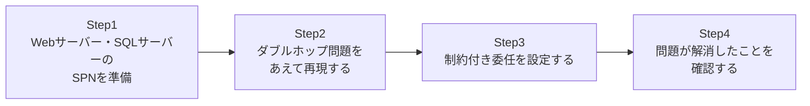

## はじめに

- **この記事で得られること**: 「Webアプリにログインしたユーザーの権限のまま、裏側のSQLサーバーにアクセスしようとすると、なぜか認証が失敗する」という、実務で非常によくある**ダブルホップ問題**を、実際に自分の手で再現し、その原因を体感します。そのうえで、**Kerberos制約付き委任**(Constrained Delegation)を使ってこの問題を解決し、なぜこの方法が安全とされているのかまでを理解します。
- **対象読者**: [Kerberos認証の仕組みを『上位1%』の視点で理解する](/articles/ad-kerberos-guide)は読んだが、「委任」が実際にどう設定され、どう動くのかを見たことがない方を想定しています。
- **読むのにかかる想定時間**: 約25分(実際に構築しながら進める場合は1時間程度を見込んでください)

この記事は[『上位1%』シリーズ 全記事ガイド](/sitemap)の一部、[Active Directoryシリーズ](/sitemap#シリーズ一覧)の32本目です。

## 前提知識

- [Kerberos認証の仕組みを『上位1%』の視点で理解する](/articles/ad-kerberos-guide): TGTとサービスチケットの違いについて、この記事の前提になっています。
- [SPN(サービスプリンシパル名)の仕組みを『上位1%』の視点で理解する](/articles/ad-spn-guide): SPNがサービスを実行しているアカウントに登録される、という理解が前提になっています。

## 全体像をつかむ

このハンズオンで行うことは、次の4ステップです。



## ハンズオン手順

### Step 1: Webサーバー・SQLサーバーの前提を整える

`WebSrv`というサーバー上でIISが、`SqlSrv`というサーバー上でSQL Serverが動いている環境を想定します(IISのサービスアカウントは、ドメインアカウント`svc-web`で動作しているものとします)。まず、SQL ServerのSPNが、そのサービスを実行しているアカウントに正しく登録されていることを確認します。

```powershell
setspn -L svc-sql
```

`MSSQLSvc/SqlSrv.example.com:1433`のようなSPNが表示されていれば準備完了です。

### Step 2: ダブルホップ問題をあえて再現する

`WebSrv`上のIISで、Windows認証を有効にしたWebアプリケーションを構築し、ユーザー`taro`がブラウザからログインしたとします。このWebアプリケーションのコード内から、`taro`自身の権限でSQL Serverへ接続しようとすると、次のようなエラーに直面します。

```
ログイン失敗しました。ユーザー 'NT AUTHORITY\ANONYMOUS LOGON' はログインできませんでした。
```

**これが、いわゆる「ダブルホップ問題」です。** クライアント(ブラウザ)からWebサーバーへの1回目のホップでは、`taro`のKerberos認証情報が正しく渡されます。しかし、Webサーバーから、その裏にあるSQLサーバーへの2回目のホップで、`taro`の認証情報を「転送」してよいという明示的な許可がない限り、Webサーバーは`taro`になりすましてSQLサーバーへアクセスすることができません。**Kerberosは、既定では、一度受け取った身元情報を勝手に他のサーバーへ転送しない、という安全な設計になっている**ため、これは意図した通りの、正しい拒否です。

### Step 3: 制約付き委任を設定する

この問題を解決するには、「`WebSrv`(正確には、`WebSrv`上で動いている`svc-web`というサービスアカウント)が、`taro`の代わりに、`SqlSrv`のSQL Serviceへアクセスすることを許可する」という設定を、AD DS側に明示的に登録する必要があります。

```powershell
Set-ADUser -Identity "svc-web" -Add @{"msDS-AllowedToDelegateTo" = @("MSSQLSvc/SqlSrv.example.com:1433")}
Set-ADAccountControl -Identity "svc-web" -TrustedToAuthForDelegation $true
```

**ここで一番重要なポイントは、`msDS-AllowedToDelegateTo`という属性に、委任してよい先のSPNを、明示的に1つずつ列挙している点です。** `svc-web`は、ここに列挙されたSQL Serviceに対してだけ、`taro`になりすますことを許可されます。それ以外の任意のサービスへ、勝手になりすませるわけではありません。これが「制約付き」委任と呼ばれる理由です。

### Step 4: 問題が解消したことを確認する

Webアプリケーションから、再度`taro`の権限でSQL Serverへの接続を試みてください。今度は、`ANONYMOUS LOGON`ではなく、**`taro`自身の権限でSQL Serverにログインできる**ことを確認できます。SQL Server側の監査ログを見ても、接続してきたユーザーが`svc-web`ではなく、`taro`本人として記録されているはずです。

## プロが見ている視点(上位1%の理解)

### なぜCredSSPやNTLMでは、この問題の適切な解決にならないのか

ダブルホップ問題を検索すると、CredSSP(資格情報のセキュリティサポートプロバイダー)や、RDPでの委任を使う解決策も見かけることがあります。しかしCredSSPは、ユーザーのパスワードそのものに近い情報を中継サーバー上に一時的に保持する仕組みであり、Kerberos制約付き委任と比べて、中継サーバーが攻撃された場合の被害が大きくなりがちです。**Kerberos制約付き委任が優れているのは、パスワードという生の機微情報を一切中継せず、KDCが発行するチケットの受け渡しだけで完結する点です。** また、NTLM認証はそもそも委任の概念自体をサポートしていないため、ダブルホップ問題が発生する構成でNTLMを使っている場合は、そもそもKerberos認証が使われるように構成を見直すことが第一歩になります。

### 制約付き委任と、より新しいリソースベースの制約付き委任の違い

今回設定した方式は、**委任元(`svc-web`)側に「どこへ委任してよいか」を登録する**、伝統的な制約付き委任です。これとは別に、Windows Server 2012以降では、**リソースベースの制約付き委任**という、逆の発想の方式も使えるようになっています。これは、委任先(SQLサーバー側)に「どのアカウントからの委任を受け入れるか」を登録する方式で、委任元のドメイン管理者権限がなくても、委任先の管理者だけで設定を完結できる、フォレストをまたいだ委任にも対応しやすい、という利点があります。実務でどちらを選ぶかは、委任元と委任先の管理者が同じ人物・チームかどうかで決まることが多い、ということも覚えておいてください。

## よくある誤解・つまずきポイント

- **誤解1: 「委任を許可すれば、そのサービスアカウントはドメイン内のどのサービスにでもなりすませるようになる」**
  制約付き委任では、`msDS-AllowedToDelegateTo`に明示的に列挙されたサービスに対してだけ、なりすましが許可されます。
- **誤解2: 「ダブルホップ問題は、Kerberosの設定ミスやバグである」**
  これは意図した通りの安全な設計であり、バグではありません。委任を明示的に許可しない限り拒否される、というのがKerberosの正しい挙動です。
- **誤解3: 「NTLM認証でも、設定さえすれば委任ができる」**
  NTLM認証はそもそも委任の概念をサポートしていません。委任が必要な構成では、Kerberos認証が実際に使われているかを確認する必要があります。

## 障害・トラブルシューティングの視点

1. **委任を設定したのに、まだ`ANONYMOUS LOGON`エラーが出る**: `msDS-AllowedToDelegateTo`に登録したSPNの文字列が、SQL Server側に実際に登録されているSPNと完全に一致しているかを確認してください。
2. **委任を設定したのに、そもそもKerberos認証が使われていない(NTLMにフォールバックしている)**: IIS側でWindows認証のプロバイダー設定を確認し、Kerberosが有効になっているか、SPNが正しく登録されているかを再確認してください。
3. **`Set-ADAccountControl`で`TrustedToAuthForDelegation`を有効にできない**: このアカウントに対する十分な権限があるか、そしてドメイン機能レベルが制約付き委任をサポートしているかを確認してください。

## まとめ

- ダブルホップ問題は、クライアントからWebサーバーへの1回目のホップは成功するが、Webサーバーから裏側のサーバーへの2回目のホップで、認証情報が転送されないために発生します。
- これはKerberosの意図した安全な設計であり、バグではありません。
- Kerberos制約付き委任を使うと、明示的に許可したサービスへの委任だけを、安全に実現できます。
- CredSSPと比べて、Kerberos制約付き委任はパスワードなどの機微情報を中継しないという利点があります。
- NTLM認証は委任の概念自体をサポートしていません。

**今日から意識すべきこと**
1. 「ANONYMOUS LOGON」のようなエラーに遭遇したら、まずダブルホップ問題を疑いましょう。
2. 委任を設定するときは、`msDS-AllowedToDelegateTo`に必要なサービスだけを列挙し、委任先を必要最小限に絞りましょう。

## 参考文献

- [Kerberos Constrained Delegation Overview | Microsoft Learn](https://learn.microsoft.com/en-us/windows-server/security/kerberos/kerberos-constrained-delegation-overview)
- [Understanding Kerberos Double Hop | Microsoft Learn](https://learn.microsoft.com/en-us/troubleshoot/windows-server/identity/new-kerberos-double-hop-solution)
