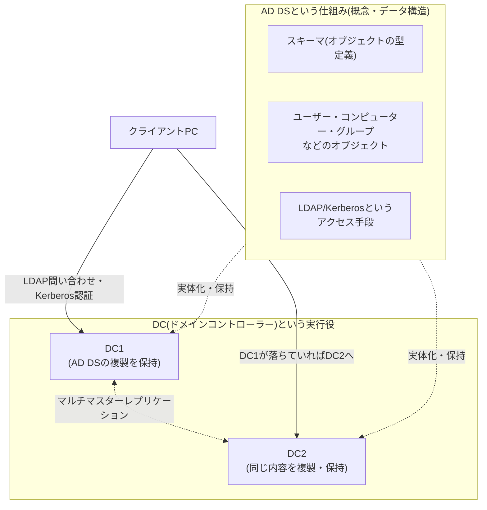
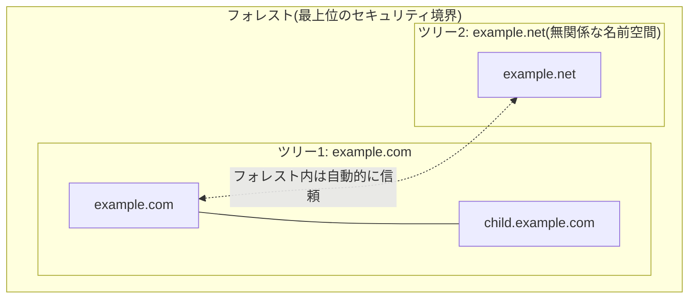
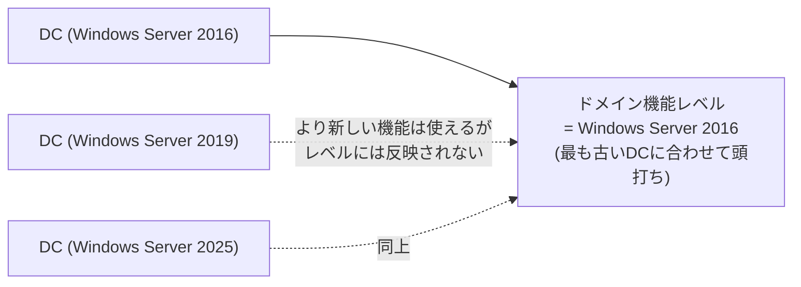

## はじめに

- **この記事で得られること**: 「ADとDCの違いが日本語の説明だとどうもしっくりこない」という素朴な疑問を出発点に、Active Directory Domain Services(AD DS)という**仕組み**と、ドメインコントローラー(DC)という**それを実行するサーバー**の役割分担、ドメイン・ツリー・フォレストという3段階の境界線がそれぞれ何を隔てているのか、機能レベルが何を制約しているのか、そしてサーバーマネージャーでAD DSの役割を追加すると一緒にインストールされる項目が何を意味しているのかまで、体系的に理解できます。
- **対象読者**: AD移行案件やドメインコントローラーの構築・運用に携わっているものの、「なんとなく手順通りにやればできる」状態から一歩進み、ADとDCという基本用語、フォレスト・ドメインという設計の単位を自分の言葉で説明できるようになりたい方を想定しています。
- **読むのにかかる想定時間**: 約20分

この記事は[『上位1%』シリーズ 全記事ガイド](/sitemap)の一部です。Active Directoryをテーマにした新シリーズの1本目にあたり、以降DNS・FSMO・DC正常性確認・移行後のクリーンアップなど、AD移行の実務で必ず直面するテーマを深掘りする記事を追加していく予定です。

## 前提知識

- **ディレクトリサービス**: ユーザー・コンピューター・グループといった「組織のヒト・モノ」に関する情報を、階層構造を持つデータベースとして一元管理し、検索・認証に使えるようにする仕組みです。電話帳(ディレクトリ)が氏名から電話番号を引けるのと同じ発想で、AD DSは「ユーザー名からそのユーザーの属性(所属グループ、パスワードハッシュ、有効期限など)」を引けるようにしています。
- **LDAP(Lightweight Directory Access Protocol)**: ディレクトリサービスに対して検索・追加・変更・削除を行うための標準プロトコルです。AD DSはこのLDAPで問い合わせを受け付けます。
- **ドメインとワークグループ**: ワークグループは各PCが自分自身のローカルなユーザーアカウント情報だけを持つ、管理者不在の対等な集まりです。ドメインでは、認証情報を1か所(AD DS)に集約し、参加している全PCがそこへ問い合わせる形になります。
- **Kerberos認証**: ADドメインにおける既定の認証プロトコルです。本記事ではAD DSの構造そのものに焦点を当てるため、認証プロトコルの内部動作には立ち入りません。裏側の仕組みは[Kerberos認証の仕組みを『上位1%』の視点で理解する](/articles/ad-kerberos-guide)で徹底的に扱います。

## 全体像をつかむ

### 一言で言うと

**AD DS(Active Directory Domain Services)は「組織のユーザー・コンピューター・グループなどの情報を一元管理する、階層構造を持つデータベースと、それに対する問い合わせ・認証の仕組み」そのものであり、DC(ドメインコントローラー)は「そのAD DSを実際に動かし、複製を保持し、問い合わせや認証要求に応答するサーバー」です。** 前者は仕組み・データ構造・プロトコルの集合、後者はそれを実行する物理的あるいは仮想的なサーバーという役者、という関係にあります。

「AD」という言葉が指すものが文脈によってAD DS(仕組み)を指したりDC(サーバー)を指したりして曖昧になるのが、この用語の分かりにくさの正体です。以降、本記事では明確に区別して「AD DS」「DC」と書き分けます。

## 基礎から徹底解説

### AD DS(Active Directory Domain Services)とは何か

AD DSは、X.500というディレクトリサービスの国際標準をベースに、Microsoftが実装したディレクトリサービスです。実体は、**スキーマ**(ユーザー・コンピューター・グループなど、格納できるオブジェクトの型とその属性を定義したルールブック)に従って構造化された、**階層構造を持つデータベース**であり、外部からはLDAPプロトコルで検索・更新でき、認証にはKerberos(および互換性のためのNTLM)を使います。

スキーマを具体例で理解する

スキーマは「オブジェクトの型」と「属性」の2階層で構成される定義集です。たとえば`user`(ユーザー)というオブジェクトの型(クラス)には、`sAMAccountName`(ログオン名)・`mail`(メールアドレス)・`memberOf`(所属グループ)といった属性が定義されており、実際にADユーザーとコンピューターで新規ユーザーを作成する操作は、内部的には「`user`クラスに従ったオブジェクトを1つ生成し、入力した値をそれぞれの属性へ書き込む」という処理に相当します。スキーマがあることで、AD DSは「この型のオブジェクトはこの属性を持てる/持てない」「この属性は必須か任意か」をデータベース側で一貫して検証でき、あるDCで作成したオブジェクトを別のDCが複製しても、同じルールで解釈できることが保証されます。

このデータベースの中身は、大きく3つの**パーティション**(命名コンテキスト)に分かれています。

| パーティション | 保持する内容 | 複製範囲 |
|---|---|---|
| ドメインパーティション | そのドメインに属するユーザー・コンピューター・グループなどのオブジェクト | 同一ドメイン内のDC間のみ |
| 設定パーティション | **サイト**(帯域の細い回線で区切られた拠点などを表す、物理ネットワーク構成上のグループ分け)の構成や、そのサイト間でどうレプリケーションを行うかというレプリケーショントポロジなど、フォレスト全体の構成情報 | フォレスト内の全DC間 |
| スキーマパーティション | オブジェクトの型定義そのもの | フォレスト内の全DC間 |

この「ドメインパーティションだけはドメイン内に閉じ、設定とスキーマはフォレスト全体で共有される」という分け方が、後述するドメイン・フォレストという境界線の意味を理解する鍵になります。

AD DSをインストールするのに、SQL ServerのようなDBサーバーは別途必要ないのか

結論として不要です。**AD DS自体が、専用の組み込みデータベースエンジン(ESE/JET、拡張可能ストレージエンジン)を内蔵しており、AD DSをインストールした時点でこのデータベースも一緒にセットアップされます**。実体は各DCのローカルディスク上にある`NTDS.dit`というファイルで、追加のDBサーバー製品(SQL Serverなど)のインストールや、別サーバーへの接続設定は一切不要です。

これは、業務アプリケーション(ApexOneなど)がMicrosoft SQL Serverを別途要求するのとは事情が異なります。業務アプリケーションは「アプリケーション本体」と「データを保存するDB」が別製品として設計されており、DB部分を自分では持たないため、SQL ServerのようなRDBMS製品を別途用意する必要があります。一方AD DSは「ディレクトリサービス専用に最適化された、読み取りが極めて多く書き込みが少ないワークロード」を前提に設計されており、汎用的なリレーショナルデータベースであるSQL Serverとは異なる、階層構造(LDAPの名前空間)に最適化された専用のデータベースエンジンを最初から内包する製品として提供されています。

### DC(ドメインコントローラー)とは何か

DCは、上記のAD DSデータベースの複製を実際に保持し、クライアントからのLDAP問い合わせやKerberos認証要求に応答する、Windows Serverのロール(役割)です。1つのドメインに複数のDCを置くのが一般的で、各DCは**マルチマスターレプリケーション**という方式で互いに変更内容を複製し合います。これは「マスター1台が更新を一手に引き受け、他は読み取り専用の複製を配る」という単純な主従関係ではなく、**どのDCで行った変更も、他のすべてのDCへ伝播していく**という設計です(ただし、後続記事で扱うFSMOという例外的に単一のDCだけが担う一部の操作は除きます)。

RODC(読み取り専用ドメインコントローラー)という例外

DCには、通常の(書き込み可能な)DCのほかに、**RODC**(Read-Only Domain Controller)という種類もあります。RODCはAD DSデータベースの読み取り専用の複製だけを保持し、パスワードハッシュも既定では一切キャッシュしません(管理者が許可したアカウントのみキャッシュ対象にできます)。物理的なセキュリティを確保しにくい拠点(支店など)に設置し、万が一そのDCが盗難・侵害されても書き込み権限や全アカウントのパスワードハッシュを奪われないようにする、という用途で使われます。

実務でRODCが選ばれる典型的な現場は、**本社と細い回線でしかつながっていない支店・工場・小売店舗**です。こうした拠点は物理的な施錠管理が本社ほど厳重ではないことが多く、サーバーラックへの不正アクセスやサーバー自体の盗難リスクが相対的に高い一方、拠点内での認証・名前解決の速度を確保するためにローカルにDCを置きたいという要求もあります。RODCであれば、万が一盗まれても書き込み可能なAD DSデータベースやフォレスト全体のパスワードハッシュが漏れることはなく、被害をその拠点で普段からログオンしていたユーザーのパスワードハッシュ程度に限定できます。また海外拠点など、本社との回線品質が不安定でレプリケーションの遅延・競合が起きやすい環境でも、RODCは書き込みを一切受け付けないため、複雑な複製の競合解決を考える必要がないという運用上の利点もあります。本記事以降の解説では、特に断りがない限り通常の書き込み可能なDCを前提とします。

DCという「サーバー」と、AD DSという「仕組み」の関係を整理すると、次のようになります。

- AD DSは、DCが1台もなければ存在しえない(データを保持する実体がないため)
- 逆に、DCという役割(サーバー)は、AD DSという仕組みを動かすためだけに存在する専用のサーバーロールである
- したがって「ADサーバー」という表現は、正確には「AD DSの役割を持つDC」を指す口語的な省略であり、AD DSそのものとDCという役割を持つサーバーは、概念としては明確に別物

### ドメイン:認証とポリシーの境界

**ドメイン**は、AD DSにおける最小の管理単位で、次のようなものを共有・独立させる境界線です。

- 共通のドメインパーティション(前述の通り、そのドメインのオブジェクトだけを保持し、他ドメインへは複製されない)
- 既定のパスワードポリシー・アカウントロックアウトポリシー(ドメイン単位で1つ。ただし「きめ細かいパスワードポリシー」を使えば、グループ・ユーザー単位で例外を設定できます)
- Kerberosの「realm(領域)」——ドメインごとに1つのKerberosの認証領域を構成します

1つのドメインに複数のDCを置いても、それらは同じドメインパーティションの複製を持ち合うだけで、ドメインという境界そのものは1つのままです。ドメインを分けるのは、**組織や拠点ごとに異なるパスワードポリシーを適用したい**、**管理権限を明確に分離したい**、といった要件がある場合です。

### ツリーとフォレスト:名前空間と信頼関係

複数のドメインを扱う場合に登場するのが**ツリー**と**フォレスト**です。

- **ツリー**: `example.com`とその子ドメイン`child.example.com`のように、**連続したDNS名前空間**を共有する1つ以上のドメインの集合です。同じツリー内のドメイン同士は、自動的に双方向・推移的な信頼関係(親子間の信頼)で結ばれます。
- **フォレスト**: 1つ以上のツリーの集合であり、**AD DSにおける最上位のセキュリティ境界**です。フォレスト内のツリー同士は、DNS名前空間が連続している必要はありません(`example.com`と`example.net`のような無関係な名前空間を持つツリーが、同じフォレスト内に共存できます)。フォレスト内のすべてのドメインは、前述の**設定パーティションとスキーマパーティションを共有**し、フォレスト内のツリーのルートドメイン同士も自動的に信頼関係で結ばれます。

フォレストが最上位の境界とされる理由は、**スキーマ管理者(Schema Admins)や企業管理者(Enterprise Admins)といった、フォレスト全体に影響する強力な権限がフォレスト単位でしか区切られていない**ためです。あるドメインの管理者(Domain Admins)は自分のドメイン内では強力な権限を持ちますが、他ドメインのオブジェクトを直接操作することはできません。一方、スキーマの変更(新しい属性の追加など)はフォレスト全体に影響するため、この権限を持つアカウントはフォレスト内のどのドメインからも「実質的に最も強い権限を持つ存在」として扱われます。**「ドメインを分ければセキュリティ境界として独立する」という理解は誤りで、真の意味でのセキュリティ境界(信頼できない相手を完全に隔離する境界)はフォレスト単位**だというのが、AD設計における重要な前提です。

グローバルカタログ(GC)とは何か

フォレスト内には通常、**グローバルカタログ**(Global Catalog、GC)という役割を持つDCが1台以上存在します。GCは、自分が属するドメインについてはすべての属性を持つフル(書き込み可能な)複製を保持しつつ、**フォレスト内の他ドメインについては、検索によく使われる一部の属性だけを持つ部分的な複製**を保持します。

ここで誤解しやすいのは、GCを「よく使う情報を事前にメモしておくキャッシュ」のようなその場しのぎの仕組みと捉えてしまうことです。実際には、GCが持つ他ドメイン分の部分的な複製は、**通常のAD DSレプリケーションの仕組みに乗って、常時同期され続ける正式な複製**であり、一時的なキャッシュではありません。属性を絞っているのは、あくまで「フォレスト全体を検索する用途で頻繁に参照される属性だけに限定することで、複製するデータ量を抑える」という設計上の最適化です。これにより、「別ドメインに所属するユーザーのメールアドレスを知りたい」といったフォレスト横断的な検索を、そのドメインのDCに逐一問い合わせずに、GCへの1回の問い合わせで済ませられます。ユニバーサルグループ(フォレスト内のどのドメインのメンバーも含められるグループ)のメンバーシップ確認にもGCへの問い合わせが必須であり、単一ドメインのフォレストであっても、ログオン処理の一部でGCへの到達性が必要になる場面があります。GCとFSMO(特にインフラストラクチャマスター)の関係は、FSMOを扱う記事で改めて整理します。

### 機能レベル(Domain/Forest Functional Level)とは何か

**機能レベル**は、「そのドメイン(あるいはフォレスト)内で、どのバージョンのAD DS機能まで使えるか」を制御する設定です。ドメイン単位の**ドメイン機能レベル**(DFL)と、フォレスト単位の**フォレスト機能レベル**(FFL)の2種類があります。

機能レベルが存在する理由は単純で、**フォレスト・ドメイン内には、Windows Server 2012 R2で稼働するDCとWindows Server 2025で稼働するDCが混在しうる**からです。新しいAD DSの機能の中には、すべてのDCがその機能を理解できるバージョン以上でなければ安全に有効化できないものがあります(例えばレプリケーションの仕組みそのものに関わる機能など)。機能レベルは、「**このドメイン/フォレストに存在する最も古いDCのOSバージョンまでしか、機能レベルを上げられない**」という制約として働き、逆に言えば機能レベルを引き上げることで、それ以降にそのバージョン以降の機能を安全に使えるようになります。

実務で「機能レベルが上がると具体的に何が変わるのか」の感覚をつかむため、代表的な例を挙げます。

| 機能レベル | 実務でよく話題になる変化点 |
|---|---|
| ドメイン機能レベル: Windows Server 2008 | ユーザー・グループ単位で異なるパスワードポリシーを設定できる**きめ細かいパスワードポリシー**(Fine-Grained Password Policy)が利用可能になる |
| フォレスト機能レベル: Windows Server 2008 R2 | 誤って削除したオブジェクトを復元できる**Active Directory ごみ箱**(AD Recycle Bin)が有効化できるようになる(機能レベルを満たすだけでは自動的には有効にならず、別途明示的な有効化が必要) |
| ドメイン機能レベル: Windows Server 2012 R2 | 特定の管理者アカウントのログオン先を特定の端末に制限できる**認証ポリシー・認証ポリシーサイロ**が利用可能になる |

このように、機能レベルの引き上げは「新しいADの管理機能・セキュリティ機能を使うための前提条件を満たす」という位置づけであり、上げたからといって既存の挙動が急に変わるわけではありません。機能レベルを引き上げる操作自体は、Active Directory管理センターやPowerShell(`Set-ADDomainMode`/`Set-ADForestMode`)から明示的に実行する必要があり、**古いバージョンのDCをドメインに追加できるかどうか**にも影響します(機能レベルを上げると、それより古いOSのDCは新規に参加できなくなります)。多くのバージョンでは機能レベルを引き下げることも技術的には可能ですが、引き上げた後に有効化された機能の一部は引き下げても復元されないなど、実務上は**一方向の操作として計画する**のが安全です。

ドメイン機能レベルとフォレスト機能レベルの上下関係

フォレスト機能レベルは、**そのフォレストに属するすべてのドメインのドメイン機能レベルのうち、最も低いもの以下**にしか設定できません。逆にドメイン機能レベルは、フォレスト機能レベル以上には設定できません(フォレストが許可する範囲を超えて、個々のドメインだけを先に高い機能レベルにすることはできない)。実務では、まずフォレスト内の全ドメインのドメイン機能レベルを揃えてから、フォレスト機能レベルを引き上げる、という順序になります。

### AD DSの役割を追加すると何が一緒にインストールされるのか

サーバーマネージャーの「役割と機能の追加」ウィザードで「Active Directory ドメインサービス」を選択すると、確認ダイアログでいくつかの管理ツールが自動的に追加候補として表示されます。これは、ウィザードの「管理ツール(該当する場合)を追加する」というオプションが既定でオンになっており、**選択した役割を管理するために必要なツール一式を一緒に提案する**という、Server Manager共通の挙動です。実際にAD DS導入時に確認されることが多い項目を整理すると、次のようになります。

| 項目 | 分類 | 追加される理由 |
|---|---|---|
| Active Directory ドメインサービス | 役割 | 今回インストールしたい本体 |
| ファイルサービスとストレージサービス(ストレージサービス) | 役割 | AD DS固有の依存ではなく、**Windows Serverであれば既定で常に有効になっているベースの役割**。後にこのDCがDCへ昇格すると、この役割が提供するファイル共有の仕組みの上でSYSVOL共有(グループポリシーのテンプレート・スクリプトを格納し、DFSRでDC間複製される共有フォルダー)がホストされることになる |
| グループポリシーの管理(GPMC) | 機能 | AD DSの主要な用途の1つである**グループポリシー(GPO、Group Policy Object)**——OSやアプリケーションの設定をドメイン・OU単位で一括配布・強制するための仕組み——を管理するための管理コンソール。GPO自体の作成・適用ルールやSYSVOLとの関係は、Windows Serverシリーズの別記事で詳しく扱います。AD DS役割選択時の付随ツールとして追加される |
| リモートサーバー管理ツール → 役割管理ツール → AD DSおよびAD LDSツール(ADモジュール、Active Directory管理センター、AD DSスナップインおよびコマンドラインツールなど) | 機能(管理ツール) | このDCおよび他のDCをGUI/PowerShellから管理するための標準ツール一式 |
| .NET Framework 4.8の機能(WCFサービス、TCPポート共有を含む) | 機能 | AD DS固有ではなく、Windows Serverの多くの管理ツール・PowerShellモジュールが動作基盤として利用する、**既定で有効なベース機能** |

ここで重要なのは、**「AD DSの役割を追加した結果、実際に新規で有効化されるもの」と「Windows Server自体が最初から持っているベース機能」を混同しないこと**です。上表で「AD DS固有の依存ではなく」と注記した項目(ファイルサービスとストレージサービス、.NET Framework 4.8など)は、AD DSを入れていなくても最初から有効になっているものであり、AD DSと一緒に**新たに**有効化されるのは、実質的にはグループポリシー管理コンソールとAD DS向けの管理ツール群(RSAT)だけです。

なぜ「サーバーの役割の選択」画面でDNSサーバーを選ぶ必要がないのか

AD DSの役割を追加するだけの段階(「役割と機能の追加」ウィザード)では、DNSサーバーの機能をあわせて選択する必要はありません。これは、**このDCを実際にドメインコントローラーへ昇格させる操作(サーバーマネージャーの通知フラグから実行する「このサーバーをドメインコントローラーに昇格する」ウィザード)自体に、独立した「DNSサーバーをインストールする」チェックボックスが用意されている**ためです。多くのAD環境ではDCがDNSサーバーを兼任するため(理由は後続のDNS関連記事で詳しく扱います)、この昇格ウィザードの中でDNSサーバーの役割を選べば、AD DSの役割追加時にあらかじめDNSサーバーを選んでおかなくても、昇格が完了した時点でDNSサーバーの役割もインストールされた状態になります。先に役割選択画面でDNSサーバーを追加しても動作上の問題はありませんが、二度手間になるだけなので、通常は昇格ウィザード側に任せるのが定石です。

### Windows Serverが最初から持っているベース機能

前述の表で「AD DS固有ではなく既定で有効」と整理した項目以外にも、Windows Serverには役割の選択とは無関係に最初から有効になっている機能がいくつかあります。実務でサーバーマネージャーの機能一覧を眺めていて「これは自分が有効化した覚えがない」と戸惑いやすいものを挙げます。

| 機能 | 役割 |
|---|---|
| Microsoft Defender ウイルス対策 | Windows Serverにも標準搭載されているマルウェア対策機能。クライアント版のMicrosoft Defenderと基本的な仕組みは共通です |
| システムデータアーカイバー | システムの診断データを収集・アーカイブする基盤機能 |
| Windows Admin Centerセットアップ | ブラウザベースの管理コンソールWindows Admin Centerを、このサーバー上で有効化するための準備機能 |
| Windows PowerShell(5.1) | 管理・自動化のための標準シェル。ほぼすべての管理ツールがこれに依存しています |
| ワイヤレスLANサービス | Wi-Fiアダプターを制御するためのサービス。物理的にWi-Fiを使わないサーバーでも、コンポーネント自体は既定で組み込まれています |
| WoW64サポート | 64bit版Windows上で32bitアプリケーションを実行するための互換レイヤーです。x64/x86の違いそのものについては、実務上のインストーラ選定の観点から別記事で扱う予定です |
| XPS ビューワー | XPS形式の文書を表示するビューアー(XPSは「XML Paper Specification」の略で、MicrosoftがPDFに対抗する形で策定した、印刷レイアウトをそのまま保存できる文書形式です。「印刷」ダイアログの出力先に表示される「Microsoft XPS Document Writer」がこの形式でファイルを書き出すための仮想プリンターであり、実務で目にする機会は限られますが、古いアプリケーションの印刷ログや一部の業務システムの帳票出力形式として今でも使われることがあります) |

これらは役割の追加・削除とは独立して、Windows ServerというOSのベースラインとして最初から用意されているものであり、「AD DSを入れたから増えた機能」ではない、という点を押さえておくと、サーバーマネージャーの機能一覧を見たときの混乱が減ります。

## プロが見ている視点(上位1%の理解)

### 複数ドメイン・複数ツリーのフォレストが実務で必要になるケース

小〜中規模の組織であれば、フォレスト・ツリー・ドメインがそれぞれ1つずつという、最もシンプルな構成(シングルドメイン・シングルフォレスト)で十分なことがほとんどです。複数ドメインへの分割が実務上検討されるのは、主に次のようなケースです。

- **合併・買収**: 買収した企業が既に独自のAD環境を運用しており、即座に1つのドメインへ統合するのが現実的でない場合、まず別ドメイン(あるいは別フォレスト+フォレスト間信頼)として共存させ、段階的に統合していく
- **法規制・監査上の要求**: 特定の事業部門やデータについて、パスワードポリシーや監査ログの保持要件が組織内の他部門と大きく異なり、ポリシーの境界を明確に分離する必要がある場合
- **極端な地理的分散とネットワーク品質**: レプリケーショントラフィックの設計上、拠点間のリンク品質やレイテンシの制約が非常に厳しく、ドメインという単位そのものを分離したい場合(ただし、多くの場合はドメインを分けずに**サイト**という別の仕組みでレプリケーショントポロジを最適化する方が現実的です)

逆に、単に「部署ごとに管理を分けたい」程度の要件であれば、ドメインを分割せず、OU(組織単位)とグループポリシー、権限移譲(Delegation)の組み合わせで十分に実現できるケースが大半です。**ドメインの追加は、フォレスト全体の複雑性(信頼関係の管理、GCのレプリケーション対象の増加、DC台数の増加)を確実に増やすコストの高い意思決定である**、という認識を持っておくことが重要です。実際に子ドメイン・別ツリーを構築し、何が共有され何が独立しているのかを手を動かして確認したい場合は、[マルチドメイン・マルチツリーのADフォレストを構築するハンズオン](/articles/ad-multidomain-handson-guide)を参照してください。

### 機能レベルを引き上げる前に確認すべきこと

機能レベルの引き上げは、UIやコマンド自体は一瞬で完了しますが、実務でトラブルになりやすいのは**引き上げようとしている機能レベルに満たない、古いバージョンのDCが環境内に残っていないか**の事前確認です。退役させたはずの古いDCが、実は正しく降格(demote)されずにAD DSオブジェクトとしてだけ残っている場合、機能レベルの引き上げが失敗したり、あるいは見かけ上成功しても後続の複製処理で不整合が発覚したりすることがあります。この「本当に古いDCがすべて正しく退役しているか」を確認する具体的な方法は、DCの正常性確認をテーマにした後続記事で詳しく扱います。

## よくある誤解・つまずきポイント

- **誤解1: 「ADとDCは同じものを指す別名にすぎない」**
  AD DSは仕組み・データ構造、DCはそれを実行するサーバーという、明確に異なるレイヤーの概念です。「ADサーバー」という口語表現は「AD DSの役割を持つDC」の省略に過ぎません。
- **誤解2: 「ドメインを分ければ、セキュリティ的に完全に隔離される」**
  真のセキュリティ境界はフォレスト単位です。ドメインを分けても、スキーマ管理者・企業管理者といったフォレスト全体に影響する権限は共有されたままであり、信頼できない相手を本当に隔離したい場合はフォレスト自体を分ける必要があります。
- **誤解3: 「機能レベルを上げれば、古いバージョンのDCも新しい機能をそのまま使える」**
  機能レベルはあくまで「その機能レベル以上のOSを積んだDCが処理できる範囲」を定義するものです。古いDCが引き続き存在する状態でその機能レベル以上にすることはそもそもできず、機能レベルを引き上げた後は、それ未満のOSのDCを新規に参加させることもできなくなります。
- **誤解4: 「フォレストが1つなら、ツリーやドメインも自動的に1つになる」**
  フォレストは複数のツリー(名前空間が連続しないドメイン群)を内包できます。フォレストの数とドメイン・ツリーの数は独立した設計要素です。

## 障害・トラブルシューティングの視点

AD DSの構造そのものに起因するトラブルは、**「どの境界(ドメイン/フォレスト)の話なのか」を先に切り分ける**ことが基本です。

1. **あるドメインの管理者アカウントで、別ドメインのオブジェクトを操作できない**: 想定通りの挙動です。ドメインは独立した管理境界であり、フォレスト内であっても他ドメインへの権限は自動的には及びません。必要な操作権限を委任(Delegation)するか、フォレスト内の適切なユニバーサルグループへの参加を検討します。
2. **フォレスト内の別ドメインのユーザー属性が検索できない/古い**: GCが保持する属性セットに含まれていない属性を検索しようとしていないか、GCのレプリケーションが正常に行われているかを確認します。
3. **機能レベルの引き上げがエラーになる、あるいは成功したのに一部機能が使えない**: 環境内に想定より古いバージョンのDC(特に正しく降格されずAD DSオブジェクトとしてだけ残っている「ゾンビDC」)が存在しないかを確認します。

### 予防策・恒久対策

- ドメイン・フォレストを追加する意思決定をする前に、OU・グループポリシー・権限移譲で要件を満たせないかを必ず検討する。
- 古いDCを退役させる際は、単なるサーバーのシャットダウン・削除ではなく、正しい降格手順(dcpromoに相当する降格ウィザード、あるいは強制削除後のAD DSオブジェクトのクリーンアップ)を必ず踏む。
- 機能レベルの引き上げは、事前に環境内の全DCのOSバージョンを棚卸ししてから実行する。

## まとめ

- AD DS(Active Directory Domain Services)は組織の情報を階層構造で一元管理する仕組みそのもの、DC(ドメインコントローラー)はそれを実行し複製を保持するサーバーであり、この2つは明確に異なるレイヤーの概念です。
- ドメインは認証・パスワードポリシーの境界、ツリーは連続した名前空間を共有するドメインの集合、フォレストは複数ツリーを内包する最上位のセキュリティ境界です。
- 機能レベルは、環境内に存在する最も古いDCのOSバージョンによって上限が決まる、ドメイン/フォレスト単位の機能制御であり、引き上げは実務上ほぼ一方向の意思決定として計画すべきです。
- サーバーマネージャーでAD DSの役割を追加した際に表示される項目の多くは、AD DS固有の新規機能ではなく、Windows Serverが最初から持つベース機能や、AD DS管理用のツール一式(GPMC・RSAT)の自動追加です。

**今日から意識すべきこと**
1. 「ADサーバー」という表現を使うときは、頭の中でAD DS(仕組み)とDC(サーバー)のどちらを指しているかを意識して区別しましょう。
2. ドメイン・フォレストの追加や機能レベルの引き上げは、いずれもコストの高い一方向の意思決定であることを踏まえ、実行前に環境内のDCの棚卸しと要件の再確認を行いましょう。

## 参考文献

- [Active Directory Domain Services Overview | Microsoft Learn](https://learn.microsoft.com/en-us/windows-server/identity/ad-ds/get-started/virtual-dc/active-directory-domain-services-overview)
- [Understanding Active Directory Domain Services (AD DS) | Microsoft Learn](https://learn.microsoft.com/en-us/windows-server/identity/ad-ds/get-started/adds-getting-started)
- [Forest Design Models | Microsoft Learn](https://learn.microsoft.com/en-us/windows-server/identity/ad-ds/plan/planning-forest-design)
- [Understanding Active Directory Domain Services (AD DS) Functional Levels | Microsoft Learn](https://learn.microsoft.com/en-us/windows-server/identity/ad-ds/active-directory-functional-levels)
- [Lightweight Directory Access Protocol (LDAP): The Protocol | RFC 4511](https://datatracker.ietf.org/doc/html/rfc4511)
