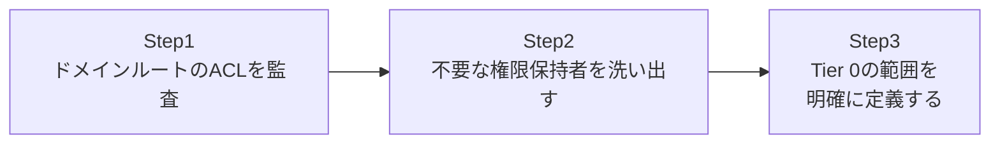

## はじめに

- **この記事で得られること**: **DCSync**という手法が悪用する、`Replicating Directory Changes`と`Replicating Directory Changes All`という2つの拡張権限を、実際にドメインルートのACLから洗い出し、その権限を持つべきではないアカウントが紛れ込んでいないかを監査します。そのうえで、**Tier 0**という、DC以外にもこの権限を正規に必要とするアカウント(Microsoft Entra Connectなど)を、Domain Adminsと同格の重要度で保護すべきだ、という考え方までを扱います。**このハンズオンは、自組織の環境の防御力を高めるための、監査・防御目的のものです。**
- **対象読者**: `mimikatz`や`DCSync`という単語を聞いたことはあるが、実際にどの権限が悪用されているのか、そして自分の環境がその権限をどう管理しているのかを、確認したことがない方を想定しています。
- **読むのにかかる想定時間**: 約20分(実際に構築しながら進める場合は40分程度を見込んでください)

この記事は[『上位1%』シリーズ 全記事ガイド](/sitemap)の一部、[Active Directoryシリーズ](/sitemap#シリーズ一覧)の43本目です。

## 前提知識

- [OUへの権限移譲(Delegation of Control)でヘルプデスクに権限だけを渡すハンズオン](/articles/ad-delegation-handson-guide): 権限移譲の実態がACL上のACEであるという理解が、この記事の前提になっています。

## そもそも、DCSyncとは何を悪用する手法なのか

複数のDCの間でAD DSのデータを同期させるレプリケーションは、[サイトという、物理的な距離をADに教えるための仕組み](/articles/ad-sites-guide)で扱った通り、AD DSの根幹をなす仕組みです。このレプリケーションを実行するために、DCは、ドメインルートに対する`Replicating Directory Changes`(DS-Replication-Get-Changes)と`Replicating Directory Changes All`(DS-Replication-Get-Changes-All)という、2つの拡張権限を持っています。**DCSyncとは、この2つの権限さえ持っていれば、あるアカウントが、あたかも自分がDCであるかのように振る舞い、他のDCに対して「レプリケーションしてください」と要求し、全ユーザーのパスワードハッシュを含む情報を、正規のレプリケーション通信として受け取れてしまう、という性質を悪用する手法です。**

## 全体像をつかむ

このハンズオンで行うことは、次の3ステップです。



## ハンズオン手順

### Step 1: ドメインルートのACLを監査する

ドメインルートのACLを取得し、この2つの拡張権限が、誰に付与されているかを確認します。

```powershell
$guid1 = "1131f6aa-9c07-11d1-f79f-00c04fc2dcd2"  # Replicating Directory Changes
$guid2 = "1131f6ad-9c07-11d1-f79f-00c04fc2dcd2"  # Replicating Directory Changes All

$acl = Get-Acl "AD:DC=example,DC=com"
$acl.Access | Where-Object { $_.ObjectType -eq $guid1 -or $_.ObjectType -eq $guid2 } | Select-Object IdentityReference, ActiveDirectoryRights
```

**既定の状態では、この権限を持っているのは、Domain Admins、Enterprise Admins、そしてDC自身が所属する`Domain Controllers`グループ程度です。** これ以外のアカウントやグループが表示された場合は、その理由を必ず確認してください。

### Step 2: 不要な権限保持者を洗い出す

実務では、この監査結果に、意図した形で**Microsoft Entra Connect**(旧Azure AD Connect)のサービスアカウントが含まれていることがあります。**これは異常ではありません。** Entra Connectは、オンプレミスのAD DSとクラウド上のMicrosoft Entra IDとの間でパスワードハッシュを同期するために、正規にこの権限を必要とします。**問題になるのは、こうした正規の理由がまったく説明できない、想定外のアカウントやグループが、この権限を持っている場合です。** 過去に行われた、原因不明のトラブルシューティング作業の中で、一時的なつもりで付与され、そのまま忘れられた権限などが典型的な例です。

### Step 3: Tier 0の範囲を明確に定義する

監査結果をもとに、**Tier 0**、つまり「侵害されると、フォレスト全体の完全な制御につながりうるアカウント・システムの集合」を、明確にリストアップします。

```
Tier 0の例:
- Domain Admins、Enterprise Adminsのメンバー
- すべてのDC
- Replicating Directory Changes / Changes Allを持つすべてのサービスアカウント(Entra Connectなど)
- バックアップソフトウェアのサービスアカウント(System Stateバックアップにアクセスできるため)
```

**Tier 0に分類されたアカウントは、Domain Adminsそのものと同じレベルの厳重さで保護されるべきです。** 具体的には、日常業務用の一般アカウントとは完全に分離した専用アカウントを使う、多要素認証を必須にする、ログオンを許可する端末を専用の踏み台サーバーだけに制限する、といった対策が該当します。

## プロが見ている視点(上位1%の理解)

### DCSyncが「侵入」ではなく「正規のレプリケーション通信のなりすまし」である理由

DCSyncの本質を理解するうえで重要なのは、これが何らかのセキュリティホールを突く「侵入」ではなく、**正規のレプリケーションプロトコルを、正規の権限を使って、正規の手順通りに呼び出しているだけ**だという点です。ネットワーク上を流れる通信そのものは、DC同士の正常なレプリケーションと、技術的に区別がつきません。**だからこそ、DCSyncへの対策は、通信を検知してブロックするという発想ではなく、そもそも「その権限を持つべきではないアカウントに、その権限を持たせない」という、権限管理そのものに焦点を当てる必要があります。**

### Tier 0という考え方が、Domain Adminsという1つの箱だけでは不十分な理由

多くの現場では、「Domain Adminsグループのメンバーだけを厳重に管理すればよい」と考えがちです。しかし、[サーバーセキュリティの実践的対策](/articles/practical-server-security-measures-guide)の観点で考えると、これは不十分です。**Domain Adminsのメンバーではなくても、DCSyncに必要な権限さえ持っていれば、事実上Domain Adminsと同等の被害をもたらせてしまいます。** Tier 0という考え方は、「Domain Adminsグループに入っているかどうか」という表面的な基準ではなく、「侵害された場合の実際の被害範囲」という実質的な基準で、保護すべき対象を再定義する、より成熟したセキュリティモデルです。

## よくある誤解・つまずきポイント

- **誤解1: 「DCSyncは、何らかのソフトウェアの脆弱性を突く攻撃である」**
  DCSyncは、正規のレプリケーション権限とプロトコルを、正規の手順で呼び出しているだけであり、ソフトウェアの脆弱性を突くものではありません。
- **誤解2: 「Domain Adminsグループのメンバーだけを管理していれば、DCSyncのリスクは管理できている」**
  Domain Adminsのメンバーでなくても、複製権限さえ持っていればDCSyncは実行可能です。権限そのものを基準に監査する必要があります。
- **誤解3: 「Entra Connectのサービスアカウントがこの権限を持っているのは、必ず異常である」**
  Entra Connectは、正規の理由でこの権限を必要とします。重要なのは、説明のつかない権限保持者を見つけることです。

## 障害・トラブルシューティングの視点

1. **監査で見慣れないアカウントが見つかった**: そのアカウントが何のために使われているか、そもそも現在も稼働中のシステムに紐づいているかを、関係者に確認してください。
2. **権限を削除したら、正規のサービスが動かなくなった**: Entra Connectなど、正規の理由でこの権限を必要とするサービスがないか、削除前に必ず洗い出してください。
3. **Tier 0の範囲をどう決めればよいか分からない**: 「このアカウント・システムが侵害されたら、フォレスト全体が危険にさらされるか」を基準に、システムごとに個別に判断してください。

## まとめ

- DCSyncは、`Replicating Directory Changes`と`Replicating Directory Changes All`という2つの拡張権限を悪用する手法です。
- この権限は、DC自身に加えて、Entra Connectのような正規のサービスにも必要とされることがあります。
- DCSync対策の焦点は、通信の検知ではなく、権限そのものの適切な管理です。
- Tier 0は、Domain Adminsという表面的な基準ではなく、侵害時の実際の被害範囲を基準にした、保護対象の再定義です。

**今日から意識すべきこと**
1. 定期的に、ドメインルートのACLで複製権限の保持者を棚卸ししましょう。
2. Tier 0に分類したアカウントは、日常業務用のアカウントと完全に分離しましょう。

## 参考文献

- [Implementing Least-Privilege Administrative Models | Microsoft Learn](https://learn.microsoft.com/en-us/windows-server/identity/ad-ds/plan/security-best-practices/implementing-least-privilege-administrative-models)
- [Microsoft Entra Connect: Password Hash Synchronization | Microsoft Learn](https://learn.microsoft.com/en-us/entra/identity/hybrid/connect/how-to-connect-password-hash-synchronization)
