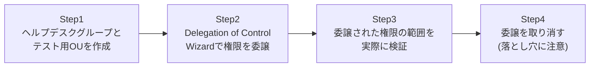

## はじめに

- **この記事で得られること**: 「ヘルプデスク担当者にパスワードリセットだけをやらせたいが、Domain Adminsを渡すのは怖い」という、実務で非常によくある要求を、**権限移譲**(Delegation of Control)という仕組みで実現します。Delegation of Control Wizardを使って、特定のOU配下に限定した、パスワードリセットだけの権限を、非管理者グループへ実際に付与し、その権限が意図した範囲だけで機能していることを確認します。あわせて、委譲した権限を取り消したくなったときに直面する、実務上のよくある落とし穴も扱います。
- **対象読者**: Domain Adminsのメンバーを増やす以外に、権限を細かく分ける方法を実際に試したことがない方を想定しています。
- **読むのにかかる想定時間**: 約20分(実際に構築しながら進める場合は45分程度を見込んでください)

この記事は[『上位1%』シリーズ 全記事ガイド](/sitemap)の一部、[Active Directoryシリーズ](/sitemap#シリーズ一覧)の31本目です。

## 前提知識

- [ADとDC、ドメインとフォレストの違いを『上位1%』の視点で理解する](/articles/ad-dc-fundamentals-guide): 「部署ごとに管理を分けたい程度の要件なら、OU・グループポリシー・権限移譲の組み合わせで十分」という記述で、この記事の内容を先取りして触れています。

## 全体像をつかむ

このハンズオンで行うことは、次の4ステップです。



## ハンズオン手順

### Step 1: ヘルプデスクグループとテスト用OUを作成する

権限を委譲する先のグループと、委譲の範囲となるOU、そしてテスト用ユーザーを作成します。

```powershell
New-ADGroup -Name "HelpdeskStaff" -Path "DC=example,DC=com" -GroupScope Global
New-ADUser -Name "helpdesk1" -Path "DC=example,DC=com" -Enabled $true -AccountPassword (ConvertTo-SecureString "P@ssw0rd123!" -AsPlainText -Force)
Add-ADGroupMember -Identity "HelpdeskStaff" -Members "helpdesk1"

New-ADOrganizationalUnit -Name "SalesOU" -Path "DC=example,DC=com"
New-ADUser -Name "salesuser1" -Path "OU=SalesOU,DC=example,DC=com" -Enabled $true -AccountPassword (ConvertTo-SecureString "P@ssw0rd123!" -AsPlainText -Force)
```

**`helpdesk1`は、Domain Adminsはもちろん、それ以外の特別なグループにも所属していない、ごく普通の一般ユーザーです。** この状態から、`SalesOU`配下のパスワードリセットだけができるように、権限を追加していきます。

### Step 2: Delegation of Control Wizardで権限を委譲する

`dsa.msc`(Active Directoryユーザーとコンピューター)を開き、`SalesOU`を右クリックして「制御の委任」を選びます。ウィザードが起動したら、次のように進めます。

1. 委任するグループとして`HelpdeskStaff`を指定する
2. 委任するタスクの一覧から、「ユーザーパスワードのリセットとパスワード期限切れ後の変更を強制」だけにチェックを入れる
3. 完了する

**ここで、パスワードのリセットとは別に「ロックされたユーザーアカウントのロック解除」という、似て非なる項目が一覧に存在することに注目してください。** この2つは実際には別々の権限であり、片方だけを委任すると、もう片方の操作は依然としてできません。「パスワードさえリセットできれば、ロック解除も一緒にできるはず」という思い込みは、実務でよく発生する誤解です。

### Step 3: 委譲された権限の範囲を実際に検証する

`helpdesk1`としてログインし、`SalesOU`配下の`salesuser1`のパスワードをリセットしてみます。

```powershell
Set-ADAccountPassword -Identity "salesuser1" -Reset -NewPassword (ConvertTo-SecureString "NewP@ss456!" -AsPlainText -Force)
```

**これは成功するはずです。** 次に、委任した範囲の外側にあるユーザー(たとえば`DC=example,DC=com`直下の別のユーザー)に対して、同じコマンドを実行してみてください。**今度はアクセス拒否のエラーになるはずです。** 委任した権限が、`SalesOU`という特定のスコープだけに正確に限定されていることを確認できました。

さらに、パスワードリセット以外の操作、たとえば`salesuser1`自体を削除しようとしてみてください。これも同様にアクセス拒否になります。**委任した「パスワードリセット」という特定のタスクだけが許可されており、それ以外のすべての操作は、既定で拒否され続けている**ことが分かります。

### Step 4: 委譲を取り消す(落とし穴に注意)

`HelpdeskStaff`への権限委譲を取り消したくなったとき、多くの人がまず「制御の委任ウィザードを、もう一度実行すればよいのでは」と考えます。**しかし、Delegation of Control Wizardには、委任した権限を取り消すための機能が用意されていません。** ウィザードは、権限を追加することしかできない、一方通行のツールです。

委任を取り消すには、`SalesOU`のプロパティ画面から「セキュリティ」タブを開き(表示されない場合は、`dsa.msc`の「表示」メニューから「拡張機能」を有効にする必要があります)、`HelpdeskStaff`に付与されているアクセス許可のエントリを、手作業で見つけて削除する必要があります。

```powershell
# PowerShellでACLを直接確認する場合
Get-Acl "AD:OU=SalesOU,DC=example,DC=com" | Select-Object -ExpandProperty Access | Where-Object { $_.IdentityReference -like "*HelpdeskStaff*" }
```

## プロが見ている視点(上位1%の理解)

### 権限移譲の正体は、OUのACL上に追加された1つのACEである

Delegation of Control Wizardがやっていることの実態は、**`SalesOU`というオブジェクトのACL(アクセス制御リスト)に、`HelpdeskStaff`グループに対する、特定の拡張権限(この場合は「パスワードのリセット」)を許可する、1つのACE(アクセス制御エントリ)を追加しているだけ**です。ウィザードは、この複雑なACLの操作を、GUI越しに分かりやすく行うための補助ツールにすぎません。この実態を理解していれば、ウィザードに「取り消し」機能がないことにも驚かなくなりますし、`dsacls`コマンドや`Get-Acl`を使って、ACLを直接確認・操作するという発想にも自然にたどり着けます。

### なぜDomain Adminsを渡すのではなく、権限移譲をするべきなのか

[サーバーセキュリティの実践的対策を『上位1%』の視点で理解する](/articles/practical-server-security-measures-guide)で扱った「必要最小限の権限だけを与える」という最小権限の原則を、AD DSの世界で具体的に実践する方法が、この権限移譲です。ヘルプデスク担当者が本当に必要としているのは、日常業務で発生するパスワードリセット程度の操作だけであることがほとんどです。それにもかかわらずDomain Adminsを渡してしまうと、そのアカウントが乗っ取られた場合に、フォレスト全体が危険にさらされます。権限移譲によって、「その担当者が本当に必要な操作だけ」に権限を絞り込むことが、実務上のセキュリティ設計の基本です。

## よくある誤解・つまずきポイント

- **誤解1: 「パスワードリセットの権限を委任すれば、ロックされたアカウントの解除も一緒にできるようになる」**
  この2つは別々の権限です。両方必要な場合は、ウィザードで両方にチェックを入れる必要があります。
- **誤解2: 「委任した権限を取り消したいときも、ウィザードをもう一度実行すればよい」**
  Delegation of Control Wizardには取り消し機能がありません。セキュリティタブから手作業でACEを削除する必要があります。
- **誤解3: 「OUに権限を委任すれば、そのOUを含むドメイン全体に権限が及ぶ」**
  委任した権限は、既定ではそのOUと配下のオブジェクトだけに限定されます。

## 障害・トラブルシューティングの視点

1. **委任したはずの操作が、依然としてアクセス拒否になる**: ウィザードで正しいタスク(パスワードリセットとロック解除は別)にチェックを入れたか、委任先のOUを間違えていないかを確認してください。
2. **委任した権限の範囲を後から確認したい**: `SalesOU`のセキュリティタブ(拡張機能を有効にした状態)、または`dsacls "OU=SalesOU,DC=example,DC=com"`コマンドで、現在のACLの内容を確認できます。
3. **委任を完全に取り消したのに、まだ古い権限が残っているように見える**: グループメンバーシップに基づく権限は、そのユーザーが一度ログオフ・再ログオンしてトークンを更新するまで、反映が遅れることがあります。

## まとめ

- Delegation of Control Wizardを使うと、Domain Adminsを渡すことなく、特定のOU配下の特定の操作だけを、非管理者グループへ委任できます。
- 「パスワードリセット」と「ロック解除」は別々の権限であり、両方必要なら両方を明示的に委任する必要があります。
- 権限移譲の実態は、OUのACL上に追加された1つのACEであり、ウィザードはそれを分かりやすく操作するための補助ツールにすぎません。
- Delegation of Control Wizardには取り消し機能がなく、取り消しはセキュリティタブからの手作業になります。

**今日から意識すべきこと**
1. 「ヘルプデスクにDomain Adminsを渡す」という要求が来たら、まず権限移譲で実現できないかを検討しましょう。
2. 権限を委任するときは、将来取り消すことになった場合に備えて、委任した内容(グループ名・OU・タスク)をどこかに記録しておきましょう。

## 参考文献

- [Delegate Administration | Microsoft Learn](https://learn.microsoft.com/en-us/windows-server/identity/ad-ds/plan/delegating-administration)
- [dsacls | Microsoft Learn](https://learn.microsoft.com/en-us/windows-server/administration/windows-commands/dsacls)
