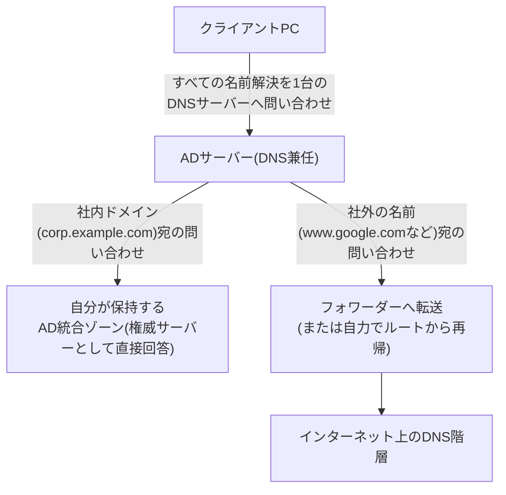
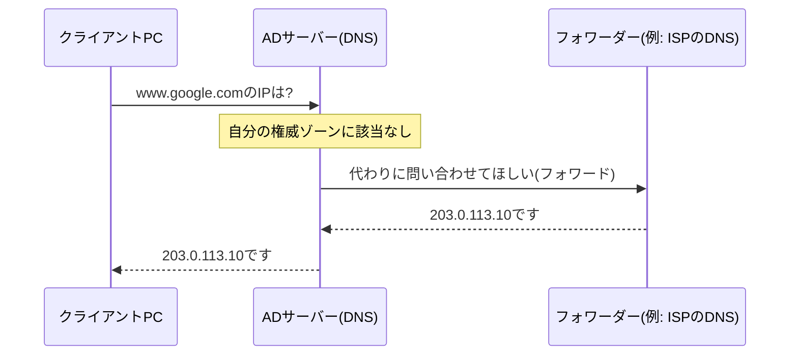

## はじめに

- **この記事で得られること**: 「`ping 8.8.8.8`は通るのに、ブラウザでのインターネット検索ができない」という、実務でよく遭遇する症状の原因から、AD環境特有のDNS設計——なぜADサーバーはDNSサーバーを兼任することが多いのか、なぜプライマリDNSで名前解決できないときにセカンダリDNSへ自動的に切り替わらないのか、なぜADサーバー自身のDNS設定に自分の実IPではなく`127.0.0.1`を指定すべきと言われるのか——までを体系的に理解できます。
- **対象読者**: AD環境の構築・運用に携わっているものの、DNSサーバーのフォワーダー設定や、複数DNSサーバー登録時の実際の挙動、AD特有のDNS設計の理由を具体的に説明できない方を想定しています。
- **読むのにかかる想定時間**: 約20分

この記事は[『上位1%』シリーズ 全記事ガイド](/sitemap)の一部、[Active Directoryシリーズ](/sitemap#シリーズ一覧)の4本目です。DNSの一般的な仕組み(再帰リゾルバ・権威サーバー・キャッシュとTTLなど)については[DNSの仕組みを『上位1%』の視点で理解する](/articles/dns-guide)で扱っているため、本記事ではその前提知識を踏まえた上で、AD環境に特有のDNS設計にフォーカスします。

## 前提知識

- **再帰リゾルバと権威サーバー**: 再帰リゾルバはクライアントの代わりにルート→TLD→権威サーバーの順に問い合わせを重ねる役割、権威サーバーは自分が管理するゾーンについて正式に答える役割です。詳しくは[DNSの仕組みを『上位1%』の視点で理解する](/articles/dns-guide)を参照してください。
- **AD統合ゾーン**: DNSのゾーンデータ(レコードの集合)を、通常のゾーンファイルではなくAD DSのデータベース内に保存する方式です。これにより、ゾーンデータ自体がAD DSのレプリケーション機構に乗って複数のDCへ複製されます。
- **動的DNS更新(Dynamic DNS Update)**: クライアントやサーバーが、自分自身のホスト名とIPアドレスのレコードを、DNSサーバーへ自動的に登録・更新する仕組みです(RFC 2136)。

## 全体像をつかむ

### 一言で言うと

**AD環境のDNSサーバーは、「社内ドメインについては自分が正式な回答者(権威サーバー)であり、それ以外の名前については誰か(フォワーダー、または自力での再帰)に取り次ぐ仲介役(再帰リゾルバ)」という、2つの役割を1台で兼ねています。** この二重の役割を意識すると、社内名前は解決できるのにインターネットの名前だけ解決できない、といった「一部だけ壊れる」症状の原因が見えやすくなります。

## 基礎から徹底解説

### なぜADサーバーはDNSサーバーを兼任することが多いのか

AD DSは、その内部動作の随所でDNSに強く依存しています。代表的な理由は次の2つです。

1. **DCロケーター機能がDNSのSRVレコードに依存している**: クライアントが「このドメインのDCはどこにあるか」を見つける仕組み(DCロケーター)は、`_ldap._tcp.dc._msdcs.<ドメイン名>`のような特殊なSRVレコードをDNSに問い合わせることで実現されています(このゾーンの詳しい構造は後続記事で扱います)。つまりDNSが正常に機能していなければ、そもそもクライアントはDCを見つけることすらできません。
2. **動的更新とAD統合ゾーンによるレプリケーションの一体化**: DCは起動時、自分自身に関する多数のレコード(前述のSRVレコードやホストレコード)をDNSへ動的に登録します。DNSサーバーの機能をDC自身に持たせ、ゾーンをAD統合ゾーンにしておくと、このレコードの複製が**AD DS自体のマルチマスターレプリケーション**に相乗りする形で行われ、DNSサーバー間で別途ゾーン転送の設定・管理をする必要がなくなります。加えて、AD統合ゾーンは**セキュリティで保護された動的更新**(Kerberos認証済みのクライアント・コンピューターだけが自分のレコードを更新できる)にも対応しており、通常のゾーンファイルによる動的更新より安全です。

これらの理由から、多くのAD環境では、DNSサーバーの役割を独立した専用サーバーに持たせるのではなく、**DC自身にDNSサーバーの役割を兼任させる**構成が一般的になっています。

### フォワーダーとは何か:「ping 8.8.8.8は通るのに検索できない」の正体

社内ドメイン以外の名前(`www.google.com`など)を問い合わせられたとき、AD統合DNSサーバーには大きく2つの選択肢があります。

- **自力で再帰的に解決する**: [DNSの仕組みを『上位1%』の視点で理解する](/articles/dns-guide)で説明した通り、ルートサーバーから順に辿っていく方式です。
- **フォワーダーへ転送する**: 自分では解決せず、あらかじめ設定しておいた特定のDNSサーバー(ISPが提供するDNSサーバーや、パブリックDNSなど)へその問い合わせをそのまま**転送**(フォワード)し、返ってきた結果をそのままクライアントへ中継する方式です。ISPそのものが何をしている会社なのかは[ISP(インターネットサービスプロバイダー)とは何か](/articles/ad-isp-guide)で深掘りします。

実務では、社内向けのファイアウォールポリシー上ルートサーバー(世界に13系統存在する、DNSの名前空間の頂点`.`を管理するサーバー群。ここから`.com`や`.jp`を管理するサーバーへと辿っていくのが、DNSの再帰的解決の出発点です)への直接の問い合わせ(UDP/TCP 53番ポート)を許可していないケースが多いため、フォワーダーを設定する構成が一般的です。DNSマネージャーの該当サーバーのプロパティ→「フォワーダー」タブで、転送先のIPアドレスを1つ以上指定できます。

ここで、実務で実際に起きた次の症状を診断してみます。

> あるPCでインターネット検索ができない状況になっていた。コマンドプロンプトで`ping 8.8.8.8`を実行したところ応答があったが、それでもインターネット検索ができない。DNSサーバーへのアクセス自体はできているように見える。

この症状は、フォワーダー設定の不備で正確に説明できます。**`ping 8.8.8.8`は、IPアドレスを直接指定してICMPパケットを送るだけの操作であり、DNSによる名前解決を一切経由しません。** つまりこのpingが通ったという事実は、「インターネットへの経路そのもの(ルーティング)は生きている」ことしか証明しておらず、**DNSが正常に機能しているかどうかとは無関係**です。一方、ブラウザでの検索(`www.google.com`のような名前でのアクセス)には必ずDNSによる名前解決が必要です。もしこのADサーバーの**フォワーダー設定に誤りがある**(転送先IPアドレスが無効、あるいはそのIPアドレスへの通信がファイアウォールで遮断されているなど)場合、社外の名前の解決だけが軒並み失敗します。**社内ドメインの名前解決(このDNSサーバー自身が権威サーバーとして直接答えられる範囲)は正常に機能し続ける**ため、「DNSサーバーへのアクセス自体はできているように見える」という所見とも矛盾しません——実際には、DNSサーバーへは到達できているものの、そのDNSサーバーが**社外の名前について正しい答えを取得できていない**、という状態です。

フォワーダーとルートヒントを併用する「条件付きフォワーダー」

DNSマネージャーには、特定のドメイン名(例: `partner.example.com`)への問い合わせだけを、特定のフォワーダーへ転送するという**条件付きフォワーダー**の機能もあります。複数の組織間でVPN接続などにより互いのAD環境の名前解決が必要な場合(拠点間VPNやAD間の信頼関係を結んでいる場合など)に使われます。フォワーダー関連のトラブルシューティングでは、通常のフォワーダー設定だけでなく、この条件付きフォワーダーの設定に誤りがないかもあわせて確認する必要があります。

名前解決の優先順位としては、**より具体的な条件に一致する条件付きフォワーダーが、通常のフォワーダー(全問い合わせ向けの既定の転送先)よりも優先されます**。両方とも該当しない名前で、かつ通常のフォワーダーも1つも応答しない(あるいはそもそも1つも設定されていない)場合は、ルートヒントを使った自力の再帰的解決にフォールバックします(サーバーのプロパティで「フォワーダーが利用できない場合はルートヒントを使用する」が有効になっている既定の状態が前提です)。

AD移行の観点でもう1点重要なのは、**この2つは既定のデータ保存場所が異なる**ことです。通常のフォワーダーは常にDNSサーバーごとのローカル(レジストリ)にのみ保存され、AD DSへ保存してDC間で自動複製させる方法はそもそも用意されていません。一方条件付きフォワーダーには、新規作成時に「この条件付きフォワーダーをActive Directoryに格納し、次のように複製する」というチェックボックスがあり(既定ではオフ=ローカル保存)、これを有効にすればAD DS経由でDC間に自動複製されます。つまり「条件付きフォワーダーだけが自動同期される」のではなく、**条件付きフォワーダーは"AD DSに格納する設定を明示的に選べば"複製できるが、通常のフォワーダーにはその選択肢自体がなく常にDCごとに個別設定が必要**、というのが正確な理解です。AD移行やDC追加の作業では、通常のフォワーダーは新しいDCにも手動で設定し直す前提で計画する必要があります。

### プライマリ/セカンダリDNSはなぜ自動でフェイルオーバーしないのか

Windowsのネットワークアダプター設定では、DNSサーバーを2つ(優先/代替)まで指定できます。ここでよくある疑問が、「メインのDNS(優先)で名前解決に失敗したとき、自動的にサブのDNS(代替)に聞きに行ってくれないのか」というものです。

結論から言うと、**これは意図的にそうなっていません。** 理由を理解するには、DNSクライアントが直面する「失敗」には性質の異なる2種類があることを区別する必要があります。

| 失敗の種類 | クライアントの挙動 | 理由 |
|---|---|---|
| **応答そのものが返ってこない(タイムアウト)** | 一定時間待ってから、代替(セカンダリ)DNSサーバーへ問い合わせる | サーバーが完全にダウンしている、あるいはネットワークが疎通していないと判断できるため、フェイルオーバーが安全に成立する |
| **応答は返ってきたが、望んだ結果ではない(NXDOMAINや、意図しない/不完全な回答)** | **代替DNSサーバーへは問い合わせない**。返ってきた応答をそのまま最終結果として受け取る | クライアント側には、その回答が「本当に正しい権威ある回答」なのか「サーバー側の設定ミスによる誤った回答」なのかを判断する手段がないため |

前述のフォワーダー設定ミスのケースは、まさに後者にあたります。DNSサーバー自体は正常に応答している(フォワーダーへの転送先が間違っているだけで、サーバープロセス自体は生きている)ため、クライアントから見れば「タイムアウトではなく、何らかの応答が返ってきた」状態であり、代替DNSサーバーへ自動的に切り替わることはありません。

**「メインDNSで名前解決できないときにサブDNSへ自動で聞きに行くべきではないか」という発想は、一見便利に思えますが、実際にはそうしない方が都合がよい**という設計判断です。もしクライアントが「回答の中身が気に入らない」という理由で勝手に別のDNSサーバーへ問い合わせを渡り歩けるとしたら、**同じ名前に対してどのDNSサーバーの回答を信頼するかが状況によって変わってしまい、名前解決の結果が予測不可能になります**。また、権威あるサーバーが「そのドメインは存在しません(NXDOMAIN)」と正しく回答しているケースまで「失敗」とみなして別のサーバーに聞き直してしまうと、本来正しいはずの「存在しない」という回答を無視して延々と探し続けることになりかねません。DNSの優先/代替という仕組みは、あくまで「**応答してくれるサーバーそのものが利用可能かどうか」を判定するためのフェイルオーバーであり、応答内容の正しさを多数決や当たり判定で決めるための仕組みではない**、という点を正確に理解しておく必要があります。

### 自分自身のIPアドレスではなく127.0.0.1を指定すべきと言われる理由

ADサーバー(DC)自身のDNS設定において、「プライマリDNSサーバーに自分自身の実IPアドレスを指定するのではなく、ループバックアドレスの`127.0.0.1`を指定すべきだ」という助言を耳にすることがあります。この助言の背景には、次のような理由があります。

- **起動時の依存関係を単純化できる**: DCが起動する過程では、[Netlogonサービス](/articles/ad-netlogon-guide)が前述のSRVレコードなどを動的に登録する処理が走ります。このとき参照するDNSサーバーとして自分自身の実IPアドレスを指定していると、そのDC自身のネットワークスタックやDNSサービスの初期化タイミング次第では、起動シーケンスの中で参照が不安定になる場合があります。`127.0.0.1`(ループバック)を指定しておけば、**「まず自分自身のDNSサービスに聞く」ことを、ネットワークスタック全体の初期化状況に関わらず確実に成立させやすい**、という考え方です。
- **複数DC環境での循環依存を避けられる**: 仮にDC-AのプライマリDNSにDC-Bの実IP、DC-BのプライマリDNSにDC-Aの実IPを、互いに指定し合う構成にしてしまうと、両方のDCが同時に再起動するようなメンテナンスのタイミングで、「DC-Aの起動はDC-BのDNSに依存し、DC-Bの起動はDC-AのDNSに依存する」という循環が生じ、起動シーケンスが不安定になる可能性があります。各DCがまず自分自身(`127.0.0.1`)を頼る構成であれば、この種の相互依存は発生しません。

127.0.0.1指定には別の観点からの注意点もある

一方で、Microsoftは`127.0.0.1`をDNSサーバーとして指定する構成について、別の角度からの注意点も公式に発信しています。**あるDCのDNSサーバー設定が常に自分自身(ループバック)を向いていると、そのDC自身が持つDNSサーバー機能が(完全なダウンではなく)部分的に不調——たとえばゾーンデータの不整合や、特定のレコードだけ応答がおかしいといった状態——に陥っていても、クライアント(DC自身を含む)がその不調を検知して他の健全なDCのDNSへ自動的にフェイルオーバーする機会が失われる**、という指摘です。前述の「プライマリが応答さえすればセカンダリへは切り替わらない」という挙動を踏まえると、常に自分自身に問い合わせる構成は、**自分自身のDNSの不調を自分自身では検知しづらくなる**、という副作用を伴います。

実務上の折衷案としては、**セカンダリDNSには必ず別の健全なDCの実IPアドレスを指定しておく**ことが重要です。これにより、万が一自分自身のDNSサービスが完全に停止した場合には、タイムアウトを経て正しくセカンダリへフェイルオーバーできます(前述の通り、部分的な不調の検知までは保証されませんが、完全な停止に対する保険にはなります)。小規模な環境では`127.0.0.1`をプライマリにする構成が広く使われ実務上大きな問題にならないことが多い一方、大規模・高可用性が求められる環境では、この副作用を踏まえたうえで、DNSサーバー自体の死活監視を別途仕組みとして持つといった補完策が推奨されます。

### `ipconfig /registerdns`は何をしているのか

クライアント(あるいはDC自身)は、自分のホスト名とIPアドレスのレコードを、既定でおよそ24時間ごとに自動的に再登録・更新しています。`ipconfig /registerdns`は、**この自動更新を待たずに、今すぐ動的DNS更新をやり直す**ためのコマンドです。

DNSの設定(DNSサーバーのIPアドレスなど)を変更した直後や、手動でDNSレコードを削除・修正した直後、あるいはIPアドレスを変更した直後などは、「次の自動更新のタイミングまで待てば、いずれ正しい状態になる」こと自体は事実です。しかし、**その自動更新が行われるまでの間、古い(あるいは存在しない)DNSレコードの情報が残り続けてしまう**という実務上のギャップがあります。`ipconfig /registerdns`は、この待ち時間をなくし、変更内容をすぐにDNSへ反映させたい場合に使う、確認・復旧のための実務的なコマンドだと理解しておくと、いつ使うべきかの判断がしやすくなります。

なぜ`/registerdns`を実行しなくても、再起動や24時間を待たずに反映されることが多いのか

ここで2つのことを分けて考える必要があります。1つ目は「`ipconfig /all`の表示が最新のIPアドレスやDNSサーバーになっている」ことで、これは**そのPC自身が持っているローカルのネットワーク設定情報を表示しているだけ**であり、DNSサーバー側のレコードとは無関係に、設定を変更した瞬間から常に最新の状態が表示されます。2つ目は「目的のサーバーへ実際にアクセスできる」ことで、こちらは本当にDNSサーバー側のレコードが正しく更新されている必要があります。

そして、動的DNS更新は**24時間ごとの定期実行だけでなく、IPアドレスの変更・DHCPからの新しいリースの取得・ネットワークアダプターの有効化など、ネットワーク構成が変化したタイミングでもイベント駆動で自動的に発火**します。多くの現場で「`/registerdns`を打たなくてもいつの間にか反映されている」と感じるのは、この構成変更時の自動登録がすでに正常に働いているためです。`/registerdns`が必要になるのは、この自動登録が何らかの理由(DNSサーバーへの疎通不可、権限不足、DNSサーバー側の権威ゾーンの不整合など)で失敗・スキップされ、DNSサーバー側のレコードだけが古いまま取り残されてしまったケースです。レコードの再登録を怠ったまま放置すると、**そのPC/サーバー宛ての通信が古いIPアドレスへ送られ続けたり、名前解決自体が失敗したりする**という不具合につながります。

## プロが見ている視点(上位1%の理解)

### DNSサーバーが1台構成の場合のリスク

ここまで見てきたプライマリ/セカンダリの挙動を踏まえると、**AD環境でDNSサーバーが実質1台しか存在しない構成(DCが1台だけの環境や、DNSサーバーの役割を持つDCが1台に集約されている環境)には、単一障害点としてのリスクが常に伴う**ことが分かります。そのDCのDNSサービスが完全に停止すれば、クライアント側はタイムアウトを経てセカンダリを試そうとしても、セカンダリの候補自体が存在しないため、フェイルオーバーのしようがありません。実務では、DCを最低2台構成にし、それぞれがDNSサーバーの役割も持つ構成にしておくことが、可用性の観点から強く推奨されます。

### フォワーダーの冗長化と選定

フォワーダーについても、通常は複数のIPアドレスを登録できます。ただし、これも前述のプライマリ/セカンダリと同様に「**応答してくれるかどうか」でのフェイルオーバー**が基本であり、特定のフォワーダー1つだけが誤った回答を返すような状況(そのフォワーダー自体の設定ミスやDNSキャッシュポイズニングなど)までは、この仕組みだけでは救えません。信頼できる複数の異なる提供元(ISPとパブリックDNSなど)を組み合わせておくことが、実務上のリスク分散になります。

## よくある誤解・つまずきポイント

- **誤解1: 「pingが通れば、そのサーバー(や経路)に関するすべての機能が正常」**
  `ping`はICMPによる疎通確認に過ぎず、DNSやその他上位のアプリケーション層のプロトコルが正常に機能しているかどうかとは無関係です。特に宛先をIPアドレス直指定したpingは、DNSを一切経由しません。
- **誤解2: 「プライマリDNSがおかしければ、Windowsが自動的にセカンダリに切り替えてくれる」**
  サーバーが応答さえしていれば(たとえその内容が誤っていても)、WindowsのDNSクライアントはその応答を最終結果として受け取り、セカンダリへは切り替えません。フェイルオーバーが働くのは、応答自体が返ってこない(タイムアウトする)場合だけです。
- **誤解3: 「127.0.0.1をDNSに指定しておけば、DNSまわりのトラブルは一切起こらない」**
  127.0.0.1指定には起動時の依存関係を単純化するメリットがある一方、自分自身のDNSサービスの部分的な不調を検知しにくくなるという副作用もあります。セカンダリには必ず別の健全なDCを指定しておくことが重要です。

## 障害・トラブルシューティングの視点

AD環境のDNS障害は、**「社内ドメインの名前解決とインターネットの名前解決のどちらが失敗しているか」を最初に切り分ける**のが鉄則です。

1. **社内・社外どちらの名前解決も失敗する**: そのクライアントが問い合わせているDNSサーバー自体に到達できているか(`nslookup`でDNSサーバーのIPを明示的に指定して確認)、DNSサーバーのサービス自体が起動しているかを確認します。
2. **社内ドメインの名前解決だけ成功し、社外の名前解決だけ失敗する(本記事のping事例)**: DNSサーバーのフォワーダー設定(転送先IPアドレスの有効性、そこへの通信がファイアウォールで遮断されていないか)を確認します。
3. **特定のDCでだけ名前解決が不安定**: そのDCのDNS設定で、セカンダリDNSに別の健全なDCが指定されているかを確認します。指定されていなければ、そのDC単体のDNS不調がそのまま影響します。
4. **DNSレコードを修正したのに反映されない**: クライアント側のキャッシュ(`ipconfig /flushdns`)に加えて、該当端末で`ipconfig /registerdns`を実行し、自動更新を待たずに即座に反映させます。

### 予防策・恒久対策

- DCは最低2台構成にし、DNSサーバーの役割もそれぞれに持たせ、互いをセカンダリDNSとして指定し合う。
- フォワーダーは複数の異なる提供元を登録し、単一のフォワーダーへの依存を避ける。
- DNSサーバー自体の死活監視(サービスの稼働状況、応答内容の妥当性)を、クライアント側のフェイルオーバーだけに頼らず別途仕組みとして持つ。

## まとめ

- ADサーバーがDNSサーバーを兼任することが多いのは、DCロケーター機能がDNSのSRVレコードに依存しており、かつAD統合ゾーンによってレコードの複製をAD DS自体のレプリケーションに相乗りさせられるためです。
- 「ping 8.8.8.8は通るのに検索できない」という症状は、pingがDNSを一切経由しない一方、ブラウザでの検索は必ずDNSを経由するために起こる典型例で、多くの場合はフォワーダー設定の不備が原因です。
- プライマリDNSが応答している限り、たとえその内容が誤っていてもセカンダリDNSへは自動的に切り替わりません。フェイルオーバーが働くのは応答そのものが返ってこない場合だけです。
- ADサーバー自身のDNS設定に`127.0.0.1`を指定するのは起動時の依存関係を単純化するためですが、自分自身のDNS不調を検知しにくくなる副作用もあるため、セカンダリには必ず別の健全なDCを指定すべきです。

**今日から意識すべきこと**
1. 「pingは通るのに特定の機能だけ動かない」という症状に遭遇したら、pingがそのプロトコル層(DNSなど上位層)の健全性を一切証明していないことを思い出しましょう。
2. AD環境のDNSサーバー設定を見直す際は、プライマリ・セカンダリの両方が実際に別々の健全なDCを指しているかを必ず確認しましょう。

## 参考文献

- [DNS Support for Active Directory Domain Controller Location | Microsoft Learn](https://learn.microsoft.com/en-us/troubleshoot/windows-server/networking/dns-support-for-active-directory-domain-controller-location)
- [Configure a DNS server to use forwarders | Microsoft Learn](https://learn.microsoft.com/en-us/troubleshoot/windows-server/networking/configure-dns-server-to-resolve-names-for-hosts-on-other-dns-server)
- [Dynamic Updates in the Domain Name System (DNS UPDATE) | RFC 2136](https://datatracker.ietf.org/doc/html/rfc2136)
- [The Case Against Using 127.0.0.1 as a DNS Server Address on Windows DNS Servers | Microsoft AskDS Blog](https://learn.microsoft.com/en-us/archive/blogs/askds/the-case-against-using-127-0-0-1-as-a-dns-server-address-on-windows-dns-servers)
- [DNSサーバーのフォワーダーとルートヒント | ipconfig /registerdns | Microsoft Learn](https://learn.microsoft.com/en-us/windows-server/administration/windows-commands/ipconfig)
