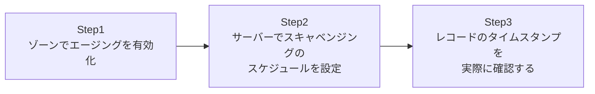

## はじめに

- **この記事で得られること**: 廃棄されたPCや、名前が変わった端末の古いDNSレコードが、ゾーンの中にいつまでも残り続けてしまう問題を防ぐための、**スキャベンジング**(Scavenging)を実際に設定します。動的更新によって記録されるタイムスタンプ、そして**リフレッシュ間隔**と**ノーリフレッシュ間隔**という2段構えの猶予期間の仕組みを理解し、スキャベンジングが既定で無効になっている理由まで扱います。
- **対象読者**: `nslookup`で調べると、もう存在しないはずの端末の名前がいつまでもヒットする、という状況に心当たりがある方を想定しています。
- **読むのにかかる想定時間**: 約20分(実際に構築しながら進める場合は40分程度を見込んでください)

この記事は[『上位1%』シリーズ 全記事ガイド](/sitemap)の一部、[Active Directoryシリーズ](/sitemap#シリーズ一覧)の40本目です。

## 前提知識

- [DNSゾーンとレコードの仕組みを『上位1%』の視点で理解する](/articles/dns-zones-records-guide): 動的更新とAD統合ゾーンについて、この記事の前提になっています。

## そもそも、なぜDNSレコードは放っておくと溜まり続けるのか

ドメイン参加済みのクライアントは、起動時やIPアドレス変更時に、動的更新によって自分自身のAレコードをDNSサーバーへ登録します。しかし、そのPCが物理的に廃棄されたり、二度と起動されなくなったりしても、**そのPCが自分でDNSサーバーに「もう使わないので削除してください」と伝える手段は存在しません。** その結果、何もしなければ、廃棄された端末のレコードが、ゾーンの中にいつまでも残り続けることになります。これが積み重なると、名前解決に使われないゴミレコードだらけの、いわゆる「DNSのゴミ屋敷化」が起こります。

## 全体像をつかむ

このハンズオンで行うことは、次の3ステップです。



## ハンズオン手順

### Step 1: ゾーンでエージングを有効化する

対象のAD統合ゾーンで、エージング(レコードの古さを追跡する機能)を有効化します。

```powershell
Set-DnsServerZoneAging -Name "example.com" -Aging $true -RefreshInterval 7.00:00:00 -NoRefreshInterval 7.00:00:00
```

**ここで指定している2つの間隔が、このハンズオンの核心です。** レコードが動的更新されると、まず**ノーリフレッシュ間隔**(既定7日間)に入ります。この期間中は、同じ内容でタイムスタンプを更新しようとしても無視されます。ノーリフレッシュ間隔が終わると、次に**リフレッシュ間隔**(既定7日間)に入り、この期間中にタイムスタンプが更新されれば、レコードは生き続けます。**両方の期間(合計で既定14日間)を通じて一度もタイムスタンプが更新されなかったレコードだけが、削除の対象になります。**

### Step 2: サーバーでスキャベンジングのスケジュールを設定する

ゾーンでエージングを有効にしただけでは、実際の削除処理は走りません。DNSサーバー自体に、スキャベンジングを実行するスケジュールを設定する必要があります。

```powershell
Set-DnsServerScavenging -ScavengingState $true -ScavengingInterval 7.00:00:00 -ApplyOnAllZones
```

**ゾーン側の「エージングを有効にする」設定と、サーバー側の「スキャベンジングを実行する」設定は、別々のオン・オフです。** 片方だけを有効にしても、期待した動作にはなりません。

### Step 3: レコードのタイムスタンプを実際に確認する

対象のAレコードのタイムスタンプを確認します。

```powershell
Get-DnsServerResourceRecord -ZoneName "example.com" -RRType A | Select-Object HostName, Timestamp
```

動的更新が有効なクライアントが定期的に自分のレコードを更新し続ける限り、タイムスタンプは更新され続け、レコードは削除されません。**一方、その端末の電源を落としたまま、リフレッシュ間隔とノーリフレッシュ間隔を合わせた期間(既定14日間)が経過すると、次回のスキャベンジング実行時に、そのレコードが自動的に削除されます。**

## プロが見ている視点(上位1%の理解)

### なぜスキャベンジングは既定で無効になっているのか

スキャベンジングは、AD DSの多くの機能とは異なり、**既定で無効**になっています。これは、設定を誤ると、まだ現役で使われているレコードまで誤って削除してしまうリスクがあるためです。特に、静的に(手動で)登録されたレコードや、動的更新に対応していない古い機器のレコードは、タイムスタンプ自体が存在しないか更新されないため、スキャベンジングの対象になりません(タイムスタンプが存在しないレコードは、スキャベンジングの対象から除外されます)。**この「静的レコードは対象外」という仕様を正しく理解していないと、重要なサーバーのレコードまで削除されてしまうという、深刻な事故につながりかねません。** だからこそ、多くのベストプラクティスでは、まず十分に長い猶予期間を設定したうえで、慎重に有効化することが推奨されています。

### 2段階の猶予期間が存在する理由

ノーリフレッシュ間隔とリフレッシュ間隔という2段階の仕組みが存在する理由は、**DNSサーバーへの不要な書き込み負荷を避けるため**です。もしタイムスタンプの更新を常に受け付けてしまうと、動的更新が頻繁に行われるたびに、DNSサーバー側での書き込み処理(そしてAD統合ゾーンであれば、そのレプリケーション)が発生し続けてしまいます。ノーリフレッシュ間隔を設けることで、短期間に何度も発生する冗長な更新要求を「無視してよいもの」として切り捨てつつ、リフレッシュ間隔の中で少なくとも1回更新されれば、そのレコードがまだ生きていると判断できる、という設計になっています。

## よくある誤解・つまずきポイント

- **誤解1: 「ゾーンでエージングを有効にすれば、それだけでスキャベンジングが自動的に実行される」**
  ゾーン側の「エージングの有効化」と、サーバー側の「スキャベンジングの実行スケジュール設定」は、別々に行う必要があります。
- **誤解2: 「静的に登録したレコードも、スキャベンジングの対象になる」**
  静的レコードにはタイムスタンプが存在しないため、既定ではスキャベンジングの対象になりません。
- **誤解3: 「リフレッシュ間隔とノーリフレッシュ間隔は、同じことをする冗長な設定である」**
  この2つは役割が異なり、両方合わせて初めて、レコードが削除されるまでの猶予期間全体が決まります。

## 障害・トラブルシューティングの視点

1. **スキャベンジングを設定したのに、古いレコードが削除されない**: ゾーン側のエージングとサーバー側のスキャベンジングスケジュールの両方が有効になっているか、そして猶予期間(リフレッシュ+ノーリフレッシュ)がまだ経過していないだけではないかを確認してください。
2. **まだ使われているはずのレコードが削除されてしまった**: そのレコードが動的更新に対応していない機器のものであれば、静的レコードとして再登録するか、そのゾーンをスキャベンジングの対象から除外することを検討してください。
3. **スキャベンジングの設定変更が反映されない**: `Set-DnsServerScavenging`は対象サーバーごとに設定するため、複数のDNSサーバーがある場合は、それぞれのサーバーで設定されているかを確認してください。

## まとめ

- 動的更新で登録されたレコードは、それを登録した端末が消えても、自動的には削除されません。
- ノーリフレッシュ間隔とリフレッシュ間隔という2段階の猶予期間を、両方経てタイムスタンプが一度も更新されなかったレコードだけが、スキャベンジングの対象になります。
- ゾーン側の「エージングの有効化」とサーバー側の「スキャベンジングの実行スケジュール」は、別々に設定する必要があります。
- 静的レコードにはタイムスタンプが存在しないため、既定ではスキャベンジングの対象外です。

**今日から意識すべきこと**
1. `nslookup`で存在しないはずの端末名がヒットする状況に気づいたら、スキャベンジングが有効になっているかを確認しましょう。
2. スキャベンジングを新規に有効化する際は、まず十分に長い猶予期間を設定し、慎重に本番投入しましょう。

## 参考文献

- [DNS Zone Scavenging and Aging | Microsoft Learn](https://learn.microsoft.com/en-us/troubleshoot/windows-server/networking/dns-scavenging-aging)
- [Set-DnsServerScavenging | Microsoft Learn](https://learn.microsoft.com/en-us/powershell/module/dnsserver/set-dnsserverscavenging)
