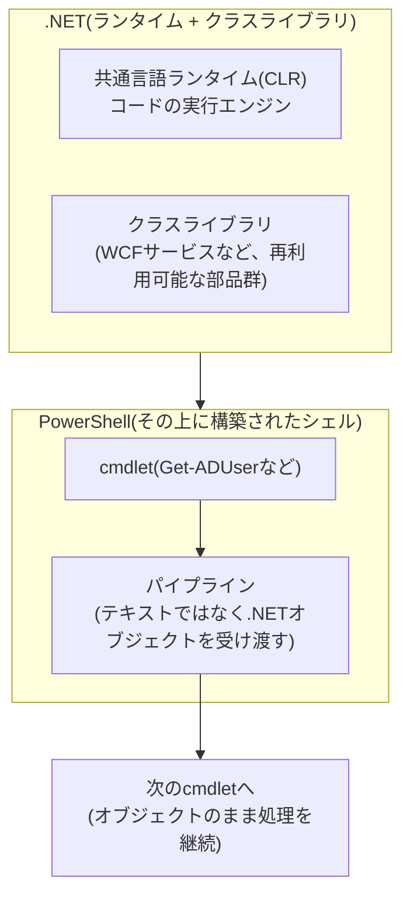

## はじめに

- **この記事で得られること**: [ADとDC、ドメインとフォレストの違い](/articles/ad-dc-fundamentals-guide)で、「AD DSの役割を追加すると、.NET Framework 4.8の機能が既定で有効なベース機能として付随する」と触れましたが、これがなぜPowerShellによるAD管理と関係しているのかには立ち入りませんでした。この記事では、.NET Framework(ランタイムとクラスライブラリの集合)とPowerShell(その上に構築されたシェル・スクリプト言語)の関係、PowerShellが他の多くのシェルと違い**テキストではなくオブジェクトをやり取りする**という設計思想、そしてWindows PowerShell 5.1とPowerShell 7という2つの系統がなぜ・どう違うのかを体系的に理解します。
- **対象読者**: `Get-ADUser`のようなPowerShellコマンドを日常的に使っているものの、「.NET Framework」という言葉と自分が使っているPowerShellがどう関係しているのかを説明できない方を想定しています。
- **読むのにかかる想定時間**: 約16分

この記事は[『上位1%』シリーズ 全記事ガイド](/sitemap)の一部、[Active Directoryシリーズ](/sitemap#シリーズ一覧)の22本目です。[ADとDC、ドメインとフォレストの違い](/articles/ad-dc-fundamentals-guide)を先に読んでおくと、本記事の理解がスムーズです。

## 前提知識

- **AD DSの役割追加時の付随機能**: [ADとDC、ドメインとフォレストの違い](/articles/ad-dc-fundamentals-guide)で扱った、サーバーマネージャーでAD DSの役割を追加すると、グループポリシー管理コンソールや.NET Framework 4.8の機能などが一緒に確認される、という挙動です。

## 全体像をつかむ

### 一言で言うと

**.NET Frameworkは、Windows上でアプリケーションを動かすための「実行エンジン(ランタイム)」と「共通の部品群(クラスライブラリ)」のセットであり、PowerShellは、その.NET Frameworkの機能を土台にして作られた、コマンドラインシェル兼スクリプト言語です。** `Get-ADUser`のようなPowerShellのコマンド(コマンドレット、cmdlet)を実行したとき、その結果として返ってくるのは、実は単なる文字列ではなく、.NETの**オブジェクト**そのものです。このオブジェクト指向のパイプラインこそが、PowerShellをbashのような伝統的なテキストベースのシェルと根本的に区別する、最大の設計上の特徴です。

## 基礎から徹底解説

### .NET Frameworkとは何か:ランタイムとクラスライブラリ

**.NET Framework**は、2002年に登場した、Windows専用のソフトウェア実行基盤です。大きく2つの要素からできています。1つは**CLR**(共通言語ランタイム)と呼ばれる、書かれたコードを実際に実行するエンジン。もう1つは、ファイル操作・ネットワーク通信・XML処理・WCFサービス(分散アプリケーション間の通信の仕組み)といった、多くのアプリケーションが共通して必要とする機能をあらかじめ部品として用意した**クラスライブラリ**です。アプリケーション開発者は、これらの部品を自分でゼロから書く代わりに、.NET Frameworkが用意した部品を呼び出すだけで済みます。[ADとDC、ドメインとフォレストの違い](/articles/ad-dc-fundamentals-guide)で触れた「AD DSの役割を追加すると.NET Framework 4.8の機能が一緒に有効化される」というのは、AD DS関連の管理ツール・PowerShellモジュールの多くが、この.NET Frameworkのクラスライブラリを動作基盤として利用しているためです。

.NET Framework 4.8は「最後のメジャーバージョン」

.NET Frameworkは4.8(2019年)・4.8.1(2022年)を最後に、これ以上の大きな機能追加は行われない方針が明言されています。Microsoftの開発の主軸は、後述する、オープンソースかつクロスプラットフォームな後継である.**NET**(旧称.NET Core)へと完全に移っています。とはいえ、.NET Frameworkは今後もWindowsに同梱され続け、セキュリティ・信頼性のための修正は提供され続けます。長年Windows専用に開発されてきた既存のアプリケーション・管理ツールの多くが今も.NET Frameworkの上で動いているため、「終了した過去の技術」ではなく「機能追加は止まったが、現役で使われ続ける基盤」として理解しておく必要があります。

### PowerShellの本質:テキストではなくオブジェクトが流れるパイプライン

Linuxの`bash`のような伝統的なシェルでは、あるコマンドの出力を次のコマンドへパイプ(`|`)で渡すとき、渡されるのは**単なる文字列**(テキスト)です。受け取る側のコマンドは、その文字列を自分で正規表現などを使って解析し、必要な情報を取り出す必要があります。

PowerShellはこれとは根本的に異なる設計を採用しています。`Get-ADUser`のようなcmdletが返すのは、文字列に整形される前の、**属性を持った.NETオブジェクトそのもの**です。次のcmdletは、このオブジェクトの属性(プロパティ)に、名前で直接アクセスできます。例えば`Get-ADUser -Filter * | Where-Object {$_.Enabled -eq $false}`という一文は、「すべてのADユーザーを取得し、その中から`Enabled`という属性が`$false`であるものだけに絞り込む」という処理を、文字列解析なしで行っています。この「オブジェクトのまま受け渡す」という設計そのものが、.NETという基盤の上にPowerShellが構築されていることの直接的な帰結です。

### Windows PowerShell 5.1とPowerShell 7:2つの系統の違い

現在、実務で目にするPowerShellには、大きく2つの系統があります。

- **Windows PowerShell 5.1**: Windowsに標準で組み込まれている(`powershell.exe`)バージョンで、従来の.**NET Framework**の上に構築されています。これ以上の新機能開発は行われておらず、現状維持(セキュリティ修正など)のフェーズにあります。
- **PowerShell 7**: `pwsh.exe`という別の実行ファイルを持つ、別途インストールが必要なバージョンで、.NET Frameworkの後継である.**NET**(旧.NET Core)の上に構築されています。Windowsだけでなく、Linux・macOSでも動く、クロスプラットフォームな後継であり、現在の開発の主軸です。

PowerShell 7でActiveDirectoryモジュールは使えるのか

以前は、`ActiveDirectory`モジュールのような、.NET Frameworkの機能に深く依存した古いモジュールをPowerShell 7から使う場合、**Windows PowerShell互換機能**(裏で隠れたWindows PowerShell 5.1プロセスを自動的に起動し、暗黙のリモーティングでコマンドを中継する仕組み)を経由する必要がありました。現在では、`ActiveDirectory`モジュールを含む主要なモジュールの多くがPowerShell 7とのネイティブな互換性を持つよう更新されており、以前ほど頻繁にこの互換機能を意識する必要はなくなっています。とはいえ、古いサードパーティ製モジュールの中には、今も互換機能を経由しないと動作しないものが残っています。

## プロが見ている視点(上位1%の理解)

### 「PowerShellが遅い/動かない」という相談の切り分け方

PowerShellのトラブル相談を受けたとき、上位1%のエンジニアがまず確認するのは、「**どちらの系統のPowerShellで発生しているか**」です。`$PSVersionTable`を実行すれば、`PSVersion`と`PSEdition`(`Desktop`ならWindows PowerShell 5.1系、`Core`ならPowerShell 7系)が一目で分かります。同じスクリプトでも、動作しているのがWindows PowerShell 5.1(.NET Framework)なのか、PowerShell 7(.NET)なのかによって、利用できる構文・モジュールの挙動が微妙に異なることがあるため、この切り分けを最初に行わずに原因調査を進めると、無関係な箇所を疑ってしまうことがあります。

## よくある誤解・つまずきポイント

- **誤解1: 「.NET FrameworkとPowerShellは、同じものの別名である」**
  .NET Frameworkは、Windows上でアプリケーションを動かすための汎用的な実行基盤であり、PowerShell以外にも、ASP.NETによるWebアプリケーションなど、非常に幅広い用途で使われています。PowerShellは、その.NET Frameworkの機能を利用して作られた、数あるアプリケーションの1つにすぎません。
- **誤解2: 「PowerShell 7をインストールすれば、Windows PowerShell 5.1は自動的に置き換わる」**
  PowerShell 7は、Windows PowerShell 5.1とは別の実行ファイル(`pwsh.exe`)・別のインストール先を持つ、並行してインストールされる独立した製品です。PowerShell 7を入れても、Windows標準のWindows PowerShell 5.1(`powershell.exe`)はそのまま残り続けます。
- **誤解3: 「PowerShellのパイプは、bashのパイプと同じ仕組みである」**
  bashのパイプはテキスト(文字列)を受け渡しますが、PowerShellのパイプは.NETオブジェクトそのものを受け渡します。見た目は似ていても、内部の設計思想はまったく異なります。

## 障害・トラブルシューティングの視点

PowerShell関連のトラブルは、多くの場合「動いている系統(Windows PowerShell 5.1かPowerShell 7か)の取り違え」が原因です。

1. **あるスクリプトが片方の環境でだけ動かない**: まず`$PSVersionTable`で、問題が起きている環境が実際にどちらの系統か確認します。
2. **PowerShell 7で古いモジュールの読み込みに失敗する**: そのモジュールがPowerShell 7とネイティブ互換ではなく、Windows PowerShell互換機能を経由する必要がある可能性があります。
3. **AD管理用のPowerShellモジュールのインストール・実行でエラーになる**: 対象サーバーの.NET Frameworkのバージョンが古すぎないか、[ADとDC、ドメインとフォレストの違い](/articles/ad-dc-fundamentals-guide)で扱ったAD DS役割の付随機能が正しく有効化されているかを確認します。

### 予防策・恒久対策

- スクリプトやモジュールのトラブルシューティングでは、必ず最初に`$PSVersionTable`でPowerShellの系統を確認する習慣をつける。
- 新しいスクリプトを書く際は、対象サーバーがどちらの系統のPowerShellを使うことになるのかを事前に確認しておく。
- サードパーティ製の古いモジュールを使う場合は、PowerShell 7とのネイティブ互換性の有無を事前に確認する。

## まとめ

- .NET Frameworkは、Windows上でアプリケーションを動かすためのランタイムとクラスライブラリのセットであり、PowerShellはその上に構築されたシェル・スクリプト言語です。
- PowerShellのパイプラインは、bashのようなテキストベースのシェルと異なり、.NETオブジェクトそのものをやり取りするという、根本的に異なる設計思想を持ちます。
- Windows PowerShell 5.1(従来の.NET Framework上に構築、開発終了)とPowerShell 7(後継の.NET上に構築、クロスプラットフォーム、現在の開発の主軸)という、2つの独立した系統が並行して存在します。
- AD DSの役割追加時に.NET Framework 4.8の機能が一緒に有効化されるのは、AD DS関連の管理ツール・PowerShellモジュールの多くが、この.NET Frameworkのクラスライブラリを動作基盤として利用しているためです。

**今日から意識すべきこと**
1. PowerShell関連のトラブルシューティングでは、まず`$PSVersionTable`でWindows PowerShell 5.1かPowerShell 7かを確認する習慣をつけましょう。
2. サードパーティ製の古いモジュールを使う前に、PowerShell 7とのネイティブ互換性を確認しましょう。

## 参考文献

- [Differences between Windows PowerShell 5.1 and PowerShell 7.x | Microsoft Learn](https://learn.microsoft.com/en-us/powershell/scripting/whats-new/differences-from-windows-powershell)
- [Migrating from Windows PowerShell 5.1 to PowerShell 7 | Microsoft Learn](https://learn.microsoft.com/en-us/powershell/scripting/whats-new/migrating-from-windows-powershell-51-to-powershell-7)
- [.NET Framework official support policy | .NET](https://dotnet.microsoft.com/en-us/platform/support/policy/dotnet-framework)
