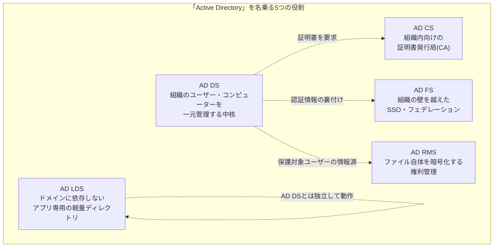

## はじめに

- **この記事で得られること**: サーバーマネージャーの役割追加画面を開くと、「Active Directory Domain Services」の他に「Active Directory Certificate Services」「Active Directory Federation Services」「Active Directory Lightweight Directory Services」「Active Directory Rights Management Services」という、似た名前の役割がいくつも並んでいます。これらが同じ「Active Directory」を名乗りながら、なぜ中身も用途もまったく異なるのか、それぞれが何のために存在し、いつ使うものなのかを体系的に整理します。あわせて、AD FSとAD RMSが現在の製品戦略の中でどう位置づけられているのかという、実務上重要な文脈も扱います。
- **対象読者**: 本シリーズでここまでAD DS(ドメインコントローラーの実体)を中心に学んできて、「そういえばAD CSやAD FSって役割追加の画面で見たことがあるけど、AD DSと何が違うんだっけ」という疑問を持っている方を想定しています。
- **読むのにかかる想定時間**: 約17分

この記事は[『上位1%』シリーズ 全記事ガイド](/sitemap)の一部、[Active Directoryシリーズ](/sitemap#シリーズ一覧)の18本目です。[ADとDC、ドメインとフォレストの違い](/articles/ad-dc-fundamentals-guide)を先に読んでおくと、AD DSとの対比がスムーズに理解できます。

## 前提知識

- **AD DS(Active Directory Domain Services)**: 本シリーズでここまで扱ってきた、ユーザー・コンピューター・グループを一元管理するディレクトリサービスの中核です。詳しくは[ADとDC、ドメインとフォレストの違い](/articles/ad-dc-fundamentals-guide)を参照してください。
- **LDAP**: ディレクトリサービスに対して検索・追加・変更・削除を行うための標準プロトコルです。本記事で扱う役割の一部は、このLDAPという「共通言語」を土台に作られています。
- **サーバーの役割(Server Role)**: Windows Serverにおいて、サーバーマネージャーから追加・削除できる機能単位です。1台のサーバーに複数の役割を同居させることも、役割ごとに専用サーバーを分けることもできます。

## 全体像をつかむ

### 一言で言うと

**「Active Directory」を名乗る役割は5つありますが、これらは1つの技術の派生形ではなく、「ディレクトリサービスという共通の設計思想・ブランド名」を共有しているだけの、目的も実装もまったく異なる5つの独立した製品です。** AD DSが「組織のユーザー・コンピューターを管理する中核」であるのに対し、AD CSは「証明書を発行する」、AD FSは「組織の壁を越えてSSOを実現する」、AD LDSは「AD DSに依存しない軽量なディレクトリをアプリ専用に持つ」、AD RMSは「ファイルそのものを暗号化して利用を制限する」という、まったく別の課題を解決するために存在します。

「Active Directory」という言葉のブランド力の強さゆえに、Microsoftは「ディレクトリサービスの考え方を応用した製品」全般にこの名前を冠してきました。この命名の経緯を知らずに個別の役割名だけを見ると、「AD DSの拡張機能の1つ」だと誤解しやすいのが、この分野の分かりにくさの正体です。

## 基礎から徹底解説

### AD CS(Active Directory Certificate Services):組織内向けの認証局

AD CSは、組織内で使うデジタル証明書を発行・管理するための**認証局**(CA: Certificate Authority)をAD DSと統合した形で構築できる役割です。社内Webサーバーの証明書、無線LAN(802.1X)のクライアント証明書、スマートカードログオン用の証明書、コード署名用の証明書などを、外部の商用認証局を使わずに社内で発行・自動更新できます。

AD DSと統合されている最大の利点は、**証明書テンプレート**と**自動登録**(Autoenrollment)です。グループポリシーで「ドメイン参加済みの全PCに、この種類の証明書を自動的に配布・更新する」という設定ができ、証明書の発行・更新作業を手動で行わずに済みます。ルートCA(最上位の信頼の起点)とサブ(発行)CAという階層構造を組み、ルートCAは通常ネットワークから切り離して厳重に保管する、というのが典型的な構成です。

### AD FS(Active Directory Federation Services):組織の壁を越えたSSO

AD FSは、**クレームベース認証**という仕組みを使い、組織の外にあるWebアプリケーションやパートナー企業のシステムに対して、AD DSの認証情報だけでシングルサインオン(SSO)できるようにする役割です。AD DSのKerberos認証は、原則として同じフォレスト内(または信頼関係のあるドメイン間)でしか機能しませんが、AD FSは**SAMLやWS-Federation**といった標準プロトコルを使い、フォレストの外、さらには組織の外にあるサービス(SaaSアプリケーションなど)に対しても、AD DSでの認証結果を「クレーム」という形の署名付きトークンとして引き渡します。

AD FSと、AD DSの信頼関係(フォレスト間トラスト)は何が違うのか

AD DSにも、別のフォレストと信頼関係を結ぶ「フォレスト間トラスト」という仕組みがありますが、これはあくまで**Kerberos/NTLMという同じ認証プロトコルの世界の中**で、信頼するフォレストの範囲を広げる仕組みです。一方AD FSは、そもそも**SAMLやOAuth/OIDCといった、Kerberosとは別の標準に変換して**社外へ引き渡すため、相手が同じActive Directoryを使っている必要すらありません。相手がGoogle Workspaceだろうと自社開発のWebアプリだろうと、SAML/OIDCさえ話せれば連携できる、というのがAD FSの守備範囲です。

**実務上の重要な注意点として、Microsoftは新規のクラウド識別基盤としてAD FSではなくMicrosoft Entra ID(旧Azure AD)への移行を強く推奨しています。** 条件付きアクセス、フィッシング耐性のある多要素認証、リスクベースの制御といった新しい機能はEntra ID側に集中的に投資されており、AD FS自体はサポートが継続されているものの、新機能はほとんど追加されていません。オンプレミスADとクラウドを橋渡しする既存のAD FS環境がある場合、将来的にはEntra IDへの移行(またはEntra Connectを使ったハイブリッド構成)を検討する時期に来ている、というのが現在地です。

### AD LDS(Active Directory Lightweight Directory Services):ドメインに依存しない軽量ディレクトリ

AD LDSは、AD DSと同じLDAPベースのディレクトリサービスでありながら、**ドメインやフォレストへの参加を一切必要としない**、独立したディレクトリのインスタンスです。1台のサーバー上に、アプリケーションごとに複数の独立したAD LDSインスタンスを同時に稼働させることができ、それぞれが独自のスキーマ(データ構造の定義)を持てます。

これが解決する課題は、「Webアプリケーションが認証・ユーザー情報のためにLDAPディレクトリを必要としているが、そのためだけに社内の本番AD DSのスキーマを拡張したり、DMZに本物のドメインコントローラーを置いたりしたくない」というケースです。AD DSのスキーマ拡張はフォレスト全体に影響する重い操作であり、外部公開用アプリケーション1つのためにそれを行うのはリスクに見合いません。AD LDSであれば、そのアプリケーション専用の使い捨て可能なディレクトリを、本番AD DSから完全に隔離して用意できます。DMZに置く拡張認証用ディレクトリや、マルチテナントSaaSでテナントごとに個別のディレクトリインスタンスを持たせる用途などで使われます。

### AD RMS(Active Directory Rights Management Services):ファイル自体を暗号化する権利管理

AD RMSは、これまでの4つとは発想が異なり、「誰がアクセスできるか」ではなく「**アクセスできた後に何をしていいか**」を制御する役割です。Word文書やメールを暗号化し、「閲覧はできるが印刷・転送・コピーは禁止」といったルールをファイル自体に埋め込みます。このルールは、ファイルが社内ネットワークの外に持ち出された後も、ファイルに紐付いたまま有効であり続けます。

**AD RMSは現在、Microsoftの製品戦略においては非推奨(legacy)の位置づけです。** クラウド版の後継である**Microsoft Purview Information Protection**(旧Azure Information Protection、Azure RMS)への移行が推奨されており、Windows Server 2025でも後方互換性のために引き続き提供され、OSのサポート期間中はセキュリティ修正も提供されますが、新機能の追加は計画されていません。既存のAD RMS環境を新規構築する理由は、現在ではほぼ無くなっています。

## プロが見ている視点(上位1%の理解)

### なぜ全部「Active Directory」を名乗っているのか

5つの役割の実装はまったく別物ですが、共通しているのは「**ディレクトリサービスという設計思想・ブランドを土台にしている**」という点です。AD DS・AD LDSはどちらもLDAPベースの階層型ディレクトリそのものです。AD CS・AD FS・AD RMSは、ディレクトリそのものではありませんが、いずれもAD DS上のユーザー・コンピューター情報を**信頼の起点**として利用する設計になっています(AD CSは証明書の発行対象を、AD FSは認証済みユーザーの属性を、AD RMSは保護対象ファイルの許可ユーザー一覧を、それぞれAD DSから引いてきます)。この「AD DSを信頼の起点として使う」という共通パターンこそが、名前を共有している技術的な根拠です。上位1%のエンジニアは、新しい役割名を見たときに「これはAD DSそのものの拡張なのか、それともAD DSを土台にした別の課題を解決する製品なのか」をまず切り分けます。

AD CS・AD FS・AD RMSは、AD DSがなくても動くのか

結論として、**AD LDSだけがAD DSから完全に独立していて、残りの3つ(AD CS・AD FS・AD RMS)は、実務上はAD DSを前提として構築されます。** ただし前提の強さには差があります。**AD CS**は技術的には「スタンドアロンCA」というAD DSに参加しないモードでも動作しますが、証明書テンプレートの管理やクライアントへの自動配布・自動更新といった、AD CSならではの利便性の大半は「エンタープライズCA」というAD DS統合モードでのみ得られるため、実務でAD DSなしにAD CSを選ぶ理由はほとんどありません。**AD FSとAD RMS**は、認証・権利管理の対象となるユーザー・グループの情報をそもそもAD DSから取得する設計になっているため、事実上AD DSが必須の前提条件です。

## よくある誤解・つまずきポイント

- **誤解1: 「AD FSを入れれば、AD DSの機能が自動的に社外にも拡張される」**
  AD FSは、AD DSとは別の役割として明示的に構築・設定する必要があり、KerberosをSAML/WS-Federationに変換するための独立したインフラです。AD DSに何かを追加インストールするだけで自動的に得られる機能ではありません。
- **誤解2: 「AD LDSは、AD DSの機能を減らした劣化版にすぎない」**
  AD LDSはAD DSのサブセットではなく、「ドメイン参加が不要」「独自スキーマを持てる」「1台に複数インスタンスを同居できる」という、AD DSにはない特性を持つ別製品です。用途が違うのであって、優劣の関係ではありません。
- **誤解3: 「AD RMSを導入すれば、Microsoft Purview Information Protectionと同じことができる」**
  AD RMSはオンプレミス専用の旧世代の実装であり、新機能の追加が計画されていない非推奨の位置づけです。新規に情報保護基盤を構築するなら、クラウド版のMicrosoft Purview Information Protectionが現在の推奨経路です。

## 障害・トラブルシューティングの視点

この記事で扱った役割は、いずれも「そもそも導入すべきかどうか」の判断ミスが最大のトラブルの原因になります。

1. **「証明書が必要になったので、とりあえずAD CSを入れる」の前に**: 社内利用限定の証明書か、インターネット公開サーバー用の証明書かを確認します。外部公開サーバーには、ブラウザに標準で信頼されている商用CAの証明書を使うのが原則です。
2. **「外部の業務委託先にもADのアカウントでログインさせたい」と言われたら**: フォレスト間トラストで安易に信頼関係を広げるのではなく、AD FS(あるいはさらに新しいEntra ID)によるクレームベースの連携を検討します。フォレスト間トラストは相手側フォレストの全体を信頼範囲に含めてしまうため、外部委託先との連携には不釣り合いに広い信頼を与えることになりがちです。
3. **「このアプリのためだけにAD DSのスキーマを拡張してほしいと言われたら」**: 本当にAD DSのスキーマ拡張が必要なのか、AD LDSで独立したディレクトリを用意する方が安全ではないかを、まず検討します。スキーマ拡張はフォレスト全体に影響し、後戻りが難しい操作です。

### 予防策・恒久対策

- 新しい役割を追加する前に、「これはAD DSそのものを拡張するのか、AD DSを土台にした別の独立した製品なのか」を必ず切り分ける。
- AD FS・AD RMSについては、新規構築の前に必ずMicrosoft Entra ID・Microsoft Purview Information Protectionへの移行が現実的な選択肢ではないかを検討する。
- AD DSのスキーマ拡張が必要だと言われたら、AD LDSで代替できないかを先に検討する。

## まとめ

- 「Active Directory」を名乗る役割は、AD DS(組織のユーザー・コンピューター管理の中核)・AD CS(社内向け証明書発行局)・AD FS(組織の壁を越えたSSO)・AD LDS(ドメインに依存しない軽量ディレクトリ)・AD RMS(ファイル自体の権利管理)の5つがあり、それぞれ目的も実装もまったく異なります。
- 共通しているのは、AD DS上の情報を「信頼の起点」として利用する設計思想であり、この共通パターンが名前を共有している技術的な根拠です。
- AD FSは新機能投資がMicrosoft Entra IDに移っており、AD RMSは非推奨でMicrosoft Purview Information Protectionへの移行が推奨されている、という現在の製品戦略上の位置づけを踏まえて、新規構築の判断をする必要があります。

**今日から意識すべきこと**
1. 新しい役割の追加を検討するときは、まず「AD DSそのものの拡張か、独立した別製品か」を切り分けましょう。
2. AD FS・AD RMSの新規構築を検討する前に、Entra ID・Microsoft Purview Information Protectionへの移行が現実的でないかを確認しましょう。

## 参考文献

- [Active Directory Lightweight Directory Services | Microsoft Learn](https://learn.microsoft.com/en-us/previous-versions/windows/desktop/adam/active-directory-lightweight-directory-services)
- [Why Use Active Directory Lightweight Directory Services | Microsoft Learn](https://learn.microsoft.com/en-us/previous-versions/windows/desktop/adam/why-use-active-directory-lightweight-directory-services-)
- [Compare the Azure Rights Management service with AD RMS | Microsoft Learn](https://learn.microsoft.com/en-us/azure/information-protection/compare-on-premise)
- [Is ADFS End of Life? Status and Migration Path](https://www.datawiza.com/blog/adfs-migration)
