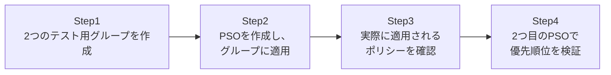

## はじめに

- **この記事で得られること**: 「1つのドメインには1つのパスワードポリシーしか設定できない」という、AD DSの古くからの制約を実際に乗り越える**きめ細かいパスワードポリシー**(Fine-Grained Password Policy、以下PSO)を、実際に作成・適用して体験します。IT管理者グループにはより厳格なパスワード要件を、一般社員グループには標準的な要件を、同じドメイン内で共存させる方法と、PSOにまつわる実務上の落とし穴を扱います。
- **対象読者**: 「ドメインのパスワードポリシーを部署ごとに変えたい」と思ったことがあるが、Default Domain Policyを編集する以外の方法を知らない方を想定しています。
- **読むのにかかる想定時間**: 約20分(実際に構築しながら進める場合は45分程度を見込んでください)

この記事は[『上位1%』シリーズ 全記事ガイド](/sitemap)の一部、[Active Directoryシリーズ](/sitemap#シリーズ一覧)の29本目です。

## 前提知識

- **ドメイン機能レベル**: PSOの利用には、ドメイン機能レベルがWindows Server 2008以上である必要があります。詳しくは[ADとDC、ドメインとフォレストの違い](/articles/ad-dc-fundamentals-guide)を参照してください。

## そもそも、なぜPSOが必要なのか

AD DSのパスワードポリシー(パスワードの長さ、複雑性要件、有効期限など)は、伝統的にはDefault Domain Policyという1つのGPOに設定され、**そのドメイン全体にただ1つだけ適用されます。** 「IT管理者アカウントだけはもっと長いパスワードを要求したい」と思っても、GPOをOU単位でいくら工夫してリンクしても、パスワードポリシー関連の設定だけは、通常のGPOの継承・優先順位のルールに従いません。**これがPSO登場以前、多くの管理者を悩ませてきた制約でした。** PSOは、この制約を迂回するための、GPOとは別の専用の仕組みです。

## 全体像をつかむ

このハンズオンで行うことは、次の4ステップです。



## ハンズオン手順

### Step 1: 2つのテスト用グループを作成する

異なるパスワード要件を適用したい、2つのグローバルグループを作成します。

```powershell
New-ADGroup -Name "ITAdmins" -Path "DC=example,DC=com" -GroupScope Global
New-ADGroup -Name "GeneralStaff" -Path "DC=example,DC=com" -GroupScope Global
New-ADUser -Name "itadmin1" -Path "DC=example,DC=com" -Enabled $true -AccountPassword (ConvertTo-SecureString "P@ssw0rd123!" -AsPlainText -Force)
Add-ADGroupMember -Identity "ITAdmins" -Members "itadmin1"
```

### Step 2: PSOを作成し、グループに適用する

`ITAdmins`グループに、より厳格なパスワード要件(最小文字数14文字、有効期限60日)を適用するPSOを作成します。

```powershell
New-ADFineGrainedPasswordPolicy -Name "ITAdmins-StrictPolicy" `
    -Precedence 10 `
    -MinPasswordLength 14 `
    -MaxPasswordAge "60.00:00:00" `
    -ComplexityEnabled $true `
    -PasswordHistoryCount 24

Add-ADFineGrainedPasswordPolicySubject -Identity "ITAdmins-StrictPolicy" -Subjects "ITAdmins"
```

**ここで一番押さえてほしいのは、`Add-ADFineGrainedPasswordPolicySubject`で指定できる対象が「ユーザーまたはグローバルセキュリティグループ」に限られるという点です。** OUを直接指定することはできません。組織図に合わせてOU単位で管理したい場合は、そのOU配下のユーザーを含む「シャドーグループ」と呼ばれる、PSO適用専用のグローバルグループを別途用意する必要があります。

### Step 3: 実際に適用されるポリシーを確認する

`itadmin1`ユーザーに、実際にどのパスワードポリシーが適用されるかを確認します。

```powershell
Get-ADUserResultantPasswordPolicy -Identity "itadmin1"
```

`MinPasswordLength`が14になっていれば、PSOが正しく適用されています。一方、`GeneralStaff`グループのユーザーに対して同じコマンドを実行すると、PSOが適用されるグループに所属していないため、Default Domain Policyの標準的な設定がそのまま返ってきます。

### Step 4: 2つ目のPSOで優先順位(Precedence)を検証する

`ITAdmins`グループに対して、内容の異なるもう1つのPSOを追加で適用してみます。

```powershell
New-ADFineGrainedPasswordPolicy -Name "ITAdmins-LenientPolicy" `
    -Precedence 5 `
    -MinPasswordLength 8 `
    -MaxPasswordAge "90.00:00:00" `
    -ComplexityEnabled $true `
    -PasswordHistoryCount 12

Add-ADFineGrainedPasswordPolicySubject -Identity "ITAdmins-LenientPolicy" -Subjects "ITAdmins"
```

再度`Get-ADUserResultantPasswordPolicy -Identity "itadmin1"`を実行してください。**`MinPasswordLength`が14ではなく8になっているはずです。** これは、`ITAdmins-LenientPolicy`の`Precedence`(10ではなく5)の方が、数値として小さいためです。**PSOのPrecedenceは、数値が小さいほど優先順位が高いというルールになっています。**

## プロが見ている視点(上位1%の理解)

### Precedenceの数値の向きを、GPOのリンク順と混同しない

PSOのPrecedenceは「数値が小さいほど優先」というルールですが、これは通常のGPOのリンク順の直感([GPOを実際に作成・リンクし、優先順位とトラブルシューティングを体験する『上位1%』のハンズオン](/articles/ad-gpo-handson-guide)で扱った、子OUが親OUより優先されるという考え方)とは全く別のルールです。**PSOはGPOと違い、AD DS内の独立したオブジェクト(`msDS-PasswordSettings`)として存在し、GPOの継承・優先順位のルールを一切経由しません。** この点を混同すると、「なぜGPOのように振る舞わないのか」と混乱することになります。

### PSOを設計するときの実務上のコツ

同じユーザーが、複数のPSOが適用されるグループに同時に所属することは、実務では珍しくありません(例えば`ITAdmins`にも`AllStaff`にも所属している場合など)。この場合、最終的に適用されるのは、Precedenceの数値が最も小さい、たった1つのPSOだけです。**複数のPSOの設定が「マージされる」ことはありません。** 意図しないPrecedenceの衝突を避けるため、PSOごとに命名規則やコメントで意図を明示し、Precedenceの数値を10刻み(10, 20, 30…)のように余裕を持って割り振っておくと、後から中間の優先順位のPSOを差し込みやすくなります。

## よくある誤解・つまずきポイント

- **誤解1: 「PSOはOUに直接リンクできる」**
  PSOが適用できるのは、ユーザーまたはグローバルセキュリティグループのみです。OU単位で管理したい場合は、シャドーグループを用意する必要があります。
- **誤解2: 「PSOを作成すれば、Default Domain PolicyのパスワードポリシーはもうAD DSから使われなくなる」**
  PSOが適用されないユーザー・グループには、引き続きDefault Domain Policyのパスワードポリシーが適用されます。
- **誤解3: 「1人のユーザーに複数のPSOが適用される場合、それぞれの設定のうち厳しい方が全部マージされて適用される」**
  マージは行われません。Precedenceの数値が最も小さい、たった1つのPSOだけが適用されます。

## 障害・トラブルシューティングの視点

1. **PSOを作成・適用したのに、`Get-ADUserResultantPasswordPolicy`で反映されない**: 対象がユーザーまたはグローバルセキュリティグループになっているか、そしてそのグループにユーザーが実際に所属しているかを確認する。
2. **意図しないPSOが適用されている**: そのユーザーが所属する全グループに対して、それぞれどのPSOが適用されているかを`Get-ADFineGrainedPasswordPolicy -Filter *`で洗い出し、Precedenceの数値を比較する。
3. **ドメイン機能レベルの制約でPSOが作成できない**: `Get-ADDomain`でドメイン機能レベルを確認し、Windows Server 2008以上になっているかを確認する。

### 予防策・恒久対策

- PSOのPrecedenceは、後から中間の優先順位を差し込めるよう、10刻みなど余裕を持った数値で運用する。
- OU単位でパスワードポリシーを管理したい場合は、最初からシャドーグループの運用ルールを明確に文書化しておく。
- 新しいPSOを追加したら、必ず対象となるユーザーで`Get-ADUserResultantPasswordPolicy`を実行し、意図した設定が実際に適用されているかを確認する。

## まとめ

- Default Domain Policyのパスワードポリシーは、ドメイン全体にただ1つだけ適用され、通常のGPOのようにOU単位で使い分けることはできません。
- PSO(きめ細かいパスワードポリシー)を使うと、ユーザーまたはグローバルセキュリティグループ単位で、異なるパスワード要件を適用できます。
- PSOはOUに直接リンクできないため、OU単位で管理したい場合はシャドーグループが必要です。
- 複数のPSOが同じユーザーに適用される場合、マージされることはなく、Precedenceの数値が最も小さい、たった1つのPSOだけが適用されます。

**今日から意識すべきこと**
1. 「特定の部署だけパスワード要件を変えたい」という要望が来たら、GPOではなくPSOで解決できないかをまず検討しましょう。
2. PSOを設計するときは、Precedenceの数値に余裕を持たせておきましょう。

## 参考文献

- [Fine-Grained Password Policies | Microsoft Learn](https://learn.microsoft.com/en-us/windows-server/identity/ad-ds/get-started/adac/introduction-to-active-directory-administrative-center-enhancements--level-100-)
- [New-ADFineGrainedPasswordPolicy | Microsoft Learn](https://learn.microsoft.com/en-us/powershell/module/activedirectory/new-adfinegrainedpasswordpolicy)
