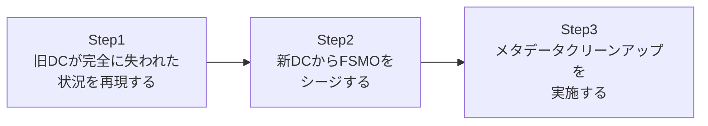

## はじめに

- **この記事で得られること**: [旧DCから新DCへのAD移行(リプレース)ハンズオン](/articles/ad-migration-handson-guide)では、旧DCが生きている状態での、正規の**転送**(Transfer)によるFSMOロールの移動を扱いました。この記事では、それとは対極にある状況、つまり**旧DCが火災・ハードウェア障害などで完全に失われ、二度と起動できない**という災害シナリオを想定し、FSMOロールを強制的に奪取する**シージ**(Seize)を、実際に手を動かして体験します。
- **対象読者**: FSMOの転送は実施したことがあるが、シージという最終手段を実際に試したことがなく、その重大さを体感していない方を想定しています。
- **読むのにかかる想定時間**: 約20分(実際に構築しながら進める場合は45分程度を見込んでください)

この記事は[『上位1%』シリーズ 全記事ガイド](/sitemap)の一部、[Active Directoryシリーズ](/sitemap#シリーズ一覧)の34本目です。

## 前提知識

- [FSMO(操作マスター)とは何かを『上位1%』の視点で理解する](/articles/fsmo-guide): 5つのFSMOロールの意味と、転送とシージの違いについて、この記事の前提になっています。
- [旧DCから新DCへのAD移行(リプレース)ハンズオン](/articles/ad-migration-handson-guide): 正規の転送手順について、この記事と対比する形で前提になっています。

## 全体像をつかむ

このハンズオンで行うことは、次の3ステップです。



## ハンズオン手順

### Step 1: 旧DCが完全に失われた状況を再現する

このハンズオンでは、`OLD-DC01`というDCが、ハードウェア障害によって完全に失われ、二度と起動できない、という状況を想定します。検証環境では、実際に`OLD-DC01`をシャットダウンし、ネットワークから切り離した状態にしてください。

```powershell
Stop-Computer -ComputerName "OLD-DC01" -Force
```

**このハンズオンの前提は「`OLD-DC01`は絶対に復旧しない」という一点に尽きます。** もし後から`OLD-DC01`が復旧する可能性が少しでも残っているなら、シージではなく、まず復旧を試みるべきです。

### Step 2: 新DCからFSMOをシージする

生き残っている`NEW-DC01`から、`ntdsutil`を使って、`OLD-DC01`が保持していたFSMOロールをシージします。

```
ntdsutil
roles
connections
connect to server NEW-DC01
quit
seize schema master
seize naming master
seize pdc
seize rid master
seize infrastructure master
quit
quit
```

**「シージ」という単語が示す通り、これは正規の持ち主の同意を得た「転送」ではなく、強制的な「奪取」です。** [FSMO(操作マスター)とは何か](/articles/fsmo-guide)で扱った通り、複数のDCが同時にこれらの役割を実行してしまうと、AD DSに深刻な矛盾が生じます。だからこそ、シージを実行した後は、次のステップが絶対に欠かせません。

### Step 3: メタデータクリーンアップを実施する

**シージを実行した後、`OLD-DC01`を二度とネットワークに接続してはいけません。** もし`OLD-DC01`が、自分がまだFSMOロールを保持していると思い込んだまま復活してしまうと、`NEW-DC01`と`OLD-DC01`の両方が、同時に同じFSMOロールを実行しているつもりになり、AD DS全体に深刻な不整合が生じます。これを防ぐため、AD DS上に残っている`OLD-DC01`の情報を、完全に削除する**メタデータクリーンアップ**を実施します。

```powershell
Get-ADDomainController -Filter {Name -eq "OLD-DC01"} | Remove-ADDomainController -Force
```

**このステップこそが、シージという手続き全体の中で、最も重要かつ見落とされがちな部分です。** シージそのものよりも、「もう戻ってこないはずの旧DCの情報を、AD DSからきちんと消し去る」という後始末の方に、実務上のリスクが集中しています。

## プロが見ている視点(上位1%の理解)

### なぜ「まず復旧を試みるべき」なのか

シージは、実行してしまうと後戻りができない、最終手段です。もし旧DCがネットワークの一時的な不調で切断されているだけであれば、その回復を待って正規の転送を行う方が、はるかに安全です。**「シージすべきかどうか」を判断する基準は、技術的な難易度ではなく、「その旧DCが物理的に、あるいは論理的に、本当に二度と復旧しないと言い切れるかどうか」という一点に尽きます。** この判断を誤り、実は復旧可能だった旧DCに対してシージを実行してしまうと、Step 3で説明した「同じFSMOロールを2台のDCが同時に持っている」という、深刻な事故につながります。

### RIDマスターのシージが、特に慎重を要する理由

5つのFSMOロールの中でも、RIDマスターのシージは特に注意が必要です。RIDマスターは、各DCに、新しいセキュリティプリンシパル(ユーザーやコンピューターなど)を作成する際に使うRIDの割り当てプールを配布する役割を持っています。**RIDマスターをシージした後、万が一旧DCが復活してしまうと、旧DCと新DCの両方が、同じRIDプールから重複したRIDを配布してしまう可能性があり**、これは同じフォレスト内に、実質的に同じSIDを持つ、区別のつかない2つのセキュリティプリンシパルが生まれる、という致命的な事態につながりかねません。RIDマスターをシージした後は、[FSMO(操作マスター)とは何か](/articles/fsmo-guide)で扱った、RIDプールの割り当て済み範囲を意図的に無効化する追加の安全対策(`m:` オプションを使った`Set-ADObject`によるRID poolの調整)を検討することが、上位1%の実務対応です。

## よくある誤解・つまずきポイント

- **誤解1: 「シージは、転送よりも速くFSMOを移動できる、便利な代替手段である」**
  シージは、旧DCが完全に失われた場合の最終手段であり、旧DCが生きている限りは、常に正規の転送を優先すべきです。
- **誤解2: 「シージが完了すれば、それで作業は終わりである」**
  シージ後は、旧DCを二度とネットワークに接続しないこと、そしてメタデータクリーンアップの実施が必須です。
- **誤解3: 「シージした旧DCは、いずれ問題が解決すればネットワークに戻してよい」**
  シージした旧DCをネットワークに戻すことは、絶対に避けるべきです。戻す必要がある場合は、OSを再インストールし、まったく新しいDCとして再構築する必要があります。

## 障害・トラブルシューティングの視点

1. **シージ後、レプリケーションエラーが多発するようになった**: メタデータクリーンアップが正しく完了しているかを、`repadmin /showrepl`で確認してください。
2. **シージした旧DCを誤ってネットワークに接続してしまった**: 直ちにネットワークから切り離し、両方のDCでFSMOロールの現在の保持者を`netdom query fsmo`で確認し、矛盾がないかを確認してください。矛盾が見つかった場合は、専門的な復旧手順が必要になる可能性があります。
3. **シージ自体のコマンドが失敗する**: 実行しているアカウントが、Enterprise Adminsなど、シージに必要な権限を持っているかを確認してください。

## まとめ

- シージは、旧DCが完全に失われ、二度と復旧しない場合の最終手段であり、生きている限りは正規の転送を優先すべきです。
- シージを実行した後は、旧DCを二度とネットワークに接続してはならず、必ずメタデータクリーンアップを実施する必要があります。
- 特にRIDマスターのシージ後は、RIDの重複割り当てを防ぐための追加対策が推奨されます。
- シージした旧DCを再利用する場合は、OSを再インストールし、まったく新しいDCとして再構築する必要があります。

**今日から意識すべきこと**
1. FSMOの移行が必要になったら、まず「旧DCは本当に二度と復旧しないのか」を厳しく自問しましょう。
2. シージを実行したら、メタデータクリーンアップを、その場で必ずセットで実施する習慣をつけましょう。

## 参考文献

- [Seize an operations master role | Microsoft Learn](https://learn.microsoft.com/en-us/troubleshoot/windows-server/identity/seize-or-transfer-operations-master-roles-in-ad-ds)
- [Clean up server metadata | Microsoft Learn](https://learn.microsoft.com/en-us/windows-server/identity/ad-ds/manage/remove-metadata)
