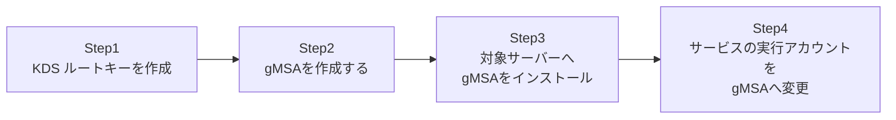

## はじめに

- **この記事で得られること**: 従来のサービスアカウントには、管理者が手動で設定し、定期的に手動でローテーションしなければならない、静的なパスワードが存在していました。この記事では、**AD DS自身がパスワードを自動生成し、自動的にローテーションしてくれる**、**gMSA**(group Managed Service Account、グループ管理サービスアカウント)を実際に構築し、サービスアカウントのパスワード管理という重荷から解放される感覚を体験します。
- **対象読者**: サービスアカウントのパスワードを、Excelやパスワード管理ツールに書き留めて手動管理している方を想定しています。
- **読むのにかかる想定時間**: 約20分(実際に構築しながら進める場合は45分程度を見込んでください)

この記事は[『上位1%』シリーズ 全記事ガイド](/sitemap)の一部、[Active Directoryシリーズ](/sitemap#シリーズ一覧)の36本目です。

## 前提知識

- [Kerberos制約付き委任で『ダブルホップ問題』を解決するハンズオン](/articles/ad-constrained-delegation-handson-guide): サービスアカウントが実務でどう使われているかについて、この記事の前提になっています。

## そもそも、なぜ従来のサービスアカウントは問題だったのか

多くの現場では、`svc-app`のような名前のサービスアカウントに、管理者が決めた固定のパスワードを設定し、そのパスワードをどこかにメモしたうえで、サービスの実行アカウントとして登録しています。**このパスワードは、多くの場合、パスワードポリシーで定められた変更期限が来ても実際には変更されません。** なぜなら、パスワードを変更すると、そのアカウントを使っているすべてのサービスの設定も同時に更新しなければならず、更新を1つでも忘れるとサービス障害につながるため、多くの現場では「動いているものには触れない」という判断のもと、何年も同じパスワードが使われ続けているのが実情です。これは、セキュリティ上、明確なリスクです。

## 全体像をつかむ

このハンズオンで行うことは、次の4ステップです。



## ハンズオン手順

### Step 1: KDS ルートキーを作成する

gMSAのパスワードは、**KDS(Key Distribution Services)ルートキー**と呼ばれる、フォレスト共通の鍵をもとに、AD DS自身が自動生成します。まだ作成していない場合は、フォレストに1つだけ作成します。

```powershell
Add-KdsRootKey -EffectiveTime ((Get-Date).AddHours(-10))
```

**`-EffectiveTime`で過去の時刻を指定している点に注目してください。** 本番環境では、このKDSルートキーがすべてのDCへ確実に複製されるのを待つため、既定では作成から**約10時間**、gMSAを実際には利用できません。検証環境で今すぐ動作を確認したい場合に限り、このように有効時刻を過去にずらすことで、待ち時間なしで先に進めます。

### Step 2: gMSAを作成する

このgMSAの利用を許可するサーバー(今回は`WebSrv01`)を対象に、gMSAアカウントを作成します。

```powershell
New-ADServiceAccount -Name "gmsa-webapp" -DNSHostName "gmsa-webapp.example.com" -PrincipalsAllowedToRetrieveManagedPassword "WebSrv01$"
```

**`-PrincipalsAllowedToRetrieveManagedPassword`で指定したコンピューター(またはグループ)だけが、このgMSAの現在のパスワードを取得できます。** ここに指定されていないサーバーは、たとえこのgMSAをサービスの実行アカウントとして設定しようとしても、パスワードを取得できずに失敗します。

### Step 3: 対象サーバーへgMSAをインストールする

`WebSrv01`にログオンし、このgMSAを利用可能な状態にします。

```powershell
Install-ADServiceAccount -Identity "gmsa-webapp"
Test-ADServiceAccount -Identity "gmsa-webapp"
```

`Test-ADServiceAccount`が`True`を返せば、`WebSrv01`がこのgMSAのパスワードを正しく取得できる状態になっています。

### Step 4: サービスの実行アカウントをgMSAへ変更する

対象のWindowsサービスの実行アカウントを、このgMSAへ変更します。

```powershell
Set-Service -Name "MyAppService" -Credential (New-Object System.Management.Automation.PSCredential ("EXAMPLE\gmsa-webapp$", (New-Object System.Security.SecureString)))
```

**ここで一番重要なポイントは、パスワードの入力欄に、空のパスワードを渡している点です。** gMSAのアカウント名の末尾には`$`を付け、パスワードは指定しません。Windowsは、このアカウントがgMSAであることを認識すると、パスワードの入力を要求せず、必要なタイミングでAD DSから自動的にパスワードを取得して認証を行います。**管理者が、このアカウントの実際のパスワードを知る必要も、入力する必要も、一切ありません。**

## プロが見ている視点(上位1%の理解)

### gMSAのパスワードは、既定で約30日ごとに自動ローテーションされる

gMSAのパスワードは、`msDS-ManagedPasswordInterval`という属性で設定された間隔(既定では30日)で、AD DS自身によって自動的に更新されます。**この自動更新のたびに管理者が何かする必要は一切なく、gMSAを利用しているサービス側も、裏側でパスワードが変わったことを意識することなく、透過的に新しいパスワードでの認証に切り替わります。** これは、[Netlogonサービスとセキュアチャネルの仕組み](/articles/ad-netlogon-guide)で扱った、コンピューターアカウントのパスワードが自動更新される仕組みと、発想としてよく似ています。

### gMSAと、古い仕組みであるsMSA(スタンドアロン管理サービスアカウント)の違い

gMSAには、さらに古い前身にあたる**sMSA**(standalone Managed Service Account)という仕組みが存在しました。sMSAも自動パスワード管理という発想は同じですが、**1つのsMSAアカウントを、1台のサーバー上でしか使えない**という大きな制約がありました。gMSAは、この制約を取り払い、`PrincipalsAllowedToRetrieveManagedPassword`に複数のサーバー(または、それらを含むグループ)を指定することで、**同じgMSAを、複数台のサーバー(たとえば、負荷分散されたWebサーバー群)で共有できる**ようになった、という点が最大の進化です。

## よくある誤解・つまずきポイント

- **誤解1: 「gMSAのパスワードも、通常のアカウントと同じように手動でリセットできる」**
  gMSAのパスワードは、AD DS自身が完全に自動管理するものであり、管理者が手動で設定・確認することは想定されていません。
- **誤解2: 「KDSルートキーを作成すれば、すぐにgMSAが使える」**
  本番環境では、KDSルートキーがすべてのDCへ複製されるまで、既定で約10時間待つ必要があります。
- **誤解3: 「gMSAは1台のサーバーでしか使えない」**
  これは前身のsMSAの制約です。gMSAは、複数のサーバーで同じアカウントを共有できます。

## 障害・トラブルシューティングの視点

1. **`Test-ADServiceAccount`が`False`を返す**: KDSルートキーの伝播が完了しているか(本番環境なら作成から10時間経過しているか)、そして`PrincipalsAllowedToRetrieveManagedPassword`に対象サーバーが正しく指定されているかを確認してください。
2. **サービスの起動時に認証エラーになる**: サービスの実行アカウント名が、gMSAの`$`付きの正しい形式(`EXAMPLE\gmsa-webapp$`)になっているかを確認してください。
3. **複数サーバーで同じgMSAを使いたいが、片方だけ失敗する**: `PrincipalsAllowedToRetrieveManagedPassword`に、失敗しているサーバーが含まれているかを確認してください。

## まとめ

- gMSAは、AD DS自身がパスワードを自動生成・自動ローテーションする、サービスアカウントの仕組みです。
- KDSルートキーは、本番環境では作成から約10時間、すべてのDCへ複製されるまで待つ必要があります。
- `PrincipalsAllowedToRetrieveManagedPassword`で指定されたサーバーだけが、gMSAのパスワードを取得できます。
- gMSAは、前身のsMSAと違い、複数のサーバーで同じアカウントを共有できます。

**今日から意識すべきこと**
1. 新しいサービスアカウントが必要になったら、まず従来型ではなくgMSAで実現できないかを検討しましょう。
2. 本番環境でKDSルートキーを新規作成する場合は、約10時間の伝播待ち時間を作業計画に織り込みましょう。

## 参考文献

- [Getting Started with Group Managed Service Accounts | Microsoft Learn](https://learn.microsoft.com/en-us/windows-server/security/group-managed-service-accounts/getting-started-with-group-managed-service-accounts)
- [Test-ADServiceAccount | Microsoft Learn](https://learn.microsoft.com/en-us/powershell/module/activedirectory/test-adserviceaccount)
