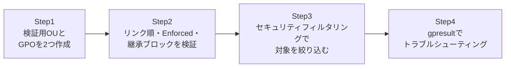

## はじめに

- **この記事で得られること**: [SYSVOL・DFSR・グループポリシーの仕組みを『上位1%』の視点で理解する](/articles/ad-sysvol-dfsr-gpo-guide)で学んだGPC/GPTという仕組みの「理解」を、実際に手を動かして「体で覚える」ための記事です。複数のGPOを作成してリンクし、リンク順・強制(Enforced)・継承のブロックが適用結果にどう影響するかを自分の目で確認します。あわせて、セキュリティフィルタリングによる適用対象の絞り込みと、「GPOが効かない」という実務で非常によくあるトラブルを`gpresult`で切り分ける手順まで扱います。
- **対象読者**: GPOの概念は理解しているが、実際に複数のGPOが競合したときにどちらが勝つのか、確信を持って説明できない方を想定しています。
- **読むのにかかる想定時間**: 約25分(実際に構築しながら進める場合は1時間程度を見込んでください)

この記事は[『上位1%』シリーズ 全記事ガイド](/sitemap)の一部、[Active Directoryシリーズ](/sitemap#シリーズ一覧)の27本目です。

## 前提知識

- [SYSVOL・DFSR・グループポリシーの仕組みを『上位1%』の視点で理解する](/articles/ad-sysvol-dfsr-gpo-guide): GPOがGPC(AD DS内の骨格)とGPT(SYSVOL内の実データ)という2つの場所に分かれて存在すること、この記事の前提になっています。

## 全体像をつかむ

このハンズオンで行うことは、次の4ステップです。



## ハンズオン手順

### Step 1: 検証用のOU構造と、2つのGPOを作成する

まず、親子関係を持つ検証用のOUと、その中にテストユーザーを作成します。

```powershell
New-ADOrganizationalUnit -Name "ParentOU" -Path "DC=example,DC=com"
New-ADOrganizationalUnit -Name "ChildOU" -Path "OU=ParentOU,DC=example,DC=com"
New-ADUser -Name "gpotest1" -Path "OU=ChildOU,OU=ParentOU,DC=example,DC=com" -Enabled $true -AccountPassword (ConvertTo-SecureString "P@ssw0rd123!" -AsPlainText -Force)
```

次に、内容が競合する2つのGPOを作成します。ここでは、Windowsの背景設定の一例として、「壁紙を無効化する」設定を使います。

```powershell
New-GPO -Name "ParentOU-GPO" | New-GPLink -Target "OU=ParentOU,DC=example,DC=com"
New-GPO -Name "ChildOU-GPO" | New-GPLink -Target "OU=ChildOU,OU=ParentOU,DC=example,DC=com"
```

`gpmc.msc`(グループポリシー管理コンソール)を開き、`ParentOU-GPO`と`ChildOU-GPO`それぞれの設定を編集して、「ユーザーの構成 → ポリシー → 管理用テンプレート → デスクトップ → デスクトップ壁紙」を、片方は無効(空文字)、もう片方は別の値に設定してみてください。

### Step 2: リンク順・Enforced・継承のブロックを検証する

`gpotest1`ユーザーでログインし、`gpupdate /force`を実行した後に有効になっている設定を確認します。**ここでまず確認してほしいのは、ParentOU-GPOとChildOU-GPOが競合する設定を持っている場合、ChildOU-GPO(より子に近い、より具体的なOUのGPO)の設定が優先されるという原則です。** 処理順は「ローカル → サイト → ドメイン → OU(親から子へ)」という順番(頭文字を取ってLSDOUと呼ばれます)で行われ、後から処理されたものほど、同じ設定を上書きします。

次に、`ParentOU-GPO`のリンクのプロパティで「**強制(Enforced)**」を有効にしてみてください。`gpupdate /force`を再実行すると、**今度は本来なら優先されるはずのChildOU-GPOの設定ではなく、Enforced化したParentOU-GPOの設定が勝つ**ようになります。Enforcedは、通常の優先順位ルールを覆す、明示的な強制指定だからです。

最後に、`ChildOU`のプロパティで「**継承のブロック**」を有効にしてみてください。ただし、ParentOU-GPO側のEnforcedが有効なままだと、継承をブロックしてもParentOU-GPOの設定は適用され続けることを確認してください。**継承のブロックは、Enforcedの前では無力である**、という優先順位の全体像がここで体感できます。

### Step 3: セキュリティフィルタリングで適用対象を絞り込む

GPOはOU単位でリンクされますが、そのOUの中の「特定のグループのメンバーだけ」に適用したい場合があります。これを実現するのが**セキュリティフィルタリング**です。

```powershell
New-ADGroup -Name "GPOTargetGroup" -Path "OU=ChildOU,OU=ParentOU,DC=example,DC=com" -GroupScope Global
Add-ADGroupMember -Identity "GPOTargetGroup" -Members "gpotest1"

$gpo = Get-GPO -Name "ChildOU-GPO"
Set-GPPermission -Name "ChildOU-GPO" -TargetName "Authenticated Users" -TargetType Group -PermissionLevel None
Set-GPPermission -Name "ChildOU-GPO" -TargetName "GPOTargetGroup" -TargetType Group -PermissionLevel GpoApply
```

**この操作の要点は、既定で付与されている「Authenticated Users」への適用権限を明示的に外し、代わりに任意のグループにだけ「適用」の権限を与えている点です。** GPOのリンク先(OU)と、実際に適用される対象(セキュリティフィルタリングで許可されたユーザー・グループ)は、別のレイヤーの話だということを覚えておいてください。

### Step 4: 「GPOが効かない」を`gpresult`で切り分ける

実務で最も多いのが、「GPOを作ってリンクしたのに、なぜか反映されない」というトラブルです。まず、対象のクライアントで次のコマンドを実行します。

```powershell
gpresult /r /scope:user
```

これは、そのユーザーに実際に適用されている(そして適用されなかった)GPOの一覧を表示してくれます。**「適用されたグループポリシーオブジェクト」の一覧に目的のGPOが出ていなければ、まずそのGPOがそもそもこのユーザーに届いていない**ということです。より詳細なHTMLレポートが欲しい場合は、次のコマンドで生成できます。

```powershell
gpresult /h C:\report.html /f
```

## プロが見ている視点(上位1%の理解)

### 「GPOが効かない」典型的な原因の切り分け順序

`gpresult`で目的のGPOが「適用されたグループポリシーオブジェクト」に出てこない場合、上位1%のエンジニアは次の順番で原因を切り分けます。

1. **リンクが無効化されていないか**: `gpmc.msc`でGPOのリンクが「有効」になっているか確認する。
2. **セキュリティフィルタリングで対象から外れていないか**: Step 3で見たように、リンク先OUに所属していても、セキュリティフィルタリングの許可対象に入っていなければ適用されない。
3. **WMIフィルターで除外されていないか**: GPOにWMIフィルターが設定されている場合、そのクライアントがフィルターの条件(OSバージョンなど)を満たしているか確認する。
4. **継承がブロックされていないか、あるいはリンク順が想定と違わないか**: Step 2で確認した優先順位のルールに従って、期待通りの順序で処理されているか確認する。
5. **単純なレプリケーション遅延**: GPOを作成・変更した直後は、GPC(AD DS側)とGPT(SYSVOL側)がまだ全DCに複製し切っていない可能性がある。クライアントが認証しているDCによっては、まだ変更前の状態が見えていることがある。

この順序で切り分けられるのは、GPOの適用が「リンク→セキュリティフィルタリング→WMIフィルター→優先順位」という複数の独立したレイヤーの掛け算で決まる、という構造を正確に理解しているからです。

## よくある誤解・つまずきポイント

- **誤解1: 「OUにGPOをリンクすれば、そのOU配下の全ユーザー・コンピューターに必ず適用される」**
  セキュリティフィルタリングやWMIフィルターによって、リンク先のOU配下であっても適用対象から除外されることがあります。
- **誤解2: 「子OUのGPOは、常に親OUのGPOより優先される」**
  通常はその通りですが、親OU側のGPOリンクが「強制(Enforced)」になっている場合は、この優先順位が逆転します。
- **誤解3: 「継承のブロックを設定すれば、親OUからのGPOの影響を完全に断ち切れる」**
  継承のブロックは、Enforced化された親OUのGPOには効果がありません。

## 障害・トラブルシューティングの視点

1. **GPOを編集したのに、クライアントに反映されない**: `gpupdate /force`を実行したか確認し、それでも反映されない場合は、GPC/GPTの複製がまだ完了していない可能性を疑い、時間を置くか`repadmin /syncall`でレプリケーションを強制する。
2. **`gpresult`で目的のGPOが「拒否されたグループポリシーオブジェクト」に表示される**: 表示されている拒否理由(セキュリティフィルタリング、WMIフィルター、無効化されたリンクなど)を確認する。
3. **想定と違うGPOの設定が勝っている**: リンク順序とEnforcedの設定を`gpmc.msc`で確認し、Step 2で確認した優先順位のルールと照らし合わせる。

### 予防策・恒久対策

- GPOの命名規則を統一し(例:対象OU名や目的を含める)、`gpmc.msc`で一覧を見ただけでどのGPOが何をするか分かるようにしておく。
- Enforcedは、本当に例外を許したくない全社共通ポリシー(セキュリティベースラインなど)にのみ限定して使い、多用しない。
- GPOを変更した直後は、必ず`gpresult`で対象クライアントへの実際の適用結果を確認してから、変更完了とみなす。

## まとめ

- GPOの優先順位は、基本的にはLSDOU(ローカル→サイト→ドメイン→OU、親から子へ)の順に処理され、後から処理されたものが勝ちます。
- 「強制(Enforced)」は、この優先順位ルールを覆す、明示的な例外指定です。
- 「継承のブロック」は、Enforced化されたGPOには無力です。
- GPOのリンク先(OU)と、実際の適用対象(セキュリティフィルタリング)は別のレイヤーの話です。
- 「GPOが効かない」トラブルは、`gpresult /r`で「適用された/拒否された」の一覧を確認するところから切り分けを始めます。

**今日から意識すべきこと**
1. GPOを新しく作成・変更したら、必ず`gpresult`で対象クライアントへの実際の適用結果を確認する習慣をつけましょう。
2. Enforcedを設定する前に、本当にその優先順位の逆転が必要かどうかを一度立ち止まって考えましょう。

## 参考文献

- [Group Policy Processing and Precedence | Microsoft Learn](https://learn.microsoft.com/en-us/troubleshoot/windows-server/group-policy/group-policy-processing-precedence)
- [gpresult | Microsoft Learn](https://learn.microsoft.com/en-us/windows-server/administration/windows-commands/gpresult)
