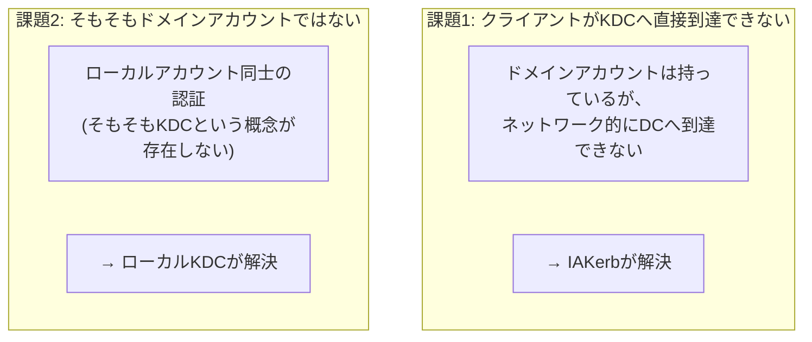
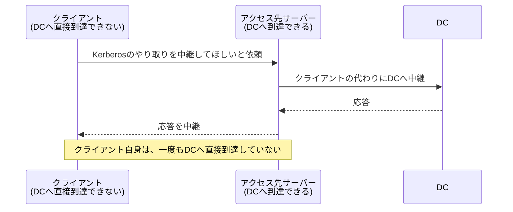

## はじめに

- **この記事で得られること**: [NTLM認証の仕組み](/articles/ad-ntlm-mechanism-guide)で扱った、「非ドメイン参加端末やワークグループ環境は、KDCが存在しないためNTLMに依存している」という構造的な課題に対して、WindowsServer 2025・Windows 11 24H2から展開が始まった、**IAKerb**と**ローカルKDC**という2つの新しい仕組みが、それぞれ何を解決しているのかを理解します。あわせて、「WindowsServer 2025ではNTLMがデフォルトで無効化されている」という、巷でよく語られる説が、実際には不正確であることと、NTLM廃止の正しいロードマップを整理します。
- **対象読者**: NTLM認証の仕組みと、非ドメイン参加端末がNTLMに依存する理由は理解したものの、「じゃあこの依存は今後どう解消されていくのか」を、最新の動向に基づいて説明できない方を想定しています。
- **読むのにかかる想定時間**: 約20分

この記事は[『上位1%』シリーズ 全記事ガイド](/sitemap)の一部、[Active Directoryシリーズ](/sitemap#シリーズ一覧)の13.2本目です。[NTLM認証の仕組み](/articles/ad-ntlm-mechanism-guide)を先に読んでおくことを強く推奨します。

## 前提知識

- **NTLMが非ドメイン参加端末で使われる理由**: [NTLM認証の仕組み](/articles/ad-ntlm-mechanism-guide)で扱った、「Kerberosの前提であるKDCが、非ドメイン参加端末にはそもそも存在しない」という構造的な課題です。
- **Kerberos認証の基本**: [Kerberos認証の仕組み](/articles/ad-kerberos-guide)で扱った、AS-REQ/AS-REP、TGS-REQ/TGS-REPという基本的なやり取りです。

## 全体像をつかむ

NTLMが使われている場面は、実は1つではなく、**異なる2つの課題**に分かれています。IAKerbとローカルKDCは、それぞれ別の課題に対応する、別々の仕組みです。

## 基礎から徹底解説

### 課題1への回答:IAKerb(Initiate and Accept Kerberos)

**IAKerbは、クライアントが、Kerberosのやり取りを行うための、DCへの直接的なネットワーク到達性を持っていない場合に、代わりにアクセス先のサーバー自身に、DCとのやり取りを中継してもらう仕組みです。** [NTLM認証の仕組み](/articles/ad-ntlm-mechanism-guide)で扱った**KDCプロキシ**と、発想そのものは近いものですが、KDCプロキシが専用のサーバー(RDゲートウェイなど)の構築を前提としていたのに対し、**IAKerbは、OS自身に組み込まれた標準機能として、特別なサーバー構築を必要とせずに、この中継を実現します。**

**これにより、「DCへのネットワーク的な到達性がない」という理由だけでNTLMへフォールバックしていた場面(例:社外のネットワークから、VPN経由ではなくリバースプロキシ経由で社内リソースへアクセスする場合など)で、NTLMの代わりにKerberosを使えるようになります。**

### 課題2への回答:ローカルKDC(Local KDC)

**ローカルKDCは、そもそもドメインアカウントではない、ローカルアカウント同士の認証に対して、Kerberosを使えるようにする仕組みです。** [NTLM認証の仕組み](/articles/ad-ntlm-mechanism-guide)で扱った通り、従来、ローカルアカウントには対応するKDCという概念そのものが存在しませんでした。**ローカルKDCは、各端末自身の中に、その端末のローカルアカウント専用の、小さなKDC機能を持たせる**という発想で、この課題を解決します。

「ローカルアカウント専用のKDC」とは、具体的に何が変わるのか

これまでは、たとえば「自分のPCへ、別のPCから、ローカルアカウントの資格情報でリモートデスクトップ接続する」という場面では、NTLMのチャレンジレスポンスに頼るしかありませんでした。**ローカルKDCが有効になると、アクセス先のPC自身が、自分のローカルアカウントに対する小さなKDCとして振る舞い、接続元のPCは、このローカルなKDCに対してKerberosのやり取り(チケットの要求)を行える**ようになります。外部のドメインコントローラーは一切関与しません。

## プロが見ている視点(上位1%の理解)

### 「NTLMがWindowsServer 2025でデフォルト無効化されている」という説は、正確ではない

ここで、よく語られる誤解を正確に訂正しておく必要があります。**WindowsServer 2025自体は、NTLMを引き続きデフォルトで有効のまま提供しています。** WindowsServer 2025が実際に持ち込んだのは、**NTLMの利用状況を監査するための強化されたツール群**と、**IAKerb・ローカルKDCという、NTLMへの依存を減らすための新しい代替手段のプレビュー**です。**NTLMがデフォルトで無効化されるのは、WindowsServer 2025のさらに次の世代(2027〜2028年ごろを予定)からである**、というのが、2026年時点でMicrosoftが公表しているロードマップの実際の内容です。

| フェーズ | 内容 | 時期 |
|---|---|---|
| フェーズ1 | WindowsServer 2025・Windows 11 24H2で、NTLM利用状況の監査強化ツールを提供(NTLMは引き続きデフォルト有効) | 提供済み |
| フェーズ2 | IAKerb・ローカルKDCによる、NTLMフォールバックが発生していた場面の解消 | 2026年後半予定 |
| フェーズ3 | NTLM(ネットワーク認証)が、デフォルトで無効化される | WindowsServer 2025の次世代(2027〜2028年ごろ予定) |

**「クラウドのAMIだから」「新しいOSバージョンだから」という理由だけで、NTLMがすでに無効化されていると思い込んでしまうと、実際の挙動との食い違いに戸惑うことになります。** AWSが提供するWindowsServer 2025のAMIについても、Microsoft自身が提供するOSのデフォルト動作を変更しているという公式な記述は見当たらず、**「AMIでNTLMが無効化されている」という説は、現時点では裏付けが確認できない、不正確な情報として扱うべきです。**

## よくある誤解・つまずきポイント

- **誤解1: 「WindowsServer 2025では、NTLMがデフォルトで無効化されている」**
  WindowsServer 2025自体は、NTLMを引き続きデフォルトで有効にしたまま提供しています。NTLMのデフォルト無効化は、さらに次の世代のOSで予定されている変更です。
- **誤解2: 「IAKerbとローカルKDCは、同じ課題を解決する、同じ仕組みである」**
  IAKerbは「DCへ到達できない」という課題を、ローカルKDCは「そもそもドメインアカウントではない」という課題を、それぞれ別々に解決する、独立した仕組みです。
- **誤解3: 「IAKerbやローカルKDCを有効にすれば、NTLMを今すぐ完全に無効化できる」**
  これらの仕組みは、NTLMへのフォールバックが発生していた場面を、段階的に減らしていくためのものであり、即座にNTLMを完全に廃止できる段階には、まだ至っていません。

## 障害・トラブルシューティングの視点

1. **IAKerbを有効にしたはずなのに、依然としてNTLMへフォールバックしている**: アクセス先のサーバー自身が、DCへの到達性を持っているか、そしてIAKerbによる中継が正しく機能しているかを確認します。
2. **ローカルKDCを使った認証が失敗する**: 接続元・接続先の両方が、ローカルKDCに対応したビルドであるかを確認します(プレビュー機能であるため、対応状況はビルドごとに異なります)。
3. **「NTLMが無効化されているはず」という前提で設計したシステムが、実際にはNTLMで動いていた**: その情報の根拠(公式ドキュメントかどうか)を、必ず確認しましょう。本記事で整理した、実際のロードマップと比較してください。

## まとめ

- IAKerbは、クライアントがDCへ直接到達できない場合に、アクセス先のサーバーがKerberosのやり取りを中継する仕組みです。
- ローカルKDCは、そもそもドメインアカウントではないローカルアカウント同士の認証にも、Kerberosを使えるようにする仕組みです。
- WindowsServer 2025は、NTLMを引き続きデフォルトで有効にしたまま提供しており、NTLMのデフォルト無効化は、さらに次の世代のOSで予定されている変更です。
- 「クラウドのAMIだから」「新しいOSだから」という理由だけでNTLMが無効化されていると思い込むのは、裏付けのない誤解です。

**今日から意識すべきこと**
1. NTLMの挙動に関する情報に出会ったら、その情報が、公式のロードマップのどのフェーズの話なのかを、必ず確認しましょう。
2. 新しいWindowsの機能について調べる際は、「プレビュー段階の機能」と「デフォルトで有効な、確定した仕様」を、明確に区別しましょう。

## 参考文献

- [Advancing Windows Security: Disabling NTLM by Default | Microsoft](https://techcommunity.microsoft.com/)
- [Reducing NTLM Dependency: IAKerb and LocalKDC in Windows Insider Preview | Microsoft Tech Community](https://techcommunity.microsoft.com/blog/windows-itpro-blog/reducing-ntlm-dependency-iakerb-and-localkdc-in-windows-insider-preview/4524615)
- [NTLM Overview | Microsoft Learn](https://learn.microsoft.com/en-us/windows-server/security/kerberos/ntlm-overview)
