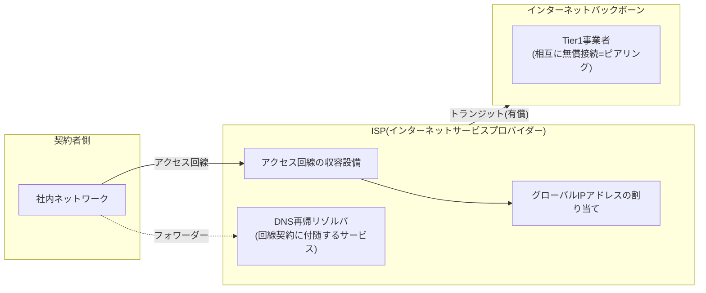

## はじめに

- **この記事で得られること**: [AD環境のDNSはなぜこう設計されているのか](/articles/ad-dns-guide)で、「フォワーダー先にはISPが提供するDNSサーバーやパブリックDNSを指定する」と繰り返し説明してきましたが、この**ISP(インターネットサービスプロバイダー)そのものが何をしている会社なのか**には立ち入りませんでした。この記事では、ISPが実際に提供しているサービスの中身、Tier1・Tier2・Tier3という業界の階層構造、そして実務でよく見かける「なぜ社内DNSの上位(フォワーダー先)に、地元のケーブルテレビ局のDNSサーバーが指定されていることがあるのか」という疑問を、歴史的経緯とともに体系的に理解します。
- **対象読者**: 「ISP」という言葉は日常的に使っているものの、それが具体的に何をしている会社で、どういう仕組みでインターネットへの出入り口を提供しているのかを説明できない方を想定しています。
- **読むのにかかる想定時間**: 約15分

この記事は[『上位1%』シリーズ 全記事ガイド](/sitemap)の一部、[Active Directoryシリーズ](/sitemap#シリーズ一覧)の23本目です。[AD環境のDNSはなぜこう設計されているのか](/articles/ad-dns-guide)を先に読んでおくと、本記事の理解がスムーズです。

## 前提知識

- **フォワーダー**: [AD環境のDNSはなぜこう設計されているのか](/articles/ad-dns-guide)で扱った、社内DNSサーバーが自分で解決できない社外の名前について、あらかじめ設定しておいた特定のDNSサーバーへ問い合わせを転送する仕組みです。
- **アクセス回線**: 利用者の自宅・拠点と、通信事業者の最寄りの設備を結ぶ「最後の1区間」です。ADSL・光回線といった実現方式の違いは[ADSL・光回線などアクセス回線の技術変遷](/articles/access-network-guide)で扱っています。

## 全体像をつかむ

### 一言で言うと

**ISP(Internet Service Provider、インターネットサービスプロバイダー)とは、契約者のアクセス回線を、世界中につながる「インターネット」という1つの巨大なネットワークへ実際に接続してくれる事業者です。** 単に「回線を貸してくれる」だけでなく、多くの場合、契約者にグローバルIPアドレスを割り当てる機能、そして[AD環境のDNSはなぜこう設計されているのか](/articles/ad-dns-guide)で扱った**DNSの再帰リゾルバ**(名前解決の代行サービス)も、回線契約に付随する形で一体的に提供しています。社内DNSのフォワーダー先として「ISPが提供するDNSサーバー」がしばしば登場するのは、この付随サービスとしてのDNSリゾルバを指しています。

## 基礎から徹底解説

### ISPの階層構造:Tier1・Tier2・Tier3

ISPは、規模と接続方式によって、大まかに3つの階層に分類されます。

- **Tier1事業者**: インターネットの背骨(バックボーン)にあたる、最上位の事業者です。他のTier1事業者どうしは、**ピアリング**(互いに料金を払わず、対等な立場でトラフィックを直接交換し合う接続)によって結ばれており、この相互接続網だけで世界中のあらゆる経路に到達できます。
- **Tier2事業者**: 他の事業者とピアリングも行いますが、それだけでは全世界のすべての経路に到達できないため、不足分をTier1事業者から**トランジット**(料金を払って、自分より上位の事業者に自分のトラフィックを運んでもらう接続)として購入します。
- **Tier3事業者**: ピアリングをほとんど、あるいはまったく行わず、上位の事業者からトランジットを購入することだけでインターネットへ接続します。企業や家庭向けにアクセス回線を提供する、いわゆる「ラストワンマイル」を担う事業者の多くがこの階層に属します。

私たちが日常的に契約する「ISP」の多くはTier2・Tier3にあたり、その上流でTier1事業者へトラフィックを流してもらうことで、初めて世界中のあらゆるサーバーと通信できるようになっています。

### なぜ日本ではケーブルテレビ局がISPを兼業していることが多いのか

実務で社内DNSのフォワーダー先を確認すると、地元のケーブルテレビ局(CATV事業者)のDNSサーバーが指定されているケースにしばしば遭遇します。これは偶然ではなく、明確な歴史的経緯があります。

ケーブルテレビ局は、もともとテレビ放送をエリア内の各家庭へ届けるために、**同軸ケーブル(または光ファイバーとの併用)を、エリア内のほぼすべての建物まで既に張り巡らせていた**事業者です。[ADSL・光回線などアクセス回線の技術変遷](/articles/access-network-guide)で扱った通り、新たにアクセス回線を敷設するコスト(いわゆるラストワンマイル問題)は非常に大きく、これが参入障壁になります。しかしケーブルテレビ局は、この「既に各家庭まで届いている伝送路」という資産を既に持っていたため、テレビ放送が使っていない周波数帯にインターネットのデータ信号を載せる技術(DOCSISなど)を導入するだけで、比較的低いコストでインターネット接続事業に参入できました。

日本では1996年に武蔵野三鷹ケーブルテレビがケーブルインターネットサービスを開始したのが最初とされ、1999年から2000年にかけて全国90社のケーブルテレビ事業者がインターネット接続サービスを提供するまでに拡大しました。現在では、J:COMのようにケーブルテレビとインターネット接続を一体で提供する事業者が、日本国内でNTTグループに次ぐ規模のISPへと成長しています。

なぜフォワーダー先がISPのDNSサーバーのままになりがちなのか

企業が新規にインターネット回線を契約すると、ルーターの設定(PPPoEやDHCP)を通じて、そのISPが提供するDNSサーバーのIPアドレスが既定値として渡されます。多くの現場では、この既定値を意図的にパブリックDNS(`8.8.8.8`など)へ変更する作業を行わない限り、そのままISPのDNSサーバーがフォワーダー先として使われ続けます。これは技術的な必然ではなく、**「回線契約時の初期設定がそのまま使われ続けている」という、運用上の経緯によるもの**です。回線事業者を乗り換えた際に、フォワーダー設定の更新を忘れると、既に解約した旧ISPのDNSサーバーへ問い合わせを送り続けてしまう、という実務上のトラブルにもつながります。

## プロが見ている視点(上位1%の理解)

### ISPのDNSサーバーとパブリックDNS、どちらをフォワーダー先にすべきか

[AD環境のDNSはなぜこう設計されているのか](/articles/ad-dns-guide)の「フォワーダーの冗長化と選定」で触れた通り、フォワーダー先は複数の異なる提供元を組み合わせておくことが望ましいとされています。ISPのDNSサーバーは、地理的・ネットワーク的にそのISPの回線利用者に近い場所に配置されていることが多く、応答が速い傾向があります。一方パブリックDNSは、世界中に分散配置されたエニーキャストのインフラで高い可用性を持ち、特定のISPの障害から独立しているという利点があります。上位1%のエンジニアは、この両者を「どちらか一方が優れている」と単純化せず、**それぞれの特性を理解した上で複数の提供元を組み合わせ、単一のISPへの依存を避ける**という設計判断をします。

## よくある誤解・つまずきポイント

- **誤解1: 「ISPは、単にインターネット回線を貸してくれるだけの会社である」**
  多くのISPは、回線の提供だけでなく、グローバルIPアドレスの割り当てや、DNSの再帰リゾルバといった付随サービスも一体で提供しています。社内DNSのフォワーダー先に「ISPのDNSサーバー」が登場するのは、この付随サービスとしてのDNS機能を指しています。
- **誤解2: 「ケーブルテレビ局がインターネットを提供しているのは、最近始まった変わった業態である」**
  日本のケーブルテレビ局によるインターネット接続サービスは1996年に始まっており、既に約30年の歴史があります。テレビ放送用に既に敷設されていた伝送路を転用するという、合理的なビジネス判断に基づいています。
- **誤解3: 「Tier1・Tier2・Tier3という階層は、単に事業者の規模の大小を表しているだけである」**
  この階層は、規模そのものよりも、**ピアリング(無償の相互接続)だけで全世界に到達できるか、それとも上位事業者からトランジット(有償の接続)を購入する必要があるか**という、接続方式の違いを表しています。

## 障害・トラブルシューティングの視点

ISP・フォワーダー関連のトラブルは、多くの場合「契約変更や設定の初期値が、意識されないまま放置されている」ことが原因です。

1. **社内DNSのフォワーダーが突然応答しなくなった**: そのフォワーダー先がISPのDNSサーバーである場合、回線契約の変更・ISPの乗り換えが最近行われていないかを確認します。旧ISPを解約していれば、そのDNSサーバーはもう応答しません。
2. **特定の時間帯だけ社外の名前解決が不安定になる**: フォワーダー先がISPのDNSサーバー1つだけに依存している場合、そのISP側の局所的な混雑や障害の影響を直接受けます。パブリックDNSなど、別の提供元を追加で登録しておくことがリスク分散になります。
3. **同じISP契約なのに拠点によって名前解決の速度が違う**: ISPのDNSサーバーが地理的に分散配置されている場合、拠点ごとに応答するサーバーが異なり、経路によって応答速度に差が出ることがあります。

### 予防策・恒久対策

- フォワーダー先には、ISPのDNSサーバーとパブリックDNSなど、複数の異なる提供元を組み合わせて登録しておく。
- 回線事業者(ISP)を乗り換える際は、必ずフォワーダー設定の見直しをチェックリストに含める。
- フォワーダー先のDNSサーバーが、どのISP・どのサービスに紐づいているのかを、ドキュメントとして残しておく。

## まとめ

- ISPは、契約者のアクセス回線をインターネットへ接続する事業者であり、回線の提供に加えて、グローバルIPアドレスの割り当てやDNSの再帰リゾルバといった付随サービスも一体で提供しています。
- ISPはTier1(バックボーン、ピアリングのみで全世界に到達)・Tier2(ピアリング+一部トランジット購入)・Tier3(トランジット購入のみ)という階層構造を持ち、私たちが契約する多くのISPはTier2・Tier3にあたります。
- 日本のケーブルテレビ局がISPを兼業していることが多いのは、もともとテレビ放送用に各家庭まで敷設していた伝送路を、1996年以降インターネット接続にも転用してきた、約30年の歴史的経緯によるものです。
- 社内DNSのフォワーダー先にISPのDNSサーバーが指定されがちなのは、回線契約時の初期設定がそのまま使われ続けているという運用上の経緯であり、複数の提供元を組み合わせておくことがリスク分散になります。

**今日から意識すべきこと**
1. 自社のフォワーダー先が、ISPのDNSサーバーだけに依存していないか確認しましょう。
2. 回線事業者(ISP)を乗り換える際は、フォワーダー設定の見直しを忘れずにチェックリストへ加えましょう。

## 参考文献

- [Tier 1 network | Wikipedia](https://en.wikipedia.org/wiki/Tier_1_network)
- [Internet Service Provider 3-Tier Model | ThousandEyes](https://www.thousandeyes.com/learning/techtorials/isp-tiers)
- [ケーブルテレビとは | 日本ケーブルテレビ連盟](https://www.catv-jcta.jp/p/service/cabletv.html)
