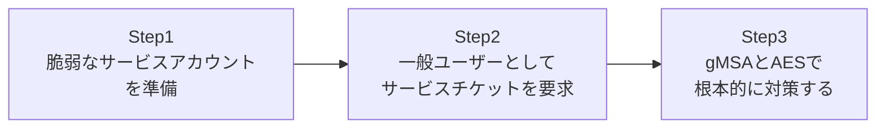

## はじめに

- **この記事で得られること**: **Kerberoasting**という、特別な管理者権限を一切持たない、ごく普通のドメインユーザーでも実行できてしまう攻撃手法を、実際に安全な検証環境で再現します。そのうえで、なぜこれが「脆弱性」ではなく、Kerberosというプロトコルの設計上、構造的に避けられない性質なのかを理解し、[gMSA(グループ管理サービスアカウント)でパスワード管理から解放されるハンズオン](/articles/ad-gmsa-handson-guide)で扱ったgMSAへの移行が、なぜ最も根本的な対策になるのかまでを扱います。
- **対象読者**: Kerberos認証の基本的な仕組みは理解しているが、それが実際にどう悪用されうるのか、攻撃者側の視点を体験したことがない方を想定しています。**このハンズオンは、自分が管理する検証環境の防御力を高めるための、教育・防御目的のものです。実運用中の他者の環境に対して、許可なくこの手順を実行しないでください。**
- **読むのにかかる想定時間**: 約20分(実際に構築しながら進める場合は40分程度を見込んでください)

この記事は[『上位1%』シリーズ 全記事ガイド](/sitemap)の一部、[Active Directoryシリーズ](/sitemap#シリーズ一覧)の42本目です。

## 前提知識

- [Kerberos認証の仕組みを『上位1%』の視点で理解する](/articles/ad-kerberos-guide): TGTとサービスチケットの違い、そしてサービスチケットがサービスアカウントの鍵で暗号化される仕組みについて、この記事の前提になっています。
- [SPN(サービスプリンシパル名)の仕組みを『上位1%』の視点で理解する](/articles/ad-spn-guide): SPNがサービスを実行しているアカウントに登録される、という理解が前提になっています。

## 全体像をつかむ

このハンズオンで行うことは、次の3ステップです。



## ハンズオン手順

### Step 1: 脆弱なサービスアカウントを準備する

検証用に、弱いパスワードが設定された、SPN登録済みのサービスアカウントを作成します。

```powershell
New-ADUser -Name "svc-legacy" -Enabled $true -PasswordNeverExpires $true -AccountPassword (ConvertTo-SecureString "Summer2024!" -AsPlainText -Force)
setspn -A "MSSQLSvc/LegacySql.example.com:1433" "svc-legacy"
```

**このアカウントは、`Summer2024!`という、辞書攻撃で突破されうる程度のパスワードを持っています。** 多くの現場で、長年運用されているレガシーなサービスアカウントに、こうした「そこそこ複雑だが、辞書攻撃には耐えられない」パスワードが設定されたまま放置されがちです。

### Step 2: 一般ユーザーとしてサービスチケットを要求する

ここからが、このハンズオンの核心です。**Domain AdminsでもEnterprise Adminsでもない、ごく普通の一般ユーザー**でドメインにログオンし、次のコマンドを実行します。

```powershell
Add-Type -AssemblyName System.IdentityModel
New-Object System.IdentityModel.Tokens.KerberosRequestorSecurityToken -ArgumentList "MSSQLSvc/LegacySql.example.com:1433"
```

**このコマンドが成功し、サービスチケットが実際に取得できてしまうことを確認してください。** 実行したユーザーは、`svc-legacy`が実行しているSQL Serviceへのアクセス権限を、一切持っていません。にもかかわらず、SPNさえ分かっていれば、そのサービスに対するサービスチケットを要求すること自体は、**誰でも**できてしまいます。

このサービスチケットは、`svc-legacy`アカウントのパスワードから導出された鍵で暗号化されています。攻撃者は、このチケットをメモリからエクスポートし、**オフラインで**(つまり、AD DSに一切追加の通信をすることなく)、辞書攻撃やブルートフォース攻撃を仕掛けて、`svc-legacy`のパスワードを解読しようと試みます。オフラインでの攻撃であるため、アカウントロックアウトポリシーの対象にもなりません。

### Step 3: gMSAとAESで根本的に対策する

この問題への根本的な対策は、[gMSAでパスワード管理から解放されるハンズオン](/articles/ad-gmsa-handson-guide)で構築した、gMSAへの移行です。

```powershell
Set-ADServiceAccount -Identity "gmsa-sql" -KerberosEncryptionType AES256
```

**gMSAのパスワードは、AD DS自身が生成する、長大でランダムな文字列です。** これは、辞書攻撃はもちろん、実用的な時間内でのブルートフォース攻撃でも、事実上解読不可能な強度を持っています。あわせて、`-KerberosEncryptionType AES256`で、暗号化方式を、解読されやすい旧式のRC4ではなく、AES256に固定することも、有効な追加対策になります。

## プロが見ている視点(上位1%の理解)

### なぜKerberoastingは「脆弱性」ではなく、設計上の性質なのか

Kerberoastingは、Kerberosの実装ミスやバグではありません。KDCは、サービスチケットを発行する時点では、**要求したユーザーが、そのサービスへ実際にアクセスする権限を持っているかどうかを一切検証しません。** その検証は、発行されたチケットを実際にサービス側へ提示した、その瞬間に行われます。つまり、「チケットを要求できること」と「そのサービスに実際にアクセスできること」は、まったく別の話です。**この設計そのものは、Kerberosプロトコルとして正しく機能しており、パッチを当てて『修正』できるような欠陥ではありません。** 唯一の実効的な対策は、そのサービスチケットを暗号化している鍵、つまりサービスアカウントのパスワードそのものを、解読不可能な強度まで引き上げることだけです。

### 弱い暗号化方式(RC4)が、なぜ攻撃者を有利にするのか

サービスチケットの暗号化には、旧式のRC4と、より新しいAESという、複数の方式が使えます。**RC4で暗号化されたチケットは、AESで暗号化されたチケットよりも、大幅に少ない計算量で解読を試みることができます。** これは、サービスアカウントの`msDS-SupportedEncryptionTypes`属性の設定次第で決まります。多くの環境では、古いアプリケーションとの互換性のために、この属性が明示的に設定されておらず、結果としてRC4が使われ続けているケースが少なくありません。Step 3で行った`-KerberosEncryptionType AES256`の設定は、この弱点を塞ぐ、単体でも効果のある対策です。

## よくある誤解・つまずきポイント

- **誤解1: 「Kerberoastingを実行するには、Domain Adminsなどの強力な権限が必要である」**
  Kerberoastingは、認証済みのドメインユーザーであれば、特別な権限なしに実行できます。
- **誤解2: 「パスワードを複雑にしてさえいれば、Kerberoastingの対策として十分である」**
  人間が記憶・管理する複雑なパスワードにも限界があります。gMSAのような、人間が一切関与しない、機械的に生成される長大なパスワードが、より確実な対策です。
- **誤解3: 「RC4を無効化すれば、Kerberoastingという攻撃手法自体が完全に無効化される」**
  RC4の無効化(AESへの統一)は、解読の難易度を大幅に上げる有効な対策ですが、パスワード自体が弱ければ、AESであっても最終的には解読されうる可能性は残ります。

## 障害・トラブルシューティングの視点

1. **どのサービスアカウントがKerberoastingの標的になりやすいか調べたい**: `Get-ADUser -Filter {ServicePrincipalName -ne "$null"} -Properties ServicePrincipalName`で、SPNが登録されている、つまりKerberoastingの対象になりうるすべてのアカウントを洗い出せます。
2. **AES256への切り替え後、一部のクライアントで認証が失敗する**: 古いOSやアプリケーションが、AES256をサポートしていない可能性があります。切り替え前に、対象クライアントの対応状況を確認してください。
3. **異常なチケット要求を検知したい**: DC上のイベントID 4769(Kerberosサービスチケットが要求された)のログを監視し、通常業務では発生しないはずのパターン(短時間での大量の異なるSPNへの要求など)を検出する仕組みを検討してください。

## まとめ

- Kerberoastingは、認証済みの一般ユーザーであれば、特別な権限なしに実行できる攻撃手法です。
- これはKerberosの設計上の性質であり、KDCがチケット発行時にアクセス権限を検証しないことに起因します。
- 唯一の実効的な対策は、サービスアカウントのパスワード強度を、解読不可能なレベルまで引き上げることです。
- gMSAへの移行と、AES256への暗号化方式の統一が、実務上最も有効な組み合わせです。

**今日から意識すべきこと**
1. `ServicePrincipalName`が設定されている全アカウントを洗い出し、パスワード強度と暗号化方式を棚卸ししましょう。
2. 新規のサービスアカウントは、最初から従来型ではなくgMSAで作成することを標準にしましょう。

## 参考文献

- [Decrypting the Selection of Supported Kerberos Encryption Types | Microsoft Learn](https://learn.microsoft.com/en-us/troubleshoot/windows-server/active-directory/decrypting-the-selection-of-supported-kerberos-encryption-types)
- [Kerberos Constrained Delegation Overview | Microsoft Learn](https://learn.microsoft.com/en-us/windows-server/security/kerberos/kerberos-constrained-delegation-overview)
