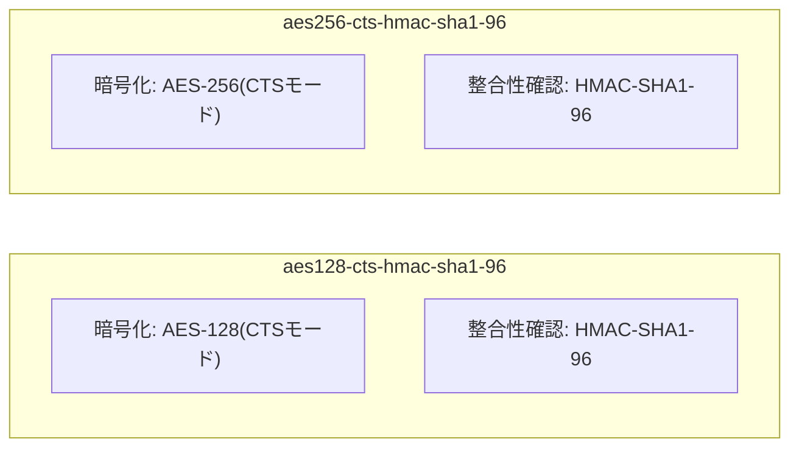

## はじめに

- **この記事で得られること**: [【障害調査】新DC昇格後にAdministratorでログインできなくなる事象](/articles/ad-dc-replace-ntlm-lockout-investigation-guide)で、「AES・RC4のキー」とひとくくりにして扱った部分を、より正確に掘り下げます。**Kerberosの標準的な暗号方式が、AES128・AES256のどちらも、整合性の確認に実はSHA-1を使っている**という、見落とされがちな事実と、`msDS-SupportedEncryptionTypes`というビットマスク属性が、具体的に何を表しているのか、そしてクライアントとKDCが、実際にどの暗号方式を使うかを、どう決めているのかを体系的に理解します。
- **対象読者**: [Kerberos認証の仕組み](/articles/ad-kerberos-guide)は理解しているものの、「AES」という言葉でひとくくりにされている暗号方式の内部が、具体的にどう構成されているのかを説明できない方を想定しています。
- **読むのにかかる想定時間**: 約18分

この記事は[『上位1%』シリーズ 全記事ガイド](/sitemap)の一部、[Active Directoryシリーズ](/sitemap#シリーズ一覧)の13.3本目です。

## 前提知識

- [Kerberos認証の仕組みを『上位1%』の視点で理解する](/articles/ad-kerberos-guide): 事前認証が、パスワードから導出した鍵による暗号化・復号を使っている、という理解が前提になっています。
- [【障害調査】新DC昇格後にAdministratorでログインできなくなる事象](/articles/ad-dc-replace-ntlm-lockout-investigation-guide): アカウントが、パスワード設定時に、どの暗号方式のキーを持つかが決まる、という理解が前提になっています。

## 全体像をつかむ

「AES256だから、AES128より暗号強度が高い」という理解自体は正しいのですが、**この一言だけでは、Kerberosが実際に使っている暗号方式の全体像を、半分しか説明できていません。** Kerberosの暗号方式は、「**データを暗号化する部分**」と、「**データが改ざんされていないかを確認する部分**」という、2つの異なる役割の組み合わせでできています。



**ここで、多くの人が見落としがちな事実があります。AES128とAES256は、暗号化に使う鍵の長さ(128ビットか256ビットか)が違うだけで、整合性確認の部分は、どちらも同じ`HMAC-SHA1-96`、つまりSHA-1を使っている**のです。

## 基礎から徹底解説

### なぜ、AES256でもSHA-1が使われているのか

**Kerberosで標準的に使われるAESベースの暗号方式には、そもそもSHA-256を使うバリエーションが存在しません。** これは、[RFC 3962](https://datatracker.ietf.org/doc/html/rfc3962)という規格が、AESベースのKerberos暗号方式を、`aes128-cts-hmac-sha1-96`と`aes256-cts-hmac-sha1-96`の2種類として定義した際、**整合性確認の方式を、どちらもSHA-1を使ったHMACに固定した**ためです。「AESの鍵長を256ビットに上げる」という判断と、「整合性確認にどのハッシュ関数を使うか」という判断は、Kerberosの標準規格の中では、**独立した、別々の決定だった**ことになります。

<details>
<summary>SHA-1を使っていることは、本当にセキュリティ上の弱点なのか</summary>

**ここは、誤解しやすい、非常に重要なポイントです。** SHA-1が「安全ではない」と言われる文脈の多くは、**SHA-1そのものに対する衝突攻撃**(異なる2つの入力から、同じハッシュ値を意図的に作り出す攻撃)が実用化された、という話です。これは、デジタル証明書の署名のような、**「ハッシュ値そのものの衝突しにくさ」が安全性の根拠になっている用途**にとって、深刻な問題です。**一方、HMAC-SHA1は、鍵を使ってハッシュ化を行う、まったく別の構成であり、SHA-1そのものへの衝突攻撃が、HMAC-SHA1の安全性を直接的に脅かすわけではありません。** そのため、「KerberosがHMAC-SHA1を使っているから、AES256でも危険だ」という主張は、正確ではありません。とはいえ、Microsoft社自身もより新しい暗号方式への移行を推奨しており、「古い方式だから、将来的には新しい方式へ置き換わっていく」という方向性そのものは、正しい認識です。

</details>

### `msDS-SupportedEncryptionTypes`というビットマスクの、具体的な中身

[【障害調査】新DC昇格後にAdministratorでログインできなくなる事象](/articles/ad-dc-replace-ntlm-lockout-investigation-guide)で扱った、「このアカウントが、どの暗号方式のキーを持っているか」という情報は、実際には`msDS-SupportedEncryptionTypes`という属性の、**ビットマスク**(複数の設定を、1つの数値の各ビットに割り当てて表現する方式)として管理されています。

```powershell
Get-ADUser -Identity Administrator -Properties msDS-SupportedEncryptionTypes |
    Select-Object Name, msDS-SupportedEncryptionTypes
```

**実行結果(イメージ):**

```
Name          msDS-SupportedEncryptionTypes
----          ------------------------------
Administrator                             28
```

| ビット(10進数) | 意味 |
|---|---|
| 4 | RC4-HMAC |
| 8 | AES128-CTS-HMAC-SHA1-96 |
| 16 | AES256-CTS-HMAC-SHA1-96 |
| 32 | AES256-CTS-HMAC-SHA1-96(セッションキー版) |

**`28`という値は、`4`(RC4)+`8`(AES128)+`16`(AES256)の合計であり、「RC4・AES128・AES256のすべてに対応している」ことを意味します。** この属性に`16`(AES256)のビットだけが立っていない場合、そのアカウントは、AES256での認証に対応できません。

### クライアントとKDCは、どうやって使う暗号方式を決めているのか

クライアントは、AS-REQを送る際に、**自分が対応している暗号方式の一覧を、優先順位をつけて**KDCへ提示します。KDCは、この一覧と、対象アカウントの`msDS-SupportedEncryptionTypes`を照合し、**両者が共通して対応している、最も優先順位の高い暗号方式**を選びます。**[【障害調査】新DC昇格後にAdministratorでログインできなくなる事象](/articles/ad-dc-replace-ntlm-lockout-investigation-guide)で確認した、`KDC_ERR_ETYPE_NOTSUPP`というエラーは、まさに、この照合の結果、共通して対応できる暗号方式が、1つも見つからなかった**ことを意味していたのです。

## プロが見ている視点(上位1%の理解)

### 「AESに統一した」で、安心して終わってはならない

多くの現場では、[Kerberoasting攻撃のハンズオン](/articles/ad-kerberoasting-handson-guide)で扱った通り、RC4からAESへの統一を、セキュリティ強化のゴールとして扱います。**これは正しい方向性ですが、「AESに統一した」という一言には、「AES128とAES256のどちらを許可するか」「整合性確認にSHA-1を使っていることを、どこまで許容するか」という、さらに細かい判断が隠れています。** `msDS-SupportedEncryptionTypes`のビットマスクを、アカウントごとに正確に把握し、**意図せずAES128だけ、あるいはRC4との混在が残っていないか**を確認する習慣が、「AESに統一した」を、具体的な根拠のある主張にしてくれます。

## よくある誤解・つまずきポイント

- **誤解1: 「AES256を使っているなら、整合性の確認にもSHA-256が使われている」**
  Kerberosの標準的なAES256(`aes256-cts-hmac-sha1-96`)は、整合性確認にSHA-1を使っています。AESの鍵長と、ハッシュ関数の種類は、別々の設定です。
- **誤解2: 「SHA-1を使っている時点で、Kerberosの認証は危険である」**
  HMAC-SHA1という構成は、SHA-1そのものへの衝突攻撃の影響を直接受けるものではなく、デジタル証明書の署名などとは、安全性の根拠がまったく異なります。
- **誤解3: 「`msDS-SupportedEncryptionTypes`が設定されていなければ、そのアカウントは暗号化されたKerberos認証を一切使えない」**
  この属性が未設定(0)の場合、既定の動作として、一般的にRC4が使われます。暗号化が一切使えなくなるわけではなく、弱い方式が選ばれる、という点がリスクです。

## 障害・トラブルシューティングの視点

1. **特定のアカウントだけ、AES256での認証ができない**: `msDS-SupportedEncryptionTypes`の値を確認し、`16`(AES256)のビットが立っているかを確認します。
2. **ドメイン内のアカウントの暗号方式対応状況を、一括で棚卸ししたい**: `Get-ADUser -Filter * -Properties msDS-SupportedEncryptionTypes`で、全アカウントの値を一覧できます。
3. **暗号方式を変更したのに、挙動が変わらない**: [【障害調査】新DC昇格後にAdministratorでログインできなくなる事象](/articles/ad-dc-replace-ntlm-lockout-investigation-guide)で扱った通り、この属性の変更も、既存のキー情報の再計算を伴う場合があるため、パスワードの再設定が必要になることがあります。

## まとめ

- Kerberosの標準的なAES暗号方式(AES128・AES256)は、どちらも整合性確認にSHA-1(HMAC-SHA1-96)を使っています。AESの鍵長とハッシュ関数の種類は、独立した設定です。
- HMAC-SHA1は、SHA-1そのものへの衝突攻撃から直接的な影響を受けるものではなく、デジタル証明書の署名などとは、安全性の文脈が異なります。
- `msDS-SupportedEncryptionTypes`は、そのアカウントが対応する暗号方式を表すビットマスクであり、RC4・AES128・AES256などの組み合わせを、1つの数値で表現しています。
- クライアントとKDCは、互いが共通して対応する、最も優先順位の高い暗号方式を選んで通信します。共通する方式がなければ、`KDC_ERR_ETYPE_NOTSUPP`エラーになります。

**今日から意識すべきこと**
1. 「AESに統一した」という状態を確認する際は、`msDS-SupportedEncryptionTypes`のビットマスクを、個別のアカウントで実際に確認しましょう。
2. 暗号方式に関する情報を調べる際は、「暗号化の方式」と「整合性確認の方式」が、別々の設定であることを、常に意識しましょう。

## 参考文献

- [RFC 3962 - Advanced Encryption Standard (AES) Encryption for Kerberos 5](https://datatracker.ietf.org/doc/html/rfc3962)
- [Decrypting the Selection of Supported Kerberos Encryption Types | Microsoft Learn](https://learn.microsoft.com/en-us/troubleshoot/windows-server/active-directory/decrypting-the-selection-of-supported-kerberos-encryption-types)
