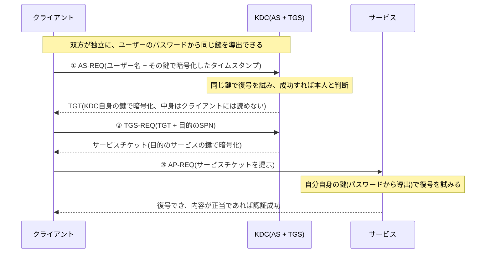

## はじめに

- **この記事で得られること**: [Windowsのログインとユーザープロファイルの仕組み](/articles/ad-windows-login-guide)や[SPN(サービスプリンシパル名)の仕組み](/articles/ad-spn-guide)で前提として扱ってきた**Kerberos認証**について、その裏側の仕組みを徹底的に理解します。特に、「ユーザーのパスワードそのものを一度もネットワークへ送信せずに、どうやって本人確認ができるのか」という核心を、実際のやり取り(AS-REQ/AS-REP、TGS-REQ/TGS-REP、AP-REQ)に沿って解き明かします。あわせて、チケットに埋め込まれる**PAC**(特権属性証明書)の中身と**SID**の関係、NTLM認証との違い、実務で遭遇しうる「所属グループが多すぎてログオンが不安定になる」トークン肥大化問題までを扱います。
- **対象読者**: Kerberos認証という言葉は何度も見聞きしてきたものの、「パスワードを送らずに認証する」という説明の裏側にある具体的な仕組みを説明できない方、SIDが実際の認証・認可処理でどう使われているのかを理解したい方を想定しています。
- **読むのにかかる想定時間**: 約22分

この記事は[『上位1%』シリーズ 全記事ガイド](/sitemap)の一部、[Active Directoryシリーズ](/sitemap#シリーズ一覧)の13本目です。[Windowsのログインとユーザープロファイルの仕組み](/articles/ad-windows-login-guide)と[SPN(サービスプリンシパル名)の仕組み](/articles/ad-spn-guide)を先に読んでおくと、本記事の理解がスムーズです。

## 前提知識

- **共通鍵暗号**: 同じ鍵で暗号化と復号の両方を行う暗号方式です。Kerberosの根幹はこの共通鍵暗号にあります。仕組みそのものの詳細は[共通鍵暗号(AES)とHMAC/AEADの仕組み](/articles/symmetric-encryption-guide)で扱っています。
- **KDC(鍵配布センター)**: DCが兼ねている役割で、Kerberos認証の中心を担うサーバーです。内部的には**ASサーバー**(Authentication Service)と**TGSサーバー**(Ticket Granting Service)という2つの論理的な役割に分かれています。
- **SPN**: サービスを実行しているアカウントを指す識別子です。詳しくは[SPN(サービスプリンシパル名)の仕組み](/articles/ad-spn-guide)を参照してください。

## 全体像をつかむ

### 一言で言うと

**Kerberos認証の核心は、「クライアントとKDCが、ユーザーのパスワードから独立に同じ鍵を導出できる」という前提を利用し、パスワードそのものではなく"その鍵を持っていることの証拠"だけをやり取りする点にあります。** クライアントは、ユーザーが入力したパスワードをその場でハッシュ化して鍵を導出し、その鍵で暗号化した情報をKDCへ送ります。KDCも同じユーザーのパスワードハッシュをAD DS側に保持しているため、同じ鍵を独立に導出でき、**受け取った情報を正しく復号できることそのものが「このクライアントは正しいパスワードを知っている」という証明**になります。パスワードのハッシュ値自体はネットワーク上を一切流れません。

## 基礎から徹底解説

### なぜ事前認証(Pre-Authentication)がパスワードの証明になるのか

最初のやり取り(①AS-REQ)では、クライアントは**現在時刻のタイムスタンプを、ユーザーのパスワードハッシュから導出した鍵で暗号化したもの**を、事前認証情報としてKDCへ送ります。パスワードそのものは一切含まれていません。

KDCは、AD DS上に保存されているそのユーザーのパスワードハッシュから、クライアントと同じ手順で鍵を導出し、受け取ったタイムスタンプの復号を試みます。**正しいパスワードを知っているクライアントだけが、KDCが復号できる形でタイムスタンプを暗号化できる**ため、復号に成功すること自体が本人確認の証明になります。タイムスタンプを使うのは、同じ暗号化データを盗んで使い回す再送攻撃(リプレイアタック)を防ぐためです(許容される時刻のずれの範囲は既定5分で、これがKerberos環境で時刻同期が厳密に求められる理由です)。

この鍵の正体:NTLMハッシュとの関係

Kerberosの事前認証で使われる鍵は、実装上、多くの場合ユーザーパスワードのNTLMハッシュ(あるいはより新しい暗号方式を使う場合はAESベースの鍵)から導出されます。ここで重要なのは、**クライアント側でこの鍵を導出するために、ユーザーが入力した平文のパスワードは一時的にメモリ上で使われますが、ネットワークへは一切送信されない**という点です。この設計により、通信経路上で盗聴されても、パスワードやそのハッシュ値そのものを盗まれるリスクが構造的に排除されています。

### TGT(チケット保証チケット)の正体

事前認証に成功すると、KDCはクライアントへ**TGT**(Ticket Granting Ticket)を発行します。ここで重要なのは、**TGTはKDC自身の鍵(`krbtgt`という特殊なアカウントのパスワードから導出される鍵)で暗号化されている**ため、クライアント自身はTGTの中身を復号して読むことができない、という点です。クライアントにとってTGTは、**中身は見えないが、次にサービスチケットを要求する際にKDCへ提示することで、"私は先ほど本人確認済みです"と証明するための封をされた証拠書類**のようなものです。

TGTには、認証されたユーザーのアカウント情報に加えて、**セッションキー**(このTGTを使ったやり取りを暗号化するための、この認証セッション限りの一時的な鍵)も含まれており、クライアントはこのセッションキーだけを自分の鍵で復号して取り出し、手元に保持します。

### TGS-REQ/TGS-REPとサービスチケットの取得

クライアントが特定のサービスへアクセスしたいとき、TGTと目的のSPNを添えてKDCへ**TGS-REQ**を送ります。[SPN(サービスプリンシパル名)の仕組み](/articles/ad-spn-guide)で扱った通り、KDCはこのSPNを`servicePrincipalName`属性に持つアカウントを検索し、**そのアカウントの鍵で暗号化したサービスチケット**を発行します。このサービスチケットにも専用のセッションキーが含まれます。

クライアントの鍵ではなく、別のアカウント(サービス)の鍵でチケットを暗号化して、本当に問題ないのか

一見すると、「クライアントからの要求に対する応答なのに、クライアント自身の鍵ではなく、まったく別のアカウント(サービスを実行しているアカウント)の鍵で暗号化する」のは奇妙に感じられるかもしれません。しかし、これは**意図的な、Kerberosの安全性そのものを支える設計**です。

このサービスチケットは、実質的には「**KDCから、目的のサービス宛てに送る、封書**」であり、クライアントはあくまでその封書を配達するだけの、中身を見ることも書き換えることもできない配達人にすぎません。もしクライアント自身の鍵で暗号化してしまうと、クライアントはチケットの中身(PACに含まれる自分の権限情報など)を自由に読み書きできてしまい、**自分の権限を偽装して書き換える**ことが可能になってしまいます。**サービス自身の鍵で暗号化しておくことで、クライアントには絶対に開封できない封書として運ばせつつ、受け取ったサービス側だけが、自分の鍵で開封して中身(本当にKDCが発行したものか、権限情報は何か)を検証できる**、という状態を作り出しています。

この設計により、**サービス側は、KDCへ一切問い合わせることなく、自分の鍵だけでチケットが本物かどうかを検証できます**(復号できた時点で、それを暗号化できたのはその鍵を知っているKDCだけである、と判断できるため)。「宛先の鍵で封をする」という、ごく普通の公開鍵暗号ならぬ共通鍵暗号での安全な配達の仕組みが、Kerberosのチケットにもそのまま応用されている、と理解すると納得しやすくなります。

### AP-REQとサービス側での検証

クライアントは最後に、取得したサービスチケットをそのサービス自身へ**AP-REQ**として提示します。サービス側は、**自分自身のパスワードから導出した鍵**(TGS-REPでKDCが暗号化したのと同じ鍵)でこのチケットの復号を試みます。復号に成功し、内容(有効期限やクライアントの情報など)が正当であれば、認証が成立します。**サービス側は一度もKDCへ直接問い合わせることなく、自分の鍵だけでチケットの正当性を検証できる**、という点が、Kerberosの効率性を支える重要な設計です。

### PAC(特権属性証明書)とSIDの関係

ここまでの説明だけでは、「認証(このユーザーは本人である)」はできても、「認可(このユーザーは何をしてよいか)」の情報が不足しています。この認可情報を運んでいるのが、TGTやサービスチケットに埋め込まれる**PAC**(Privilege Attribute Certificate、特権属性証明書)というデータ構造です。

PACには、**そのユーザー自身のSID(セキュリティ識別子)と、そのユーザーが所属するすべてのグループのSIDの一覧**が含まれています。サービス側は、提示されたチケットからこのPACを取り出すだけで、「このユーザーは誰で、どのグループに属しているか」を、**AD DSへ都度問い合わせることなく**判断できます。これが、[Windowsのログインとユーザープロファイルの仕組み](/articles/ad-windows-login-guide)の前提知識で触れた「Windowsの権限管理はユーザー名という文字列ではなく、SIDを基準に行われる」という原則の、実装レベルでの具体的な正体です。ファイルやフォルダーのアクセス許可(ACL)が実際に照合しているのは、ユーザー名の文字列ではなく、**チケットのPACに含まれるSIDのリスト**なのです。

## プロが見ている視点(上位1%の理解)

### Kerberos認証とNTLM認証の違い

| | Kerberos | NTLM |
|---|---|---|
| 認証方式 | チケットベース(KDCが発行する証明書を提示) | チャレンジレスポンス方式(サーバーが出した課題に、クライアントがパスワードハッシュを使って応答) |
| DCへの都度の問い合わせ | サービス側はチケットの検証だけで完結し、DCへ都度問い合わせない | 認証のたびにサーバーがDCへ確認する必要がある(パススルー認証) |
| 相互認証 | 可能(サービス側もクライアントに対して自分の正当性を証明できる) | 一方向のみ(クライアントがサーバーを検証する仕組みがない) |
| 委任(二重ホップ認証) | 可能(委任が構成されていれば) | 基本的に不可能 |
| パフォーマンス | 一般に高速(DCへの往復が少ない) | 認証のたびにDCとのやり取りが発生し、相対的に低速 |

Kerberosの方が総合的に優れているため、Windowsドメイン環境では既定でKerberosが優先され、**Kerberosが使えない状況(SPNが正しく登録されていない、IPアドレスで直接アクセスしているなど)でのみ、NTLMへフォールバックする**という関係になっています。[SPN(サービスプリンシパル名)の仕組み](/articles/ad-spn-guide)で扱った「SPN未登録時にNTLMへ静かに降格する」という実務トラブルは、まさにこのフォールバックの仕組みが引き起こしています。

### トークン肥大化(Token Bloat)問題

PACには前述の通りユーザーの全所属グループのSIDが含まれるため、**あるユーザーが非常に多くのグループに所属している場合、PACのサイズが膨らみ続けます**。Windowsには`MaxTokenSize`というパラメータでPAC(トークン)のサイズに上限が設けられており(既定でおよそ48KB)、この上限を超えると、**一部のグループ情報がトークンに含まれなくなり、本来アクセスできるはずのリソースにアクセスできない、あるいは認証自体が不安定になる**という症状が発生します。大規模組織で、入れ子になった多数のグループに所属するユーザー(特に管理者アカウント)ほどこの問題に遭遇しやすく、実務では`MaxTokenSize`レジストリ値の調整や、不要なグループメンバーシップの整理、あるいは`sIDHistory`属性(ドメイン移行の際に旧ドメインのSIDを引き継ぐための仕組み)に不要なエントリが蓄積していないかの確認が、対処法として挙げられます。

## よくある誤解・つまずきポイント

- **誤解1: 「Kerberos認証では、パスワードのハッシュ値がKDCへ送信されている」**
  送信されているのは、パスワードから導出した鍵で暗号化したタイムスタンプであり、パスワードのハッシュ値そのものはネットワーク上を流れません。KDC側は自分が保持しているハッシュから独立に同じ鍵を導出し、復号を試みているだけです。
- **誤解2: 「TGTには、ユーザーのパスワードそのものが入っている」**
  TGTに含まれているのは認証済みという証明とセッションキーなどであり、ユーザーのパスワードそのものは含まれていません。またTGTはKDC自身の鍵で暗号化されているため、クライアント自身もその中身を読むことはできません。
- **誤解3: 「サービスへアクセスするたびに、サービス側がDCへ確認の問い合わせをしている」**
  サービス側は、提示されたチケットを自分自身の鍵で復号できるかどうかだけで検証を完結でき、DCへ都度問い合わせる必要はありません。これがKerberosがNTLMより高速である理由の1つです。

## 障害・トラブルシューティングの視点

Kerberos関連の障害は、「**どの段階(事前認証・TGT取得・サービスチケット取得・チケット提示)で失敗しているか**」を軸に切り分けます。

1. **ログオン自体が失敗する**: イベントビューアーのセキュリティログで、DC側のイベントID`4768`(TGT要求)を確認し、事前認証の段階で失敗していないかを確認します。
2. **ログオンはできるが、特定のサービスにアクセスできない**: イベントID`4769`(サービスチケット要求)を確認し、対象のSPNに対するチケット発行が失敗していないかを確認します。[SPN(サービスプリンシパル名)の仕組み](/articles/ad-spn-guide)で扱ったSPN関連の問題を疑います。
3. **時刻がずれている環境で認証が失敗する**: [FSMO(操作マスター)とは何か](/articles/fsmo-guide)で扱ったPDCエミュレータを基準とした時刻同期が正しく機能しているかを確認します。許容範囲(既定5分)を超える時刻のずれは、事前認証の失敗に直結します。
4. **多数のグループに所属するユーザーだけ認証が不安定**: トークン肥大化を疑い、`MaxTokenSize`の設定やグループメンバーシップの整理を検討します。

### 予防策・恒久対策

- ドメイン全体の時刻同期([PDCエミュレータ](/articles/fsmo-guide)を基準とした階層構造)が正しく機能していることを、定期的に確認する。
- ユーザー、特に管理者アカウントの所属グループが不必要に多くなっていないか、定期的に棚卸しする。
- ドメイン移行後、`sIDHistory`属性に不要なエントリが蓄積していないかを確認し、必要に応じて整理する。

## まとめ

- Kerberos認証の核心は、クライアントとKDCが独立に同じ鍵をパスワードから導出できることを利用し、パスワードそのものではなく「その鍵で正しく暗号化・復号できること」を証明としてやり取りする点にあります。
- TGTはKDC自身の鍵で暗号化された"封をされた証明書"であり、クライアント自身もその中身を読むことはできません。
- チケットに埋め込まれるPAC(特権属性証明書)には、ユーザーとその所属グループのSIDの一覧が含まれており、サービス側はDCへ都度問い合わせることなく認可情報を検証できます。
- Kerberosが使えない状況ではNTLMへフォールバックしますが、NTLMは相互認証や委任ができないなど機能的な制約が多く、パフォーマンスでも劣ります。

**今日から意識すべきこと**
1. Kerberos関連の障害に遭遇したら、事前認証・TGT取得・サービスチケット取得・チケット提示のどの段階で失敗しているかを、イベントID4768/4769を軸に切り分けましょう。
2. 認証が不安定なユーザーに出会ったら、所属グループ数によるトークン肥大化の可能性を疑いましょう。

## 参考文献

- [Kerberos Authentication Overview | Microsoft Learn](https://learn.microsoft.com/en-us/windows-server/security/kerberos/kerberos-authentication-overview)
- [How Kerberos Pre-Authentication Works | Microsoft Learn](https://learn.microsoft.com/en-us/troubleshoot/windows-server/windows-security/kerberos-authentication-fails-with-error-message)
- [MaxTokenSize and Kerberos Token Bloat | Microsoft Learn](https://learn.microsoft.com/en-us/troubleshoot/windows-server/windows-security/kerberos-authentication-problems-if-user-belongs-to-groups)
