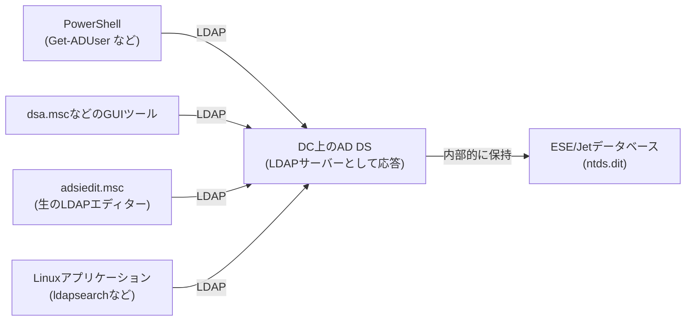

## はじめに

- **この記事で得られること**: [ADとDC、ドメインとフォレストの違い](/articles/ad-dc-fundamentals-guide)以来、本シリーズでは「AD DSはLDAPプロトコルで問い合わせを受け付ける」と繰り返し説明してきましたが、そのLDAP自体の中身には立ち入ってきませんでした。この記事では、LDAPが扱うデータの構造(DN・属性・オブジェクトクラス)、Bind・Search・Add/Modify/Deleteという操作の種類、そして`Get-ADUser`や`adsiedit.msc`が裏で実際に何をしているのかを体系的に理解します。あわせて、ポート389・636・3268・3269の使い分けと、LDAP署名・LDAPチャネルバインディングという、実務でセキュリティ監査の際に必ず問われる設定についても扱います。
- **対象読者**: 「AD DSはLDAPで動いている」という説明は理解しているものの、LDAPというプロトコル自体が具体的に何を、どうやり取りしているのかを説明できない方を想定しています。
- **読むのにかかる想定時間**: 約18分

この記事は[『上位1%』シリーズ 全記事ガイド](/sitemap)の一部、[Active Directoryシリーズ](/sitemap#シリーズ一覧)の19本目です。[ADとDC、ドメインとフォレストの違い](/articles/ad-dc-fundamentals-guide)を先に読んでおくと、本記事の理解がスムーズです。

## 前提知識

- **AD DS(Active Directory Domain Services)**: [ADとDC、ドメインとフォレストの違い](/articles/ad-dc-fundamentals-guide)で扱った、ユーザー・コンピューター・グループを一元管理するディレクトリサービスです。LDAPは、このAD DSに対して問い合わせる際の標準プロトコルです。
- **`adsiedit.msc`**: [AD移行後のクリーンアップ](/articles/ad-migration-cleanup-guide)で扱った、AD DSのあらゆるパーティションに対してLDAPの生の属性レベルで直接アクセスできる汎用エディターです。

## 全体像をつかむ

### 一言で言うと

**LDAP(Lightweight Directory Access Protocol)は、「階層構造を持つデータベース(ディレクトリ)」に対して、検索・追加・変更・削除を行うための標準プロトコルです。** AD DSは、内部的にはユーザーやコンピューターの情報を独自のデータベースエンジン(ESE/Jet)で保持していますが、外部のクライアントやアプリケーションに対しては、このLDAPという共通言語で問い合わせ窓口を統一しています。`Get-ADUser`のようなPowerShellコマンドも、`dsa.msc`のようなGUIツールも、ユーザーが直接触れることのない裏側では、最終的にLDAPのリクエストをAD DSへ送っています。

## 基礎から徹底解説

### LDAPが扱うデータの形:DN・属性・オブジェクトクラス

LDAPが扱うディレクトリは、フォルダーの階層のようにオブジェクトが入れ子になった木構造(DIT: Directory Information Tree)です。この木構造の中で、あるオブジェクト1つを一意に指し示す住所にあたるものが**DN**(Distinguished Name、識別名)です。例えば「`example.com`ドメインの`Sales`という組織単位(OU)の中にいる`tanaka`というユーザー」は、`CN=tanaka,OU=Sales,DC=example,DC=com`のようなDNで表されます。

DNの読み方:右から左へ、木の根から葉へ

DNはカンマ区切りで複数の要素(RDN: Relative Distinguished Name)が並んでいますが、これは**右側がディレクトリの根(ルート)に近く、左側が葉(そのオブジェクト自身)に近い**という順序で並んでいます。`CN=tanaka,OU=Sales,DC=example,DC=com`であれば、「`example.com`というフォレスト・ドメイン(`DC=example,DC=com`)の中の、`Sales`という組織単位(`OU=Sales`)の中の、`tanaka`という共通名(`CN=tanaka`)のオブジェクト」という具合に、右から左へ読み下ろしていくと、実際のディレクトリ階層をたどっていることが分かります。

RDNの主な種類と、証明書のCSRとの関係

RDNとして使われる要素には、代表的なものだけでも次のような種類があります。

| RDN | 意味 |
|---|---|
| `CN` | Common Name(共通名)。ユーザー名やコンピューター名など、そのオブジェクト自身を表す名前 |
| `OU` | Organizational Unit(組織単位)。ADの管理単位としてのフォルダー |
| `DC` | Domain Component。ドメイン名(`example.com`)を`.`区切りで分解した各部分 |
| `O` | Organization(組織名)。会社名など |
| `C` | Country(国名)。ISO国コード(`JP`など) |
| `L` | Locality(地名)。市区町村など |
| `ST` | State/Province(都道府県・州) |

これらのRDNは、実はLDAP・AD DS特有のものではなく、**X.500というディレクトリサービスの国際標準に由来する、汎用的な「名前の表し方」の規格**です。そして[PKIとデジタル証明書の仕組み](/articles/pki-guide)で扱った**CSR**(証明書署名要求)にも、証明書の発行対象を表す**Subject**(サブジェクト)というフィールドがあり、これもまったく同じ`CN=`・`O=`・`OU=`・`C=`という形式で記述されます。つまりDNとCSRのSubjectは、**同じX.500由来の名前表現規格を、LDAPディレクトリと証明書という別々の場面で共用している**という関係にあり、無関係ではありません。証明書発行の実務でSubjectに`CN=`や`O=`を入力する作業は、本記事で扱ったDNの読み方がそのまま応用できます。

各オブジェクトは、**オブジェクトクラス**(そのオブジェクトが何の種類か、例えば`user`や`computer`)によって、持つことのできる**属性**(名前・パスワードハッシュ・所属グループなど、キーと値のペア)の種類が決まっています。この「オブジェクトの型とその属性を定義したルールブック」が、[ADとDC、ドメインとフォレストの違い](/articles/ad-dc-fundamentals-guide)で触れた**スキーマ**の正体です。

### LDAPの主要な操作:Bind・Search・Add/Modify/Delete

LDAPクライアントがサーバーとやり取りする操作は、大きく分けて次のようなものがあります。

- **Bind(バインド)**: 認証を行う操作です。「誰として」以降の操作を行うかを、LDAPサーバーに伝えます。
- **Search(検索)**: 指定した範囲(検索の起点となるDNと、そこから何階層下まで見るかという**スコープ**)の中から、**検索フィルター**という条件式に合致するオブジェクトを探します。例えば`(&(objectClass=user)(sAMAccountName=tanaka)))`という検索フィルターは、「オブジェクトクラスが`user`かつ、`sAMAccountName`属性が`tanaka`であるもの」という条件を表します。
- **Add/Modify/Delete**: オブジェクトの追加・属性の変更・オブジェクトの削除を行う操作です。

Bindの種類:シンプルバインドとSASLバインド

Bindには主に2つの方式があります。**シンプルバインド**は、ユーザーのDNとパスワードをそのまま(暗号化なしでは平文で)送る、もっとも基本的な方式です。**SASLバインド**は、Kerberos(GSSAPI)などの既存の認証の仕組みを間借りして認証する方式で、パスワードそのものをLDAPの通信に乗せません。Windows環境では、ドメイン参加済みのクライアントがKerberosチケットを使ってバインドする(Kerberos認証の詳細は[Kerberos認証の仕組み](/articles/ad-kerberos-guide)で扱いました)ケースが一般的です。

### ポート389・636・3268・3269の使い分け

LDAPが使うTCPポートは1つではなく、用途によって次のように使い分けられています。

| ポート | 名称 | 特徴 |
|---|---|---|
| 389 | LDAP | 平文が基本。`STARTTLS`という手順を使うことで、同じ接続の途中から暗号化に切り替えられる |
| 636 | LDAPS | 接続の最初からTLSで暗号化されている(SSL/TLSのハンドシェイクから始まる) |
| 3268 | グローバルカタログ(LDAP) | [FSMO(操作マスター)](/articles/fsmo-guide)などで触れたグローバルカタログに対する、フォレスト全体を横断した検索用のポート(平文) |
| 3269 | グローバルカタログ(LDAPS) | 3268のTLS暗号化版 |

389番ポートへの問い合わせは、そのDCが担当するドメインパーティション内のオブジェクトだけが対象ですが、3268番ポートへの問い合わせは、**フォレスト内の全ドメインを横断して**、グローバルカタログに複製されている属性だけを対象に検索できます。「ユーザー名で検索したいが、そのユーザーがどのドメインに所属しているか分からない」という場面で3268番が使われる理由はここにあります。

## プロが見ている視点(上位1%の理解)

### LDAP署名とLDAPチャネルバインディング:2019年のセキュリティ勧告とその後

389番ポートの平文LDAP通信は、正しく保護されていないと、通信内容の改ざんや、認証情報を中継して別のサーバーになりすます**NTLMリレー攻撃**などに悪用されるリスクがあります。この問題に対処するのが、**LDAP署名**(通信内容にデジタル署名を付け、改ざんを検知する)と**LDAPチャネルバインディング**(TLS層の情報とLDAPの認証情報を紐付け、中継攻撃を防ぐ)という2つの設定です。

Microsoftは2019年8月に**ADV190023**というセキュリティ勧告を公開し、LDAP署名を「必須(Require Signing)」に、LDAPチャネルバインディングを「サポートされていれば要求する」に設定することを推奨しました。当初は将来の更新プログラムでこれらを既定で有効化する計画でしたが、2020年3月、互換性への影響を考慮して、**既存の環境に対して強制的に有効化する更新は行わない**方針に転換されました。

Windows Server 2025での変化:新規構築ドメインコントローラーは既定で保護される

Windows Server 2025では、方針が一歩進みました。**新規に構築されたドメインコントローラー**については、LDAP署名が既定で「必須」相当の挙動になり、LDAPチャネルバインディングも既定で「サポートされていれば要求する」に設定されるようになっています。ただし、これはあくまで**新規構築時の既定値**の変更であり、既存のドメインコントローラーの設定がWindows Updateによって自動的に書き換わるわけではありません。既存環境でLDAP署名・チャネルバインディングを有効化したい場合は、グループポリシーで明示的に設定する必要があります。

実務上の重要な注意点は、LDAP署名やチャネルバインディングを「要求する」設定に変更する前に、環境内に平文LDAP通信に依存した古いアプリケーションやネットワーク機器(プリンター複合機の認証連携など)が残っていないかを必ず確認することです。設定変更後にこれらのバインドが一斉に失敗し、認証障害を引き起こすことがあります。

## よくある誤解・つまずきポイント

- **誤解1: 「LDAPはAD DS専用のプロトコルである」**
  LDAPはAD DS専用ではなく、OpenLDAPなど他のディレクトリサービスでも使われる汎用的な標準プロトコルです。AD DSは、このLDAPという共通言語で問い合わせを受け付けている実装の1つに過ぎません。
- **誤解2: 「389番ポートを使っていれば、通信は必ず平文である」**
  389番ポートでも、接続の途中で`STARTTLS`という手順を踏むことで暗号化に切り替えられます。389番=平文固定、636番=暗号化固定、と単純に決めつけるのは誤りです。
- **誤解3: 「LDAP署名を必須にすれば、それだけでNTLMリレー攻撃を完全に防げる」**
  LDAP署名は通信内容の改ざん検知が主目的であり、中継攻撃(リレー)そのものを防ぐには、TLS層と紐付けるLDAPチャネルバインディングも合わせて有効にする必要があります。この2つはセットで検討すべき設定です。

## 障害・トラブルシューティングの視点

LDAP関連のトラブルは、多くの場合「クライアントとサーバーが期待するセキュリティレベルの不一致」が原因です。

1. **特定のアプリケーションだけLDAP接続に失敗するようになった**: グループポリシーでLDAP署名・チャネルバインディングの要求レベルを変更していないか確認します。そのアプリケーションが平文バインドや旧式のSASLメカニズムに依存している可能性があります。
2. **フォレスト内の別ドメインのユーザーが検索できない**: 389番ポート(自ドメインのみが対象)に問い合わせていないか確認します。フォレスト横断検索が必要な場合は、3268番ポート(グローバルカタログ)への問い合わせに切り替える必要があります。
3. **`adsiedit.msc`で編集した属性がすぐに反映されない**: `adsiedit.msc`もLDAP経由でAD DSと通信しているため、変更内容は他のDCへの複製を経て反映されます。[ADの「サイト」とレプリケーショントポロジー](/articles/ad-sites-guide)で扱ったレプリケーションの遅延が影響している可能性があります。

### 予防策・恒久対策

- LDAP署名・チャネルバインディングの要求レベルを変更する前に、必ず環境内の全アプリケーション・機器の対応状況を洗い出す。
- フォレスト横断の検索が必要な処理では、389番ではなく3268番(グローバルカタログ)を使うよう実装しておく。
- 平文の389番ポートでの通信が必要な場合は、`STARTTLS`を使った暗号化への切り替えを徹底する。

## まとめ

- LDAPは、AD DSに対して検索・追加・変更・削除を行うための標準プロトコルであり、AD DS専用の技術ではありません。
- LDAPが扱うデータは、DN(識別名)で一意に識別される木構造のオブジェクトであり、それぞれのオブジェクトが持てる属性の種類は、オブジェクトクラス(スキーマ)によって決まります。
- ポート389(自ドメイン、平文基本)・636(自ドメイン、TLS)・3268(フォレスト横断、平文基本)・3269(フォレスト横断、TLS)を、用途に応じて使い分ける必要があります。
- LDAP署名・LDAPチャネルバインディングは、平文LDAP通信の改ざんやNTLMリレー攻撃を防ぐための設定であり、Windows Server 2025では新規構築DCの既定値が強化されましたが、既存環境への自動適用は行われていません。

**今日から意識すべきこと**
1. フォレスト横断の検索が必要な場面では、389番ではなく3268番(グローバルカタログ)を使いましょう。
2. LDAP署名・チャネルバインディングの設定変更を検討する際は、事前に環境内の古いアプリケーション・機器への影響を洗い出しましょう。

## 参考文献

- [Lightweight Directory Access Protocol | Wikipedia](https://en.wikipedia.org/wiki/Lightweight_Directory_Access_Protocol)
- [ADV190023 - Microsoft Guidance for Enabling LDAP Channel Binding and LDAP Signing | Microsoft Security Response Center](https://msrc.microsoft.com/update-guide/en-us/advisory/ADV190023)
- [2020, 2023, and 2024 LDAP channel binding and LDAP signing requirements for Windows (KB4520412) | Microsoft Support](https://support.microsoft.com/en-us/topic/2020-2023-and-2024-ldap-channel-binding-and-ldap-signing-requirements-for-windows-kb4520412-ef185fb8-00f7-167d-744c-f299a66fc00a)
- [LDAP signing for Active Directory Domain Services on Windows Server | Microsoft Learn](https://learn.microsoft.com/en-us/windows-server/identity/ad-ds/ldap-signing)
