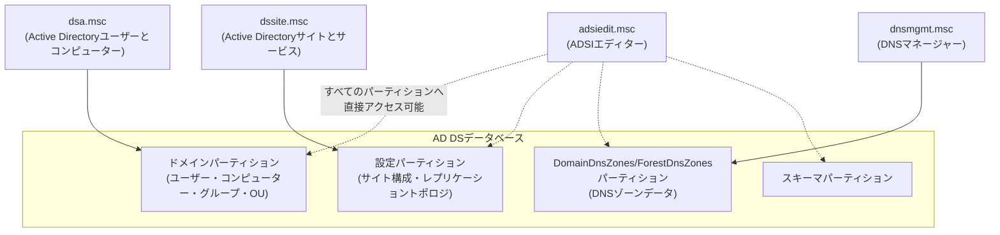

## はじめに

- **この記事で得られること**: AD移行でDCを正式に撤去した後、`dsa.msc`(Active Directoryユーザーとコンピューター)・`dssite.msc`(Active Directoryサイトとサービス)・`adsiedit.msc`(ADSIエディター)・`dnsmgmt.msc`(DNSマネージャー)という4つの管理コンソールをそれぞれ確認する作業が発生します。この記事では、**4つのコンソールがそれぞれAD DSのどの部分を管理しているのか**、**なぜそこを確認・削除する必要があるのか**を体系的に整理します。あわせて、「ドメインから脱退させた古いコンピューターの情報が、なぜ`dsa.msc`の`Computers`コンテナーにいつまでも残り続けるのか」という、実務でよく遭遇する疑問にも答えます。
- **対象読者**: AD移行の手順書に沿ってこれら4つのコンソールを確認したことはあるものの、それぞれが何を管理しているコンソールなのか、なぜそこを確認する必要があるのかを整理できていない方を想定しています。
- **読むのにかかる想定時間**: 約19分

この記事は[『上位1%』シリーズ 全記事ガイド](/sitemap)の一部、[Active Directoryシリーズ](/sitemap#シリーズ一覧)の10本目です。パーティションの種類は[ADとDC、ドメインとフォレストの違いを『上位1%』の視点で理解する](/articles/ad-dc-fundamentals-guide)、DNSレコードの詳細は[DNSゾーンとレコードの読み方を『上位1%』の視点で理解する](/articles/dns-zones-records-guide)を前提にしています。

## 前提知識

- **MMC(Microsoft Management Console)スナップイン**: Windowsの多くの管理ツール(`dsa.msc`や`dssite.msc`など)は、それぞれが独立したアプリケーションとして作られているわけではなく、**MMCという共通のGUIの枠組み(入れ物)に、機能を追加するパーツとして「差し込まれて」動いています**。この「差し込むパーツ」のことを**スナップイン**(snap-in、"パチッとはめ込む"という意味の英単語に由来)と呼びます。拡張子の`.msc`も、この仕組みに由来する「**Microsoft Saved Console**」(あらかじめどのスナップインを読み込むかを保存しておいた、MMCの設定ファイル)の略です。つまり`dsa.msc`をダブルクリックする操作は、実際には「MMCを起動し、"Active Directoryユーザーとコンピューター"というスナップインを読み込んだ状態を復元する」ことに相当します。この仕組みのおかげで、複数のスナップインを1つのMMC画面にまとめて表示する、独自のカスタムコンソールを作ることもできます。各`.msc`ファイルが、AD DSという1つのデータベースの中の異なる部分を、異なる見た目・操作性で見せている、という関係を理解しておくと、以降の整理がしやすくなります。

## 全体像をつかむ

### 4つのコンソールが管理しているものの違い

**この4つのコンソールは、同じAD DSという1つのデータベースに対する、異なる"窓口"です。** それぞれが管理しているデータの範囲を整理すると、次のようになります。

`dsa.msc`・`dssite.msc`・`dnsmgmt.msc`は、それぞれ特定のパーティションを、使いやすいGUIで管理するための専用コンソールです。一方`adsiedit.msc`だけは特別で、**特定のパーティション専用ではなく、AD DS内のどのパーティションに対しても直接アクセスできる、汎用的なLDAPエディター**です。

## 基礎から徹底解説

### `dsa.msc`(Active Directoryユーザーとコンピューター):ドメインパーティションの窓口

`dsa.msc`は、[ADとDC、ドメインとフォレストの違いを『上位1%』の視点で理解する](/articles/ad-dc-fundamentals-guide)で説明した**ドメインパーティション**——ユーザー・コンピューター・グループ・OU(組織単位)といった、日常的な運用で最も頻繁に触れるオブジェクト群——を管理するためのコンソールです。

AD移行の文脈では、次の2点を確認します。

- **降格した旧DCのコンピューターアカウントが、`Domain Controllers`OUから外れ、通常の`Computers`コンテナーへ移動しているか**(降格処理が正しく完了していれば自動的にそうなります)。あるいは、そのコンピューター自体を完全に撤去する場合は、このアカウント自体を削除します。
- **AD DS上に、既に存在しない・使われていないコンピューターアカウントやユーザーアカウントが残っていないか**。

ドメインから脱退させたのに、なぜComputersコンテナーに情報が残り続けるのか

ここで実務上よく遭遇する疑問が、「PCをドメインから脱退させた(ワークグループへ戻した)はずなのに、`dsa.msc`の`Computers`コンテナーにそのコンピューター名がいつまでも残っている」というものです。

これは、**「PC側でドメインから脱退する操作」と「AD DS側でそのコンピューターアカウント(オブジェクト)を削除する操作」が、まったく別々の操作である**ためです。PC側の「ドメインから脱退してワークグループへ戻る」という操作は、あくまでそのPC自身がドメインの認証情報を使うのをやめるだけの、**PCローカルの設定変更**です。この操作は、AD DS側に対して「このコンピューターアカウントを削除してください」という要求を自動的に送るわけではありません。

**AD DS側のコンピューターアカウントは、明示的に管理者が削除しない限り、そのまま残り続けます。** これは設計上の配慮でもあります——もし脱退のたびに自動的にアカウントが削除されてしまうと、同じPCを再度ドメインに参加させたいだけの場合でも、毎回新しいコンピューターアカウントとして扱われてしまい、そのアカウントに紐づいていたグループポリシーの適用対象設定やグループメンバーシップなどをすべて再設定する必要が出てきます。**「脱退してもアカウントは残しておき、必要であれば管理者が明示的に削除する」という2段階の設計になっている**、と理解しておくと、この挙動に納得しやすくなります。

### `dssite.msc`(Active Directoryサイトとサービス):設定パーティションの窓口

`dssite.msc`は、[ADとDC、ドメインとフォレストの違いを『上位1%』の視点で理解する](/articles/ad-dc-fundamentals-guide)で説明した**設定パーティション**——サイト(拠点)の定義、サブネットとサイトの対応、そして**各DCのレプリケーション構成そのもの**——を管理するためのコンソールです。

具体的には、`Sites`コンテナーの中の各サイトの`Servers`フォルダーに、そのサイトに属するDCがサーバーオブジェクトとして登録されており、そのサーバーオブジェクトの下に**NTDS Settingsオブジェクト**(そのDCが他のどのDCと、どのようなスケジュールでレプリケーションを行うかという接続オブジェクトの集合)があります。

AD移行の文脈で`dssite.msc`が重要なのは、**正しく降格処理が完了したDCは、このサーバーオブジェクトとNTDS Settingsオブジェクトも自動的に削除される**ためです。したがって、**旧DCのサーバーオブジェクトがこの`dssite.msc`にまだ残っている場合、それは降格処理が完全ではなく、AD DSのレプリケーション構成に関する情報が古いまま残っている**ことを意味します。

### `dsa.msc`と`dssite.msc`の違い

この2つの違いを一言でまとめると、**`dsa.msc`は「ドメインに何が存在するか(誰が、どのグループに、どのOUに属しているか)」を管理する窓口、`dssite.msc`は「DCが物理的・ネットワーク的にどこにあり、互いにどうレプリケーションしているか」を管理する窓口**です。日常的なユーザー・グループ管理では`dsa.msc`だけで完結しますが、**DCの追加・撤去やレプリケーショントポロジの設計・トラブルシューティングでは`dssite.msc`が主戦場**になります。前述の通り、旧DCが本当に完全に撤去されたかを最終確認する際にも、`dsa.msc`(コンピューターアカウントの有無)だけでなく`dssite.msc`(サーバーオブジェクト・NTDS Settingsの有無)まで確認して初めて、AD DSの構造上完全に除去されたと判断できます。

### `adsiedit.msc`(ADSIエディター):すべてのパーティションへの直接アクセス

`adsiedit.msc`は、AD DS内のあらゆるパーティション(ドメイン・設定・スキーマ・DomainDnsZones・ForestDnsZonesを含む)に対して、**LDAPの生の属性レベルで直接読み書きできる、汎用的なエディター**です。`dsa.msc`や`dssite.msc`のような、目的別に使いやすく整えられたGUIとは異なり、オブジェクトの階層構造と属性値がほぼそのまま表示されます。

AD移行のクリーンアップで`adsiedit.msc`が必要になるのは、主に**降格処理が正常に完了せず(旧DCが既に故障・消失していたなど)、`ntdsutil`による強制的なメタデータクリーンアップを行った場合**です。この場合、通常の降格処理が自動的に行うはずだった一部のオブジェクトの削除・整理が完了しないまま残ることがあり、`dsa.msc`や`dssite.msc`のGUIには表示されない、あるいは通常の操作では削除できない残骸オブジェクトが残ることがあります。こうしたケースで、`adsiedit.msc`から該当のオブジェクトを直接特定し、削除します。

adsiedit.mscは強力だが危険なツールである

`adsiedit.msc`は、`dsa.msc`のような操作の途中で表示される「本当に削除してよいですか」という確認や、依存関係のチェックといった安全装置の多くを経由せず、直接AD DSのデータを書き換えられます。誤った属性を誤ったオブジェクトで削除・変更してしまうと、AD DS全体の整合性に深刻な影響を及ぼしかねません。**日常的な運用ツールとして気軽に使うものではなく、他のGUIツールでは対処できない、特定の限定的な状況でのみ、内容を十分に理解した上で使う「最終手段」として位置づける**べきです。

### `dnsmgmt.msc`(DNSマネージャー):DNSゾーンデータの窓口

`dnsmgmt.msc`が管理しているDNSゾーンデータは、[DNSゾーンとレコードの読み方を『上位1%』の視点で理解する](/articles/dns-zones-records-guide)で説明した通り、AD統合ゾーンの場合`DomainDnsZones`・`ForestDnsZones`という専用のパーティションに保存されています。AD移行のクリーンアップでは、次の3点を確認します。

- 旧DCのホスト名に対応する**Aレコード**が削除されているか
- `_msdcs`ゾーン配下の、旧DCに対応する**SRVレコード**が削除されているか
- `_msdcs`ゾーン直下の、旧DCのGUIDに対応する**CNAMEレコード**が削除されているか

## プロが見ている視点(上位1%の理解)

### なぜ4つものコンソールを確認する必要があるのか

**正常な(グレースフルな)降格処理を実行した場合、これら4つのコンソールが管理しているデータのほとんどは、実は自動的にクリーンアップされます。** `dsa.msc`のコンピューターアカウントの移動、`dssite.msc`のサーバーオブジェクトの削除、`dnsmgmt.msc`のレコード削除は、いずれも降格ウィザード自身が内部的に実行する処理の一部です。

したがって、**4つのコンソールを1つずつ手作業で確認する作業が本当に重要になるのは、次の2つの場面**です。

1. **旧DCが既に故障・消失しており、正規の降格処理が実行できず、`ntdsutil`による強制的なメタデータクリーンアップを行った場合**——この経路では自動クリーンアップの一部(特に`dssite.msc`のサーバーオブジェクトや、場合によってはDNSレコード)が完了しないまま残ることがあり、手動での確認・削除が必須になります。
2. **正規の降格処理を実行した場合でも、「本当に自動クリーンアップが完全に完了したか」を検証(トラスト・バット・ベリファイ)する場面**——特に本番環境のAD移行では、自動処理を信頼しきるのではなく、結果を目視で確認するプロセスを組み込むことが実務上重要です。

## よくある誤解・つまずきポイント

- **誤解1: 「dsa.mscでコンピューターやユーザーが見えなくなれば、AD DS上のデータはすべて消えている」**
  `dsa.msc`が管理しているのはドメインパーティションだけです。設定パーティション(`dssite.msc`)やDNSゾーンデータ(`dnsmgmt.msc`)に古い情報が残っている可能性は、`dsa.msc`だけでは確認できません。
- **誤解2: 「PCをドメインから脱退させれば、AD DS上のコンピューターアカウントも自動的に削除される」**
  ドメインからの脱退はPC側のローカルな設定変更に過ぎず、AD DS側のコンピューターアカウントの削除は、管理者が明示的に行わない限り実行されません。
- **誤解3: 「adsiedit.mscの方が高機能だから、日常的な管理作業もadsiedit.mscで行うべき」**
  `adsiedit.msc`は安全装置を経由しない汎用エディターであり、日常的な運用には`dsa.msc`や`dssite.msc`のような目的別のGUIを使うべきです。`adsiedit.msc`は、他のツールでは対処できない限定的な状況でのみ使う最終手段です。

## 障害・トラブルシューティングの視点

AD移行後のクリーンアップ漏れは、**「グレースフルな降格だったか、強制的なメタデータクリーンアップだったか」を最初に確認する**のが基本です。

1. **強制的なメタデータクリーンアップを行った場合**: 必ず4つのコンソール(`dsa.msc`・`dssite.msc`・`adsiedit.msc`・`dnsmgmt.msc`)すべてを手動で確認します。特に`dssite.msc`のサーバーオブジェクト・NTDS Settingsの残存は見落とされやすいポイントです。
2. **グレースフルな降格だったが、念のため確認したい場合**: `dsa.msc`と`dssite.msc`、`dnsmgmt.msc`を確認するだけで通常は十分です。`adsiedit.msc`まで踏み込む必要が生じるのは、それでも異常が見つかった場合に限られます。
3. **旧DC名がまだ何らかの形で参照されている**: [DCの正常性確認](/articles/dc-health-check-guide)で扱った`repadmin /replsummary`や`repadmin /showrepl *`の出力とあわせて、どのパーティション・どのコンソールに残骸があるかを特定します。

### 予防策・恒久対策

- 可能な限り、旧DCが生きているうちに正規の降格処理を実行し、強制的なメタデータクリーンアップを避ける。
- やむを得ず強制的なメタデータクリーンアップを行った場合は、必ず4つのコンソールすべてのチェックリストを作業手順に組み込む。
- 正規の降格処理であっても、本番環境の移行では自動クリーンアップの結果を目視で検証するプロセスを省略しない。

## まとめ

- `dsa.msc`はドメインパーティション(ユーザー・コンピューター・グループ・OU)、`dssite.msc`は設定パーティション(サイト構成・DCのレプリケーション構成)、`dnsmgmt.msc`はDNSゾーンデータをそれぞれ管理するコンソールです。
- `adsiedit.msc`だけは特定のパーティション専用ではなく、AD DS内のどのパーティションへも直接アクセスできる汎用エディターであり、他のツールでは対処できない限定的な状況でのみ使う最終手段です。
- ドメインからの脱退はPC側のローカルな設定変更に過ぎず、AD DS側のコンピューターアカウントは管理者が明示的に削除しない限り残り続けます。
- グレースフルな降格処理では多くのクリーンアップが自動的に行われますが、強制的なメタデータクリーンアップを行った場合は、4つのコンソールすべての手動確認が必須です。

**今日から意識すべきこと**
1. AD移行後のクリーンアップ確認では、まず「グレースフルな降格だったか、強制的なメタデータクリーンアップだったか」を確認し、後者であれば4つのコンソールすべてを必ずチェックしましょう。
2. `dsa.msc`だけで「もう何も残っていない」と判断せず、`dssite.msc`のサーバーオブジェクト・NTDS Settingsの残存も必ず確認しましょう。

## 参考文献

- [Active Directory Users and Computers overview | Microsoft Learn](https://learn.microsoft.com/en-us/windows-server/identity/ad-ds/plan/appendix-c--managing-machine-accounts)
- [Active Directory Sites and Services overview | Microsoft Learn](https://learn.microsoft.com/en-us/previous-versions/windows/it-pro/windows-server-2012-r2-and-2012/cc772774(v=ws.11))
- [ADSI Edit overview | Microsoft Learn](https://learn.microsoft.com/en-us/previous-versions/windows/it-pro/windows-server-2012-r2-and-2012/cc772819(v=ws.11))
- [Clean Up Server Metadata | Microsoft Learn](https://learn.microsoft.com/en-us/previous-versions/windows/it-pro/windows-server-2012-r2-and-2012/cc816907(v=ws.11))
