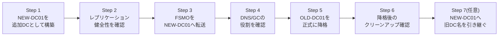

## はじめに

- **この記事で得られること**: 「老朽化したDCを新しいサーバーへ入れ替える」という、AD運用で最も頻繁に発生する実務案件——**AD移行(リプレース)**——を、実際に手を動かして一通り体験します。新DCの追加、レプリケーション健全性の確認、5つのFSMOロールの転送、旧DCの正式な降格、降格後のクリーンアップ確認、そして必要に応じた旧DC名の引き継ぎまでを、実際のコマンドを1つずつ実行しながら進めます。あわせて、`dcdiag /v`であえて警告を発生させ、その意味を読み解く演習も行います。
- **対象読者**: これまでのAD DSシリーズ([FSMO](/articles/fsmo-guide)、[DCの正常性確認](/articles/dc-health-check-guide)、[dcdiag](/articles/dcdiag-guide)、[AD移行後のクリーンアップ](/articles/ad-migration-cleanup-guide)など)を読み、個々の概念は理解したものの、実際の移行作業の一連の流れとして体験したことがない方を想定しています。
- **読むのにかかる想定時間**: 約40分(実際に構築しながら進める場合は3時間程度を見込んでください)

この記事は[『上位1%』シリーズ 全記事ガイド](/sitemap)の一部、[Active Directoryシリーズ](/sitemap#シリーズ一覧)の15本目、**このシリーズ全体の集大成となるハンズオン**です。[FSMO(操作マスター)とは何か](/articles/fsmo-guide)、[DCの正常性確認](/articles/dc-health-check-guide)、[dcdiag /vの読み方](/articles/dcdiag-guide)、[AD移行後のクリーンアップ](/articles/ad-migration-cleanup-guide)、[sysdm.cplとnetdom computernameは何が違うのか](/articles/ad-computername-netdom-guide)を先に読んでおくことを強く推奨します。

## 前提知識

本記事は、これまでのAD DSシリーズのほぼ全体を前提知識として使います。特に次の記事で扱った内容は、本記事中で改めて説明せず前提とします。

- [FSMO(操作マスター)とは何か](/articles/fsmo-guide): 5つの役割の意味と、転送(Transfer)とシージ(Seize)の違い
- [DCの正常性確認](/articles/dc-health-check-guide): `repadmin /showrepl`・`net share`の読み方
- [dcdiag /vの読み方](/articles/dcdiag-guide): 主要なテスト項目の意味
- [AD移行後のクリーンアップ](/articles/ad-migration-cleanup-guide): `dsa.msc`・`dssite.msc`・`adsiedit.msc`・`dnsmgmt.msc`の役割分担

## ハンズオンの前提条件

- Windows Server 2025のVMが2台。1台は既にDCとして稼働している想定です。
  - `OLD-DC01`(IPアドレス例: `10.0.40.11`): `example.com`ドメインの既存の唯一のDC。5つのFSMOロールすべてを保持し、DNSサーバー・グローバルカタログも兼任しています。
  - `NEW-DC01`(IPアドレス例: `10.0.40.12`): まだドメインに参加していない、新しいサーバー。
- `NEW-DC01`のDNSサーバー設定は、あらかじめ`OLD-DC01`のIPアドレスを指すよう設定しておいてください(新DCがドメインへ参加するには、既存のDCを名前解決できる必要があります)。
- 検証用の使い捨て環境である前提で進めます。

## 全体像をつかむ

### 全体の作業の流れ



この順序が重要である理由は、[FSMOをすべて1台に集約すべきか、分散すべきか](/articles/fsmo-guide)で触れた通り、**現在の役割保持者(OLD-DC01)がまだ正常に稼働している状態でFSMOを転送する(シージではなく転送)ことが、安全な移行の大原則**だからです。旧DCを先に落としてしまうと、シージという緊急手段に頼らざるを得なくなります。

## Step 1: `NEW-DC01`を追加DCとして構築する

`NEW-DC01`で、PowerShellを管理者として開き、既存ドメインへ**追加のDC**として参加させます。

```powershell
Install-WindowsFeature AD-Domain-Services -IncludeManagementTools

Install-ADDSDomainController `
    -DomainName "example.com" `
    -InstallDns `
    -Credential (Get-Credential "EXAMPLE\Administrator") `
    -SafeModeAdministratorPassword (ConvertTo-SecureString "P@ssw0rd-DSRM!" -AsPlainText -Force)
```

完了すると、`NEW-DC01`は`example.com`の2台目のDCとして起動します。既定では新規に昇格したDCにグローバルカタログ(GC)も自動的に有効化されます。

## Step 2: レプリケーション健全性を確認する

[DCの正常性確認](/articles/dc-health-check-guide)と[dcdiag /vの読み方](/articles/dcdiag-guide)で扱ったコマンドを使い、FSMO転送を進める前に、**2台のDC間のレプリケーションが正常に成立しているか**を必ず確認します。

```powershell
# 両方のDCで実行し、お互いをレプリケーションパートナーとして認識しているかを確認する
repadmin /showrepl

# NEW-DC01自身の健全性を確認する
dcdiag /v
```

`repadmin /showrepl`の出力で、[repadminの主語(受信側)の強調](/articles/dc-health-check-guide)で扱った通り、**実行したDC自身が受信側となっているレプリケーション状況**が表示されるため、`OLD-DC01`・`NEW-DC01`の両方で実行し、双方向のレプリケーションが正常であることを確認してください。**このレプリケーションが健全であることを確認するまで、次のFSMO転送には進まないでください。**

## Step 3: FSMOロールを`NEW-DC01`へ転送する

レプリケーションの健全性が確認できたら、`OLD-DC01`または`NEW-DC01`のいずれかで(Active Directoryモジュールが使える環境であれば)、5つのFSMOロールすべてを`NEW-DC01`へ転送します。

```powershell
Move-ADDirectoryServerOperationMasterRole `
    -Identity "NEW-DC01" `
    -OperationMasterRole PDCEmulator, RIDMaster, InfrastructureMaster, SchemaMaster, DomainNamingMaster
```

これは、[FSMO転送:役割を安全に移す](/articles/fsmo-guide)で扱った通り、**現在の役割保持者(`OLD-DC01`)がまだ正常に稼働している状態で行う、正規の転送(Transfer)手続き**です。実行すると、ロールごとに確認プロンプトが表示されるので、内容を確認しながら進めてください。

転送が完了したら、必ず結果を確認します。

```powershell
netdom query fsmo
```

5つのロールすべてが`NEW-DC01`に移っていることを確認してください。

## Step 4: DNS・GCの役割を確認する

FSMOはあくまで5つの役割の話であり、**DNSサーバーやグローバルカタログはFSMOとは別の独立した役割**です。[DNSサーバーが1台構成の場合のリスク](/articles/ad-dns-guide)で触れた通り、`OLD-DC01`を撤去する前に、`NEW-DC01`が単独でもDNS解決・GC検索を問題なく処理できる状態になっているかを確認しておく必要があります。

```powershell
# NEW-DC01がGCを保持しているかを確認する
Get-ADDomainController -Identity "NEW-DC01" | Select-Object IsGlobalCatalog

# NEW-DC01のDNSサーバー機能が正常に応答するかを確認する
nslookup example.com NEW-DC01.example.com
```

## Step 5: `OLD-DC01`を正式に降格する

ここまでの確認がすべて完了したら、`OLD-DC01`を正式な手順で降格します。

```powershell
Uninstall-ADDSDomainController `
    -DemoteOperationMasterRole `
    -Credential (Get-Credential "EXAMPLE\Administrator") `
    -LocalAdministratorPassword (ConvertTo-SecureString "P@ssw0rd-Local!" -AsPlainText -Force)
```

`-DemoteOperationMasterRole`を付けておくと、[FSMO転送し忘れたまま降格した場合](/articles/fsmo-guide)で扱った「万が一まだこのDCがFSMOを保持していた場合に、自動的に他のDCへ転送してから降格する」という安全策が働きます(本ハンズオンではStep 3で既に転送済みのため、通常は何も転送されません)。

## Step 6: 降格後のクリーンアップを確認する

[AD移行後のクリーンアップ](/articles/ad-migration-cleanup-guide)で扱った4つのコンソールを使い、`OLD-DC01`の情報が完全に除去されたことを確認します。

1. **`dsa.msc`**: `Domain Controllers`OUに`OLD-DC01`が残っていないか、`Computers`コンテナーへ正しく移動しているか(あるいは完全に削除されているか)を確認します。
2. **`dssite.msc`**: `Sites`配下の`OLD-DC01`のサーバーオブジェクトと、その下のNTDS Settingsオブジェクトが削除されていることを確認します。
3. **`dnsmgmt.msc`**: `OLD-DC01`のAレコード、`_msdcs`ゾーン配下のSRVレコード・GUID名のCNAMEレコードが削除されていることを確認します。
4. **`repadmin /replsummary`**: `OLD-DC01`の名前がレプリケーションパートナーとしてどこにも表示されないことを確認します。

**正常な(グレースフルな)降格であれば、これらの多くは自動的にクリーンアップされます。** 万が一いずれかが残っていた場合は、`adsiedit.msc`から手動で削除する前に、まず降格が本当に正常完了しているか(イベントログにエラーが残っていないか)を確認してください。

## Step 7(任意): `NEW-DC01`へ`OLD-DC01`の名前を引き継ぐ

社内システムやスクリプトが`OLD-DC01`の名前をハードコードしている場合、[sysdm.cplとnetdom computernameは何が違うのか](/articles/ad-computername-netdom-guide)で扱った手順に従って、`NEW-DC01`の名前を`OLD-DC01`へ変更できます。

```powershell
# 現在の名前を代替名として登録する
netdom computername NEW-DC01 /add:OLD-DC01

# 登録した代替名をプライマリ名へ昇格させる(この時点でNEW-DC01は代替名になる)
netdom computername NEW-DC01 /makeprimary:OLD-DC01

# 反映には再起動が必要
shutdown /r /t 0
```

この操作を行う場合は、**降格済みの旧`OLD-DC01`の実機(別用途に転用する場合)のコンピューター名を、先に別の一意な名前へ変更しておく**ことを絶対に忘れないでください。[実例:AD移行後にホスト名が重複し、ログオンできなくなった事故](/articles/ad-computername-netdom-guide)で扱った通り、これを怠ると深刻な認証障害につながります。

再起動後、新しい名前(`OLD-DC01`)でセキュアチャネルが健全かどうかを、[Netlogonサービスとセキュアチャネルの仕組み](/articles/ad-netlogon-guide)で扱った`Test-ComputerSecureChannel`で確認しておくと安心です。

## プロが見ている視点(上位1%の理解)

### `dcdiag /v`であえて警告を発生させ、読み解く演習

実務のAD移行では、`dcdiag /v`を実行して**警告が1つも出ない、という状態の方がむしろ珍しい**という話を[dcdiag /vの読み方](/articles/dcdiag-guide)で扱いました。ここでは、意図的に軽微な不整合を作り出し、実際に警告を読み解く練習をしてみます。

<details>
<summary>演習: DNSレコードをわざと1つ削除してdcdiagのDNSテストを失敗させる</summary>

**注意: 検証用の使い捨て環境でのみ実施してください。**

1. `dnsmgmt.msc`を開き、`_msdcs.example.com`ゾーン配下にある、`NEW-DC01`のGUID名のCNAMEレコードを1つ、意図的に削除します。
2. `NEW-DC01`で`dcdiag /v /test:DNS`を実行します。
3. **DNSテストの中で、削除したレコードに関連する項目がFAILまたは警告として表示される**ことを確認します。出力には、具体的にどのレコードが見つからなかったかが示されているはずです。
4. 表示された内容から、「どのゾーンの、どの種類のレコードが、なぜ必要とされているのか」を、[DNSゾーンとレコードの読み方](/articles/dns-zones-records-guide)で扱ったGUIDベースのCNAMEレコードの役割に照らして説明できるか、自分の言葉で確認してみてください。
5. 確認できたら、削除したレコードを手動で復元するか、`ipconfig /registerdns`と`nltest /sc_reset:example.com`を実行して自動再登録を促し、`dcdiag /v /test:DNS`が再びPASSすることを確認します。

この演習のポイントは、**「エラーが出た」という事実だけでなく、出力された具体的な情報からどの仕組みが壊れているのかを逆算できるようになること**です。これは、本物の障害に遭遇したときに、根拠を持って対処できるかどうかを分ける、実務上重要なスキルです。

</details>

## よくあるエラーとその対処

- **`Move-ADDirectoryServerOperationMasterRole`が「アクセスが拒否されました」で失敗する**: 実行しているアカウントが、転送対象のロールに応じた権限グループ(スキーママスターであればSchema Adminsなど)のメンバーであるかを確認してください。
- **Step 5の降格が、レプリケーションエラーで失敗する**: Step 2に戻り、`repadmin /showrepl`でレプリケーションが本当に健全かを再確認してください。健全でない状態のまま降格を強行すると、[転送(Transfer)とシージ(Seize)の違い](/articles/fsmo-guide)で扱った、より厄介な復旧作業が必要になるリスクがあります。
- **降格後も`OLD-DC01`の名前が`dssite.msc`に残っている**: [AD移行後のクリーンアップ](/articles/ad-migration-cleanup-guide)で扱った通り、降格処理が完全でなかった可能性が高いです。`adsiedit.msc`での手動クリーンアップが必要になる場合があります。

## 検証環境のクリーンアップ

このハンズオンの環境を破棄する場合は、最後に残った`NEW-DC01`(あるいはStep 7実施後は改名後のDC)で、次のコマンドを実行してドメインごと削除します。

```powershell
Uninstall-ADDSDomainController -LastDomainControllerInDomain -DemoteOperationMasterRole -Force
```

## まとめ

- 安全なAD移行の大原則は、**旧DCがまだ正常に稼働している状態でFSMOを転送すること**であり、シージは旧DCが完全に失われた場合の最終手段です。
- FSMO転送の前には、必ず`repadmin /showrepl`でレプリケーションの健全性を確認する習慣が重要です。
- 降格処理の多くは自動的にクリーンアップされますが、`dsa.msc`・`dssite.msc`・`dnsmgmt.msc`・`repadmin /replsummary`での最終確認を省略すべきではありません。
- `dcdiag /v`の警告は、件数ではなく、具体的にどの仕組みが壊れているのかを出力内容から逆算できるかどうかが実務上の分かれ目です。

## 参考文献

- [Install-ADDSDomainController | Microsoft Learn](https://learn.microsoft.com/en-us/powershell/module/addsdeployment/install-addsdomaincontroller)
- [Move-ADDirectoryServerOperationMasterRole | Microsoft Learn](https://learn.microsoft.com/en-us/powershell/module/activedirectory/move-addirectoryserveroperationmasterrole)
- [Uninstall-ADDSDomainController | Microsoft Learn](https://learn.microsoft.com/en-us/powershell/module/addsdeployment/uninstall-addsdomaincontroller)
