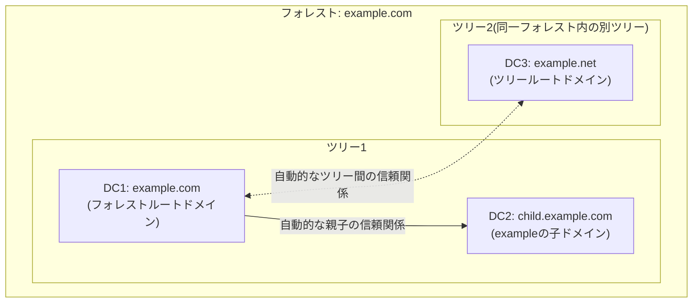

## はじめに

- **この記事で得られること**: [ADとDC、ドメインとフォレストの違い](/articles/ad-dc-fundamentals-guide)で解説した「ドメインパーティションだけはドメイン内に閉じ、設定パーティションとスキーマパーティションはフォレスト全体で共有される」という原則を、実際に3台のドメインコントローラーを構築して**自分の目で確認する**ハンズオンです。フォレストルートドメイン(`example.com`)、その子ドメイン(`child.example.com`)、そして同一フォレスト内の別ツリー(`example.net`)という3つのドメインを構築し、それぞれの間で何が共有され、何が独立しているのかを、ADUC・`netdom`・`repadmin`などの実際のコマンドで検証します。
- **対象読者**: [ADとDC、ドメインとフォレストの違い](/articles/ad-dc-fundamentals-guide)を読んでドメイン・ツリー・フォレストの概念は理解したものの、実際にそれらがどう構築され、どう連携しているのかを手を動かして確かめたい方を想定しています。
- **読むのにかかる想定時間**: 約35分(実際に構築しながら進める場合は2〜3時間程度を見込んでください)

この記事は[『上位1%』シリーズ 全記事ガイド](/sitemap)の一部、[Active Directoryシリーズ](/sitemap#シリーズ一覧)の14本目です。**本記事はハンズオン(実際に手を動かす検証)記事であり、これまでの深掘り記事群の集大成として位置づけています。** [ADとDC、ドメインとフォレストの違い](/articles/ad-dc-fundamentals-guide)、[sysdm.cplとnetdom computernameは何が違うのか](/articles/ad-computername-netdom-guide)、[FSMO(操作マスター)とは何か](/articles/fsmo-guide)、[ADの「サイト」とレプリケーショントポロジー](/articles/ad-sites-guide)を先に読んでおくことを強く推奨します。VM自体の作成手順は[ハンズオン準備マニュアル](/articles/handson-prep-guide)と[Windows Serverの初期セットアップ](/articles/windows-server-setup-guide)を参照してください。

## 前提知識

このハンズオンは、これまでのAD DSシリーズの内容を前提知識として使います。特に次の3点は必須です。

- **パーティションの分離**: ドメインパーティションはドメイン内のDC間だけで複製され、設定パーティション・スキーマパーティションはフォレスト全体のDC間で複製されます。詳しくは[ADとDC、ドメインとフォレストの違い](/articles/ad-dc-fundamentals-guide)を参照してください。
- **ツリーとフォレスト**: 連続したDNS名前空間を共有するドメインの集合が**ツリー**、ツリーの集合が**フォレスト**です。同じツリー内は自動的に親子の信頼関係で、ツリー同士もルートドメイン間で自動的に信頼関係が結ばれます。
- **FSMO**: スキーママスター・ドメイン名前付けマスターはフォレスト全体で1台、RID・PDCエミュレータ・インフラストラクチャマスターはドメインごとに1台が保持します。詳しくは[FSMO(操作マスター)とは何か](/articles/fsmo-guide)を参照してください。

## ハンズオンの前提条件

- Windows Server 2025のVMが3台(それぞれ[ハンズオン準備マニュアル](/articles/handson-prep-guide)と[Windows Serverの初期セットアップ](/articles/windows-server-setup-guide)の手順で、初期設定・固定IPアドレスの設定・SSH(またはRDP)接続まで完了していること)。本記事では次のホスト名を使います。
  - `DC1`(IPアドレス例: `10.0.30.11`): `example.com`のフォレストルートドメインの最初のDC
  - `DC2`(IPアドレス例: `10.0.30.12`): `child.example.com`(`example.com`の子ドメイン)の最初のDC
  - `DC3`(IPアドレス例: `10.0.30.13`): `example.net`(`example.com`と同一フォレストの別ツリー)の最初のDC
- 3台とも、DNSサーバーのIPアドレスに**自分自身のIPアドレス**を暫定的に指定しておきます(構築が進むにつれて`example.com`のDNSサーバーを参照するよう変更していきます)。
- 検証用の使い捨て環境である前提で進めます。本番環境や既存のドメインに影響を与えないよう、**独立したネットワークセグメント**で実施してください。

## 全体像をつかむ

### 構築する環境



### 全体の作業の流れ

1. **Step 0**: DC1を`example.com`のフォレストルートドメインの最初のDCとして構築する
2. **Step 1**: DC2を`child.example.com`として、`example.com`の子ドメインに昇格する
3. **Step 2**: DC3を`example.net`として、`example.com`と同じフォレスト内の別ツリーに昇格する
4. **検証1〜5**: パーティションの分離・信頼関係・グローバルカタログ・FSMOの配置を、実際のコマンドで確認する

## Step 0: DC1を`example.com`のフォレストルートドメインとして構築する

DC1で、PowerShellを管理者として開き、AD DSの役割を追加してからフォレストを作成します。

```powershell
# AD DSの役割を追加する(再起動不要)
Install-WindowsFeature AD-Domain-Services -IncludeManagementTools

# 新しいフォレストを作成する(DNSサーバーの役割もあわせてインストールする)
Install-ADDSForest `
    -DomainName "example.com" `
    -DomainNetbiosName "EXAMPLE" `
    -InstallDns `
    -SafeModeAdministratorPassword (ConvertTo-SecureString "P@ssw0rd-DSRM!" -AsPlainText -Force)
```

`-SafeModeAdministratorPassword`は、**DSRM**(ディレクトリサービス復元モード)というAD DSデータベースが壊れた際の復旧専用モードで使うパスワードです。通常のドメイン管理者アカウントとは別物として、忘れないように控えておいてください。コマンド実行後、確認プロンプトに従うと自動的に再起動され、DC1が`example.com`の最初のDCとして起動します。

再起動後、DC2・DC3のDNS設定を、暫定の自分自身から**DC1のIPアドレス**へ変更しておきます(この時点でまだDC2・DC3はドメインに参加していません)。

## Step 1: DC2を`child.example.com`として子ドメインに昇格する

DC2で、AD DSの役割を追加したあと、既存のフォレスト(`example.com`)の**子ドメイン**として昇格します。この操作には、`example.com`の**エンタープライズ管理者**権限を持つ資格情報が必要です。

```powershell
Install-WindowsFeature AD-Domain-Services -IncludeManagementTools

Install-ADDSDomain `
    -NewDomainName "child" `
    -ParentDomainName "example.com" `
    -DomainType "ChildDomain" `
    -InstallDns `
    -Credential (Get-Credential "EXAMPLE\Administrator") `
    -SafeModeAdministratorPassword (ConvertTo-SecureString "P@ssw0rd-DSRM!" -AsPlainText -Force)
```

`-NewDomainName`には**単一ラベル**(`child`)だけを指定し、`-ParentDomainName`で親ドメインの完全修飾名(`example.com`)を指定します。これにより、完全な名前としては`child.example.com`というドメインが作成されます。

## Step 2: DC3を`example.net`として別ツリーに昇格する

DC3で、同様にAD DSの役割を追加したあと、今度は既存のフォレストの**新しいツリー**として昇格します。子ドメインとの違いは、`-DomainType`に`TreeDomain`を指定し、`-NewDomainName`に**完全修飾名**(`example.net`)を指定する点です。

```powershell
Install-WindowsFeature AD-Domain-Services -IncludeManagementTools

Install-ADDSDomain `
    -NewDomainName "example.net" `
    -ParentDomainName "example.com" `
    -DomainType "TreeDomain" `
    -InstallDns `
    -Credential (Get-Credential "EXAMPLE\Administrator") `
    -SafeModeAdministratorPassword (ConvertTo-SecureString "P@ssw0rd-DSRM!" -AsPlainText -Force)
```

**`-ParentDomainName`には引き続き`example.com`を指定する点に注意してください。** これは`example.net`が`example.com`の「子」になるという意味ではなく、「`example.com`が属しているのと同じフォレストに、新しいツリーとして参加させる」ことを指定するためのパラメーターです。ツリールート同士(`example.com`と`example.net`)は、DNS名前空間としては無関係のまま、同じフォレストのメンバーになります。

<details>
<summary>ここまでで詰まりやすいポイント:DNSの前方参照ゾーンが見えない</summary>

`child.example.com`や`example.net`の昇格中に、親ドメインのDNSゾーンへの委任(delegation)がうまくいかず、ゾーンが正しく見えないというエラーに遭遇することがあります。多くの場合、DC2・DC3のDNSサーバー設定が`example.com`(DC1)を正しく参照できていないことが原因です。昇格前に`nslookup example.com`を実行し、DC1が正しく名前解決できることを確認してから再試行してください。

</details>

## 検証1: ドメインパーティションの分離を確認する

3台のDCすべてで昇格が完了したら、まずドメインパーティションが本当に分離されているかを確認します。

DC1(`example.com`)のADUC(`dsa.msc`)で新しいテスト用ユーザー(例: `test-root-user`)を作成し、DC2(`child.example.com`)とDC3(`example.net`)のADUCを開いて、**そのユーザーがどちらにも一切表示されない**ことを確認してください。これは、ドメインパーティションが同一ドメイン内のDC間だけで複製され、他のドメインへは一切複製されないためです。

## 検証2: 設定パーティション・スキーマパーティションの共有を確認する

次に、設定パーティションとスキーマパーティションがフォレスト全体で共有されていることを確認します。最も分かりやすいのは、[ADの「サイト」とレプリケーショントポロジー](/articles/ad-sites-guide)で扱ったサイト情報です。

DC1で`dssite.msc`(Active Directoryサイトとサービス)を開き、新しいサイトを1つ作成してみてください(例: `Test-Site`)。作成後、しばらく待ってから(あるいは[repadmin /syncall](/articles/dc-health-check-guide)で強制同期してから)、DC2・DC3の`dssite.msc`を開き、**作成した`Test-Site`が両方に反映されている**ことを確認します。ユーザーオブジェクト(検証1)とは対照的に、サイト情報は設定パーティションに属するため、フォレスト内のすべてのDCへ複製されます。

## 検証3: 自動的な信頼関係を確認する

`netdom`コマンドで、ドメイン間の信頼関係を確認します。DC1で次を実行してください。

```powershell
netdom query trust
```

`example.com`から見て、**`child.example.com`との間の親子の信頼関係**と、**`example.net`との間のツリールート間の信頼関係**が、どちらも自動的に(手動で構成した覚えがないにもかかわらず)存在していることを確認できます。これらの信頼関係は、いずれも**双方向・推移的**であり、たとえば`child.example.com`のユーザーが(適切な権限が付与されていれば)`example.net`のリソースへアクセスすることも、フォレスト内であれば技術的には可能です。

## 検証4: グローバルカタログとフォレスト横断検索を確認する

DC1・DC2・DC3のうち、**各ドメインの最初のDCには既定でグローバルカタログ(GC)が有効になっています**。DC3(`example.net`)のADUCから、「検索」機能を使って`child.example.com`に作成したユーザーを検索してみてください。**通常の検索範囲を「エンティティ全体」ではなくGC検索に切り替える**(ADUCのメニューから「検索」→「エンティティ全体のディレクトリ」を選ぶか、Active Directory管理センターでフォレスト全体を対象に検索する)ことで、DC3から`child.example.com`のオブジェクトを直接検索できることを確認できます。これが、[ADとDC、ドメインとフォレストの違い](/articles/ad-dc-fundamentals-guide)で扱った「GCへの1回の問い合わせで、フォレスト横断的な検索が完結する」という仕組みの実例です。

## 検証5: FSMOの配置を確認する

最後に、[FSMO(操作マスター)とは何か](/articles/fsmo-guide)で扱った5つの役割の配置を、実際に確認します。

```powershell
netdom query fsmo
```

このコマンドをDC1・DC2・DC3のいずれで実行しても、**スキーママスターとドメイン名前付けマスターは、常にDC1(フォレストで最初に構築されたDC)だけが保持している**ことを確認できます。一方、**RIDマスター・PDCエミュレータ・インフラストラクチャマスターは、`example.com`(DC1)・`child.example.com`(DC2)・`example.net`(DC3)それぞれに、独立して存在している**ことも確認できます。これは、フォレスト全体で1つだけの役割と、ドメインごとに1つずつ存在する役割という、FSMOの設計をそのまま反映した結果です。

## プロが見ている視点(上位1%の理解)

### 実務で「別ドメイン」「別ツリー」「別フォレスト」をどう使い分けるか

このハンズオンで構築した3つのパターンには、それぞれ実務上異なる採用理由があります。

- **子ドメイン(`child.example.com`)を選ぶ理由**: 親ドメインと同じDNS名前空間の中で、組織・拠点・部門単位で管理権限やパスワードポリシーを分離したい場合に使います。買収・合併で独立した組織を吸収する際、既存の名前空間との整合性を保ちつつ管理を分離したいケースが典型例です。
- **別ツリー(`example.net`)を選ぶ理由**: 同じフォレスト内に共存させたいが、DNS名前空間が既存ドメインと無関係(あるいは異なるブランド名を使っている)場合に使います。同一企業グループ内に、まったく異なるブランド名で運営される複数の事業会社が存在するケースなどが該当します。
- **完全に別のフォレストを選ぶ理由**: 本記事のいずれのパターンでもなく、**スキーマ管理者・エンタープライズ管理者といったフォレスト全体に影響する権限そのものを完全に分離したい**場合です。セキュリティ境界を厳密に分離する必要がある場合(たとえば買収した組織を将来的に完全に分離したまま運用する場合など)は、子ドメインでも別ツリーでもなく、フォレスト自体を分けたうえで、必要に応じてフォレスト間の信頼関係を個別に構成します。

## よくあるエラーとその対処

- **子ドメイン・別ツリーの昇格が「アクセスが拒否されました」で失敗する**: `-Credential`に指定した資格情報が、フォレストの**エンタープライズ管理者**グループのメンバーであるかを確認してください。ドメイン管理者権限だけでは、新しいドメインをフォレストへ追加する操作はできません。
- **`Install-ADDSDomain`が親ドメインを見つけられない**: DC2・DC3のDNSサーバー設定がDC1(`example.com`)を正しく参照できているかを確認してください。子ドメイン・別ツリーの昇格には、親ドメイン(フォレストルート)への正常な名前解決が前提条件です。
- **検証2でサイト情報が反映されない**: レプリケーションの伝播を待つか、[repadmin /syncall](/articles/dc-health-check-guide)で強制同期してください。既定のサイト間レプリケーション間隔(最短15分)を踏まえて、焦らず確認することが重要です。

## 検証環境のクリーンアップ

検証が終わったら、**降格は子ドメイン・別ツリーから先に、フォレストルートは最後に**行います(逆順で行うと、依存関係のあるドメインが残ったままフォレストルートが消えてしまい、収拾がつかなくなります)。

```powershell
# DC2・DC3で先に実行(それぞれのドメインの最後のDCなので、ドメインごと削除される)
Uninstall-ADDSDomainController -LastDomainControllerInDomain -DemoteOperationMasterRole -Force

# 最後にDC1で実行(フォレスト内の最後のドメインの最後のDCなので、フォレストごと削除される)
Uninstall-ADDSDomainController -LastDomainControllerInDomain -DemoteOperationMasterRole -Force
```

## まとめ

- ドメインパーティション(ユーザーなどのオブジェクト)はドメイン内に閉じますが、設定パーティション・スキーマパーティションはフォレスト全体で共有され、実際にサイト情報を作成して確認するとその違いが目に見える形で分かります。
- 子ドメイン(`Install-ADDSDomain -DomainType ChildDomain`)と別ツリー(`-DomainType TreeDomain`)の違いは、DNS名前空間が親ドメインと連続しているかどうかであり、どちらも同じフォレストに参加し、自動的な信頼関係で結ばれます。
- グローバルカタログを使えば、フォレスト内のどのドメインのオブジェクトも、DCへ逐一問い合わせることなく横断的に検索できます。
- FSMOのうちスキーママスターとドメイン名前付けマスターはフォレストで1台だけですが、RID・PDCエミュレータ・インフラストラクチャマスターはドメインごとに独立して存在します。

## 参考文献

- [Install a New Windows Server Active Directory Child or Tree Domain | Microsoft Learn](https://learn.microsoft.com/en-us/windows-server/identity/ad-ds/deploy/install-a-new-windows-server-2012-active-directory-child-or-tree-domain--level-200-)
- [Install-ADDSForest | Microsoft Learn](https://learn.microsoft.com/en-us/powershell/module/addsdeployment/install-addsforest)
- [Install-ADDSDomain | Microsoft Learn](https://learn.microsoft.com/en-us/powershell/module/addsdeployment/install-addsdomain)
