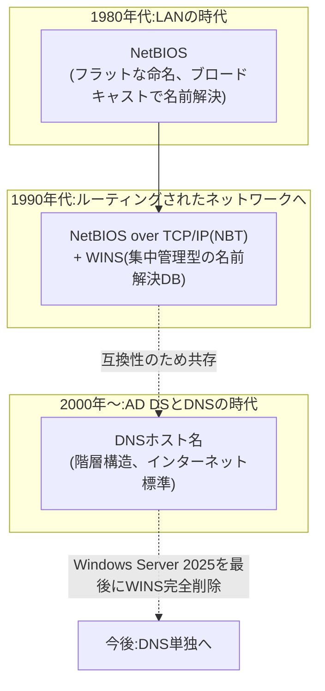

## はじめに

- **この記事で得られること**: [sysdm.cplとnetdom computernameは何が違うのか](/articles/ad-computername-netdom-guide)で「Windowsのコンピューターは伝統的にNetBIOS名とDNSホスト名という2種類の名前を持つ」と触れましたが、なぜ2種類の名前が必要なのか、なぜNetBIOS名だけが15文字という中途半端な制限を持つのか、そしてこの制限がどこから来ているのかには立ち入りませんでした。この記事では、NetBIOSというプロトコルが生まれた歴史的経緯、WINS(Windows Internet Name Service)が果たしていた役割、そして**Windows Server 2025がWINSを含む最後のLTSCリリースとなり、以降のリリースではWINSサーバーの役割自体が完全に削除される**という、実務上いま押さえておくべき現在地までを体系的に理解します。
- **対象読者**: 「NetBIOS名」という言葉は知っているものの、それがなぜ存在し、DNSホスト名と何が違い、いつまで気にする必要があるのかを説明できない方を想定しています。
- **読むのにかかる想定時間**: 約16分

この記事は[『上位1%』シリーズ 全記事ガイド](/sitemap)の一部、[Active Directoryシリーズ](/sitemap#シリーズ一覧)の20本目です。[sysdm.cplとnetdom computernameは何が違うのか](/articles/ad-computername-netdom-guide)を先に読んでおくと、本記事の理解がスムーズです。

## 前提知識

- **NetBIOS名とDNSホスト名**: [sysdm.cplとnetdom computernameは何が違うのか](/articles/ad-computername-netdom-guide)で触れた、Windowsのコンピューターが伝統的に持つ2種類の名前です。
- **DNS(Domain Name System)**: 階層構造を持つ名前解決の仕組みです。[dns-guide](/articles/dns-guide)で基礎を扱っています。

## 全体像をつかむ

### 一言で言うと

**NetBIOS名は、DNSがまだ普及していなかった1980年代のLAN(ローカルエリアネットワーク)向けに設計された、階層を持たない「フラットな」命名の仕組みであり、DNSホスト名(階層構造を持つ、インターネット標準の命名の仕組み)とは、生まれた時代も設計思想もまったく異なります。** Windows環境で2種類の名前が共存しているのは、Windows NT時代からの互換性を、Active DirectoryがDNSへ移行した後も長らく引きずってきた結果です。そしてこの互換性の維持は、Windows Server 2025を最後に、大きな区切りを迎えます。

## 基礎から徹底解説

### NetBIOSはなぜ生まれ、なぜコンピューター名は15文字までなのか

**NetBIOS**(Network Basic Input/Output System)は、1983年にIBMのPC Network向けに設計された、同一LAN内のコンピューター同士が名前でお互いを見つけ、通信するための仕組みです。当時はまだTCP/IPやDNSが一般的ではなく、NetBIOSは「同じLANセグメント内へブロードキャスト(一斉送信)して、名乗り出た相手と通信する」という、階層を持たない**フラットな命名空間**を前提に設計されていました。

15文字制限の正体:NetBIOS名は実は16バイト固定長

NetBIOSの名前は、実は仕様上**常に16バイトの固定長**です。このうち**先頭15バイトが管理者・ユーザーが指定できる名前部分**で、**最後の16バイト目(いわゆるNetBIOSサフィックス)は、そのコンピューターが提供しているサービスの種類を示す予約領域**として使われます(例えば`0x00`はワークステーションサービス、`0x20`はファイルサーバーサービスを示す、といった具合です)。コンピューター名として入力できるのが15文字までなのは、この「16バイト目はサービス種別のために予約されている」という、NetBIOSプロトコルの仕様に由来します。DNSホスト名の各ラベルが63文字まで使えるのとは対照的に、NetBIOS名の制約は、DNSとはまったく別のプロトコルの都合によるものです。

### WINSの役割:ブロードキャストが届かない範囲での名前解決

NetBIOSの名前解決は、本来「同じLANセグメントへのブロードキャスト」が前提でした。しかし、企業ネットワークが複数のセグメント・複数の拠点にルーターで分割されるようになると、ブロードキャストは届かなくなります。この問題を解決するためにMicrosoftが導入したのが**WINS**(Windows Internet Name Service)です。WINSは、「NetBIOS名とIPアドレスの対応表」を1台の集中サーバーで管理し、クライアントはブロードキャストの代わりにこのWINSサーバーへ直接問い合わせることで、ルーターを越えた範囲でもNetBIOS名による名前解決ができるようになりました。DNSがFQDN(階層的なホスト名)とIPアドレスを対応づけるのに対し、WINSはNetBIOS名(フラットな15文字までの名前)とIPアドレスを対応づける、いわば「**NetBIOS版のDNS**」として機能していました。

### Windows 2000以降:AD DSがDNSを主役に据えた

Windows NT 4.0までのドメインは、NetBIOSドメイン名だけで識別される、DNSに依存しない仕組みでした。しかしWindows 2000でActive Directoryが登場すると、ドメイン名はインターネット標準のDNS名前空間(`example.com`のような階層構造)を基盤とするように設計が改められました。[ADとDC、ドメインとフォレストの違い](/articles/ad-dc-fundamentals-guide)で扱った通り、現在のAD DSはLDAPやKerberosといった標準プロトコルで動いており、これらの多くはDNSによる名前解決を前提としています。

**それでもNetBIOS名が完全に廃止されなかったのは、後方互換性のためです。** `DOMAIN\username`という、今でも見かける形式のログオン名(ダウンレベルログオン名)は、NetBIOSドメイン名を前提にした表記です。古いアプリケーションやネットワーク機器の中には、DNSホスト名ではなくNetBIOS名でのみコンピューターを識別できるものも長く残っていました。

## プロが見ている視点(上位1%の理解)

### WINSは終わる:Windows Server 2025が含む最後のLTSCという現在地

**実務上、いま最も押さえておくべきなのは、WINSが既にWindows Server 2022の時点で非推奨(Deprecated)とされており、Windows Server 2025が、WINSサーバーの役割を含む最後のLTSC(長期サービスチャネル)リリースになるという点です。** Windows Server 2025自体のサポートは2034年11月まで続きますが、それ以降のWindows Serverリリースでは、WINSサーバーの役割・管理用MMCスナップイン・関連APIが完全に削除される予定です。

Microsoftがこの削除に踏み切る理由として挙げているのは、WINSやNetBIOSにはDNSSECのような改ざん・なりすまし対策の仕組みがなく、セキュリティ面で見劣りすること、そしてActive Directoryを含む現代のアプリケーション・クラウド基盤がDNSを前提に設計されていることです。

移行に向けて何をすべきか

WINSに依存した環境を持つ組織は、まず**社内のどのアプリケーション・機器がNetBIOS名前解決(WINSへの問い合わせ)に依存しているのかを棚卸しする**必要があります。その上で、条件付きフォワーダー・スプリットブレインDNS構成(内部と外部で異なる名前解決結果を返す構成)・DNSサフィックス検索リストといった、DNSベースの代替手段への切り替えを計画的に進めることが推奨されています。長年動いてきたレガシーなアプリケーションほど、この棚卸しを怠ると、WINS削除後に思わぬ名前解決の失敗に直面するリスクがあります。

## よくある誤解・つまずきポイント

- **誤解1: 「NetBIOS名は、DNSホスト名を15文字に短縮しただけのものである」**
  NetBIOS名とDNSホスト名は、単に長さが違うだけの同じ仕組みではありません。NetBIOSはDNSより古い、階層を持たないフラットな命名空間を前提とした、まったく別のプロトコルです。15文字という制限も、DNSの都合ではなく、NetBIOS名が16バイト固定長で最後の1バイトがサービス種別に予約されているという、NetBIOS自体の仕様に由来します。
- **誤解2: 「WINSはとっくの昔に廃止され、もう気にする必要はない」**
  WINSはWindows Server 2022時点で非推奨とはされましたが、Windows Server 2025まではまだ提供されています。完全に削除されるのはそれ以降のリリースからであり、「もう存在しない」と決めつけるのは早計です。現時点でWINSに依存した環境がある場合は、Windows Server 2025のサポート終了(2034年11月)までに移行を計画する必要があります。
- **誤解3: 「`DOMAIN\username`という表記は、単なる古い書き方の癖であり、技術的な意味はない」**
  この表記(ダウンレベルログオン名)は、NetBIOSドメイン名を前提にした正式な認証名の形式です。単なる慣習ではなく、NetBIOSという古いプロトコルの命名規則が、現在も認証の仕組みの中に生き続けている証拠です。

## 障害・トラブルシューティングの視点

NetBIOS/WINS関連のトラブルは、多くの場合「古い仕組みへの依存が、意識されないまま残っている」ことが原因です。

1. **特定の古いアプリケーションだけ、コンピューターを名前で見つけられない**: そのアプリケーションがNetBIOS名前解決(ブロードキャストやWINS問い合わせ)にのみ対応しており、DNSホスト名を解釈できない可能性があります。
2. **WINSサーバーを廃止したら、一部のクライアントで名前解決エラーが増えた**: 廃止前に、依存しているアプリケーション・機器の棚卸しが不十分だった可能性があります。DNSサフィックス検索リストや条件付きフォワーダーへの切り替えが完了しているかを確認します。
3. **コンピューター名を16文字以上にしようとしてエラーになる**: これはDNSホスト名の制限ではなく、NetBIOS名の16バイト固定長という仕様上の制約です。DNSホスト名だけを長くしたい場合、NetBIOS名は先頭15文字が自動的に使われる(あるいは別途調整が必要になる)ことを踏まえて設計します。

### 予防策・恒久対策

- WINSに依存したアプリケーション・機器がないか、計画的に棚卸しを行う。
- 新規に構築する環境では、そもそもNetBIOS名前解決・WINSに依存しない設計(DNSベースの名前解決に統一)を前提にする。
- Windows Server 2025のサポート終了(2034年11月)を見据え、WINS依存の解消を長期計画に組み込む。

## まとめ

- NetBIOS名は、DNSが普及する前の1980年代に設計された、階層を持たないフラットな命名の仕組みであり、DNSホスト名とは生まれた時代も設計思想も異なります。
- コンピューター名が15文字までしか使えないのは、NetBIOS名が16バイト固定長で、最後の1バイトがサービス種別のために予約されているという、NetBIOSプロトコル自体の仕様に由来します。
- WINSは、ブロードキャストが届かない範囲でもNetBIOS名前解決ができるようにするための、集中管理型の仕組み(「NetBIOS版のDNS」)でした。
- WINSはWindows Server 2022時点で非推奨とされ、**Windows Server 2025がWINSを含む最後のLTSCリリース**となり、以降のリリースではWINSサーバーの役割自体が完全に削除される予定です。WINSに依存した環境は、計画的なDNSベースへの移行が必要です。

**今日から意識すべきこと**
1. 自分の環境にWINSやNetBIOS名前解決に依存したアプリケーション・機器がないか、一度棚卸ししてみましょう。
2. 新規構築する環境では、最初からNetBIOS名前解決に依存しない設計を心がけましょう。

## 参考文献

- [Name computers, domains, sites, and OUs | Microsoft Learn](https://docs.microsoft.com/en-us/troubleshoot/windows-server/identity/naming-conventions-for-computer-domain-site-ou)
- [WINS removal: Moving forward with modern name resolution | Microsoft Support](https://support.microsoft.com/en-us/topic/wins-removal-moving-forward-with-modern-name-resolution-f00381f0-7237-4f7b-8e78-aa6f9c5b279f)
- [Microsoft to remove WINS support after Windows Server 2025 | BleepingComputer](https://www.bleepingcomputer.com/news/microsoft/microsoft-to-remove-wins-support-after-windows-server-2025/)
