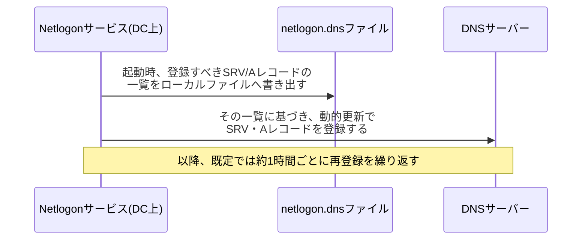

## はじめに

- **この記事で得られること**: [DNSゾーンとレコードの読み方](/articles/dns-zones-records-guide)や[Netlogonサービスとセキュアチャネルの仕組み](/articles/ad-netlogon-guide)では、クライアントがDCロケーターを使ってSRVレコードを「検索する」側の話を扱いました。この記事では、その裏側、**そもそもそのSRVレコードを誰がDNSへ「書き込んで」いるのか**という、登録側の仕組みを掘り下げます。答えはNetlogonサービス自身であり、**一般的なクライアントコンピューターが使う`ipconfig /registerdns`とは、まったく別の独立した登録経路**を持っています。この違いを理解していないと、DC更改の現場で新DCが見つからないときに、効果のないコマンドを実行して時間を浪費することになります。
- **対象読者**: SRVレコードがDCロケーターに使われることは知っているものの、そのSRVレコードが具体的にどのタイミングで、何によってDNSへ書き込まれるのかを説明できない方を想定しています。
- **読むのにかかる想定時間**: 約16分

この記事は[『上位1%』シリーズ 全記事ガイド](/sitemap)の一部、[Active Directoryシリーズ](/sitemap#シリーズ一覧)の12.1本目です。

## 前提知識

- [Netlogonサービスとセキュアチャネルの仕組み](/articles/ad-netlogon-guide): Netlogonサービスが、DCの役割情報をDNSのSRVレコードとして公開する役割を担っているという理解が前提になっています。
- [DNSゾーンとレコードの読み方](/articles/dns-zones-records-guide): SRVレコードが「特定のサービスを提供しているサーバーはどれか」を示すレコードであるという理解が前提になっています。

## 全体像をつかむ

**DCが持つSRVレコード(Kerberos・LDAP・PDCエミュレータなど、そのDC自身の役割を示すレコード群)は、人間が手動でDNSマネージャーから登録するものではありません。** **Netlogonサービス自身が、DCの起動時、そしてその後も一定間隔ごとに、自分の役割情報をDNSサーバーへ自動的に登録し続けている**のです。この自己登録の仕組みを理解していないと、「新しく構築したDCが、他のDCやクライアントから見つからない」という障害に遭遇した際、見当違いの対処(クライアント向けのコマンドをDC上で実行する、など)に時間を使ってしまいます。



## 基礎から徹底解説

### Netlogonサービスが、自分の役割をDNSへ登録する仕組み

**Netlogonサービスは、DCの起動時に、自分自身がDNSへ登録すべきレコードの一覧を計算し、それをDNSサーバーへ動的更新(Dynamic DNS Update)として送信します。** 登録される内容には、Kerberosの鍵配布センター(KDC)、LDAPサーバー、PDCエミュレータ、グローバルカタログといった、**そのDC自身がどの役割を提供しているかを示すSRVレコード**が含まれます。**この登録は一度きりではなく、既定では約1時間ごとに繰り返し再送信される**ため、一時的にDNSサーバーへの通信が失敗していても、通常は次の再登録のタイミングで自然に回復します。

<details>
<summary>netlogon.dnsファイルとは何か</summary>

Netlogonサービスは、自分が登録すべきレコードの一覧を、**`%windir%\System32\config\netlogon.dns`というテキストファイルにも書き出しています。** このファイルは、DNSサーバーへ実際に登録が成功したかどうかとは無関係に、**「このDCがNetlogonの観点で登録すべきと認識しているレコードの一覧」をローカルに保持したもの**です。DNSサーバー側のレコードと、このファイルの内容を比較することで、「登録を試みているはずなのに、実際にはDNS側に反映されていない」という食い違いを発見する手がかりになります。

</details>

### `ipconfig /registerdns`が、DC上では実質的に効かない理由

一般的なクライアントコンピューターでは、`ipconfig /registerdns`を実行すると、DHCPクライアントサービスが、そのコンピューター自身のホスト名に対応するA/AAAAレコードと、逆引き用のPTRレコードを、DNSサーバーへ再登録します。**しかし、ドメインコントローラーの場合、この役割はDHCPクライアントサービスではなく、Netlogonサービスが担っています。** DC自身のホスト名レコードも、SRVレコードと同様に、**Netlogonサービスの自己登録の仕組みの管理下にある**ため、**DC上で`ipconfig /registerdns`を実行しても、実質的には何も起こりません。**「DNSの登録がおかしいから、とりあえず`ipconfig /registerdns`を実行してみよう」という、クライアント端末では有効な対処が、DC上では意味を持たないのは、このためです。

> **重要な注意**: この「DC上で`ipconfig /registerdns`が実質的に何もしない」という挙動は、複数の実務者による検証・報告に基づくものであり、Microsoftの公式ドキュメントで明示的に保証された仕様ではありません。環境やOSのバージョンによって挙動が異なる可能性があるため、実際の障害対応では、後述する`nltest /dsregdns`や、Netlogonサービスの再起動という、DC向けに明確に用意された手段を優先してください。

## プロが見ている視点(上位1%の理解)

### 新DCがなかなか見つからないとき、まず試すべきコマンド

DC更改の現場で、新しく構築したDCのSRVレコードがなかなかDNSに現れない場合、選択肢は大きく2つあります。**1つは、Netlogonサービス自体を再起動すること**です。サービスの再起動は、起動時の自己登録処理を強制的にもう一度走らせるため、確実な方法ですが、**再起動の瞬間、そのDC自身のNetlogon関連の処理(セキュアチャネルの検証など)が一時的に中断**します。**もう1つは、`nltest /dsregdns`コマンドを実行すること**です。このコマンドは、Netlogonサービスを再起動せずに、DC固有のDNSレコードの登録だけを強制的にやり直させることができ、**サービスを止めるリスクを負わずに、再登録だけを即座に行いたい場面で有効**です。実務では、まず`nltest /dsregdns`を試し、それでも解決しない場合に、サービスの再起動という、より影響範囲の大きい手段へ切り替えるという順序が合理的です。

<details>
<summary>netlogon.dnsファイルとDNSサーバーの実際のレコードを比較する、具体的な診断手順</summary>

```powershell
# netlogon.dnsファイルの内容を確認する(登録されるべきレコードの一覧)
Get-Content "$env:windir\System32\config\netlogon.dns"

# DNSサーバー側に、実際にSRVレコードが存在するかを確認する
Resolve-DnsName -Type SRV _ldap._tcp.dc._msdcs.contoso.com

# DC固有のDNSレコードの登録を、サービス再起動なしで強制的にやり直す
nltest /dsregdns
```

`netlogon.dns`に記載されているレコードが、DNSサーバー側に実際には存在しない場合、**DNSサーバーへの動的更新そのものが失敗している**可能性が高く、該当ゾーンが動的更新を許可する設定になっているか、DNSサーバーへの通信経路に問題がないかを、次に確認すべきです。

</details>

## よくある誤解・つまずきポイント

- **誤解1: 「`ipconfig /registerdns`は、どのWindowsコンピューターでも同じように有効な、DNS登録のやり直しコマンドだ」**
  ドメインコントローラー上では、DNS登録の役割はNetlogonサービスが担っており、`ipconfig /registerdns`は実質的に意味を持ちません。
- **誤解2: 「SRVレコードは、一度登録されれば、その後は何もしなくても永続的に存在し続ける」**
  SRVレコードは、Netlogonサービスによって既定で約1時間ごとに再登録される、動的な存在です。DNSサーバー側で誤って削除されても、次の再登録のタイミングで自然に復元されることがあります。
- **誤解3: 「SRVレコードを再登録させるには、必ずNetlogonサービスを再起動する必要がある」**
  `nltest /dsregdns`を使えば、Netlogonサービスを再起動せずに、DNSレコードの登録だけを強制的にやり直せます。

## 障害・トラブルシューティングの視点

1. **新しく構築したDCが、他のDCやクライアントから見つからない**: `netlogon.dns`ファイルの内容と、実際のDNSサーバー上のレコードを比較し、登録が実際に反映されているかを確認します。
2. **DNSの登録に問題がありそうなので、とりあえず何か試したい**: DC上では`ipconfig /registerdns`ではなく、`nltest /dsregdns`を実行します。
3. **`nltest /dsregdns`を実行しても改善しない**: 該当するDNSゾーンが動的更新を許可する設定になっているか、DNSサーバーへの通信経路に問題がないかを確認し、必要であればNetlogonサービス自体の再起動を検討します。

## まとめ

- DCのSRVレコードは、Netlogonサービス自身が、起動時および約1時間ごとに、DNSサーバーへ動的更新として自動登録しているものです。
- `netlogon.dns`ファイルは、Netlogonサービスが登録すべきと認識しているレコードの一覧を、ローカルに保持したものです。
- ドメインコントローラー上では、DNS登録の役割をNetlogonサービスが担っているため、`ipconfig /registerdns`は実質的に意味を持ちません。
- `nltest /dsregdns`を使えば、Netlogonサービスを再起動せずに、DC固有のDNSレコードの登録だけを強制的にやり直せます。

**今日から意識すべきこと**
1. DC上でDNS登録のやり直しが必要になったときは、`ipconfig /registerdns`ではなく`nltest /dsregdns`を使いましょう。
2. 新DCが見つからないという障害に遭遇したら、まず`netlogon.dns`ファイルと実際のDNSレコードを比較する習慣をつけましょう。

## 参考文献

- [How can I force a domain controller (DC) to reregister its DNS records? | ITPro Today](https://www.itprotoday.com/windows-78/how-can-i-force-domain-controller-dc-reregister-its-dns-records)
- [Service (SRV) Locator Records Registered By Windows Domain Controllers | Jorge's Quest For Knowledge](https://jorgequestforknowledge.wordpress.com/2011/09/11/service-srv-locator-records-registered-by-windows-domain-controllers/)
