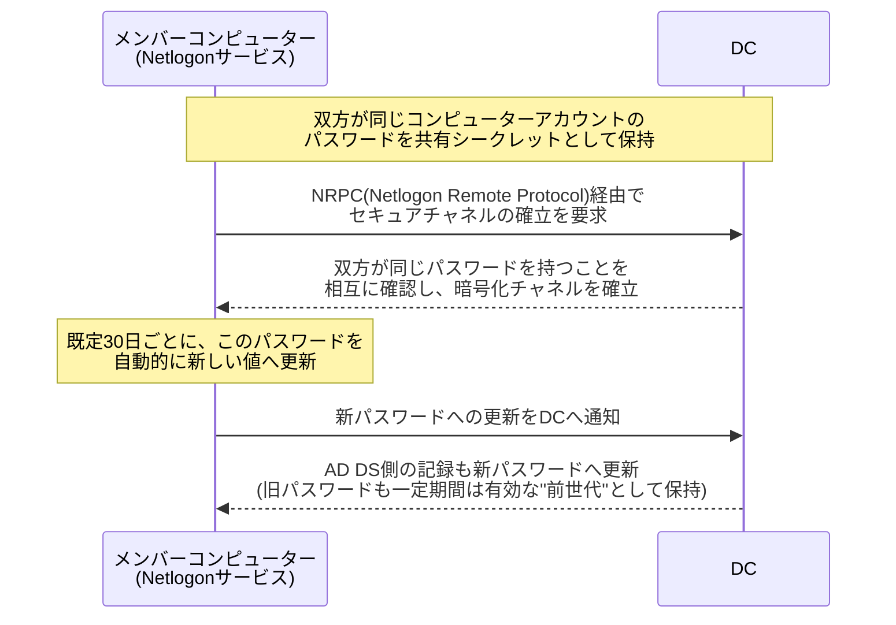
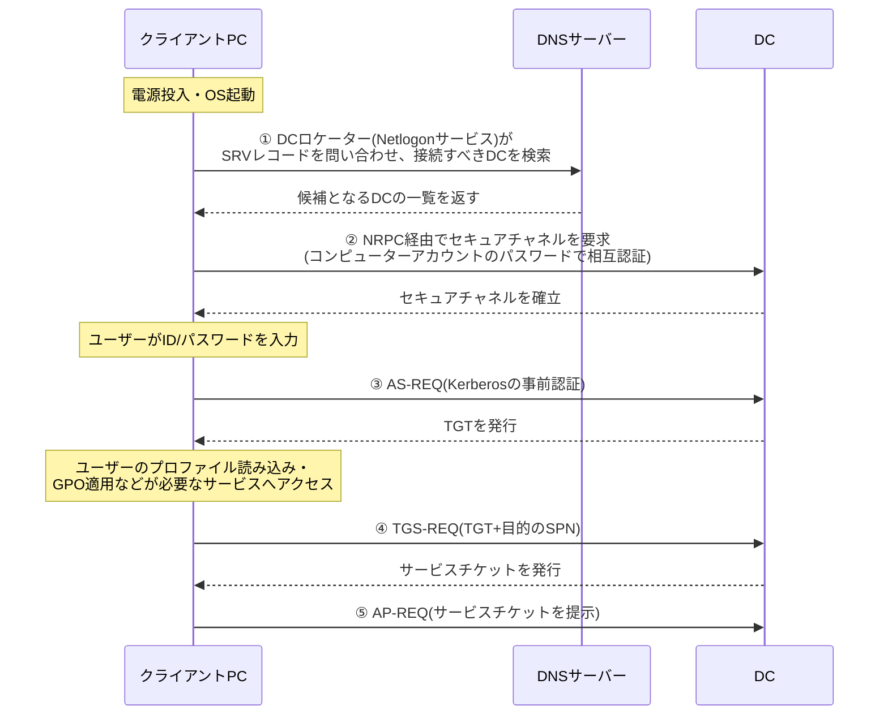

## はじめに

- **この記事で得られること**: [sysdm.cplとnetdom computernameは何が違うのか](/articles/ad-computername-netdom-guide)や[DNSゾーンとレコードの読み方](/articles/dns-zones-records-guide)で繰り返し言及してきた**Netlogonサービス**と**セキュアチャネル**について、それぞれが具体的に何を行っている仕組みなのかを体系的に理解します。特に、マシンアカウントパスワードが既定で30日ごとに自動更新される仕組みと、実務で頻発する「VMのスナップショットを古い状態に戻したら、ドメインにログオンできなくなった」というトラブルがなぜ起きるのかを、診断の道筋込みで扱います。
- **対象読者**: 「信頼関係の障害」というエラーに遭遇してドメインへの再参加で対処した経験はあるものの、その根本原因を説明できない方、Netlogonというサービス名を目にしたことはあるが具体的に何をしているサービスなのか把握できていない方を想定しています。
- **読むのにかかる想定時間**: 約20分

この記事は[『上位1%』シリーズ 全記事ガイド](/sitemap)の一部、[Active Directoryシリーズ](/sitemap#シリーズ一覧)の12本目です。[sysdm.cplとnetdom computernameは何が違うのか](/articles/ad-computername-netdom-guide)で扱ったコンピューターアカウントとセキュアチャネルの前提知識を先に読んでおくと、本記事の理解がスムーズです。

## 前提知識

- **コンピューターアカウントのパスワード**: ドメインに参加した端末には、AD DS上にコンピューターアカウントが作成され、そのアカウント自身のパスワード(既定では30日ごとに自動更新されるランダムな値)を持ちます。詳しくは[sysdm.cplとnetdom computernameは何が違うのか](/articles/ad-computername-netdom-guide)を参照してください。
- **「信頼関係」という言葉の2つの意味**: AD DSの文脈での「信頼関係」には、本記事で扱う**メンバーコンピューター(またはDC)とDCとの間の信頼関係**(セキュアチャネル)と、複数のドメイン・フォレスト同士を結ぶ**ドメイン間の信頼関係**(トラスト)という、まったく別の2つの意味があります。本記事が扱うのは前者です。

## 全体像をつかむ

### 一言で言うと

**Netlogonサービスは、ドメインに参加した端末(メンバーコンピューターや、DC自身も含む)が、自分のコンピューターアカウントのパスワードを鍵として使い、DCとの間に確立・維持する暗号化された通信路——セキュアチャネル——を管理するサービスです。** 「このPCは本当に、AD DS上に登録されているあのコンピューターアカウント本人なのか」を、パスワードという共有シークレットを使って相互に証明し合う仕組みだと捉えると理解しやすくなります。



## 基礎から徹底解説

### そもそもRPCとは何か

NRPCの正体を理解する前に、土台となる**RPC**(Remote Procedure Call、リモートプロシージャコール)そのものを整理しておきます。**RPCとは、あるコンピューター上で動くプログラムが、まるでローカルの関数を呼び出すのと同じような感覚で、ネットワーク越しに別のコンピューター上の処理(プロシージャ)を呼び出せるようにする、汎用的な仕組み(規格・技術のカテゴリ)です。** 呼び出す側は、相手が実際にはネットワークの先にいることを意識せず、「この関数に、この引数を渡して、この戻り値を受け取る」という形でプログラムを書くだけで済み、実際の通信の詳細(パケットの組み立て、送受信、相手側での処理の呼び出し)は、RPCの仕組みが裏側で肩代わりしてくれます。

Windows環境では、Microsoft独自の実装である**MS-RPC**が、リモートレジストリ編集・サービスの起動停止・そして本記事のNRPCなど、非常に多くの機能の土台として使われています。[DCの正常性確認](/articles/dc-health-check-guide)で扱った**IPC$共有**も、このRPCによる通信をSMB経由でやり取りするための特殊な共有でした。つまり**NRPCとは、「Netlogon関連の処理」に特化した、数あるRPCベースのプロトコルの1つ**である、と位置づけると理解しやすくなります。

### セキュアチャネルの正体

セキュアチャネルは、**NRPC**(Netlogon Remote Protocol)というRPCベースのプロトコルの上に確立される、認証済みの暗号化通信路です。この認証の鍵になっているのが、前述のコンピューターアカウントのパスワードです。メンバーコンピューター側もDC側(正確にはAD DS)も、同じこのパスワードを知っている前提で、互いに「自分は本当にそのアカウント本人だ」ということを証明し合います。**双方が知っているパスワードの値が一致している間だけ、このセキュアチャネルは健全に機能します。**

### Netlogonサービスの3つの主な役割

Netlogonサービスが担っている役割は、大きく3つに整理できます。

1. **DCの検出(DCロケーター)**: 起動時やログオン時に、DNSのSRVレコードを使って、自分が接続すべきDCを検索します。詳しくは[ADの「サイト」とレプリケーショントポロジー](/articles/ad-sites-guide)で扱っています。
2. **セキュアチャネルの確立と維持**: 前述の通り、コンピューターアカウントのパスワードを使ってDCとの信頼関係を確立し、パスワードの自動更新にも対応します。
3. **パススルー認証**: NTLM認証のような、Kerberosに依存しない古い認証方式を使う場合、Netlogonサービスがクライアントの認証要求をDCへ中継する役割も担います。

### マシンアカウントパスワードの自動更新と、その裏で起きていること

コンピューターアカウントのパスワードは、既定で**およそ30日ごと**に、そのコンピューター自身が主体となって自動的に新しい値へ更新します。更新のたびに、[sysdm.cplとnetdom computernameは何が違うのか](/articles/ad-computername-netdom-guide)で触れた通り、**AD DSは最新のパスワードだけでなく、1世代前(N-2)のパスワードも一定期間は有効な値として保持**します。これは、パスワード更新の通知がDC間のレプリケーションで行き渡る前に、別のDCへ認証要求が飛んだ場合でも、認証が失敗しないようにするための緩衝材です。

### なぜVMのスナップショットを古い状態に戻すと「信頼関係の障害」が起きるのか

実務で非常によく遭遇するトラブルが、**仮想マシンのスナップショットを、ある程度古い時点まで巻き戻したところ、そのVMがドメインへログオンできなくなる**という現象です。ログオン画面には「このワークステーションと主ドメインとの信頼関係に失敗しました」といった趣旨のエラーが表示されます。

このトラブルの正体は、これまでの知識で正確に診断できます。

1. スナップショットを取得した時点では、そのVMのコンピューターアカウントパスワードは、AD DS側の記録と一致していました。
2. その後、スナップショットを戻さずにVMを稼働させ続けていれば、Netlogonサービスが約30日ごとにパスワードを自動更新し、AD DS側の記録も追従して更新されていきます。
3. **ここでスナップショットを古い時点まで巻き戻すと、そのVMのローカルなパスワードの記憶だけが過去に巻き戻り、AD DS側は(スナップショット取得後も稼働を続けていた別のインスタンスの記憶に基づいて)既に新しいパスワードへ更新済みの状態になっています。**
4. 結果として、VM側とAD DS側でパスワードが食い違い、セキュアチャネルの確立に失敗します。前述の「1世代前のパスワードも一定期間は有効」という緩衝材はありますが、**スナップショットが十分に古ければ、この許容範囲すら超えてしまいます**。

この仕組みを理解していれば、予防策も自然に導けます。**運用上どうしてもスナップショットへ戻す必要がある場合は、既定のパスワード更新間隔(約30日)より古いスナップショットへの復元は避けるべき**であり、それでも復元せざるを得ない場合は、復元後に後述する方法でセキュアチャネルを明示的に再同期する必要があります。

### `Test-ComputerSecureChannel`と`nltest`によるセキュアチャネルの診断・修復

セキュアチャネルの状態は、影響を受けている端末自身の上で、次のコマンドから確認・修復できます。

```powershell
# セキュアチャネルの状態を確認する
Test-ComputerSecureChannel

# セキュアチャネルの状態を確認し、壊れていればローカル・AD DS双方のパスワードを
# 明示的に再同期して修復する(メンバーコンピューターでのみ有効。DCには使えない)
Test-ComputerSecureChannel -Repair

# nltestコマンドでも同様の確認ができる
nltest /sc_verify:corp.example.com

# セキュアチャネルをリセットする(nltest版)
nltest /sc_reset:corp.example.com
```

**`-Repair`は、ドメインへの再参加なしに、セキュアチャネルだけを明示的に立て直してくれる操作**です。多くの場合、この方法で「信頼関係の障害」エラーは、ドメインから一度脱退して入り直すという大掛かりな手順を取らなくても解消できます。

<details>
<summary>より詳しい診断が必要な場合:Netlogonのデバッグログ</summary>

`Test-ComputerSecureChannel`や`nltest`だけでは原因が特定できない、より込み入ったケースでは、Netlogonサービス自体のデバッグログを有効化して詳細な内部動作を確認する方法があります。

```powershell
# Netlogonのデバッグログを有効化する
nltest /dbflag:0x2080ffff

# 無効化する(調査後は必ず元に戻す)
nltest /dbflag:0x0
```

有効化すると、`%windir%\debug\netlogon.log`に詳細なログが出力されます。このログには、セキュアチャネルの確立試行やパスワード検証の詳細な結果が記録されるため、単純なコマンド1つでは切り分けられない込み入った障害の調査に有効です。ログの出力量が多くなるため、調査が終わったら必ず無効化することを忘れないでください。

</details>

### クライアントのログオン時、裏側で何がどの順番で起きているのか

Netlogon・DCロケーター・Kerberos認証は、これまで別々の記事で個別に扱ってきましたが、ここで一度、**クライアントPCの電源を入れてログオンするまでの一連の流れ**として、時系列でつなぎ直してみます。



この図が示す通り、**①DCロケーターによるDCの発見(Netlogon)→②コンピューター自身のセキュアチャネル確立(Netlogon)→③ユーザー本人のKerberos認証(KDC)→④以降、必要なサービスごとのチケット取得(KDC)**、という順序で処理が積み重なっています。①②はコンピューターアカウント自身の認証、③以降はユーザーアカウントの認証であり、**「コンピューターの信頼」と「ユーザーの信頼」は別レイヤーの話である**という点が、この一連の流れを理解するうえでの最大のポイントです。①②のセキュアチャネルが壊れていると、③以降のユーザー認証がいくら正常でも、そもそもログオンできない(信頼関係の障害エラー)、という因果関係もここから読み取れます。

## プロが見ている視点(上位1%の理解)

### なぜNetlogonはこれほど重要なセキュリティ境界として扱われるのか:Zerologon脆弱性

Netlogonサービスの重要性を象徴する出来事として、2020年に公表された**Zerologon**(CVE-2020-1472)という脆弱性があります。この脆弱性は、NRPCの暗号化処理に使われていた実装上の不備を突くことで、**認証情報を一切持たない攻撃者が、ネットワーク経由でDC自身のコンピューターアカウントのパスワードを空文字列にリセットできてしまう**という、極めて深刻なものでした。DC自身のコンピューターアカウントのパスワードを奪われるということは、実質的にそのドメイン全体の管理者権限を奪われることに等しく、AD環境全体の完全な乗っ取りにつながります。

この脆弱性が示しているのは、**Netlogonが単なる「ログオンを手伝う裏方のサービス」ではなく、AD DS全体の信頼の土台そのものを支えている**という事実です。Netlogonが提供するセキュアチャネルの仕組み(パスワードによる相互認証)が破られるということは、「誰が誰であるか」を保証する仕組みそのものが崩壊することを意味します。2020年8月のセキュリティ更新プログラム以降、この脆弱性は修正されていますが、Netlogonまわりの脆弱性が定期的に発見・修正され続けていること自体が、このサービスの重要性を物語っています。DC・メンバーコンピューターともに、セキュリティ更新プログラムを最新の状態に保つことが、他のどんな対策よりも基本かつ重要です。

## よくある誤解・つまずきポイント

- **誤解1: 「セキュアチャネルが切れた=ドメインから完全に脱退した状態と同じ」**
  セキュアチャネルが切れても、コンピューターアカウント自体はAD DS上に存在し続けます。`Test-ComputerSecureChannel -Repair`で、ドメインへの再参加なしに、パスワードの再同期だけで復旧できるケースが多くあります。
- **誤解2: 「"信頼関係の障害"は、常にドメイン間の信頼関係(トラスト)の問題を指している」**
  この記事で扱った「信頼関係の障害」は、メンバーコンピューターとDCとの間のセキュアチャネルの問題であり、複数ドメイン・フォレストを結ぶトラストとは別物です。用語が同じ「信頼関係」でも、指している対象がまったく異なる点に注意が必要です。
- **誤解3: 「マシンアカウントパスワードの自動更新は、管理者が意識する必要のない完全に裏側の処理」**
  通常はその通りですが、VMのスナップショット運用のように、**「時間を巻き戻す」操作がこの前提を崩す場面がある**ことを知っておく必要があります。

## 障害・トラブルシューティングの視点

Netlogon・セキュアチャネル関連の障害は、「**このコンピューターとAD DSが、同じパスワードを共有できているか**」を軸に切り分けます。

1. **ログオン画面で「信頼関係の障害」エラーが表示される**: 影響を受けている端末上で`Test-ComputerSecureChannel`を実行し、セキュアチャネルの状態を確認します。壊れていれば`-Repair`で修復を試みます(DCの場合は`-Repair`が使えないため、後続で扱う`repadmin`などで対処します)。
2. **VMのスナップショットを復元した直後からログオンできなくなった**: 本記事で扱った通り、スナップショット取得後にパスワードが自動更新されていないかを疑います。取得時点が30日以上前であれば、可能性は非常に高いです。
3. **特定のDCだけでNetlogon関連のイベントログ(イベントID 5719など)が多発する**: そのDC自身のコンピューターアカウントのパスワードに問題がないかを疑います。
4. **単純なコマンドでは原因が特定できない**: Netlogonのデバッグログ(`nltest /dbflag`)を有効化し、`netlogon.log`から詳細な内部動作を確認します。

### 予防策・恒久対策

- VMのスナップショットを運用に組み込む場合、既定のパスワード更新間隔(約30日)より古いスナップショットへの復元は避ける。
- どうしても古いスナップショットへ復元する必要がある場合は、復元後に必ず`Test-ComputerSecureChannel`でセキュアチャネルの状態を確認する運用を徹底する。
- DC・メンバーコンピューターともに、Netlogon関連の脆弱性(Zerologonなど)に対応するセキュリティ更新プログラムを迅速に適用する。

## まとめ

- Netlogonサービスは、DCの検出・セキュアチャネルの確立と維持・パススルー認証という3つの役割を担う、AD認証の土台となるサービスです。
- セキュアチャネルは、コンピューターアカウントのパスワードを鍵として使う、メンバーコンピューター(またはDC)とDCとの間の認証済み暗号化通信路です。
- コンピューターアカウントのパスワードは既定で約30日ごとに自動更新されるため、それより古いVMスナップショットへの復元はセキュアチャネルの不整合(信頼関係の障害)を引き起こします。
- `Test-ComputerSecureChannel -Repair`は、ドメインへの再参加なしにセキュアチャネルだけを立て直せる、実務上最初に試すべき復旧手段です。

**今日から意識すべきこと**
1. VMのスナップショットを扱う際は、既定のパスワード更新間隔(約30日)より古い状態への復元を避けましょう。
2. 「信頼関係の障害」エラーに遭遇したら、まずドメインへの再参加ではなく`Test-ComputerSecureChannel -Repair`を試しましょう。

## 参考文献

- [How the Secure Channel Works | Microsoft Learn](https://learn.microsoft.com/en-us/previous-versions/windows/it-pro/windows-2000-server/bb742499(v=technet.10))
- [Test-ComputerSecureChannel | Microsoft Learn](https://learn.microsoft.com/en-us/powershell/module/microsoft.powershell.management/test-computersecurechannel)
- [CVE-2020-1472 | Microsoft Security Response Center](https://msrc.microsoft.com/update-guide/vulnerability/CVE-2020-1472)
